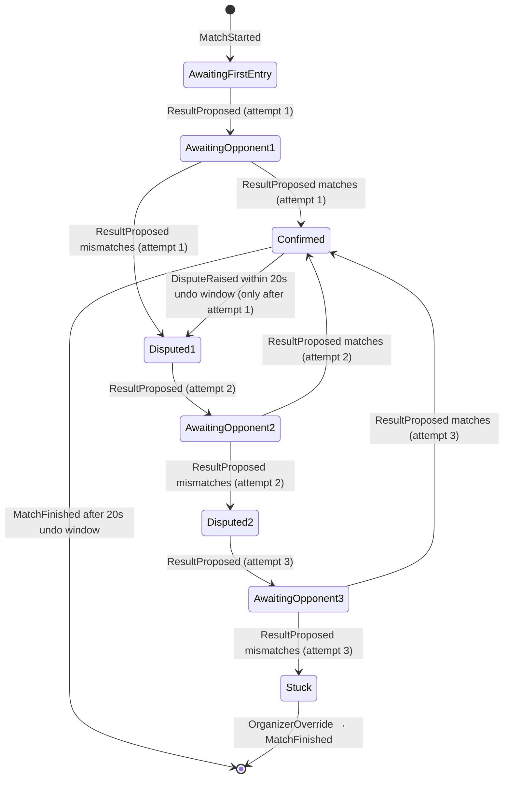

# ADR-0007: Match result confirmation and dispute resolution

- **Status**: Accepted
- **Date**: 2026-05-02
- **Depends on**: ADR-0001 (event log), ADR-0002 (Bounded Contexts), ADR-0005 (Per-platform persistence), ADR-0006 (Lamport invariants)

## Context

The per-match-result live-scoring model was confirmed by the owner on 2026-05-02 (see `docs/feature-notes/live-scoring-granularity.md`). In this model, each match in a tournament is finalized by both competing teams entering the match result on their phones (e.g., 2:1 sets won). The system must detect agreement, surface disagreement, and provide a clear escalation path to the organizer when needed.

The owner described the intended flow:

> "wenn die spielresultate von beiden gleich eingetragen werden kann es gefreezed werden, wenn unterschiede entstehen dann sollten beide zur einigung aufgefordert werden und wenn noch immer ein missmatch besteht dann muss der Organisator einstellen"

> "entweder haben sie sich geeinigt oder der turinier veranstalter hat geschlichtet, danach akzeptieren wir nichts mehr"

This ADR formalizes that flow as a state machine, defines the events that drive it, and pins down the boundary conditions (re-entry limits, undo window, organizer authority).

## Decision

### State machine

`OrganizerOverride` can be emitted from **any** non-terminal state and immediately produces `MatchFinished`. The transitions are not drawn explicitly above to keep the diagram readable.

States in plain words:

- **AwaitingFirstEntry**: Match has started, no team has submitted a result.
- **AwaitingOpponent1 / 2 / 3**: One team has submitted attempt N, waiting for the other.
- **Confirmed**: Both teams agreed. After attempt 1 → 20-second undo window opens. After attempt 2 or 3 → `MatchFinished` immediately (no further undo).
- **Disputed1 / 2**: Submissions mismatched at attempt 1 / attempt 2. Re-entry round opens.
- **Stuck**: All three attempts ended in mismatch. Only `OrganizerOverride` can resolve.
- **(terminal)**: `MatchFinished` is emitted. No further events for this match accepted (per ADR-0006).

### Events

| Event | Emitted by | Carries | When |
|---|---|---|---|
| `MatchStarted` | Organizer or scheduler | matchId, teams, ruleSetId, openingCode | Already exists |
| `ResultProposed` | Player phone | byTeam, result, attempt (1, 2, or 3) | Each result submission |
| `ResultConfirmed` | Application layer (derived) | result | When two ResultProposed events match |
| `DisputeRaised` | Player phone OR application (derived) | reason ("mismatch on attempt 1/2" / "mismatch on attempt 3 — escalated" / "manual undo within window") | On mismatch or in 20s undo window |
| `OrganizerOverride` | Organizer | result, reason | Any time before MatchFinished |
| `MatchFinished` | Application layer | result, source ("confirmed" or "overridden"), reason | After 20s undo window expires on Confirmed (attempt 1), immediately on Confirmed (attempt 2 or 3), or immediately after OrganizerOverride |

`ResultConfirmed` and `MatchFinished` are derived by the application layer from the underlying event sequence. They are persisted as events for replay determinism (per ADR-0006), but they are not directly emitted by user actions.

### Re-entry rules

- **Maximum three attempts per team** per match.
- After both teams have submitted attempt 1:
  - Match → `Confirmed` (then 20s undo window)
  - Mismatch → `Disputed1`, both teams may submit attempt 2
- After both teams have submitted attempt 2:
  - Match → `Confirmed` → `MatchFinished` (no further undo window after re-entry)
  - Mismatch → `Disputed2`, both teams may submit attempt 3
- After both teams have submitted attempt 3:
  - Match → `Confirmed` → `MatchFinished`
  - Mismatch → `Stuck` — only `OrganizerOverride` can finalize
- A team that does not submit a re-entry (the other team did) blocks the match in `AwaitingOpponent2` or `AwaitingOpponent3`. The organizer can `OrganizerOverride` from any of these states.

### 20-second undo window (after attempt-1 Confirmed only)

- After both teams agree on attempt 1, the match enters `Confirmed`.
- For 20 seconds, either team can emit `DisputeRaised` to undo.
- If `DisputeRaised` arrives within the window: state transitions to `Disputed1`, attempt-2 round opens.
- If 20 seconds pass without `DisputeRaised`: application layer emits `MatchFinished` (terminal).
- **No undo window after attempt-2 or attempt-3 Confirmed**: those rounds were already the deliberate second/third chance.
- The 20s timer is wall-clock on the application layer, not Lamport-based — this is a UX timer, not a causality concern. If a phone is offline during those 20s and a `DisputeRaised` arrives later, the server rejects it (per ADR-0006 late-submission policy).

### Organizer authority

The organizer can emit `OrganizerOverride` from **any non-terminal state**:

- `AwaitingFirstEntry` (no-show, forfeit ruling)
- `AwaitingOpponent1 / 2 / 3` (one team is unreachable, or organizer pre-empts re-entry)
- `Disputed1 / 2` (active conflict)
- `Stuck` (escalation reached after all three attempts)

`OrganizerOverride` always produces `MatchFinished` immediately. There is no organizer-undo — if the organizer made a wrong call, that is a manual conversation with the players, not a system-level event.

### Bracket dependency

- The next match in the bracket reads the previous match's `MatchFinished` result to determine its participants.
- Until `MatchFinished` is emitted, downstream matches cannot start.
- This is enforced by the `tournament/` context, not by the state machine in `match/`.

### After MatchFinished

- No further events accepted for this matchId (per ADR-0006).
- Result is canonical. Any reklamation is a manual conversation with the organizer, who must initiate a new match (with a different matchId) if they decide to replay.

## Alternatives considered

### Alt 1: Single-team submission (winning team enters)

- **Pro**: Simpler — one event, no cross-check.
- **Contra**: Removes the dispute mechanism entirely. No way to catch typos or honest mistakes. Trust-based, which fails at competitive tournaments.
- **Why rejected**: Defeats the purpose of having a digital scoring tool over paper.

### Alt 2: Unlimited re-entry attempts

- **Pro**: More flexibility for honest disagreements, no premature escalation.
- **Contra**: Ping-pong loops with no clear cutoff. Organizer escalation becomes ad-hoc.
- **Why rejected**: Three attempts give plenty of room for honest correction. If both teams disagree three times in a row, talking to the organizer is genuinely the right next step, not another tap-and-resubmit cycle.

### Alt 3: No undo window after Confirmed

- **Pro**: Simpler — one terminal transition, no timer.
- **Contra**: Both teams enter 2:1, but one of them meant 1:2 (typo). No recovery short of organizer intervention.
- **Why rejected**: 20 seconds is a small cost for catching the most common UX mistake.

### Alt 4: Auto-timeout for missing entries

- **Pro**: System self-resolves no-shows without organizer action.
- **Contra**: Brittle. Edge cases (one team submits early, other team is waiting for a sub) become forfeits unfairly. Organizer-driven decisions are more humane.
- **Why rejected**: Organizer is on-site and can resolve forfeits with full context. `OrganizerOverride` from `AwaitingOpponent` covers this cleanly.

### Alt 5: Server-side state machine instead of application layer

- **Pro**: One source of truth, no client state divergence.
- **Contra**: Server becomes stateful and active, contradicting ADR-0006's "server is passive" rule.
- **Why rejected**: Application layer (Riverpod notifier) computes state from event sequence; server stores events; clients re-derive. Replay-deterministic per ADR-0006.

## Consequences

### Positive

- Clear, finite, testable state machine. Property tests can exhaust the transition table.
- Organizer always has the last word from any non-terminal state.
- Typo protection via 30s undo, without endless re-entry loops.
- Aligns with the per-match-result model resolved 2026-05-02 — minimal new event vocabulary.

### Negative

- Organizer must actively watch for stuck matches (no auto-timeout). Mitigation: future organizer-dashboard feature surfaces "matches awaiting action > X min".
- Three attempts is a hard cap. Cases of "we honestly misclicked three times" still go to the organizer. Mitigation: in practice, the organizer talks to the teams before any override anyway.
- The 20s timer adds a tiny bit of state to the application layer (a `Future.delayed` cancelable on early `DisputeRaised`). Mitigation: small surface, well-isolated.

### Neutral

- New `MatchEvent` variants needed: `ResultProposed`, `ResultConfirmed`, `MatchFinished` enriched with `source` field. `DisputeRaised` and `OrganizerOverride` already exist conceptually but get formalized here.
- The state transitions are enforced in the application layer (Riverpod notifier in `lib/features/match/application/`), not in the pure-Dart domain. The domain provides the events and the rule that "no event after MatchFinished"; the application orchestrates the state machine.
- Existing `MatchEvent` variants `ThrowRecorded` and `KubbsThrownIn` are not used by this state machine — they belong to training (per `docs/feature-notes/live-scoring-granularity.md` resolution).

## Followups

- **Refactor task (pre-M3)**: prune or relocate `ThrowRecorded` and `KubbsThrownIn` from the tournament-sync `MatchEvent` hierarchy. Add `ResultProposed`, `ResultConfirmed`. Enrich `MatchFinished` with `source`.
- **Implementation task (M3)**: state machine in `lib/features/match/application/match_state_notifier.dart` (or equivalent).
- **Implementation task (M3)**: 20s undo timer in the application layer, cancelable on early `DisputeRaised`.
- **Test task (M3)**: property test exhausting the state-machine transition table via `glados`.
- **UX task (M3)**: clear UI states for each phase — "Wartet auf Gegner", "Konflikt — bitte erneut eintragen (Versuch 2 von 3)", "Konflikt — bitte erneut eintragen (Versuch 3 von 3)", "Organisator entscheidet", "Bestätigt (rückgängig in 18s)".
- **Future feature (post-M3)**: organizer dashboard showing matches stuck in `AwaitingOpponent1 / 2 / 3` or `Stuck` for longer than a threshold.
