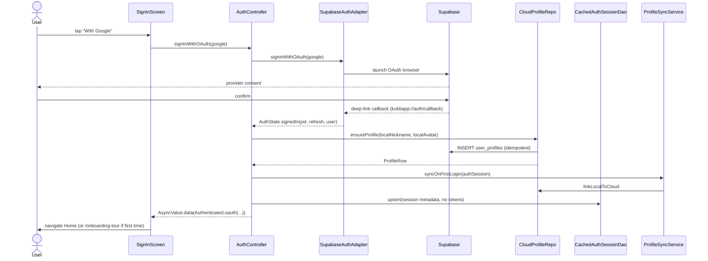
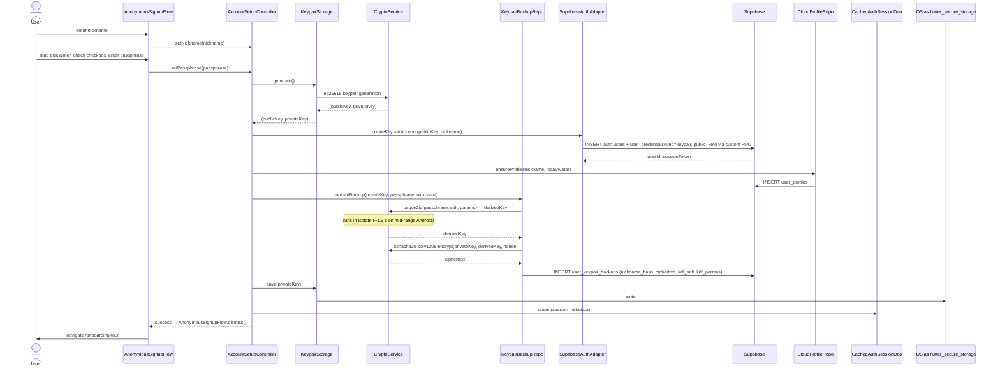
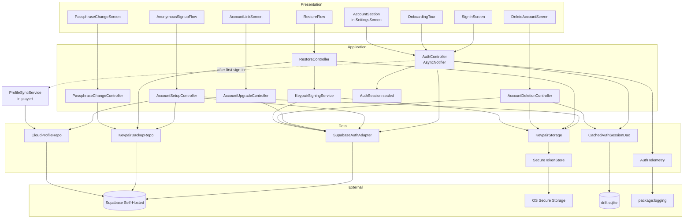

# Architecture — Authentication: OAuth + anonymous keypair

> Produced by `/agents/architect` on 2026-05-04.
> Inputs: `po-output.md` (14 MUST + 4 SHOULD/COULD stories with all clarifications resolved), ADR-0010 (canonical auth spec), ADR-0009 (hosting), ADR-0002 (bounded contexts), ADR-0001 (tech stack).
> Owner-Decision applied: **Variant A** — own `lib/features/auth/` bounded context (data/application/presentation).

## Bounded Context & Layering

**Primary**: new `auth/` bounded context — **pragmatic** layering per ADR-0002. Owns sign-in, sign-up, restore, account upgrade, passphrase change, onboarding tour, account section in settings, the credential-cache table, and all crypto operations.

**Touched contexts** (Owner-Decision 2026-05-04, Phase-2.2-Checkpoint: **Interpretation B — auth becomes mandatory, no local-only profile**):

| Context | Touch | Reason |
|---|---|---|
| `player/` | **gutted in this feature** — `players` drift table dropped; `player_repository.dart`, `current_profile_provider.dart` removed; `onboarding_screen.dart` and edit-mode in `profile_screen.dart` replaced by sign-in / cloud-profile flows. The `player/` directory survives only as a thin presentation layer reading the cached auth-session display fields | Profile is cloud-owned. Local `players` table cannot coexist with that without ambiguous source-of-truth. |
| `core/data/` | drift v4 migration: **drops** `players` table; adds `cached_auth_session` table; renames `sessions.player_id` → `sessions.user_id` (text/uuid, no local FK — references cloud `auth.users.id`). Existing dev-only session data is dropped (app not live). | Single-account state cache + Sessions anchored to cloud user. |
| `core/ui/settings/` | settings screen gets a new top-level `account_section` widget | Logout, account-status badge, "delete account", "link OAuth" entry points |
| `app/router.dart` | redirect rule simplified: `signedOut → /sign-in` (no exceptions, no "Später"-Bypass). Existing `redirect for missing local profile` is removed. | Auth-mandatory entry. |

No new bounded context beyond `auth/`. No hexagonal layering — credentials/sessions are not domain concepts in the DDD sense; they are infrastructure with state.

**Removed from earlier draft (no-longer-needed)**:
- `lib/features/player/application/profile_sync_service.dart` — there is no local profile to sync. `cloud_profile_repository.ensureProfile(...)` is called directly by `account_setup_controller` (anonymous flow) and by `auth_controller` after OAuth callback, with the nickname coming from user input or OAuth-profile fallback.
- The "Später" path (use app without auth) — gone.
- Local-profile-Cloud-profile conflict resolution (US-8 old wording) — gone; cloud is the only profile.

## Components

### `lib/features/auth/data/`

| File | Responsibility |
|---|---|
| `tables/cached_auth_session_table.dart` | drift table definition: single-row session metadata (no plaintext tokens — see ADR-0010 §RLS and AK-14) |
| `dao/cached_auth_session_dao.dart` | drift DAO: read/write the single session row, `watchCurrent()` stream |
| `auth_dao.dart` | facade re-export of `cached_auth_session_dao.dart` for the application layer |
| `secure_token_store.dart` | wrapper over `flutter_secure_storage` for JWT, refresh-token, OAuth-token, ed25519 private-key (one method per credential kind) |
| `keypair_storage.dart` | high-level: `generate()` → `(publicKey, privateKey)`, `save(privateKey)`, `load() → privateKey?`, `clear()` — uses `secure_token_store` |
| `supabase_auth_adapter.dart` | thin wrapper around `supabase_flutter`'s `auth` API. Exposes: `signInWithOAuth(provider)`, `signOut()`, `currentSession`, `onAuthStateChange` stream, `signInWithKeypairChallenge(userId, signature)`, `linkOAuth(provider)`, `deleteAccount()` |
| `keypair_backup_repository.dart` | upload/download `user_keypair_backups` rows; runs Argon2id + XChaCha20-Poly1305 in an isolate to keep UI responsive. Methods: `uploadBackup(privateKey, passphrase, nickname)`, `restoreBackup(nickname, passphrase) → privateKey`, `updatePassphrase(privateKey, oldPassphrase, newPassphrase)`, `deleteBackup()` |
| `cloud_profile_repository.dart` | wraps Supabase queries against `user_profiles` and `user_credentials`. Methods: `ensureProfile(nickname, avatarColor) → ProfileRow`, `linkCredential(kind, ...)`, `deleteAllForUser()` |
| `auth_telemetry.dart` | thin `package:logging` wrapper; emits `auth.signin.attempt`, `auth.signin.success`, `auth.signin.failure`, `auth.refresh.success`, `auth.refresh.failure`, `auth.logout`, `auth.delete` events with **no PII** (only `userId` prefix and event kind) — implements US-17 / AK-17 |

### `lib/features/auth/application/`

| File | Responsibility |
|---|---|
| `auth_session.dart` | sealed class via freezed. Variants: `SignedOut`, `Anonymous` (keypair-only), `Authenticated.oauth(provider, fallbackKeypair)`, `Authenticated.keypair`. Contains `userId`, `displayName`, `provider?`. |
| `auth_controller.dart` | `@riverpod` AsyncNotifier exposed as `authControllerProvider`. Boot path: read `cached_auth_session` → if present, restore session + trigger refresh-on-stale-edge; if absent, emit `SignedOut`. Also subscribes to `supabase_auth_adapter.onAuthStateChange` for cross-tab sync (web) / deep-link callbacks (mobile). |
| `account_setup_controller.dart` | drives the multi-step anonymous-signup flow (nickname → disclaimer + passphrase → backup-upload → onboarding). Stateful, lives only during the flow. |
| `account_upgrade_controller.dart` | drives the link-OAuth-to-existing-account flow (US-5). |
| `restore_controller.dart` | drives the restore-on-new-device flow (US-4) including 30-s cooldown after 3 failures per `nickname_hash` |
| `passphrase_change_controller.dart` | drives US-12 (re-encrypt and update server backup) |
| `account_deletion_controller.dart` | drives US-13 (two-step confirmation; cascades server + local) |
| `keypair_signing_service.dart` | requests challenge from server, signs with private key, returns signed challenge for `supabase_auth_adapter.signInWithKeypairChallenge` |
| `auth_providers.dart` | computed providers: `currentUserIdProvider`, `isAuthenticatedProvider`, `isAnonymousProvider`, `currentProviderProvider`, `requiresOAuthProvider` (true when an organizer-only screen is reached and current session is keypair-only) |

### `lib/features/auth/presentation/`

| File | Responsibility |
|---|---|
| `sign_in_screen.dart` | three CTAs: "With Google" (always), "With Apple" (iOS only), "Without account" (always); plus secondary "Restore account" link and "Continue without sign-in" (the `Später` path) |
| `anonymous_signup_flow.dart` | three sub-screens (PageView): NicknameStep → DisclaimerAndPassphraseStep (the AK-19 disclaimer block + checkbox + passphrase + strength) → BackupConfirmationStep |
| `disclaimer_block.dart` | reusable widget for the AK-19 three-bullet disclaimer; rendered in anonymous signup AND in the onboarding-tour anonymous-reminder slide |
| `passphrase_input.dart` | text field with show/hide toggle, strength indicator (zxcvbn-light), 12-char minimum validation |
| `restore_flow.dart` | two-step: NicknameStep → PassphraseStep + cooldown badge if currently throttled |
| `account_link_screen.dart` | upgrade flow UI (anonymous → OAuth) — single screen with provider buttons + explanation |
| `passphrase_change_screen.dart` | three fields (old, new, confirm new) + confirm button |
| `delete_account_screen.dart` | two-step destructive UI: warning → final confirmation with checkbox |
| `onboarding_tour.dart` | 4-slide PageView (welcome+status / training-modes / coming-soon / passphrase-reminder for anonymous) with skip + finish actions |
| `account_section.dart` | settings-screen widget: status badge + email/nickname + "Logout" + (anonymous) "Link Google/Apple" + "Change passphrase" + "Delete account" |
| `auth_widgets/oauth_provider_button.dart` | shared OAuth button with provider logo + correct platform-conditional rendering for Apple |

### `lib/core/data/`

| File | Responsibility |
|---|---|
| `app_database.dart` | `schemaVersion` bumped 3 → 4. Migration: `m.createTable(cachedAuthSession)`. Existing tables untouched. |
| `tables/app_settings_table.dart` | unchanged structure (key/value); new keys used at runtime: `onboarding_completed = "true"\|"false"`, `last_oauth_provider = "google"\|"apple"\|null` |

### `lib/features/player/`

The bounded context shrinks to a thin presentation layer that reads from the cached auth-session display fields. Concretely:

| File | Action |
|---|---|
| `data/player_repository.dart` | **delete** |
| `data/tables/players.dart` | **delete** |
| `application/current_profile_provider.dart` | **delete**; downstream readers are migrated to `currentUserIdProvider` + a new `displayProfileProvider` (computed from `auth_controller`) |
| `presentation/onboarding_screen.dart` | **delete**; replaced by `auth/presentation/sign_in_screen.dart` |
| `presentation/profile_screen.dart` | **rewrite** — display-only screen reading from cached session + `cloud_profile_repository`; edit-mode delegates to a new `auth/presentation/edit_profile_screen.dart` (via deep-link) |
| `application/display_profile_provider.dart` | NEW — exposes `DisplayProfile { userId, displayName, avatarColor }` from `cached_auth_session` for offline-safe UI access |

### `lib/app/`

| File | Change |
|---|---|
| `router.dart` | extend redirect: `signedOut + no localProfile + not on /sign-in → redirect /sign-in`. `signedOut + has localProfile + on /sign-in → allow ("Später"-Pfad will pop back into /).` Add routes: `/sign-in`, `/sign-in/anonymous`, `/sign-in/restore`, `/auth/callback`, `/onboarding-tour`, `/settings/account/link`, `/settings/account/passphrase`, `/settings/account/delete` |
| `bootstrap.dart` | bootstrap reads cached session in addition to initial profile (synchronous); router redirect uses both |

## Ports & Adapters

This context is pragmatic — no formal hexagonal ports. But the following boundaries are clean enough to mock for tests:

| Boundary | Production Adapter | Test Adapter |
|---|---|---|
| Supabase Auth | `SupabaseAuthAdapter` (wraps `supabase_flutter`) | `FakeSupabaseAuthAdapter` (in-memory, deterministic OAuth-callback simulation) |
| OS Secure Storage | `SecureTokenStore` (wraps `flutter_secure_storage`) | `InMemorySecureTokenStore` |
| Crypto Operations | `CryptoService` (wraps `package:cryptography`) | real `CryptoService` is fast enough — no fake needed; isolate-runner is mockable |
| Cloud Profile | `CloudProfileRepository` (Supabase queries) | `FakeCloudProfileRepository` |
| Keypair Backup | `KeypairBackupRepository` (Supabase queries) | `FakeKeypairBackupRepository` |
| drift cached session | `CachedAuthSessionDao` (real, in-memory drift) | real, in-memory drift |

All adapters are constructor-injected via Riverpod providers — overriding for tests is one `overrideWithValue` away.

## Riverpod provider topology (public API)

| Provider | Type | Watched by |
|---|---|---|
| `authControllerProvider` | `AsyncNotifierProvider<AuthController, AuthSession>` | router, settings, all auth-gated screens |
| `currentUserIdProvider` | `Provider<UserId?>` (computed) | profile-sync, telemetry, future tournament/match contexts |
| `isAuthenticatedProvider` | `Provider<bool>` (computed) | router redirect, gating widgets |
| `isAnonymousProvider` | `Provider<bool>` (computed) | settings (show "link OAuth" only when anonymous), onboarding tour |
| `currentProviderProvider` | `Provider<OAuthProvider?>` (computed) | account-section badge |
| `requiresOAuthProvider` | `Provider<bool>` (computed) | future organizer-only routes |
| `profileSyncServiceProvider` | `Provider<ProfileSyncService>` | called by `auth_controller` post-sign-in |
| `cryptoServiceProvider` | `Provider<CryptoService>` | keypair-backup-repository, keypair-signing-service |
| `keypairStorageProvider` | `Provider<KeypairStorage>` | restore-controller, account-setup-controller, signing-service |
| `supabaseAuthAdapterProvider` | `Provider<SupabaseAuthAdapter>` | auth-controller, account-upgrade, account-deletion |

## Data flow

### Flow A — Sign-In OAuth (Google / Apple)



### Flow B — Sign-In anonymous (most complex; includes backup upload)



### Flow C — Restore on new device

```mermaid
sequenceDiagram
    actor User
    participant UI as RestoreFlow
    participant RC as RestoreController
    participant KBR as KeypairBackupRepo
    participant CS as CryptoService
    participant KS as KeypairStorage
    participant KSS as KeypairSigningService
    participant SA as SupabaseAuthAdapter
    participant SB as Supabase
    participant DAO as CachedAuthSessionDao

    User->>UI: enter nickname + passphrase
    UI->>RC: restore(nickname, passphrase)
    RC->>KBR: restoreBackup(nickname, passphrase)
    KBR->>SB: SELECT user_keypair_backups WHERE nickname_hash = sha256(nickname || server_salt)
    SB-->>KBR: ciphertext, kdf_salt, kdf_params
    KBR->>CS: argon2id(passphrase, salt, params)
    CS-->>KBR: derivedKey
    KBR->>CS: xchacha20-poly1305 decrypt(ciphertext, derivedKey)
    alt decrypt success
        CS-->>KBR: privateKey
        KBR-->>RC: privateKey
        RC->>KS: save(privateKey)
        RC->>KSS: signInWithChallenge()
        KSS->>SA: requestChallenge(publicKeyHash)
        SA->>SB: GET /auth/keypair/challenge
        SB-->>SA: challenge
        KSS->>CS: ed25519 sign(challenge || timestamp)
        CS-->>KSS: signature
        KSS->>SA: signInWithKeypairChallenge(publicKey, signature, timestamp)
        SA->>SB: POST /auth/keypair/verify → JWT
        SB-->>SA: session
        RC->>DAO: upsert(session metadata)
        RC-->>UI: success → navigate Home
    else decrypt failure
        CS--xKBR: decryption error (auth tag mismatch)
        KBR-->>RC: AuthError.passphraseMismatch
        RC->>RC: increment failure counter for nickname_hash; if >= 3 set 30 s cooldown
        RC-->>UI: error message + cooldown badge
    end
```

### Flow D — Account upgrade anonymous → OAuth

Sequence is short enough to express in prose:

`AccountUpgradeController.linkOAuth(provider)` → `SupabaseAuthAdapter.linkOAuth(provider)` → Supabase OAuth browser → callback → server INSERT `user_credentials(kind=oauth_<provider>, oauth_subject=...)` for **same `user_id`** → `auth_controller` rebuilds session as `Authenticated.oauth(provider, fallbackKeypair: true)` → cached session metadata updated → settings UI re-renders. Existing keypair stays in `flutter_secure_storage`; not deleted.

## Data model deltas

### Local (drift) — schema version 3 → 4

```dart
class CachedAuthSessionTable extends Table {
  // Single-row constraint enforced via deterministic primary key
  TextColumn get id => text().withDefault(const Constant('singleton'))();
  TextColumn get userId => text()();           // cloud auth.users.id (UUID)
  TextColumn get kind => text()();             // 'oauth_google' | 'oauth_apple' | 'keypair'
  TextColumn get displayName => text()();      // nickname (cached from user_profiles for offline UI)
  TextColumn get avatarColor => text().nullable()();  // hex (cached from user_profiles)
  DateTimeColumn get expiresAt => dateTime()();
  DateTimeColumn get refreshAfter => dateTime()();
  DateTimeColumn get createdAt => dateTime()();
  DateTimeColumn get updatedAt => dateTime()();

  @override
  Set<Column<Object>> get primaryKey => {id};
}
```

`Sessions` table changes:
```dart
class Sessions extends Table {
  TextColumn get id => text()();
  TextColumn get userId => text()();    // CHANGED — was playerId text().references(Players, #id)
                                         // now plain UUID, no FK (references cloud auth.users.id)
  TextColumn get kind => text()();
  // ... other fields unchanged
}
```

Migration in `app_database.dart`:

```dart
if (from < 4) {
  // 1. Create new auth-cache table.
  await m.createTable(cachedAuthSession);

  // 2. Migrate sessions: drop FK, rename column, drop existing rows
  //    (app not live; dev-only data is acceptable to discard).
  await customStatement('DELETE FROM session_events');
  await customStatement('DELETE FROM finisseur_stick_events');
  await customStatement('DELETE FROM sessions');
  await m.alterTable(
    TableMigration(
      sessions,
      columnTransformer: {
        sessions.userId: const CustomExpression<String>("''"),  // empty for the dropped rows
      },
      newColumns: [sessions.userId],
    ),
  );
  // (drift's TableMigration handles the column rename via column-list replacement
  //  in the recreated table; FK to players is gone in the new schema)

  // 3. Drop the players table (no longer source-of-truth for profile data).
  await m.deleteTable('players');
}
```

`AppSettingsTable` is **unchanged** structurally; new runtime keys:
- `onboarding_completed` — `"true"` after the user finishes or skips the onboarding tour
- `restore_failure_<nickname_hash>` — JSON `{count:int, cooldownUntil:iso8601}` for the 3-strikes throttle

**Note**: drift schema-migration helpers for "rename column + drop FK" are awkward; the implementation will likely use a temp-table swap (`CREATE TABLE sessions_new`, `INSERT FROM OLD_SELECT`, `DROP TABLE sessions`, `ALTER TABLE sessions_new RENAME TO sessions`) inside the migration block. Scrum-master will mark this migration as a **single MEDIUM-sized task** (not S) due to the schema-level surgery.

### Server (Supabase / Postgres) — additions per ADR-0010

These need a one-shot SQL migration applied to the local Docker Supabase + later to the Hetzner instance:

```sql
-- New tables (per ADR-0010)
CREATE TABLE user_credentials (
  id            uuid        PRIMARY KEY DEFAULT gen_random_uuid(),
  user_id       uuid        NOT NULL REFERENCES auth.users(id) ON DELETE CASCADE,
  kind          text        NOT NULL CHECK (kind IN ('oauth_google','oauth_apple','keypair')),
  public_key    text        NULL,    -- base64; non-null when kind='keypair'
  oauth_subject text        NULL,    -- non-null when kind starts with 'oauth_'
  created_at    timestamptz NOT NULL DEFAULT now(),
  CHECK (
    (kind = 'keypair' AND public_key IS NOT NULL AND oauth_subject IS NULL)
    OR (kind <> 'keypair' AND oauth_subject IS NOT NULL AND public_key IS NULL)
  )
);
CREATE INDEX user_credentials_user_id_idx ON user_credentials(user_id);
CREATE UNIQUE INDEX user_credentials_oauth_subject_idx
  ON user_credentials(kind, oauth_subject)
  WHERE oauth_subject IS NOT NULL;
CREATE UNIQUE INDEX user_credentials_public_key_idx
  ON user_credentials(public_key)
  WHERE public_key IS NOT NULL;

CREATE TABLE user_keypair_backups (
  user_id        uuid        PRIMARY KEY REFERENCES auth.users(id) ON DELETE CASCADE,
  nickname_hash  text        NOT NULL UNIQUE,    -- sha256(nickname || server_salt), base64
  ciphertext     bytea       NOT NULL,
  kdf_salt       bytea       NOT NULL,
  kdf_params     jsonb       NOT NULL,            -- {algo:'argon2id', m:65536, t:3, p:4}
  created_at     timestamptz NOT NULL DEFAULT now(),
  updated_at     timestamptz NOT NULL DEFAULT now()
);
CREATE INDEX user_keypair_backups_nickname_hash_idx ON user_keypair_backups(nickname_hash);

-- Extend user_profiles per ADR-0010
ALTER TABLE user_profiles
  ADD COLUMN nickname_unique citext UNIQUE,
  ADD COLUMN avatar_color text NULL,
  ADD COLUMN onboarding_completed boolean NOT NULL DEFAULT false;
```

RLS policies (per ADR-0010 §RLS):

```sql
-- user_credentials: only the owner can read; only owner can insert when not yet present
ALTER TABLE user_credentials ENABLE ROW LEVEL SECURITY;
CREATE POLICY user_credentials_owner_read ON user_credentials
  FOR SELECT USING (user_id = auth.uid());
CREATE POLICY user_credentials_owner_insert ON user_credentials
  FOR INSERT WITH CHECK (user_id = auth.uid());

-- user_keypair_backups: anyone may read by nickname_hash (the ciphertext is useless without
-- the passphrase); only owner may write
ALTER TABLE user_keypair_backups ENABLE ROW LEVEL SECURITY;
CREATE POLICY user_keypair_backups_lookup ON user_keypair_backups
  FOR SELECT USING (true);            -- nickname_hash is the only filter clients use
CREATE POLICY user_keypair_backups_owner_write ON user_keypair_backups
  FOR INSERT WITH CHECK (user_id = auth.uid());
CREATE POLICY user_keypair_backups_owner_update ON user_keypair_backups
  FOR UPDATE USING (user_id = auth.uid());
CREATE POLICY user_keypair_backups_owner_delete ON user_keypair_backups
  FOR DELETE USING (user_id = auth.uid());
```

Plus a **server salt** for `nickname_hash` lives in a Supabase secret (read by the auth-challenge edge function only — clients never see it). Keeps offline brute-force on a stolen ciphertext from being trivially mapped to the original nickname.

### Custom auth endpoints (Supabase Edge Functions or Postgres functions)

Three small server endpoints live alongside Supabase Auth:

| Endpoint | Purpose |
|---|---|
| `POST /auth/keypair/create` | Create new anonymous account: validates nickname, inserts auth.users + user_credentials(keypair) + user_profiles in a transaction, returns userId + initial JWT |
| `GET /auth/keypair/challenge?publicKey=...` | Return a short-lived challenge string for keypair sign-in |
| `POST /auth/keypair/verify` | Verify Ed25519 signature; if valid, return Supabase JWT and refresh token (issued via `auth.users` row, lifetime 1 h) |

These are **not** part of standard Supabase Auth — they extend it. Implementation choice: Postgres functions + PostgREST endpoints (simpler, all in DB) vs. a small Dart sidecar (more code but easier to test). Recommend **Postgres functions + PostgREST** for v1; sidecar can be added later if logic grows.

## Tech-stack additions

To `pubspec.yaml` (versions are floors at time of writing 2026-05-04 — pin per `.claude/rules/tech-lead.md`):

```yaml
dependencies:
  supabase_flutter: ^2.5.0       # Supabase client incl. OAuth + auth-state stream
  flutter_secure_storage: ^9.2.2 # Keychain / Keystore wrapper
  cryptography: ^2.7.0           # Ed25519, Argon2id, XChaCha20-Poly1305 — pure Dart
  app_links: ^6.3.0              # Deep-link handling for OAuth callback (mobile)
```

All four packages are widely used, well-maintained, and Cross-Platform (Android/iOS/Linux/Windows/macOS/Web). `cryptography` runs Argon2id in pure-Dart; we wrap it in an `Isolate` (via `compute()`) so the UI thread does not jank during the ~1.5 s KDF on mid-range Android. **Spike task** before scrum-master cuts work: verify Argon2id timings on mid-range Android + Linux + Web (per Risk #3 in feature-plan.md).

No deletions from existing dependencies. No version bumps to existing deps required.

## Component diagram (auth/ container view)



## Open architectural risks (carry-over to scrum-master)

1. **Argon2id-on-Web performance** — `cryptography` package runs Argon2id in pure-Dart. On Flutter Web (compiled to JS / WASM) timings can balloon to 5–10 s. Mitigation: **first scrum-master task is a spike** that benchmarks Argon2id on Linux/Android/Web with the chosen parameters; if Web is unacceptable, fall back to lower memory parameter (m=32 MiB) on Web only.

2. **Local Docker Supabase parity with Hetzner Supabase** — auth-flows tested locally must work identically on Hetzner. Mitigation: scrum-master schedules an integration-test pass against a transient Docker-Supabase as part of the implement-loop. Hetzner-specific verification is a separate owner-task post-feature.

3. **Custom keypair-auth endpoints** — Postgres functions + PostgREST is a less-trodden path than standard Supabase Auth. Mitigation: keep the endpoints minimal (3 functions, ~80 lines SQL), test them in isolation against Docker-Supabase before integrating clientside.

4. **OAuth deep-link callback on Linux desktop** — `app_links` doesn't fully cover Linux. Mitigation: defer Linux OAuth to post-feature; on Linux the sign-in screen disables the OAuth buttons with a "not yet supported on this platform" hint and offers only the keypair path.

5. **Profile-creation race / idempotency** — `auth_controller` calls `cloud_profile_repository.ensureProfile(...)` on every successful sign-in (since there is no longer a local profile that already encodes "first login"). Idempotency must be enforced at the repository level. Mitigation: `ensureProfile` uses Postgres `ON CONFLICT (user_id) DO NOTHING RETURNING *`; `cached_auth_session` is upserted (single-row).

6. **drift v4 destructive migration** — drops the `players` table and clears `sessions`, `session_events`, `finisseur_stick_events` rows. Acceptable because the app is not live, but for safety: the migration runs only when upgrading from schema v3, and a one-time backup of the v3 DB is written to `<app-data>/kubb_v3_backup_<timestamp>.db` before destruction. Recovery is manual (open the backup with sqlite-cli and inspect).

## ADR delta

**No new ADR required.** All architectural decisions trace back to:
- ADR-0001 (Riverpod + drift + Supabase + freezed)
- ADR-0002 (`auth/` is a pragmatic bounded context)
- ADR-0003 (roles, lifecycle, RLS skeleton)
- ADR-0009 (self-hosted Supabase on Hetzner)
- ADR-0010 (canonical auth spec — drives the data model and the encryption parameters)

The Argon2id parameters (m=64 MiB, t=3, p=4), the XChaCha20-Poly1305 cipher, the `nickname_hash = sha256(nickname || server_salt)` lookup pattern, the 3-strike client-side cooldown, the single-row drift session cache, and the custom Postgres-function auth-challenge endpoints are **implementations** of decisions already taken in ADR-0010 — not new architectural choices that warrant their own record.

## UI workflow rule (Owner-Decision 2026-05-04)

**Every UI task must be preceded by a design-template request.** This is a project-wide rule (saved in agent memory). Concretely for this feature:

- All tasks under M5 (Presentation) AND any UI-touching task in M6 / M7 need a paired **"design-template request"** sub-task scheduled BEFORE the implementation task.
- Scrum-master will bundle all M5 design-template requests into **one batch at the start of M5**, output a single comprehensive design-brief document `docs/plans/auth-oauth-keypair/design-brief.md`, and mark all M5 implementation tasks as blocked-by that batch.
- Owner produces the templates via Claude Design (separate cloud-based design process). Implementation does not start before the templates are in hand.
- Brief format per UI element: which user story / AK, which existing patterns from `docs/design/`, which states must be covered (loading / empty / error / success / disabled), accessibility constraints, copy keys (ARB).

## Tasks-Sketch (hint to Scrum Master)

Suggested grouping into milestones; scrum-master will refine into atomic ≤ 100 LOC / ≤ 3-file tasks per `rules/scrum-master.md`. **Reflects Interpretation-B updates** (no `players` table, sessions migrated to `userId`) and the **UI design-template-first rule**.

### M0 — Spike & dependencies
- Spike task: benchmark Argon2id on Linux/Android/Web; document chosen parameters
- Add `pubspec.yaml` deps: `supabase_flutter`, `flutter_secure_storage`, `cryptography`, `app_links`
- Initial Docker-Supabase setup: `docker-compose.local.yml` for dev (committed; NOT for prod)

### M1 — Local data layer (drift v4)
- drift v4 migration: drop `players`, create `cached_auth_session`, rename `sessions.player_id` → `sessions.user_id` (with table-recreate), drop existing session rows. Tests cover migration from a v3 fixture DB.
- `cached_auth_session_table.dart` + DAO + tests (in-memory drift)
- `secure_token_store.dart` + tests (using `flutter_secure_storage` mock)
- `keypair_storage.dart` + tests (with fake `SecureTokenStore`)
- `crypto_service.dart` + tests (small wrapper over `cryptography` package; Argon2id + XChaCha20 + Ed25519; isolate-runner for KDF)

### M2 — Server schema + custom endpoints (against local Docker Supabase)
- Supabase SQL migration script: tables (`user_credentials`, `user_keypair_backups`), indexes, RLS policies, server-salt secret
- Postgres functions for keypair `create` / `challenge` / `verify`
- PostgREST exposure of the three endpoints
- Manual integration tests against Docker-Supabase (curl-based smoke tests committed under `tools/auth-smoketest/`)

### M3 — Repositories & adapters
- `supabase_auth_adapter.dart` + `FakeSupabaseAuthAdapter` + tests
- `keypair_backup_repository.dart` (with isolate-based KDF) + fake + tests
- `cloud_profile_repository.dart` (uses `ON CONFLICT (user_id) DO NOTHING RETURNING *` for idempotency) + fake + tests
- `auth_telemetry.dart` + tests (PII filter assertions)

### M4 — Application layer
- `auth_session.dart` (freezed sealed: `SignedOut`, `Authenticated.oauth`, `Authenticated.keypair`)
- `auth_controller.dart` (AsyncNotifier) + tests (boot from cached session, refresh-on-stale, onAuthStateChange subscription)
- `account_setup_controller.dart` (anonymous flow) + tests
- `restore_controller.dart` (incl. 30-s cooldown after 3 failures per `nickname_hash`) + tests
- `account_upgrade_controller.dart` + tests
- `passphrase_change_controller.dart` + tests
- `account_deletion_controller.dart` + tests
- `keypair_signing_service.dart` + tests
- `auth_providers.dart` (computed providers `currentUserIdProvider`, `isAuthenticatedProvider`, `isAnonymousProvider`, `currentProviderProvider`, `requiresOAuthProvider`) + tests
- `display_profile_provider.dart` (in `player/application/`, sources from cached session) + tests

### M5 — UI (each task PRECEDED by a design-template request)
- **Batch design-brief task** (single owner-task): write `docs/plans/auth-oauth-keypair/design-brief.md` covering all UI elements below; owner produces templates via Claude Design before any of the implementation tasks below start
- `sign_in_screen.dart` (Google + Apple-on-iOS + anonymous CTA) — implement-after-template
- `anonymous_signup_flow.dart` (3 sub-screens; AK-19 disclaimer in step 2) — implement-after-template
- `disclaimer_block.dart` (reusable widget) — implement-after-template
- `passphrase_input.dart` (show/hide, strength indicator, 12-char min) — implement-after-template
- `restore_flow.dart` (cooldown badge) — implement-after-template
- `account_link_screen.dart` — implement-after-template
- `passphrase_change_screen.dart` — implement-after-template
- `delete_account_screen.dart` (two-step destructive) — implement-after-template
- `onboarding_tour.dart` (4 slides) — implement-after-template
- `account_section.dart` (settings widget) — implement-after-template
- `oauth_provider_button.dart` (shared) — implement-after-template
- `edit_profile_screen.dart` (replaces F2 edit-mode) — implement-after-template

### M6 — Routing + bootstrap + l10n + player-context cleanup
- `router.dart` redirect rule rewrite: `signedOut → /sign-in`, no exceptions; remove old missing-local-profile redirect
- `bootstrap.dart` cached-session readout (sync), removal of `initialProfileProvider` for the local-player-fallback
- New routes: `/sign-in`, `/sign-in/anonymous`, `/sign-in/restore`, `/auth/callback`, `/onboarding-tour`, `/settings/account/link`, `/settings/account/passphrase`, `/settings/account/delete`, `/profile/edit`
- Delete: `lib/features/player/data/player_repository.dart`, `lib/features/player/data/tables/players.dart`, `lib/features/player/application/current_profile_provider.dart`, `lib/features/player/presentation/onboarding_screen.dart`
- Rewrite `lib/features/player/presentation/profile_screen.dart` as display-only
- Update all callers of `currentProfileProvider` → `displayProfileProvider`
- Update SessionDao methods: `playerId` → `userId` in all signatures
- ARB strings for all new UI (de) + `flutter gen-l10n` + commit generated files (per `tech-lead.md` quality-gate 6)

### M7 — Polish + integration
- Account-status badge (US-15) — implement-after-template
- Backup-warning surface in settings (US-10) — implement-after-template
- Internal logging audit pass (US-17): grep for `print(`, `log(`, ensure all auth-events route through `auth_telemetry.dart`
- Full integration test: anonymous sign-up → backup → restore on simulated second device → upgrade → logout

Estimated total: ~35–40 atomic tasks across 8 effective phases (M0–M7 + the design-batch). The M5 design-batch task is **owner-blocked** — implementation timeline depends on owner's Claude-Design throughput.

## Validation summary

Per `/skills/stepValidator` checklist:
- ✅ Bounded Context bestimmt (`auth/`) und konsistent mit ADR-0002
- ✅ Komponenten klar zugeschnitten (Single Responsibility per file)
- ✅ Test-Adapter (Fakes) für jeden externen Boundary genannt
- ✅ Datenmodell-Änderungen rückwärtskompatibel (drift onUpgrade additive only; Server-Migration adds columns + tables only, no drops)
- ✅ Zwei Mermaid-Diagramme (component + sequence)
- ✅ Kein neuer ADR nötig (begründet)

Result: **PASS**.
