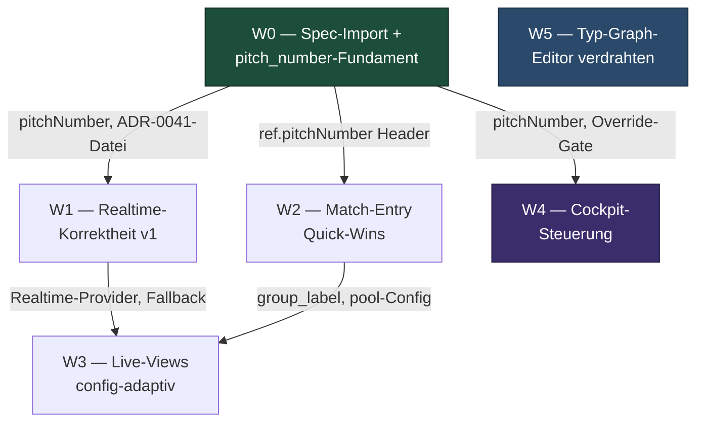

# Sprint-Plan — Cockpit, Live-Views, Match-Entry, Realtime & Typ-Graph-Editor

**Status:** Meta-Übersicht zum Backlog `tasks.md`.
**Bezug:** `architecture.md` (W0 → W5), ADR-0041/0043/0044/0045, Forward-Specs unter
`docs/specs/`.
**Level:** senior (TDD-first, Conventional-Commit-Scopes, additive Migrationen,
security-checker bei jeder RPC/RLS/Grant-Berührung).

---

## 1. Wellen-Übersicht

| Welle | Inhalt | Tasks | Deps |
|---|---|---|---|
| **W0 — Spec-Import + pitch_number-Fundament** | 4 Forward-Specs + ADR-0041 importieren, pitch_number in match_get/list projizieren, bis `TournamentMatchRef.pitchNumber` + Banner durchreichen, Override-Gate per pgTAP einfrieren | 10 | keine (Fundament) |
| **W1 — Realtime-Korrektheit v1** | 5 Robustheits-Guards, Standings-CDC-Concern, garantierter Voll-Refetch-Catch-up bei Rejoin/Resume, Participants-Fallback-Gate, Degraded-Banner auf Standings/Live, deklarative Kritikalitäts-Stufe, ADR-0041-Body | 18 | keine harte (clientseitig; ADR-0041-Datei aus W0-T02) |
| **W2 — Match-Entry Quick-Wins** | Satzanzahl aus Config (S3), canPop-Back (S1), Clock+Pitch-Header (S2), Cross-Tournament-PitchCall im Home (S4) | 9 (1 gestrichen → 8 aktiv) | S2-Pitch konsumiert W0 pitchNumber |
| **W3 — Live-Views config-adaptiv** | Tiebreak-Kette format-getrieben, gruppierte Standings, Bracket im Übersicht-Tab, Gruppen-Label, Einzel/Team-Header, group_label/phase-Projektion, InboxBell auf Nicht-Eingabe-Screens | 18 | W1 (Realtime-Provider) + W2 (group_label/pool-Config befüllt) |
| **W4 — Cockpit-Steuerung** | Timer-Status + extend/shorten-RPC, Pitch-Badge, begründungsfreier Direct-Score, Cross-Turnier-Check-in-RPC+Screen, Detail-Entkernung ZULETZT | 25 (3 gestrichen → 22 aktiv) | W0 pitchNumber-Fundament (Pitch-Badge), Override-Gate (Direct-Score) |
| **W5 — Typ-Graph-Editor verdrahten** | Form/Canvas-Toggle im Ebene-2-Body, standalone Route, Wizard-Write-Pfad `config['type_graph']` | 7 | keine (UI-Wiring, Domain fertig) |

**Anzahl Wellen:** 6.
**Tasks gesamt:** 87 geplant, 4 gestrichen (dedupliziert nach W0), **83 aktiv**.

---

## 2. Task-Verteilung je Welle (aktive Tasks)

| Welle | docs | tests | data | security | domain | frontend | Summe |
|---|---|---|---|---|---|---|---|
| W0 | 3 | 3 | 1 | 1 | 1 | 1 | 10 |
| W1 | 2 | 8 | 5 | 0 | 3 | 0 | 18 |
| W2 | 0 | 1 | 0 | 0 | 0 | 7 | 8 |
| W3 | 0 | 4 | 2 | 2 | 3 | 7 | 18 |
| W4 | 0 | 6 | 3 | 3 | 3 | 7 | 22 |
| W5 | 0 | 3 | 0 | 0 | 0 | 4 | 7 |
| **Summe** | **5** | **25** | **11** | **6** | **10** | **26** | **83** |

Test-Anteil 30 % (25/83) — senior-typisch (TDD-first plus pgTAP je RPC-Berührung).
Gestrichen (nicht gezählt): W4-T01, W4-T02, W4-T03, W2-T08 (siehe §5).

---

## 3. Kritischer Pfad

Der längste Abhängigkeitspfad läuft vom pitch_number-Fundament in W0 über die
Cockpit-Migrationen bis in die Detail-Entkernung — sie ist der späteste Knoten der
ganzen Planung, weil sie auf ALLE Cockpit-Funktionen wartet:

```
W0-T04 (pgTAP pitch)
  -> W0-T05 (Migration pitch-Projektion match_get + list)
  -> W0-T08 (TournamentMatchRef.pitchNumber + beide Decoder)
  -> W4-T04 (Pitch-Badge im Cockpit)
  -> W4-T08 ("Punkte eintragen"-CTA)
  -> W4-T24 (Per-Tournament-Check-in ins Cockpit)
  -> W4-T25 (Detail-Entkernung ZULETZT)
```

Parallel läuft der zweite Cockpit-Strang über das Override-Gate:

```
W0-T10 (Override-Gate-Freeze)
  -> W4-T06 (submitDirect, reason-frei)
  -> W4-T07 (Direct-Modus im Override-Screen)
  -> W4-T08
  -> W4-T25
```

Nach der Reconciliation (pitch_number aus W0, kein W4-Pitch-Duplikat) entfällt der
frühere Zwischenknoten W4-T03; W4-T04 hängt direkt an W0-T08.

---

## 4. Abhängigkeitsdiagramm (Wellen-Ebene)



W0 ist das Fundament: pitch_number und ADR-0041-Datei speisen W1/W2/W4, das
Override-Gate speist W4. W3 wartet auf W1 (Realtime) und W2 (befülltes group_label).
W5 hängt an nichts (Domain ist fertig, reines UI-Wiring) und darf jederzeit laufen.
W4 ist mit Abstand die grösste Welle.

---

## 5. Cross-Wave-Abhängigkeiten & Reconciliations

### Harte Cross-Wave-Deps
1. **pitch_number-Fundament (W0-T04/T05/T08)** ist der saubere Ursprung des Feldes
   und blockt die Pitch-Badge im Cockpit (W4-T04). W0-T05 projiziert
   `match_get` + `list`, W0-T08 legt das Feld + beide Parser an.
2. **Override-Gate-Freeze (W0-T10)** blockt den begründungsfreien Direct-Score
   (W4-T06): das Gate `caller_can_administer` muss per pgTAP eingefroren sein, bevor
   der Override-Schreibweg generalisiert wird.
3. **Detail-Entkernung (W4-T25) ZULETZT** — erst müssen Direct-Score (W4-T08),
   Timer-extend (W4-T16), Cross-Check-in (W4-T23) UND Per-Tournament-Check-in
   (W4-T24) vollständig im Cockpit erreichbar sein, sonst Funktionsverlust.
4. **Live-Views (W3) NACH Realtime (W1)** und nach befülltem
   `group_label`/`pool_phase_config` (W2-Daten) — ohne group_label fällt die
   Übersicht still auf Rundengruppierung zurück (kein Crash).

### Datei-Kollisionen wellenübergreifend (bei paralleler Ausführung sequenzieren)
- `pitch_call_banner.dart` — W0-T09 + W2-T06.
- `tournament_standings_screen.dart` / `tournament_live_screen.dart` —
  W1-T14 + W3-T14/T15/T16.
- `tournament_remote.dart` — W0-T08 + W3-T08/T09 + W4-T12/T20.

### Reconciliations (auf den Roh-Plan angewandt)

**A — pitch_number-Dedup.** Das echte `pitch_number` landet bereits in W0
(Owner-Entscheid 2). Die in W4 duplizierten Pitch-Tasks sind redundant und
**gestrichen**, die Original-IDs bleiben zur Nachvollziehbarkeit als "GESTRICHEN"
markiert:
- **W4-T01** (pgTAP pitch projection) — gestrichen, W0-T04 deckt es ab.
- **W4-T02** (Migration pitch projection) — gestrichen, W0-T05 projiziert match_get + list.
- **W4-T03** (`TournamentMatchRef.pitchNumber` Feld) — gestrichen, W0-T08 legt Feld + beide Parser an.
- **W4-T04** (Pitch-Badge) bleibt, `depends_on → W0-T08` (statt W4-T03).

**B — ADR-0042 gestrichen.** Da das echte pitch_number landet, nutzt der
Match-Entry-Header (W2-T05) `ref.pitchNumber` aus W0 — KEIN
`matchNumberInRound`-Stand-in. Das Stand-in-ADR entfällt:
- **W2-T05** angepasst: Header zeigt Pitch aus `ref.pitchNumber` (W0); hängt
  zusätzlich an W0-T08.
- **W2-T08** (ADR-0042 dokumentieren) — gestrichen, das Stand-in ist obsolet.

**C — Stale-Briefing-Korrekturen** (festgehalten in §7 Risiken + `architecture.md`
§0/§1):
- die `pitch_number`-SPALTE existiert bereits seit `20260525000001` (vom Pitch-Assign
  gespeist) → W0 macht nur Projektion + Wire, KEINE Schema-Migration.
- das Override-Gate ist bereits `tournament_caller_can_administer` (seit
  `20261281000000`) → W0-T10 verifiziert/friert es per pgTAP ein, baut es nicht;
  `tournament_caller_can_manage` ist nur ein deprecated Alias. Owner-Entscheid 1 ist
  damit faktisch bereits erfüllt.

### Migrations-Timestamps (koordiniert, höchste bestehende `20261316000000`)
| Welle | Migration | Timestamp |
|---|---|---|
| W0 | match_get/list pitch_number | `20261317000000` |
| W3 | list_matches phase + group_label | `20261321000000` |
| W4 | adjust_round_time | `20261323000000` |
| W4 | search_checkin_targets | `20261324000000` |

`20261322000000` war für die list-Pitch-Migration reserviert, entfällt mit der W4-Dedup.

---

## 6. ADR-Liste

| ADR | Welle | Inhalt | Status |
|---|---|---|---|
| **0041** | W0/W1 | Push-Critical-Freshness and Delta-Catchup (Import von origin-0035, umnummeriert auf 0041; Body in W1-T18). Realtime-v1-Korrektheit: Standings als first-class CDC-Concern, garantierter Voll-Refetch-Catch-up bei Rejoin/Resume, deklarative Kritikalitäts-Stufe; amendiert ADR-0029 | Accepted (Body W1-T18) |
| **0043** | W3 | Tiebreak-Kette format-getrieben statt user-config in der Standings-Projektion — Live-Rangliste leitet die Kette aus Format/Stage-Typ ab (`chainForStageType`), persistierte `tiebreakerOrder` nur Fallback für reine roundRobin; begründet durch vorrunde-ranking-spec §6.2 | Proposed |
| **0044** | W4 | Direkter Punkte-Eintrag generalisiert `tournament_organizer_override` — kein eigener RPC, bestehender Override-Schreibweg begründungsfrei (reason optional) wiederverwendet, Audit bleibt erhalten | Proposed |
| **0045** | W4 | Timer-Verstellen als additiver Schreibweg auf `match_seconds`/`ends_at` der laufenden Schedule-Zeile — kein neues Pause-Modell, skew-konforme Anzeige via vorhandene CDC-Push statt Polling | Proposed |

**Gestrichen:** ADR-0042 (Wave-2-Pitch-Header-Stand-in). Reconciliation B — der
Header nutzt das echte `ref.pitchNumber` aus W0, ein `matchNumberInRound`-Stand-in
ist nicht mehr nötig. Die ursprünglich als `00NN`/`00xx` geplanten Platzhalter-ADRs
sind oben auf 0043/0044/0045 durchnummeriert (0042 bleibt frei).

**Importierte Specs** (keine ADRs, aber Fundament-Artefakte, W0-T01/T03):
`realtime-sync-fixes-spec.md` (9 Cross-Refs 0035 → 0041),
`live-views-and-inbox-spec.md`, `match-entry-and-home-tile-spec.md`,
`organizer-cockpit-dashboard-spec.md`.

---

## 7. Risiken (Kurzfassung, Details in `architecture.md` je Welle)

- **Stale-Briefing:** `pitch_number`-Spalte und `caller_can_administer`-Gate
  existieren bereits → W0 verifiziert statt baut. Wer hier neu migriert, erzeugt
  Doppel-Felder bzw. Gate-Drift. Siehe §5-C.
- **CDC-Fold-Reset:** Der Catch-up-/extend-Pfad darf NICHT
  `tournamentRoundScheduleProvider` invalidieren — das würde den akkumulierten Fold
  zurücksetzen. Nur fetch-basierte FutureProvider invalidieren (W1-T08/T10, W4-T13).
- **Battery-Invariante (ADR-0029):** kein neuer `Timer.periodic`, kein gehaltener
  Hintergrund-Socket; jeder Fallback-Poller MUSS gegated sein (W1-T12).
- **Detail-Entkernung als Funktionsverlust-Risiko:** W4-T25 erst nach allen
  Cockpit-Migrationen — Reihenfolge ist hart.
- **SECURITY DEFINER:** `tournament_search_checkin_targets` braucht vollen
  Security-Review (search_path-Pinning, Scope-Bypass) — W4-T19.
- **Editor-Parität (W5):** Canvas und Form mutieren nur `stageTypeGraphBuilderProvider`;
  der parity_test ist der Wächter. Der Write-Pfad muss exakt die `toConfig()`-Form
  schreiben, sonst bricht der Round-Trip mit Summary-Reader und Materializer.
- **Wellenübergreifende Datei-Kollisionen** (§5): bei paralleler Ausführung
  sequenzieren.

---

## 8. Aufwandsschätzung

Grössen-Mapping (Senior-Faktor 0.8 auf Roh-Schätzung S = 0.75 h / M = 2 h / L = 4 h):

| Welle | S | M | L | Brutto (h) | Senior ×0.8 (h) |
|---|---|---|---|---|---|
| W0 | 6 | 3 | 0 | 10.5 | 8.4 |
| W1 | 13 | 5 | 0 | 19.75 | 15.8 |
| W2 | 6 | 3 | 0 | 10.5 | 8.4 |
| W3 | 9 | 9 | 0 | 24.75 | 19.8 |
| W4 | 11 | 12 | 2 | 40.25 | 32.2 |
| W5 | 4 | 3 | 0 | 9.0 | 7.2 |
| **Summe (geplant, 87)** | **49** | **35** | **3** | **114.75** | **≈ 91.8** |

**Geschätzte Gesamt-Effektivarbeit: ~92 h** für die 87 geplanten Tasks. Mit den 4
gestrichenen Dedup-Tasks (W4-T01/T02/T03 je S, W2-T08 S) fallen ~3 h weg → **83 aktive
Tasks, ~89 h**.

Verteilung: kein Task grösser als L. Einziges L-Risiko fürs Senior-100-LOC-Limit ist
**W4-T22** (Cross-Check-in-Screen) — bei Bedarf in Such-UI + Trefferliste splitten.

> **Wave 4 ist mit ~32 h die mit Abstand grösste Welle.** Für eine ausgewogenere
> Verteilung (scrum-master.md: ähnliche Grösse je Block) intern in **4a**
> Timer/Pitch/Direct-Score und **4b** Cross-Check-in/Detail-Entkernung splitten.
