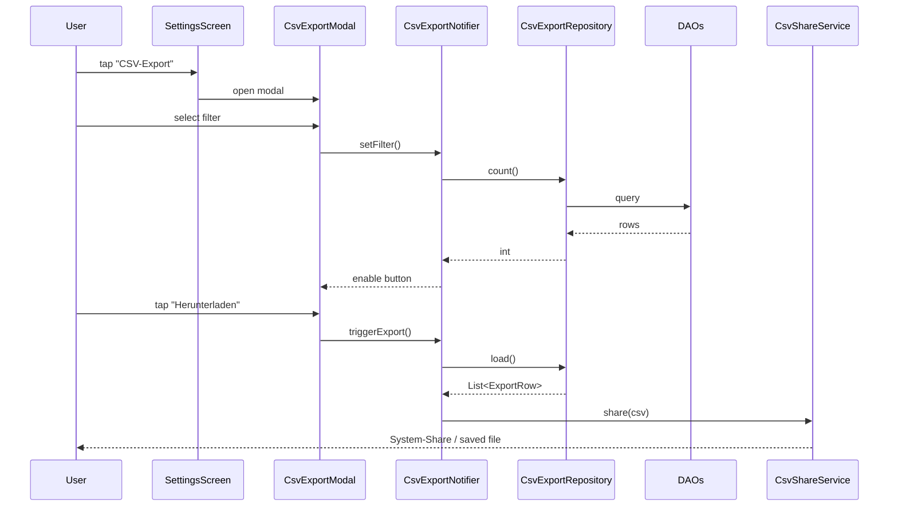
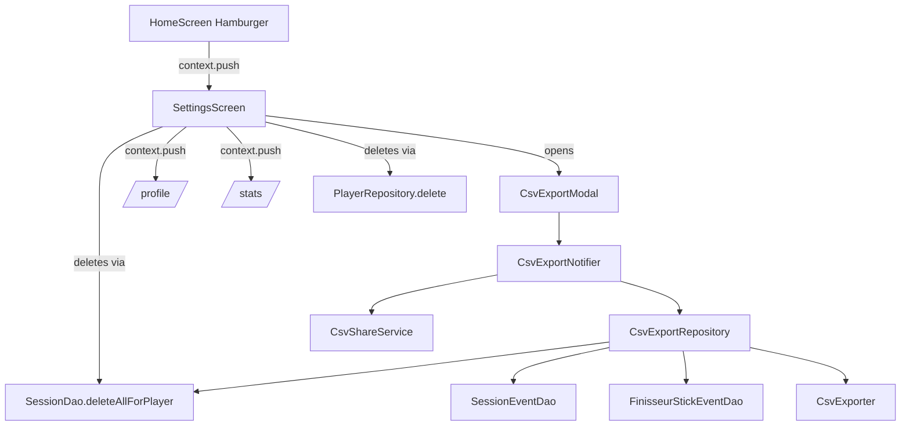

# Architecture: F5 — CSV Export + SettingsScreen

## Übersicht

Zwei lose gekoppelte Bausteine: ein **CsvExporter** (pure-Dart) plus **CsvExportRepository** (Daten-Aggregation aus DAOs) plus **CsvExportModal** (UI). Daneben ein neuer **SettingsScreen** unter `lib/features/settings/` mit Account-/Daten-/App-Sektionen.

## Bounded Contexts

- **Settings** (neu): `lib/features/settings/` — pragmatic. Riverpod direkt zu DAOs/Repositories.
- **Training** (bestehend): nur konsumiert — `SessionDao.allCompletedForPlayer`, `SessionEventDao.forSession`, `FinisseurStickEventDao.forSession`.
- **Player** (bestehend): erweitert um `delete` in `PlayerRepository`.

Kein neuer Context. Bewusst pragmatisch — keine Domain-Reichheit, kein Hexagonal nötig.

## Komponenten

### 1. `CsvExporter` (pure Dart)

Standort: `lib/features/settings/data/csv_exporter.dart`.

Signatur:

```dart
class CsvExporter {
  String generate(List<ExportRow> rows);
}

class ExportRow {
  final String sessionId;
  final String mode;
  final DateTime startedAt;
  final DateTime? completedAt;
  final int? durationSeconds;
  final double? distanceM;
  final int? throwTarget;
  final int hits;
  final int misses;
  final int helis;
  final int? finField;
  final int? finBase;
  final int? sticksUsed;
  final bool? success;
  final bool? kingHit;
}
```

CSV-Spalten exakt wie in der Owner-Spec. Trennzeichen: Komma. Newline: `\n`. Felder mit Kommas/Quotes werden in Double-Quotes gewrappt mit `""`-Escape. Bei `null` → leer.

Tests prüfen: Header-Zeile, Sniper-Row, Finisseur-Row, Escape-Verhalten.

### 2. `CsvExportRepository`

Standort: `lib/features/settings/data/csv_export_repository.dart`.

Lädt Sessions per Filter und mappt sie auf `ExportRow`. Aggregiert Hits/Misses/Helis aus `SessionEventDao` (für Sniper) bzw. `FinisseurStickEventDao` (für Finisseur, summiert `eightMHit`, `fieldKubbsHit`, `heliThrow` und `kingHit`).

Filter:
- `mode`: `{sniper, finisseur, both}`
- `range`: `{all, last30Days, last90Days, lastYear}`

```dart
class CsvExportFilter {
  final bool includeSniper;
  final bool includeFinisseur;
  final ExportRange range;
}

enum ExportRange { all, last30Days, last90Days, lastYear }

class CsvExportRepository {
  Future<List<ExportRow>> load({
    required String playerId,
    required CsvExportFilter filter,
  });

  Future<int> count({
    required String playerId,
    required CsvExportFilter filter,
  });
}
```

### 3. `CsvShareService`

Standort: `lib/features/settings/data/csv_share_service.dart`.

Plattform-Adapter:
- Mobile (Android/iOS): `share_plus` System-Share mit `XFile.fromData(...)`.
- Desktop/Web: `path_provider` → Datei in Downloads/Documents schreiben, Pfad zurückgeben.

Interface:
```dart
abstract interface class CsvShareService {
  Future<ShareResult> share(String csv, {String filename});
}

class ShareResult {
  final ShareKind kind; // shared | savedToFile
  final String? path;   // when savedToFile
}
```

### 4. `CsvExportNotifier`

Standort: `lib/features/settings/application/csv_export_notifier.dart`.

`AsyncNotifier`-style: hält Filter-State, exposiert `count`, `isExportEnabled`, `triggerExport()`.

### 5. `CsvExportModal`

Standort: `lib/features/settings/presentation/csv_export_modal.dart`.

Bottom-Sheet via `showModalBottomSheet`. Filter-Chips, Modus-Checkboxen, Vorschau-Header (statisch — keine Echtdaten-Preview im MVP), Download-Button. Disabled wenn `count == 0`.

### 6. `SettingsScreen`

Standort: `lib/features/settings/presentation/settings_screen.dart`.

Drei Sektionen:
- **Account**: Profil-Row → `/profile`, DeviceId-Read-only, "Profil löschen" (danger).
- **Daten**: "Statistik" → `/stats`, "CSV-Export" → opens `CsvExportModal`, "Sessions zurücksetzen" (danger).
- **App**: Theme-SegmentedButton, Heli-Switch, Vibration-Switch, Sprache-Read-only ("Deutsch"), Privacy-Hinweis (statisch), Version-Footer.

Confirm-Dialoge via `AlertDialog` mit zwei Buttons.

### 7. `PlayerRepository.deleteAll`

Erweitere `PlayerRepository` um `Future<void> delete(String id)`. Routing-Redirect (Bootstrap-Pattern via `currentProfileProvider`) erledigt die Navigation automatisch.

### 8. `SessionDao.deleteAllForPlayer`

Erweitere `SessionDao` um `Future<void> deleteAllForPlayer(String playerId)`. FK-Cascade entfernt SessionEvents und FinisseurStickEvents.

## Datenfluss



## Tech-Stack-Erweiterung

Neu in pubspec:
- `share_plus: ^10.x` (Industry-Standard für File-Share auf Android/iOS).
- `package_info_plus`: bereits da.
- `path_provider`: bereits da.

Kein `csv`-Package — die paar Zeilen CSV-Generation sind trivialer als die Library-Abhängigkeit.

## Diagramm — Component View



## Scale-Impact

**Trigger**: Liest Daten, deren Volumen mit User-Aktivität wächst (alle Sessions eines Profils).
**Bei welcher Tier kritisch**: 3 — die App ist single-player, Volumen pro User bleibt klein (typisch 100-1000 Sessions/Jahr).
**Mitigation**: Pagination unnötig auf der UI — der CSV-Export muss alle Rows holen, das ist eine seltene Aktion. Bei >10k Sessions Performance reviewen.
**Performance-Budget**: `triggerExport()` p95 < 3s bei 1000 Sessions.
**Migrationsrelevant?**: no.
