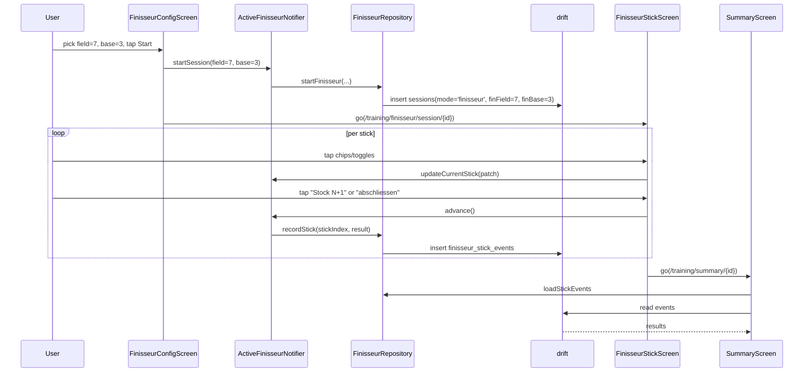

# Architecture — F4 Finisseur

## Overview

Finisseur lebt im `training/` Bounded Context, weiter pragmatisch (Riverpod direkt zu drift). Schema bekommt einen Mode-Discriminator und eine zweite Tabelle für die Per-Stock-Daten. UI ist eine eigene Screen-Trio (Config, Stick, Summary-Variante) mit eigenem Notifier — komplett orthogonal zum bestehenden Sniper-Pfad.

## Bounded Context

`training/` (existing). Kein neuer Context. Pragmatic-Layering — kein Domain-Package.

## Data Layer

### Schema bump v2 → v3

`Sessions` Tabelle bekommt drei neue Spalten:
- `mode TEXT NOT NULL DEFAULT 'sniper'` — Discriminator. Existierende Rows bekommen 'sniper' als Default.
- `finField INT NULL` — Anzahl Feldkubbs in der Konfig (nur für mode='finisseur').
- `finBase INT NULL` — Anzahl Basiskubbs in der Konfig.

Neue Tabelle `FinisseurStickEvents`:

| Column | Type | Notes |
|---|---|---|
| `id` | TEXT PK | UUIDv7 |
| `sessionId` | TEXT FK Sessions.id ON DELETE CASCADE | |
| `stickIndex` | INT | 0..5 |
| `fieldKubbsHit` | INT | 0..3 typischerweise |
| `eightMHit` | INT (BOOL) | 1 = Basiskubb-Treffer auf 8m |
| `heliThrow` | INT (BOOL) | 1 = Helikopter, ungültig |
| `kingHit` | INT NULL (BOOL) | NULL = kein Königswurf, 0 = verfehlt, 1 = Treffer |
| `kingPosition` | TEXT NULL | 'oben' \| 'unten' \| NULL |
| `penaltyHits1` | INT | 0..base, erster Strafkubb-Wurf (nur stick 0) |
| `penaltyHits2` | INT | 0..base, zweiter Strafkubb-Wurf (nur stick 0) |
| `createdAt` | DATETIME | UTC |

PK: composite (`sessionId`, `stickIndex`) oder einfach `id` mit unique-index — wir nutzen `id` PK mit unique Index auf `(sessionId, stickIndex)`. Save-on-stick-advance schreibt insert; bei Re-Edit (z.B. stick zurückspringen) ist nicht in Phase 1 vorgesehen — Stocks gehen nur vorwärts.

### Migration

```dart
onUpgrade: (m, from, to) async {
  if (from < 2) {
    await m.addColumn(players, players.avatarColor);
  }
  if (from < 3) {
    await m.addColumn(sessions, sessions.mode);
    await m.addColumn(sessions, sessions.finField);
    await m.addColumn(sessions, sessions.finBase);
    await m.createTable(finisseurStickEvents);
  }
}
```

### DAO

`FinisseurStickEventDao` mit Methoden:
- `insert(FinisseurStickEventsCompanion)`
- `forSession(String sessionId) → List<...>` ordered by stickIndex
- `countForSession(String sessionId) → int`

`SessionDao` bekommt zusätzlich:
- `activeFinisseurForPlayer(String playerId) → Session?` (filter: mode='finisseur', status='active')

### Repository

Eigener `FinisseurRepository` (analog zu TrainingRepository, separat — sauberer Trennstrich):
- `startFinisseur({playerId, field, base}) → Session`
- `recordStick({sessionId, stickIndex, FinisseurStickResult}) → void`
- `markCompleted(sessionId)`
- `discard(sessionId)`
- `loadActiveOrNull(playerId)`
- `loadStickEvents(sessionId)`

## Application Layer

`ActiveFinisseurState` (manuelle Klasse, kein Freezed — folgt ActiveSessionState-Stil):
- `sessionId: String`
- `field: int`
- `base: int`
- `sticks: List<StickResult>` (immutable Liste, kopiert bei Mutation)
- `currentIndex: int` (0..5)
- `startedAt: DateTime`

`StickResult` (manuelle Klasse):
- `fieldHits: int` (0..3)
- `eightMHit: bool`
- `heli: bool`
- `king: KingResult?` (nullable)
- `penalty1: int`, `penalty2: int`

`KingResult`:
- `hit: bool`
- `position: KingPosition` (enum: oben, unten)

`ActiveFinisseurNotifier extends AsyncNotifier<ActiveFinisseurState?>`:
- `startSession({playerId, field, base})`
- `updateCurrentStick(StickResult patch)` — merge in current
- `advance()` — persist current, increment index, return whether finished
- `complete()` — final persist + markCompleted
- `abortAndDelete()`

## Presentation Layer

Drei Screens, alle in `lib/features/training/presentation/`:

1. `FinisseurConfigScreen` (Stateful, Stepper + Visual Stack + Presets + Start-Button)
2. `FinisseurStickScreen` (ConsumerWidget, lädt aktuelles Stick aus Notifier, schreibt Updates)
3. Summary-Screen erweitert: `summarySessionProvider` lädt zusätzlich Mode + Stick-Events, `_Body` verzweigt nach `mode` und rendert Sniper- oder Finisseur-Variante.

Helper-Widgets in `presentation/widgets/`:
- `kubb_stack_preview.dart` (Visual-Stack-Row)
- `pip_progress.dart` (Stock-Pip-Reihe)
- `finisseur_section.dart` (kleine UI-Bausteine: Section-Header, Toggle, Segmented, BigChip)

## Routing

```
/training/finisseur/config       → FinisseurConfigScreen
/training/finisseur/session/:id  → FinisseurStickScreen
/training/summary/:id            → SummaryScreen (existing, branch by mode)
```

## Dataflow



## Stats Integration

`StatsRepository` filtert in `_summarise` aktuell stumpf nach hit/miss/heli. Finisseur-Sessions haben keine `session_events` — sie sind separat. Für Phase 1: `allCompletedForPlayer` filtert per `mode='sniper'` (oder `mode IS NULL`), damit Finisseur-Sessions die Sniper-Aggregate nicht verfälschen. Eigene Finisseur-Aggregates kommen später.

`recentSessionsProvider` zeigt Finisseur-Sessions an mit eigenem `modeTag = 'Finisseur'` und einem angepassten Subtitle (config + erfolgs-status).

## Tech-Stack-Erweiterung

Keine. Bestehender Stack reicht.

## Scale-Impact

Trifft keinen Trigger (kein Realtime, keine Email, keine Suche). Lokale-only-Feature. Keine Notiz nötig.
