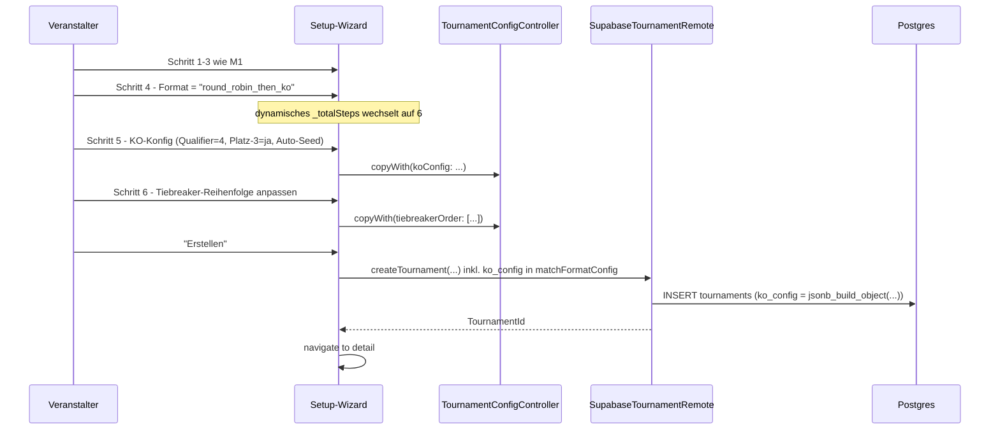
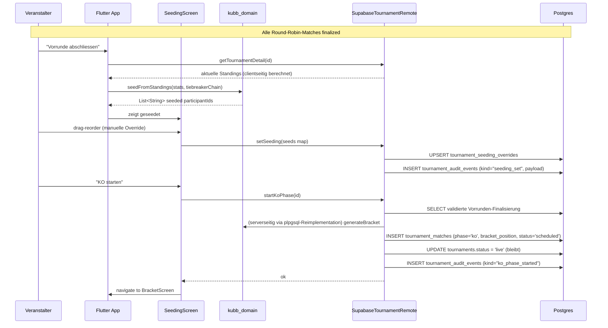
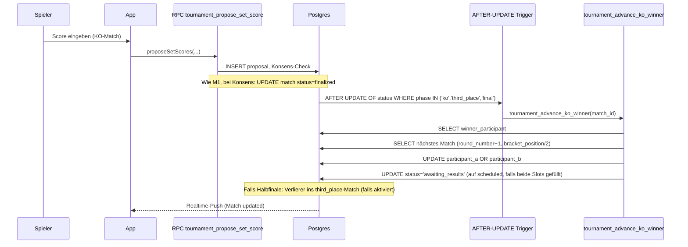
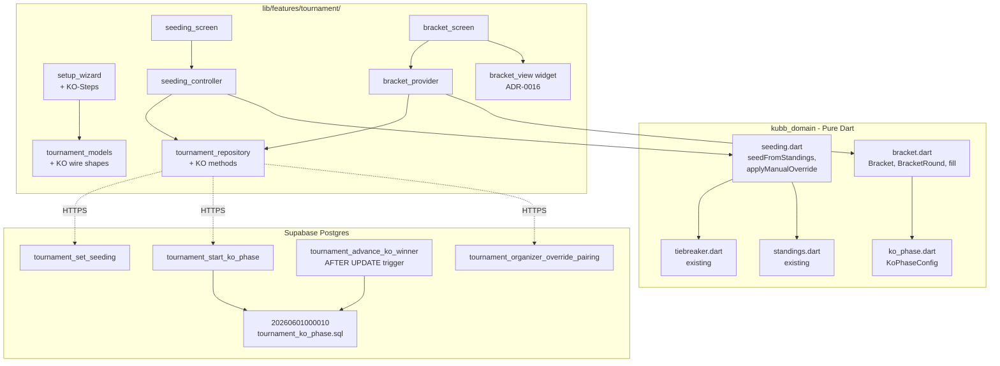
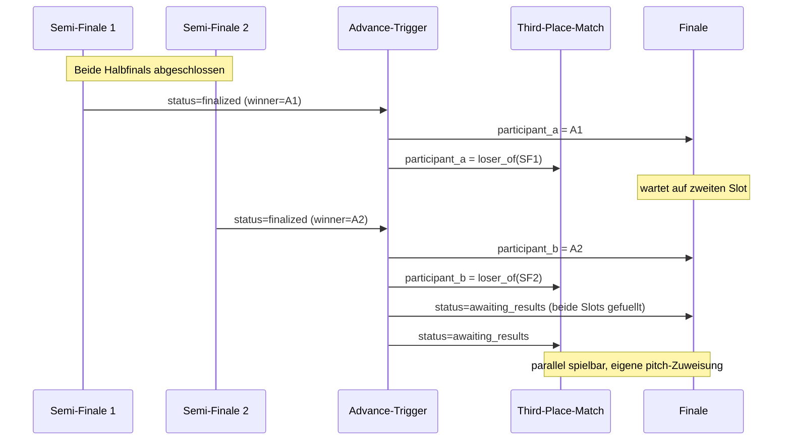

# M2 — KO-Bracket + Setup-Wizard-Polish — Architektur

> Status: Entwurf, wartet auf Abnahme
> Datum: 2026-05-25
> Bezug: `docs/plans/tournament-foundation/architecture.md` §3.1/§3.2/§3.3, `docs/specs/tournament-mode-spec.md` FR-FMT, FR-PAIR, FR-RANK, FR-PUB-6, ADR-0014, ADR-0002, ADR-0001

## 1. Übersicht

M2 ergänzt den in M1 fertiggestellten Round-Robin-Slice um Single-Elimination-KO, das Hybridformat `round_robin_then_ko`, automatisches Seeding aus den Vorrunden-Standings (mit manueller Override) und ein Spiel-um-Platz-3 als Option. Visualisiert wird das Bracket in einem dedizierten Widget; der Setup-Wizard wächst um zwei Wahl-Bausteine (KO-Konfiguration, Tiebreaker-Reihenfolge).

## 2. Bounded Context

Keine neuen Bounded Contexts. M2 lebt komplett im bestehenden `tournament/`-Kontext und bleibt hexagonal-light gemäss ADR-0002 §2.

Aufteilung wie in M1:

- **Pure Domain** (`packages/kubb_domain/lib/src/tournament/`) wird um KO-spezifische Generatoren, Seeding-Logik und das Spiel-um-Platz-3 erweitert. `bracket.dart` existiert bereits als Skelett und wird ausgebaut.
- **Server-Lifecycle** (Supabase) bekommt eine Schema-Erweiterung (`phase`-Spalte, optional `bracket_position`-Spalte) und KO-spezifische RPCs für Phasenwechsel sowie Seeding-Override.
- **App-Layer** (`lib/features/tournament/`) bekommt Bracket-Visualisierungs-Widget, zwei zusätzliche Wizard-Schritte und einen Seeding-Editor.

Match- und Player-Contexts werden in M2 nicht angefasst — Solo-Match bleibt unverändert (ADR-0014), Teams kommen erst in M3.

## 3. Komponenten

### 3.1 Pure Domain (`packages/kubb_domain/lib/src/tournament/`)

Bestehend:
- `bracket.dart` — `Bracket`, `BracketRound`, `BracketEntry`, `BracketPairing`, `SingleEliminationBracket` (M0).
- `pairing.dart`, `pool.dart`, `tiebreaker.dart`, `standings.dart`, `ekc_score.dart` — bereits in M0/M1 angelegt.

Neu / erweitert in M2:

- `bracket.dart` ausbauen:
  - `Bracket.singleEliminationWithThirdPlace(...)` — variantenfreie Konstruktor-Wahl (Flag `withThirdPlace` existiert schon als Parameter, ist aber im Body nicht verdrahtet).
  - `BracketRound.phase: BracketPhase { winners, thirdPlace, final_ }` — neues Feld, ermöglicht das Trennen des Spiels-um-Platz-3 von der KO-Hauptlinie ohne Sonderfall im Visualizer.
  - `Bracket.fill(round: int, position: int, participantId: String)` — pure Update-Funktion, die einen Slot in einer späteren Runde mit einem Sieger füllt; deterministisch und null-sicher. Wird vom Lifecycle-Adapter beim Finalisieren eines KO-Matches aufgerufen.
- `seeding.dart` (neu) — Reine Funktionen, die `List<ParticipantStats>` (aus M1's `tiebreaker.dart`) plus einen `TiebreakerChain` nehmen und eine seedgeordnete `List<String> participantIds` produzieren. Trennt das Sortier-Anliegen sauber vom Bracket-Generator (`bracket.dart` bleibt seed-agnostisch). Funktionen:
  - `List<String> seedFromStandings(List<ParticipantStats>, TiebreakerChain)` — FR-FMT-10.
  - `List<String> applyManualOverride(List<String> autoSeeded, Map<int, String> overrides)` — FR-FMT-10 manuelle Korrektur.
  - `BracketEntry assignByesToTopSeeds(...)` — bereits durch den vorhandenen `singleElimination`-Konstruktor abgedeckt, aber in einer expliziten Helper-Funktion dokumentiert für FR-FMT-11.
- `ko_phase.dart` (neu) — Wertobjekt `KoPhaseConfig` mit den drei Parametern, die `round_robin_then_ko` braucht: `qualifierCount` (Top-N aus der Vorrunde rücken ins Bracket), `withThirdPlacePlayoff` (bool), `seedingMode` (`auto` | `manual`). Enthält Validierung (`qualifierCount` muss `<= participantCount` sein und idealerweise eine Zweierpotenz oder mit BYE-Auffüllung kompatibel). Pure.
- Property-Tests via `glados` für:
  - Determinismus von `singleElimination` bei identischem Input.
  - Korrektheit des Spiels-um-Platz-3 (Halbfinal-Verlierer landen genau dort).
  - Korrektheit der BYE-Verteilung an Top-Seeds (FR-FMT-11).
  - Konsistenz der `Bracket.fill`-Funktion: nach N-1 Fills aller Vorrunden ist das Finale genau einmal befüllt.

### 3.2 Server (Supabase)

Schema-Erweiterung als neue Migration `20260601000010_tournament_ko_phase.sql`:

| Änderung | Tabelle | Zweck |
|---|---|---|
| `ADD COLUMN phase text NOT NULL DEFAULT 'group' CHECK (phase IN ('group','ko','third_place','final'))` | `tournament_matches` | Phasenunterscheidung. Bei reinem `round_robin` bleibt der Default `group` für alle Matches. Bei `single_elimination` werden alle Matches als `ko`/`third_place`/`final` erzeugt. |
| `ADD COLUMN bracket_position int NULL` | `tournament_matches` | Position innerhalb der KO-Runde (1..N). Erlaubt deterministisches Fortschreiben (Sieger Match 1 + Match 2 → Match 1 nächster Runde) ohne extra Tabelle. NULL für Group-Phase. |
| `ADD COLUMN ko_config jsonb NULL` | `tournaments` | Konfig-Bag für KO-spezifische Einstellungen (`qualifier_count`, `with_third_place_playoff`, `seeding_mode`). NULL bei reinen Vorrunden-Formaten. |
| Neue Tabelle `tournament_seeding_overrides` | — | Pro Teilnehmer ein Override-Eintrag mit `seed_override int NOT NULL`, `set_by uuid`, `set_at timestamptz`, FK auf `tournament_participants`. Audit-Trail bleibt in `tournament_audit_events`. |

Existierende `format`-CHECK-Constraint deckt `round_robin_then_ko` bereits ab — keine Änderung nötig.

Neue RPCs (alle `SECURITY DEFINER`, wie M1-Pattern):

- `tournament_set_seeding(p_tournament_id uuid, p_seeds jsonb)` — Veranstalter ruft auf nach Ende der Vorrunde. `p_seeds` ist `{participant_id → seed_number}`. Schreibt in `tournament_seeding_overrides`. Triggert kein Match-Insert; das passiert beim Phasenwechsel.
- `tournament_start_ko_phase(p_tournament_id uuid)` — pur server-seitig: liest die aktuellen Standings (computed clientseitig in M1, aber beim KO-Start brauchen wir Server-Authority, weil sonst zwei Veranstalter-Geräte konkurrieren könnten), validiert das Bracket, inserted die Match-Rows mit `phase='ko'`. Erwartet, dass alle Vorrunden-Matches `finalized` oder `overridden` sind. Setzt `tournaments.status` auf `live` (falls noch nicht) und schreibt ein Audit-Event `phase_started`.
- `tournament_advance_ko_winner(p_match_id uuid)` — wird vom bestehenden `tournament_propose_set_score`-Pfad **nicht** automatisch aufgerufen, sondern als separate Server-Funktion, die nach Finalisierung eines KO-Matches per `AFTER UPDATE`-Trigger feuert. Schreibt den Sieger in das Folge-Match, setzt `participant_a` oder `participant_b` je nach `bracket_position`-Logik. Verlierer eines Halbfinales landen je nach `ko_config.with_third_place_playoff` im Third-Place-Match.
- `tournament_organizer_override_pairing(p_match_id uuid, p_participant_a uuid, p_participant_b uuid, p_reason text)` — Veranstalter überschreibt eine KO-Paarung **vor** dem Start des Matches. FR-PAIR-7. Pflicht-Begründung im Audit-Event.

RLS unverändert: Lesen für `published/live/finalized`-Turniere öffentlich, Schreiben nur über RPCs. KO-Phase ändert das Sichtbarkeits-Modell nicht.

### 3.3 App-Layer (`lib/features/tournament/`)

Erweiterungen entlang der bestehenden Schichten.

**Application:**
- `tournament_config_controller.dart` (existiert) bekommt zwei neue Felder im Draft: `koConfig: KoPhaseConfig?` und `bracketSeedingMode: SeedingMode { auto, manual }`. Validierungs-Pfad: wenn `format` in `{single_elimination, round_robin_then_ko}`, dann ist `koConfig` Pflicht.
- `tournament_seeding_controller.dart` (neu) — hält den Seeding-Editor-State (Liste von Teilnehmern in geseededer Reihenfolge, drag-Reorder, Reset auf Auto). Schreibt beim "Bestätigen" über `tournament_set_seeding`.
- `tournament_bracket_provider.dart` (neu) — Riverpod-`FutureProvider.family` über `TournamentId`. Liest die `tournament_matches` mit `phase IN ('ko','third_place','final')`, mapped auf eine `Bracket`-Struktur per `bracketFromMatches(...)`-Helper (auch pure).

**Data:**
- `tournament_models.dart` bekommt drei zusätzliche Wire-Shapes: `KoPhaseConfigWire`, `BracketPositionWire`, `SeedingOverrideWire`. Alle JSON-serialisierbar.
- `tournament_repository.dart` bekommt vier neue Methoden, die zu den vier neuen RPCs mappen.

**Presentation:**
- `widgets/bracket_view.dart` (neu) — Bracket-Visualisierung. **Implementierungs-Wahl ist offen** (siehe OD-M2-01, ADR-0016): CustomPainter from scratch vs. existierende Library. Layout-Anforderungen:
  - Vertikal-orientierte Spalten pro Runde, Verbindungslinien zwischen Match-Boxen.
  - Tap auf Match-Box öffnet bestehenden `tournament_match_detail_screen.dart`.
  - Spiel-um-Platz-3 als separate Spalte rechts neben dem Finale.
  - Responsiv: Mobile horizontal scrollbar, Tablet/Desktop ganzes Bracket sichtbar.
  - Read-only und Editier-Modus (Editier nur für `participants_a/b == null`-Slots vor Match-Start, für FR-PAIR-7).
- `tournament_setup_wizard.dart` (existiert) wächst um zwei zusätzliche Schritte (siehe Datenfluss §5):
  - **Schritt 5: KO-Konfiguration** — nur wenn Format `single_elimination` oder `round_robin_then_ko`. Felder: Qualifier-Anzahl (falls Hybrid), Spiel-um-Platz-3 Switch, Seeding-Modus (Radio).
  - **Schritt 6: Tiebreaker-Reihenfolge** — Drag-Reorder-Liste der `TiebreakerCriterion`-Werte. Default-Order kommt aus `TournamentConfigDraft`.
  - Aus `_kTotalSteps = 4` wird ein dynamisches `_totalSteps`, das je nach gewähltem Format auf 4, 5 oder 6 springt.
- `tournament_bracket_screen.dart` (neu) — eigene Route `/<id>/bracket` für die Bracket-Sicht. Wird auch im öffentlichen Read-Only-Pfad (Anon-Key) erreichbar sein.
- `tournament_seeding_screen.dart` (neu) — Veranstalter-Editor nach Ende der Vorrunde. Listet alle qualifizierten Teilnehmer, drag-reorder, "Auto wiederherstellen"-Button, "KO starten"-Button (ruft `tournament_start_ko_phase` nach Bestätigung).
- `tournament_detail_screen.dart` wird um einen Tab oder ein Card "Bracket" erweitert, das auf `tournament_bracket_screen.dart` weiterleitet (sichtbar ab Phase `ko`).

## 4. Schnittstellen (Ports)

`TournamentRemote` in `packages/kubb_domain/lib/src/ports/tournament_remote.dart` wird um vier Methoden erweitert, alle additiv (keine Breaking Changes für M1-Aufrufer):

```dart
abstract interface class TournamentRemote {
  // ...existierende M1-Methoden...

  /// FR-FMT-10 manuelle Override. Schreibt die Seeding-Reihenfolge der
  /// Teilnehmer für die anstehende KO-Phase. Erwartet vollstaendiges
  /// Mapping aller qualifizierten Teilnehmer.
  Future<void> setSeeding({
    required TournamentId tournamentId,
    required Map<TournamentParticipantId, int> seeds,
  });

  /// Inserted die KO-Match-Rows aus den aktuellen Standings + Seeding.
  /// Validiert serverseitig, dass die Vorrundenphase vollstaendig
  /// finalisiert ist.
  Future<void> startKoPhase(TournamentId tournamentId);

  /// FR-PAIR-7. Tauscht Teilnehmer einer noch nicht gestarteten
  /// KO-Paarung. Pflicht-Begründung im Audit-Trail.
  Future<void> overrideKoPairing({
    required TournamentMatchId matchId,
    required TournamentParticipantId participantA,
    required TournamentParticipantId participantB,
    required String reason,
  });

  /// Liest den aktuellen Bracket-Stand als Domain-Wertobjekt fuer das
  /// Visualisierungs-Widget. Pure Read-Pfad, baut intern auf
  /// `listMatchesForTournament` auf — kann auch clientseitig komponiert
  /// werden, der Port bietet sie als Convenience.
  Future<Bracket> getBracket(TournamentId tournamentId);
}
```

Der bisherige `TournamentRemote` deckt Lifecycle und Score-Eingabe ab; die KO-Erweiterung ist nur ein weiterer Lifecycle-Schritt. `proposeSetScores` und `organizerOverride` aus M1 funktionieren ohne Änderung auch für KO-Matches.

`SupabaseTournamentRemote` und `FakeTournamentRemote` implementieren die vier neuen Methoden. Der Fake muss `tournament_advance_ko_winner` simulieren — das ist der einzige Punkt, an dem der Fake komplexer wird (siehe Tasks M2-T13).

## 5. Datenfluss

### 5.1 Setup → KO-Konfiguration



### 5.2 Phasenwechsel Vorrunde → KO



Hinweis zur Server-Authority: Die Bracket-Generierung läuft im Server als plpgsql-Implementation, weil zwei parallele Veranstalter-Geräte sonst inkonsistente Brackets erzeugen könnten. Die pure Dart-Implementation in `bracket.dart` bleibt als Single-Source-of-Truth für die Logik, die plpgsql-Version ist eine 1:1-Spiegelung. **Alternative siehe OD-M2-04** (Client-side Generation mit Optimistic Concurrency).

### 5.3 KO-Match finalisiert → Sieger ins nächste Match



### 5.4 Bracket-View (read-only)

UI (`TournamentBracketScreen`) → Riverpod `bracketProvider(tournamentId)` → `SupabaseTournamentRemote.getBracket(id)` (Convenience-Wrapper über `listMatchesForTournament` + Domain-Mapper `bracketFromMatches`) → `BracketView`-Widget rendert. Polling alle 5 Sekunden wie M1 (Realtime kommt M4).

## 6. Tech-Stack-Erweiterung

**Stack-Konformität:** Alle bestehenden Decisions aus ADR-0001 (Flutter, Riverpod, Supabase, drift, freezed) gelten weiter. Keine neuen Top-Level-Frameworks.

Potenziell neue Library: **Bracket-Visualisierung**. Drei plausible Optionen:

1. **Eigenes CustomPainter-Widget** — volle Kontrolle, ca. 1.5–2 Tage Arbeit für Mobile-Variante, +1 Tag für Tablet-/Desktop-Layout. Keine zusätzliche Abhängigkeit. Pflege-Aufwand bleibt im Haus.
2. **`flutter_bracket_view` o.ä. Pub.dev-Package** — schnell, oft 100 LOC weniger Eigencode. Risiken: Wartung des Pakets unklar (selten >1k Pub.dev-Likes für solche Nischen-Libs), Customizing-Limits, Theming-Anpassung an das bestehende `kubb_tokens`-Design-System.
3. **SVG-Renderer** via `flutter_svg` mit serverseitig vorgeneriertem SVG — overengineering für M2, würde aber für die später kommende öffentliche Streaming-Sicht (FR-PUB-10) wiederverwendbar sein. Realistisch nicht für M2.

Entscheidung fällt in **ADR-0016**, wartet auf `/committee bracket-visualization-flutter` und Owner-Abnahme. Siehe OD-M2-01.

Zwei Abhängigkeiten werden in M2 vermutlich angefasst:

- **`reorderable_grid` oder `flutter_reorderable_list`**: für den Seeding-Editor (drag-Reorder). Flutter bringt `ReorderableListView` von Haus aus mit — wahrscheinlich reicht das. Falls nicht: Entscheidung als kleine OD, kein ADR.
- **`glados` (dev-dep)**: vermutlich schon in `pubspec.yaml` für M0-Property-Tests. Falls nicht: in M2-T1 hinzufügen.

## 7. Diagramme

### 7.1 Component — KO-Slice in `tournament/`



### 7.2 Sequence — Spiel-um-Platz-3-Befüllung



## 8. Scale-Impact-Check

Geprüft gegen die Trigger aus `rules/tech-lead.md` Section "Scale-Impact-Check":

- **Bracket > 32 Teams**: Single-Elimination bei 32 Teilnehmern = 5 Runden = 31 Matches. Bracket-View horizontal scrollbar auf Mobile ist Pflicht, alle 31 Boxen gleichzeitig zu rendern ist okay (CustomPainter performant, ListView mit Lazy-Build kein Muss). Bei 64 Teilnehmern = 6 Runden = 63 Matches — immer noch unkritisch für Flutter-Rendering. Reale Schweizer Liga-Turniere haben selten >32 Teams pro Bracket. **Keine Architektur-Änderung nötig.**
- **Realtime-Channels**: KO-Phase ändert nichts an der Channel-Strategie aus M1 (Polling). M4 bringt Realtime — der KO-Stand wird dann auf demselben `tournament_matches`-Channel publiziert.
- **Audit-Trail-Wachstum**: KO bringt ~2x Audit-Events pro Match (Phase-Start, Override, Pairing-Override). Bei 32-Team-Turnier = 31 Matches × 2 = 62 zusätzliche Audit-Events. Unkritisch.
- **DB-Indices**: bestehende Indices auf `(tournament_id, round_number, match_number_in_round)` und `(tournament_id, status)` bleiben optimal. Neue Spalten `phase` und `bracket_position` benötigen **keinen** eigenen Index — sie werden nur in Verbindung mit `tournament_id` abgefragt.

Kein Scale-Impact-Trigger ausgelöst.

## 9. Sicherheits- und Privacy-Anker

Unverändert zu M1. Die KO-Phase ändert das Sichtbarkeits-Modell nicht — `published/live/finalized`-Turniere sind öffentlich lesbar inklusive Bracket-Sicht. Override-RPCs (Seeding und Pairing) erfordern Veranstalter-Recht (RLS prüft `tournaments.created_by = auth.uid()`) und schreiben Pflicht-Audit-Events mit Begründung.

## 10. Migration des bestehenden M1-Codes

Additiv. Kein bestehender Code wird brechen:

- `TournamentConfigDraft` bekommt zwei optionale Felder mit Defaults — bestehende Wizards laufen weiter.
- `tournament_matches.phase` default `'group'` — alle M1-Round-Robin-Matches sind nach dem Migration-Apply automatisch korrekt zugeordnet.
- `TournamentRemote`-Erweiterung ist additiv. Bestehende Fakes brauchen leere Default-Implementationen (oder `UnimplementedError` für KO-spezifische Methoden, solange kein Test sie braucht).
- Die KO-spezifischen Wizard-Schritte sind nur sichtbar wenn das gewählte Format sie verlangt — Round-Robin-only-Wizards bleiben 4-Schritte.

## 11. Was in M2 explizit **nicht** drin ist

Damit der 8–10-Tage-Aufwand realistisch bleibt:

- **Schweizer System + Schoch + Hybride mit Schweizer/Schoch**: bleibt M5. KO-spezifisch bringen wir nur das, was für `single_elimination` und `round_robin_then_ko` nötig ist.
- **Shared Tournaments (FR-FMT-8)**: M5+.
- **Double Elimination (FR-FMT-9)**: KANN-Anforderung, nicht vor M5.
- **Bracket auf Live-Streaming-Sicht (FR-PUB-10)**: KANN, kommt nach M5.
- **Drag-and-Drop-Pairing-Override im Bracket-View**: für M2 reicht "Tap auf Match → Dialog → Teilnehmer tauschen". Volles Drag-and-Drop kann M3+ kommen.
- **Realtime-Push beim Bracket-Update**: weiter Polling wie M1. Realtime kommt M4.
- **Server-Authority für Bracket-Generation**: siehe OD-M2-04 — wenn Client-side gewählt wird, ist Optimistic-Concurrency-Schutz erforderlich; wenn Server-Authority bestätigt wird, ist plpgsql-Spiegelung Pflicht.
