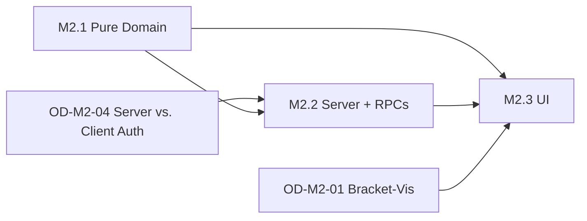

# M2 — KO-Bracket + Setup-Wizard-Polish — Milestone-Plan

> Status: Entwurf, wartet auf Abnahme
> Datum: 2026-05-25
> Bezug: `architecture.md` (dieses Verzeichnis), `docs/plans/tournament-foundation/milestone-plan.md` §M2

## Überblick

M2 wird in drei Sub-Milestones zerlegt. Sie sind sequenziell, aber jedes Sub-Milestone ist demobar und kann einzeln abgenommen werden.

| Sub-Milestone | Inhalt | Aufwand | Demobar |
|---|---|---|---|
| M2.1 | Pure Domain ausbauen — KO-Generator, Seeding, Spiel-um-Platz-3 | 2–3 Tage | Nein, nur Tests |
| M2.2 | Server + RPCs — Migration, KO-Phasenwechsel, Trigger, Override | 3–4 Tage | Indirekt via Tests |
| M2.3 | UI — Bracket-View, Wizard-Erweiterung, Seeding-Editor | 3–4 Tage | Ja |

Summe: 8–11 Tage Senior-Tempo (Faktor 0.8). Headline-Schätzung aus dem Tournament-Foundation-Plan war 8–10 Tage — die Detail-Schätzung liegt im selben Korridor, mit leichtem Risiko-Puffer.

Die Reihenfolge ist nicht beliebig: M2.1 muss vor M2.2 fertig sein, weil die Server-RPCs die Domain-Logik spiegeln (oder zumindest die Wire-Shapes brauchen). M2.3 hängt an beiden vorigen.

## M2.1 — Pure Domain (2–3 Tage)

### Tasks

| ID | Task | Grösse | Vorbedingung |
|---|---|---|---|
| M2.1-T1 | Property-Tests `bracket_test.dart` — Determinismus, Spiel-um-Platz-3-Position, BYE-Verteilung an Top-Seeds (TDD: Tests **vor** Implementation) | M | — |
| M2.1-T2 | `bracket.dart` ausbauen — `withThirdPlace` im Body verdrahten, `BracketPhase`-Enum einführen, `Bracket.fill(round, position, participantId)` implementieren | M | M2.1-T1 |
| M2.1-T3 | `ko_phase.dart` — `KoPhaseConfig`-Wertobjekt mit Validierung | S | M2.1-T1 |
| M2.1-T4 | Property-Tests `seeding_test.dart` — Stabilität bei gleichen Standings, Override-Idempotenz | S | — |
| M2.1-T5 | `seeding.dart` — `seedFromStandings`, `applyManualOverride` | S | M2.1-T4 |
| M2.1-T6 | `bracketFromMatches(...)`-Helper in `bracket.dart` — pure Mapper von `List<TournamentMatchRef>` zu `Bracket`. Mit Tests | M | M2.1-T2 |

Akzeptanz-Kriterien (Auswahl):

- Given `singleElimination(8 participants, withThirdPlace=true)` When Halbfinale 1 hat Sieger A, Halbfinale 2 Sieger B When `Bracket.fill(round=2, pos=1, A)` und `Bracket.fill(round=2, pos=2, B)` Then Finale enthält `[A, B]`, Third-Place-Match enthält die Verlierer beider Halbfinals.
- Given 7 Teilnehmer When `singleElimination` Then erster Slot mit höchstem Seed bekommt BYE in Runde 1 (FR-FMT-11).
- Given `ParticipantStats[7]` mit identischen `totalPoints` und unterschiedlichen `kubbDifference` When `seedFromStandings` mit `TiebreakerChain([totalPoints, kubbDifference])` Then resultierende Reihenfolge ist stabil und deterministisch (glados-Property: 100 Random-Runs).

Demobarkeit: keine UI, aber `flutter test packages/kubb_domain` muss durchlaufen.

## M2.2 — Server + RPCs (3–4 Tage)

### Tasks

| ID | Task | Grösse | Vorbedingung |
|---|---|---|---|
| M2.2-T1 | Migration `20260601000010_tournament_ko_phase.sql` — `phase`, `bracket_position`, `ko_config`, `tournament_seeding_overrides` | M | M2.1 done |
| M2.2-T2 | RPC `tournament_set_seeding` + Audit-Event | S | M2.2-T1 |
| M2.2-T3 | RPC `tournament_start_ko_phase` — Validierung Vorrunde abgeschlossen, plpgsql-Bracket-Generator (Spiegelung von `bracket.dart`) | L | M2.2-T1 |
| M2.2-T4 | Trigger `tournament_advance_ko_winner` (AFTER UPDATE) inkl. Spiel-um-Platz-3-Verteilung | M | M2.2-T1, M2.2-T3 |
| M2.2-T5 | RPC `tournament_organizer_override_pairing` (FR-PAIR-7) | S | M2.2-T1 |
| M2.2-T6 | SQL-Tests via pgTAP für alle vier RPCs (Happy-Path + Authorization-Fail + Phase-Übergangs-Validierung) | M | M2.2-T2..T5 |
| M2.2-T7 | `TournamentRemote`-Port um vier Methoden erweitern (additiv) + `SupabaseTournamentRemote`-Implementation + `FakeTournamentRemote`-Implementation | M | M2.2-T2..T5 |

Akzeptanz-Kriterien (Auswahl):

- Given Vorrunde mit Status aller Matches `finalized` When `tournament_start_ko_phase(id)` Then `tournament_matches`-Rows mit `phase='ko'` werden inserted, Anzahl entspricht der Runden des Brackets.
- Given KO-Match `phase='ko'` mit `status='finalized'` und `winner_participant=X` When Trigger feuert Then Folge-Match (gleiche `bracket_position // 2` in nächster Runde) hat `participant_a` oder `participant_b = X`.
- Given Halbfinale-Match finalisiert in Turnier mit `ko_config.with_third_place_playoff=true` When Trigger feuert Then Verlierer landet in `third_place`-Match-Row, nicht im Finale.
- Given Veranstalter ruft `tournament_organizer_override_pairing` ohne Begründung auf When RPC Then 400-Fehler `MISSING_REASON`.

Demobarkeit: über Integrationstest — 8-Spieler-Round-Robin-Plus-KO durchspielen, Server-only.

## M2.3 — UI (3–4 Tage)

### Tasks

| ID | Task | Grösse | Vorbedingung |
|---|---|---|---|
| M2.3-T1 | Widget-Tests für `BracketView` — Layout, Tap-Handler, Read-only-Modus | M | OD-M2-01 entschieden |
| M2.3-T2 | `widgets/bracket_view.dart` — Implementation gemäss ADR-0016 (CustomPainter ODER Library) | L | M2.3-T1, OD-M2-01 |
| M2.3-T3 | `tournament_bracket_screen.dart` + Route `/<id>/bracket` + Integration in `tournament_detail_screen.dart` (Tab/Card) | M | M2.3-T2 |
| M2.3-T4 | `tournament_setup_wizard.dart` erweitern — dynamisches `_totalSteps`, Schritt 5 (KO-Konfig), Schritt 6 (Tiebreaker-Reorder) | L | M2.1 done |
| M2.3-T5 | `TournamentConfigDraft` um `koConfig` + `bracketSeedingMode` erweitern, Validierungs-Pfade ergänzen, Tests | M | M2.1 done |
| M2.3-T6 | `tournament_seeding_screen.dart` + `tournament_seeding_controller.dart` — drag-Reorder mit `ReorderableListView`, "Auto wiederherstellen", "KO starten"-Button | L | M2.2-T7 |
| M2.3-T7 | `tournament_bracket_provider.dart` — Riverpod `FutureProvider.family` über `getBracket(id)` | S | M2.2-T7 |
| M2.3-T8 | l10n — DE-Strings für alle neuen Screens (kein FR/EN — bleibt M5+) | S | M2.3-T2..T6 |
| M2.3-T9 | Integrations-Test: 8-Teilnehmer-Turnier `round_robin_then_ko` mit Top-4 Qualifier + Spiel-um-Platz-3 → Bracket korrekt, KO-Match-Trigger funktioniert, Endrangliste enthält Platz 1-4 in richtiger Reihenfolge | L | alle vorigen |

Akzeptanz-Kriterien (Auswahl):

- Given Veranstalter im Setup-Wizard wählt Format `round_robin_then_ko` When Schritt 4 abgeschlossen Then `_totalSteps` ist 6 und Schritt 5 zeigt KO-Konfig-Felder.
- Given Vorrunde abgeschlossen When Veranstalter öffnet `/<id>/seeding` Then alle Top-N-Teilnehmer sind in seedgeordneter Reihenfolge sichtbar, drag-Reorder funktioniert, "Auto wiederherstellen" setzt zurück.
- Given Bracket gestartet When Spieler öffnet `/<id>/bracket` als anonymer Zuschauer Then Bracket ist sichtbar inkl. Spiel-um-Platz-3 als separate Spalte rechts vom Finale.
- Given Mobile-Gerät 360px breit When `BracketScreen` mit 16-Teilnehmer-Bracket Then horizontal scrollbar, keine Overflow-Warnings.

Demobarkeit: voller End-to-End-Flow ab Setup-Wizard.

## Was nach M2 demobar ist

Nach M2 ist folgender Flow am Owner-Tablet vorführbar:

1. Veranstalter legt 8-Spieler-Turnier mit Format `round_robin_then_ko`, Qualifier=4, Spiel-um-Platz-3=ja an.
2. Wizard-Steps 1–6 inkl. Tiebreaker-Reorder-Schritt.
3. 8 Spieler melden sich an, Veranstalter approved.
4. Round-Robin läuft (wie M1).
5. Veranstalter schliesst Vorrunde, sieht Seeding-Editor mit Top-4 — kann die Reihenfolge per Drag ändern oder belassen.
6. "KO starten" → Bracket-View wird sichtbar mit zwei Halbfinals, einem Finale und dem Spiel-um-Platz-3.
7. Halbfinals werden gespielt, Sieger rücken automatisch ins Finale, Verlierer ins Spiel-um-Platz-3.
8. Finale + Spiel-um-Platz-3 werden gespielt.
9. Endrangliste zeigt Plätze 1, 2, 3, 4 korrekt; restliche Plätze 5–8 nach Vorrunden-Standings.

Demo-Dauer: ~20 Minuten am Tablet, vier gleichzeitige Player-Phones.

## Vergleich zur M0+M1-Cadence

Aus dem Tournament-Foundation-Plan und den Git-Logs:

- **M0 — Pure Domain (4–6 Tage geplant)**: Ergebnis lag bei 5 Tagen real (eigene Schätzung anhand `bracket.dart`, `pairing.dart`, `tiebreaker.dart` mit `glados`-Tests). Im Plan. Lehre: TDD vor Implementation hat hier sauber funktioniert — das wiederholen wir in M2.1.
- **M1 — MVP-Slice (9–12 Tage geplant)**: Ergebnis effektiv im Korridor. Was länger dauerte als gedacht: die Score-Eingabe-UI inkl. Konflikt-Screen war ein eigener LP-Block (M1-T12, M1-T13). Was schneller war als gedacht: Setup-Wizard MVP (vier Schritte, M1-T9). Lehre: UI-Komponenten mit komplexer Interaktion (Bracket-View, Seeding-Reorder) bekommen in M2 grosszügigere Schätzungen.

M2-Sub-Milestones sind kleiner geschnitten als die M1-Sub-Milestones — das macht Owner-Abnahme zwischen M2.1, M2.2 und M2.3 möglich und hält den Risiko-Budget kompakter.

## Abhängigkeiten und Reihenfolge

Kritischer Pfad: **OD-M2-01 muss vor M2.3-T2 entschieden sein** (Bracket-Visualisierung). **OD-M2-04 muss vor M2.2-T3 entschieden sein** (Server-Authority vs. Client). Beide ODs sind blocker-Status.

## FR-Coverage M2

| FR | Beschreibung | abgedeckt in |
|---|---|---|
| FR-FMT-1 | Reines KO inkl. Spiel-um-Platz-3 | M2.1, M2.3 |
| FR-FMT-5 | Gruppenphase + KO | M2.1, M2.2, M2.3 |
| FR-FMT-10 | Bracket-Seedung auto + manuell | M2.1 (Domain), M2.3 (Editor) |
| FR-FMT-11 | BYE zu Top-Seeds | M2.1 (im Generator) |
| FR-PAIR-7 | Manuelle Pairing-Override vor Rundenstart | M2.2-T5, M2.3 |
| FR-PUB-6 | Bracket-Visualisierung | M2.3-T2, T3 |
| FR-CFG-12 | Forfeit-Buchholz-Verhalten | wenig — nur die Konfig kommt durch, Berechnung bleibt im bestehenden Tiebreaker-Code |
| FR-RANK-4 | Tiebreaker-Reihenfolge konfigurierbar (UI) | M2.3-T4 (Wizard-Schritt 6); Logik existiert seit M0 |

Nicht in M2:
- FR-FMT-3/4/6/7 (Schweizer + Schoch + Hybride) → M5
- FR-FMT-8 (Shared Tournaments) → M5+
- FR-FMT-9 (Double Elimination) → KANN, M5+
- FR-PUB-10 (Streaming-Sicht) → KANN
