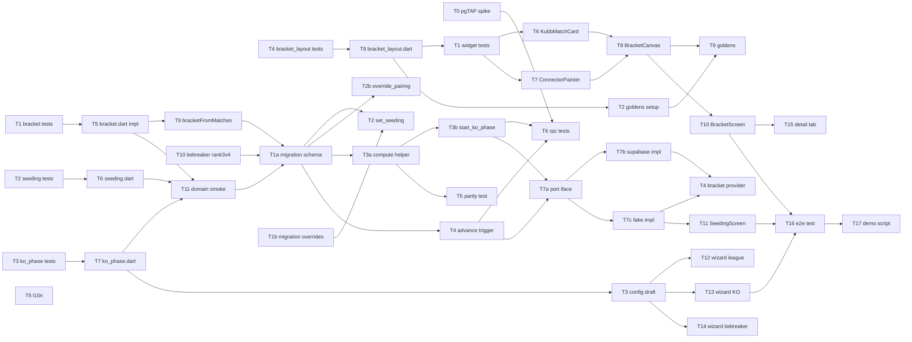

# M2 — Sprint-Plan

> Stand: 2026-05-26
> Bezug: `milestone-plan.md`, `architecture.md`, `open-decisions.md`, ADR-0016, ADR-0017
> Tasks: `tasks.md` (atomare Liste)

## Zweck

Dieser Sprint-Plan zerlegt M2 (KO-Bracket + Setup-Wizard-Polish) in Sub-Milestones, Waves und ausführbare Tasks. Jeder Task ist von einem Worker-Agent in einer Wave bearbeitbar. Die Wave-Nummer drueckt aus, was parallel laufen kann.

## Sub-Milestones

### M2.1 — Pure Domain (Tage 1–3)

**Demo-Akzeptanz**: `flutter test packages/kubb_domain` ist gruen, glados-Property-Tests laufen ueber n ∈ [2, 64]. Owner sieht den Test-Run im Terminal — keine UI. Pre-Merge-Gate: alle Tests gruen, Coverage fuer `bracket.dart`, `seeding.dart`, `ko_phase.dart`, `bracket_layout.dart` ≥ 90%.

Inhalt: `withThirdPlace` aktiv verdrahten, `BracketPhase`-Enum, `Bracket.fill`, `bracketFromMatches`-Mapper, `seeding.dart`, `ko_phase.dart` mit Validierung gemaess OD-M2-04/-05, Tiebreaker-Determinismus fuer Rang 3 vs. 4, plus die Pure-Function `BracketLayout` fuer das spaetere CustomPainter-Widget (ADR-0016).

### M2.2 — Server + RPCs (Tage 4–7)

**Demo-Akzeptanz**: 8-Spieler-Round-Robin-plus-KO laeuft als Integrations-Test durch — Vorrunde finalisiert, `tournament_start_ko_phase` inserted die KO-Matches, Trigger ruecken Sieger ins Folge-Match, Walkover-Pfad funktioniert. Owner sieht entweder den pgTAP- oder den Dart-Integration-Test-Output. Property-Paritaet Dart ↔ plpgsql ist gruen.

Inhalt: Migration `20260601000010_tournament_ko_phase.sql` mit `phase`, `bracket_position`, `ko_config`, `league_eligible`, `tournament_seeding_overrides`; vier RPCs (`set_seeding`, `start_ko_phase` mit `_tournament_compute_ko_bracket`-Helper, `advance_ko_winner`-Trigger, `organizer_override_pairing`); `TournamentRemote`-Port-Erweiterung plus Supabase- und Fake-Implementation.

### M2.3 — UI (Tage 8–11)

**Demo-Akzeptanz**: voller E2E-Flow am Owner-Tablet. Setup-Wizard 6-Schritte, Liga-Flag, Seeding-Editor mit Drag-Reorder, Bracket-View mit CustomPainter, Spiel-um-Platz-3 als Side-Branch sichtbar, Pairing-Override per Tap-Dialog. 360px-Mobile-Display zeigt das Bracket horizontal-scrollbar. Golden-Tests fuer 4/8/16/32/64-Team-Brackets gruen.

Inhalt: `BracketCanvas` + `KubbMatchCard` + `BracketConnectorPainter`, `TournamentBracketScreen` plus Route, `TournamentSeedingScreen` plus Controller, Wizard-Erweiterungen (Liga-Flag, KO-Konfig, Tiebreaker-Reorder), `TournamentConfigDraft`-Erweiterung, `tournament_bracket_provider`, DE-l10n, Integrations-Test.

## Senior-Annahmen

- **TDD-Pflicht fuer Domain**: Test-Task immer vor Impl-Task bei `packages/kubb_domain/`. Test-Task definiert die Property-Test-Suite (glados) inklusive Invarianten — der Impl-Task darf erst landen wenn die Tests rot waren und gruen werden.
- **Conventional Commits**: Pflicht. Task-ID in Commit-Message (`feat(tournament): TASK-M2.1-T2 wire third-place flag`).
- **Senior-Sizing**: max 100 LOC, max 3 Files, max 1h netto. Verstoss → splitten.
- **Wave-Paralleltritt**: Tasks in derselben Wave duerfen sich nicht gegenseitig blocken. Worker laufen in eigenen Worktrees, Cherry-pick + Merge nach Wave-Ende.
- **Contract-Sharing**: Wave-N-Tasks zitieren in `Notes` den Contract (Type-Signatur, Method-Name) aus Wave-(N-1)-Vorgaengern, damit der Impl-Worker nicht raten muss.
- **`league_eligible`-Kontrakt**: in M2.2 wird das Feld geschrieben (Migration), in M2.3 wird es vom Wizard gelesen — der Kontrakt steht in `tasks.md` unter TASK-M2.2-T1 und TASK-M2.3-T5.
- **Pre-Task pgTAP-Klaerung**: knowledge-gap aus dem Committee — wir wissen noch nicht ob pgTAP in der Supabase-Pipeline verfuegbar ist. TASK-M2.2-T0 klaert das; Fallback ist Dart-Integration-Test gegen lokale Supabase-Instanz.

## Wave-Plan

Jede Wave hat ein klares Eingangs- und Ausgangs-Gate. Innerhalb einer Wave laufen Tasks parallel; zwischen Waves wird gemergt.

### Wave 1 (M2.1, Tag 1) — Test-First Domain

- T1: glados-Property-Tests `bracket_test.dart` (BYE, third-place position, Determinismus, withThirdPlace-Varianten)
- T2: glados-Property-Tests `seeding_test.dart` (Stabilitaet, Override-Idempotenz)
- T3: glados-Property-Tests `ko_phase_test.dart` (`KoPhaseConfig`-Validierung)
- T4: Property-Test `bracket_layout_test.dart` (Layout-Math: keine Kollision, Side-Branch-Position)

Diese vier Test-Tasks laufen parallel und definieren die Contracts fuer Wave 2.

### Wave 2 (M2.1, Tag 2) — Domain-Implementation

- T5: `bracket.dart` ausbauen — `withThirdPlace` verdrahten, `BracketPhase`-Enum, `Bracket.fill`
- T6: `seeding.dart` neu — `seedFromStandings`, `applyManualOverride`
- T7: `ko_phase.dart` neu — `KoPhaseConfig`-Wertobjekt mit Validierung
- T8: `bracket_layout.dart` neu — Pure-Function `BracketLayout` mit eigenen `BoxRect`/`Point`-Records

Vier Impl-Tasks parallel. Sie konkurrieren um keine Datei (jeder Task hat seine eigene File).

### Wave 3 (M2.1, Tag 3) — Domain-Glue + Tiebreaker

- T9: `bracketFromMatches`-Helper in `bracket.dart` plus Test
- T10: Tiebreaker-Determinismus-Erweiterung — Rang 3 vs. 4 bei `withThirdPlace=false` plus glados-Test
- T11: M2.1-Acceptance-Smoke — kombiniertes Integrations-Beispiel (8-Teilnehmer end-to-end im Domain-Layer)

T9 hat eine Dependency auf T5 (es schreibt zusaetzlich in `bracket.dart` und braucht den finalen `BracketPhase`-Enum). T10 modifiziert `tiebreaker.dart`. T11 ist nur Test, kein Production-Code.

### Wave 4 (M2.2, Tag 4) — Pre-Task Klaerung

- T0: pgTAP-Verfuegbarkeit klaeren (Knowledge-Gap, Spike)
- T1a: Migration `20260601000010_tournament_ko_phase.sql` — Schema (phase, bracket_position, ko_config, league_eligible)
- T1b: Migration-Teil II — Tabelle `tournament_seeding_overrides` (separate Datei `20260601000011_tournament_seeding_overrides.sql`)

T0 ist research, blockiert nur T6 (SQL-Tests). T1a und T1b sind eigene Migration-Dateien und damit konflikt-frei parallel.

### Wave 5 (M2.2, Tag 5) — Helper + Set-Seeding

- T2: RPC `tournament_set_seeding` + Audit-Event
- T2b: RPC `tournament_organizer_override_pairing` (FR-PAIR-7)
- T3a: Helper-Function `_tournament_compute_ko_bracket(seeds jsonb, third_place bool)` — plpgsql-Port von `bracket.dart`-Recursive-Order

Diese drei laufen parallel. T3a ist isoliert in einer Helper-Function, T2/T2b in eigenen RPCs.

### Wave 6 (M2.2, Tag 6) — Phasenwechsel + Trigger

- T3b: RPC `tournament_start_ko_phase` (nutzt Helper aus T3a)
- T4: Trigger `tournament_advance_ko_winner` mit Walkover-Pfad fuer Bronze
- T5: Property-Paritaet-Test `_tournament_compute_ko_bracket` ↔ `bracket.dart` (Sweep 8/16/32/64)

T3b haengt an T3a. T4 haengt an T1a (braucht `phase`, `bracket_position`, `ko_config`). T5 haengt an T3a + T1a, ist aber unabhaengig von T3b/T4.

### Wave 7 (M2.2, Tag 7) — Server-Tests + Port-Erweiterung

- T6: SQL-Tests fuer alle vier RPCs (Happy-Path, Authorization-Fail, Phase-Validierung, Forfeit-Walkover) — pgTAP oder Dart-Integration je nach T0-Ergebnis
- T7a: `TournamentRemote`-Port-Erweiterung in `kubb_domain/lib/src/ports/` (vier neue Methoden)
- T7b: `SupabaseTournamentRemote`-Implementation der vier Port-Methoden
- T7c: `FakeTournamentRemote`-Implementation inkl. simulierter Trigger-Logik

Vier Tasks parallel; jeder beruehrt eine andere Datei.

### Wave 8 (M2.3, Tag 8) — UI-Vorbereitung

- T1: Widget-Tests `bracket_canvas_test.dart` (Layout, Tap, Read-only) — Test-First
- T2: Golden-Test-Setup fuer 4/8/16/32-Team-Brackets (Test-First)
- T3: `TournamentConfigDraft` + `koConfig` + `bracketSeedingMode` + `leagueEligible` plus Tests
- T4: `tournament_bracket_provider` Riverpod-FutureProvider plus Tests
- T5: l10n DE-Strings fuer alle neuen Screens (ARB-Datei-Erweiterung)

Vier Tasks parallel: Tests, Domain-Draft, Provider, l10n.

### Wave 9 (M2.3, Tag 9) — Bracket-Visualisierung

- T6: `KubbMatchCard`-Widget (Tap, Semantics, Tokens)
- T7: `BracketConnectorPainter` (CustomPainter, shouldRepaint, Highlight-Layer)
- T8: `BracketCanvas`-ConsumerWidget (InteractiveViewer, Stack, Positioned)
- T9: Bracket-View-Goldens generieren und einchecken

T6/T7 sind unabhaengig (eigene Files). T8 haengt auf T6 + T7. T9 haengt auf T8.

### Wave 10 (M2.3, Tag 10) — Screens und Wizard

- T10: `TournamentBracketScreen` + Route `/<id>/bracket`
- T11: `TournamentSeedingScreen` + `TournamentSeedingController`
- T12: Wizard-Schritt 4.5 — Liga-Flag-Frage `tournaments.league_eligible`
- T13: Wizard-Schritt 5 — KO-Konfiguration (Qualifier-Input, Bronze-Switch, Seeding-Mode, Preview-Panel U3/U4)
- T14: Wizard-Schritt 6 — Tiebreaker-Reorder (Preset-Empfehlung gemaess OD-M2-03 Empfehlung C)
- T15: Bracket-Tab in `tournament_detail_screen.dart`

Sechs Tasks parallel. T10 haengt auf T8 (BracketCanvas). T11 haengt auf T7c (FakeTournamentRemote). T12-T14 ist Wizard-Erweiterung in einer Datei — gesplittet in drei kleine Tasks, sequenziell ueber denselben File (siehe Notes).

### Wave 11 (M2.3, Tag 11) — Integration

- T16: Integrations-Test `round_robin_then_ko_e2e_test.dart` (8 Teilnehmer, voller Flow)
- T17: M2-Demo-Smoke (manueller Test-Plan dokumentiert in `docs/plans/m2-ko-bracket/demo-script.md`)

T16 haengt auf alle vorigen Tasks. T17 ist Doku, keine Code-Aenderung.

## Mermaid-Dependency-Graph

## Kritische Pfade

1. **`bracket.dart`-Modifikationen** (Wave 2 T5, Wave 3 T9): zwei Tasks aenderen dieselbe Datei und muessen seriell laufen. T5 zuerst, T9 spaeter — beide unter 100 LOC, kein Konflikt im selben Commit.
2. **Setup-Wizard-Datei** (Wave 10 T12, T13, T14): drei Tasks beruehren `tournament_setup_wizard.dart`. Sequentielle Ausfuehrung in einer Wave, **nicht** parallel — Worker muss in einem Worktree alle drei in Reihe abarbeiten, oder die drei werden ueber separate Helper-Widgets ausgelagert (`_LeagueStep`, `_KoConfigStep`, `_TiebreakerStep`), dann parallelisierbar. Empfehlung: separate Helper-Widgets, dann parallel.
3. **Helper-Function ↔ RPC**: T3a (Helper-Function `_tournament_compute_ko_bracket`) blockiert T3b (`tournament_start_ko_phase`). T3a ist isoliert genug, dass es in Wave 5 fertig wird.
4. **Domain ↔ Server Property-Paritaet**: T5 (Wave 6) ist Pflicht-Gate — wenn die plpgsql-Implementation von der Dart-Referenz abweicht, blockt das die ganze M2.2.

## Empfohlene Reihenfolge der Waves

Sequenziell von Wave 1 bis Wave 11. Owner-Abnahme nach Wave 3 (Ende M2.1), Wave 7 (Ende M2.2) und Wave 11 (Ende M2.3). Bei Bedarf koennen Wave 8 (UI-Prep) und Wave 5 (RPCs) zeitlich ueberlappen — Wave 8 braucht nur Wave 2/3 (Domain), nicht Wave 4–7 (Server). Das ist die einzige Wave-Verschachtelung im Plan, dokumentiert als optionaler Speedup.

## Out of Scope

- OD-M2-03 (Tiebreaker-Reorder-UI-Stil), OD-M2-06 (Force-Override-Pfad), OD-M2-07 (Bracket-Theming) sind in den UX-Tasks (T14, T11, T6/T8) nur mit Default-Verhalten umgesetzt. Volle Klaerung kommt nach Owner-Entscheidung in der Implementierungs-Phase — pre-blocking ist nicht eingebaut.
- pgTAP-Setup-Klaerung: T0 (Wave 4) ist research-Task; Ergebnis bestimmt ob T6 in pgTAP oder Dart-Integration laeuft.
- iOS / Web / Linux / Windows-Builds: M2 bleibt Android-only gemaess ADR-0015.

## Quality-Gates (per Sub-Milestone)

| Gate | Sub-Milestone | Bedingung |
|---|---|---|
| G1 | M2.1 | `flutter test packages/kubb_domain` gruen, glados-Property-Tests ueber n ∈ [2, 64] gruen, Coverage ≥ 90% auf neuen Files |
| G2 | M2.2 | RPC-Tests (pgTAP oder Dart-Integration) gruen, Property-Paritaet Dart ↔ plpgsql ueber 8/16/32/64-Sweep gruen, Fake-Adapter simuliert Trigger korrekt |
| G3 | M2.3 | Widget-Tests + Goldens gruen, Integrations-Test `round_robin_then_ko_e2e` gruen, Demo-Script manuell durchgespielt am Tablet, l10n vollstaendig (DE) |

## Senior-Cadence

Insgesamt 11 Tage Senior-Tempo (Faktor 0.8). Ueber 11 Tage gestreckt entspricht das ca. 8.8 effektiven Personentagen — im Rahmen der Headline-Schaetzung 8–10 Tage aus der `milestone-plan.md`.
