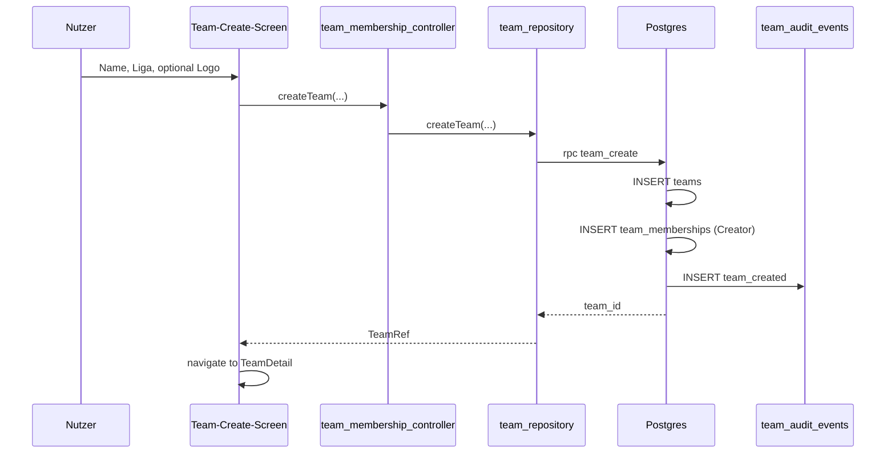
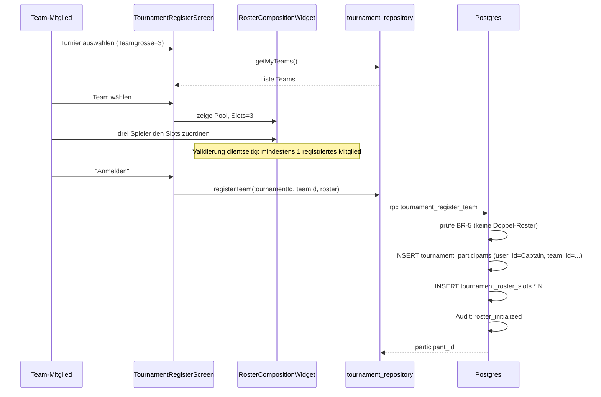
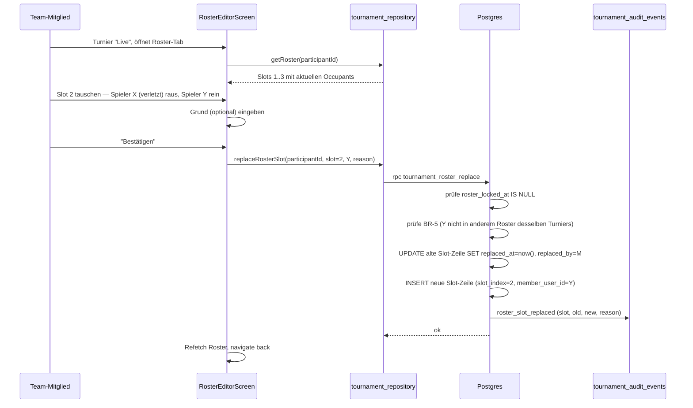
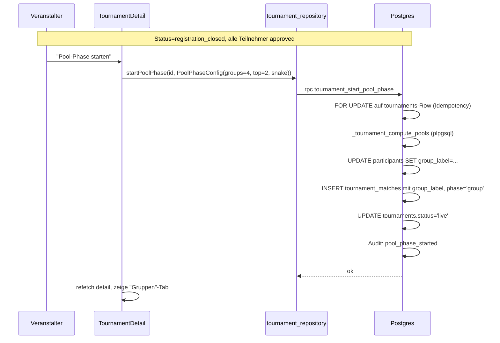
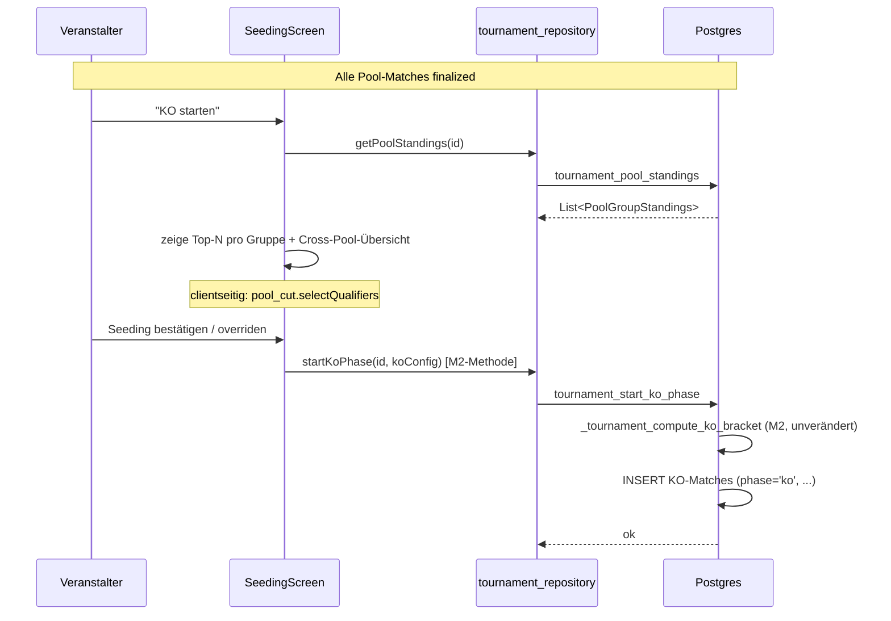
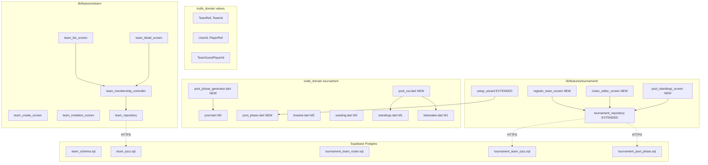
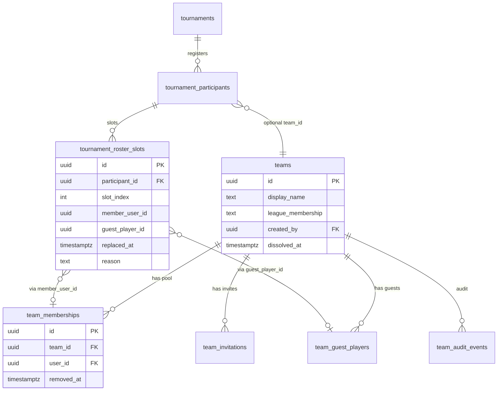
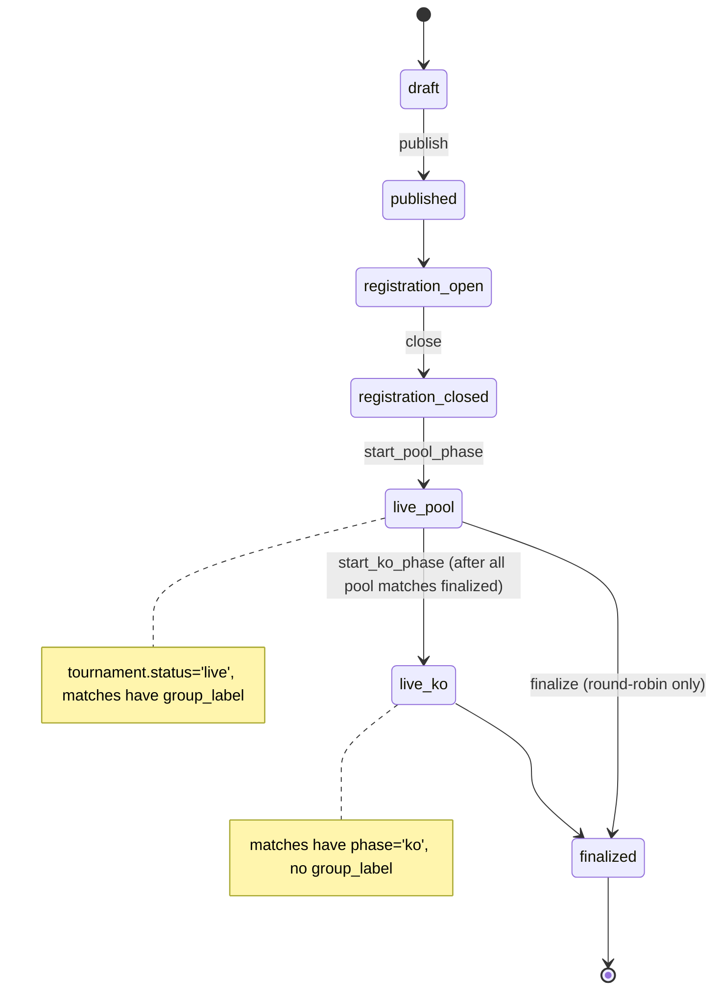

# M3 — Teams, Pools, Roster — Architektur

> Status: Entwurf, wartet auf Abnahme
> Datum: 2026-05-26
> Bezug: `docs/plans/tournament-foundation/architecture.md`, `docs/plans/m2-ko-bracket/architecture.md`, `docs/specs/tournament-mode-spec.md` §3.6 FR-REG, §3.7 FR-TEAM, §3.8 FR-FMT-5, ADR-0001, ADR-0002, ADR-0014

## 1. Übersicht

M3 öffnet den Turniermodus für Teams. Drei Bausteine: ein neuer Bounded Context `team/` für Team-Pool und Mitgliedschaft (pragmatisches CRUD nach ADR-0002), eine Roster-Erweiterung in `tournament/` für die per-Turnier-Auswahl aus dem Team-Pool, und ein Pool-Phase-Format als Vorrundenvariante mit Gruppen-Cut auf Top-N pro Gruppe. Der KO-Pfad aus M2 hängt sich unverändert hinter die Pool-Phase, KO bleibt seeding-agnostisch.

## 2. Bounded Context

### Neu: `team/` — pragmatic CRUD

Per ADR-0002 §2 (Tabelle) sind `player/` und `team/` als pragmatic CRUD vorgesehen. M3 zieht diese Vorgabe für `team/` jetzt scharf:

- **Domain**: kein Domain-Package-Code. `Team`, `TeamMembership`, `TeamPool` sind reine Wire-Daten plus Riverpod-Modelle.
- **Cross-Context-Referenz** zu `tournament/` läuft über `TeamRef` (Value Object in `packages/kubb_domain/lib/src/values/`) — analog zu `PlayerRef`. Keine DB-Joins zwischen `team_*`- und `tournament_*`-Tabellen ausserhalb der RPCs.
- **Begründung pragmatic** (ADR-0002-Kriterien): Team-Operationen sind CRUD mit Lifecycle-Schritten (gründen, einladen, beitreten, entfernen, auflösen). Keine reichen Geschäftsregeln im Sinn einer State-Machine — Captain-Rechte sind ein Vergleich, kein Zustand.

### Erweitert: `tournament/` — hexagonal-light

Roster und Pool-Phase sind tournament-spezifisch und leben weiter in `tournament/`. Bestehende M1/M2-Aufteilung gilt:

- Pure Domain für Pool-Phase-Algorithmus (Group-Round-Robin-Generator, Top-N-Cut, Cross-Pool-Standings-Merge, BYE-Behandlung pro Gruppe).
- Server-Lifecycle für Roster-Persistenz und Phasenwechsel Pool → KO.
- App-Layer für Team-Anmelde-Flow, Roster-Editor (Pre-Tournament und Mid-Tournament), Pool-Standings-View.

### Unverändert

`match/`, `player/`, `training/`, `social/`, `auth/`, `inbox/`, `core/`, `stats/`, `settings/` werden in M3 nicht angefasst.

## 3. Komponenten

### 3.1 `team/` Bounded Context — neu

**Data-Layer** (`lib/features/team/data/`):

- `team_models.dart` — Wire-Types: `TeamWire`, `TeamMembershipWire`, `TeamInvitationWire`, `GuestPlayerWire`.
- `team_repository.dart` — Riverpod-`Provider` über `Ref`. Methoden 1:1 zu RPCs aus §3.2.

**Application-Layer** (`lib/features/team/application/`):

- `team_list_provider.dart` — `FutureProvider`: "Teams in denen ich Mitglied bin" plus "Öffentliche Team-Suche".
- `team_detail_provider.dart` — `FutureProvider.family<TeamId>`: Team-Header + Pool-Liste.
- `team_membership_controller.dart` — `Notifier`: einladen, Einladung annehmen / ablehnen, Mitglied entfernen, Gast-Spieler aufnehmen, austreten, Team auflösen.

**Presentation-Layer** (`lib/features/team/presentation/`):

- `team_list_screen.dart` — zwei Tabs ("Meine Teams", "Suchen"), Karten mit Team-Name, Liga, Pool-Grösse.
- `team_detail_screen.dart` — Pool-Liste mit Rollen-Badge (registriertes Mitglied / Gast), Liga, optionalem Logo. Aktionen "Mitglied einladen", "Gast hinzufügen", "Verlassen".
- `team_create_screen.dart` — Wizard-leicht: Name, Liga-Vorwahl, optionales Logo.
- `team_invitation_screen.dart` — Inbox-Integration: ausstehende Einladungen, Akzeptieren / Ablehnen.
- `widgets/team_member_card.dart` — wiederverwendbares Card-Widget.

**Cross-Context-Berührung mit `inbox/`**: Einladungen erzeugen einen Inbox-Eintrag pro eingeladenem Nutzer. `inbox/` bleibt unverändert, die `team_*`-RPCs schreiben direkt in `public.inbox_items` (FR-NOT). Cross-Context-Referenz läuft über `UserId` als Value Object — keine SQL-Joins.

### 3.2 Server-Schicht — neue Migration

Neue Migration `20260615000001_team_schema.sql`:

| Tabelle | Zweck | Schlüssel-Spalten |
|---|---|---|
| `teams` | Team-Header | `id uuid PK`, `display_name text`, `logo_url text NULL`, `home_club_id uuid NULL`, `country text NULL`, `league_membership text NOT NULL DEFAULT 'B'`, `created_by uuid REFERENCES auth.users`, `dissolved_at timestamptz NULL`, `created_at`, `updated_at` |
| `team_memberships` | Pool-Mitglied (registrierter Nutzer) | `id uuid PK`, `team_id uuid FK CASCADE`, `user_id uuid REFERENCES auth.users`, `joined_at`, `removed_at timestamptz NULL`, `removed_by uuid NULL`, UNIQUE `(team_id, user_id) WHERE removed_at IS NULL` |
| `team_guest_players` | Gast-Spieler im Pool (kein Auth-Account) | `id uuid PK`, `team_id uuid FK CASCADE`, `display_name text`, `claimed_by_user_id uuid NULL`, `added_by uuid REFERENCES auth.users`, `added_at`, `removed_at timestamptz NULL` |
| `team_invitations` | Ausstehende Einladungen registrierter Nutzer | `id uuid PK`, `team_id uuid FK`, `invitee_user_id uuid`, `invited_by uuid`, `state text CHECK ('pending','accepted','declined','revoked')`, `created_at`, `responded_at timestamptz NULL` |
| `team_audit_events` | Append-only Audit-Log (FR-TEAM-14, NFR-AUDIT-3/-5) | `id`, `team_id FK`, `kind text`, `actor_user_id`, `payload jsonb`, `at` |

Migration `20260615000002_team_rpcs.sql` legt die RPCs an (alle `SECURITY DEFINER`):

| RPC | Aufrufer | Zweck |
|---|---|---|
| `team_create(p_display_name, p_league, p_logo_url, p_country)` | jeder Auth-Nutzer | FR-TEAM-1. Inserted Team und erste Membership des Erstellers, Audit-Event `team_created`. |
| `team_invite(p_team_id, p_invitee_user_id)` | jedes Pool-Mitglied | FR-TEAM-8. Inserted `team_invitations` (state=pending) und Inbox-Eintrag. Verhindert Doppel-Invite. |
| `team_invitation_respond(p_invitation_id, p_accept bool)` | nur `invitee_user_id` | FR-TEAM-8. Bei accept: `team_memberships`-Insert. |
| `team_add_guest(p_team_id, p_display_name)` | jedes Pool-Mitglied | FR-TEAM-9. |
| `team_remove_member(p_team_id, p_user_id, p_reason text)` | jedes Pool-Mitglied | FR-TEAM-5 plus OD-M3-01 (Schutzmechanismus). Audit-Event `member_removed`. |
| `team_remove_guest(p_team_id, p_guest_id, p_reason text)` | jedes Pool-Mitglied | analog. |
| `team_leave(p_team_id)` | nur eigenes Pool-Mitglied | FR-TEAM-5. Wenn letztes registriertes Mitglied → automatische Auflösung (FR-TEAM-19). |
| `team_dissolve(p_team_id)` | jedes Pool-Mitglied; benötigt Consent aller Mitglieder | FR-TEAM-19. Setzt `dissolved_at`, friert Memberships ein. |
| `team_list_for_caller()` | jeder Auth-Nutzer | Eigene Teams. |
| `team_get(p_team_id)` | RLS — siehe unten | Header + Pool-Liste. |

RLS:

- `teams`: SELECT öffentlich (Team-Suche, FR-PUB-9). Mutationen nur über RPC.
- `team_memberships`, `team_guest_players`: SELECT öffentlich für Mitglieder eines Teams; sonst nur Aggregat (Anzahl) durch View.
- `team_invitations`: SELECT nur für Invitee und Pool-Mitglieder des Teams.
- `team_audit_events`: SELECT nur für Pool-Mitglieder.

### 3.3 `tournament/` Roster-Erweiterung

Neue Migration `20260615000003_tournament_team_roster.sql`:

| Änderung | Tabelle | Zweck |
|---|---|---|
| `ADD COLUMN team_id uuid NULL REFERENCES teams(id) ON DELETE SET NULL` | `tournament_participants` | Optional — `team_id IS NULL` für Einzelturniere (Backward Compatibility mit M1). |
| `ADD COLUMN roster_locked_at timestamptz NULL` | `tournament_participants` | Wird gesetzt sobald Turnier in `finalized` geht (FR-TEAM-15). |
| `ALTER COLUMN user_id DROP NOT NULL` | `tournament_participants` | Bei Team-Anmeldung ist der angemeldete Nutzer der Captain (`user_id` als "wer hat angemeldet"), die Roster-Plätze stehen in der neuen `tournament_roster_slots`-Tabelle. |
| Neue Tabelle `tournament_roster_slots` | — | Pro Slot ein Eintrag. `participant_id uuid FK`, `slot_index int CHECK (1..6)`, `member_user_id uuid NULL`, `guest_player_id uuid NULL`, `assigned_at`, `assigned_by uuid`, `replaced_at timestamptz NULL`, `replaced_by uuid NULL`. CHECK: genau eines von `member_user_id` / `guest_player_id` ist gesetzt. UNIQUE `(participant_id, slot_index) WHERE replaced_at IS NULL`. |

Diese Struktur erlaubt sowohl initialen Roster (`replaced_at IS NULL` = aktuelle Belegung) als auch volle Audit-Historie ("Spieler X war Slot 2 in Match 1-3, Spieler Y ist Slot 2 ab Match 4") ohne separate History-Tabelle. Cross-Tournament-Constraint BR-5 (ein Spieler kann nicht in zwei Rostern desselben Turniers stehen) wird per Trigger-Check auf Insert / Replace geprüft.

Migration `20260615000004_tournament_team_rpcs.sql`:

| RPC | Zweck |
|---|---|
| `tournament_register_team(p_tournament_id, p_team_id, p_roster jsonb)` | FR-REG-2, FR-REG-12, FR-TEAM-12. `p_roster` ist `[{slot_index, member_user_id?, guest_player_id?}]`. Validiert: Pool-Mitgliedschaft, BR-5 (keine Doppel-Roster), mindestens ein registriertes Mitglied (FR-REG-12), Slot-Anzahl = `tournaments.team_size`. |
| `tournament_roster_replace(p_participant_id, p_slot_index, p_new_member_user_id?, p_new_guest_player_id?, p_reason text)` | FR-TEAM-13, FR-TEAM-14. Setzt `replaced_at` auf alter Zeile, inserted neue Zeile mit gleicher `slot_index`. Pflicht-Audit-Event mit Begründung. Vor `tournament.finalized` möglich, danach blockiert. |
| `tournament_roster_list(p_tournament_id, p_team_id?)` | Read-side für Detail-Screen. |

### 3.4 Pool-Phase — neuer Format-Pfad

Pool-Phase ergänzt das bestehende Format `round_robin_then_ko` um eine echte Gruppenphase (mehrere parallele Round-Robins). Format-Slug bleibt — die Wahl steuert sich über `match_format.pool_phase` in `tournaments.match_format` (jsonb).

Pure Domain Erweiterung (`packages/kubb_domain/lib/src/tournament/`):

- `pool_phase.dart` (neu) — Wertobjekt `PoolPhaseConfig` mit Feldern `groupCount int`, `qualifiersPerGroup int`, `groupingStrategy GroupingStrategy { snake, random, seeded }`. Validierung: `participantCount` muss durch `groupCount` teilbar oder mit BYE-Auffüllung pro Gruppe kompatibel sein. `qualifiersPerGroup * groupCount` darf nicht 0 oder grösser als die Pro-Gruppe-Teilnehmer sein.
- `pool_phase_generator.dart` (neu) — Pure Funktion `List<Pool> generatePools(List<String> participantIds, PoolPhaseConfig)`. Nutzt bestehende `pool.dart` (Round-Robin-Generator) pro Gruppe und kombiniert.
- `pool_cut.dart` (neu) — `List<String> selectQualifiers(List<List<ParticipantStats>> standingsPerGroup, PoolPhaseConfig, TiebreakerChain)`. Erst Top-N pro Gruppe, danach optional Cross-Pool-Tiebreaker für die Reihenfolge im resultierenden Seeding (Schwierigkeitsgrad-bereinigt durch Gegnerstärke aus Buchholz).
- `bracket.dart` und `seeding.dart` (M2) bleiben unverändert — der Pool-Cut liefert die geseedete Liste, die KO-Bracket-Generierung nimmt sie 1:1 ab.

Server (Migration `20260615000005_tournament_pool_phase.sql`):

- `ADD COLUMN group_label text NULL` an `tournament_matches` (z.B. "A", "B", "C"; NULL bei nicht-Pool-Formaten).
- `ADD COLUMN group_label text NULL` an `tournament_participants` (Gruppen-Zuordnung nach Pool-Phase-Start).
- RPC `tournament_start_pool_phase(p_tournament_id, p_pool_config jsonb)` — plpgsql-Spiegelung von `generatePools` mit denselben Property-Parität-Tests wie OD-M2-02 (Server-Authority gilt nach Präzedenz auch hier).
- RPC `tournament_start_ko_phase` aus M2 wird erweitert: liest pro Gruppe die Standings, ruft den neuen `_tournament_compute_pool_cut(p_group_label, p_top_n)`-Helper, mergt zur seeded Bracket-Eingabe. Die plpgsql-Signatur bleibt rückwärtskompatibel.

App-Layer:

- `tournament_config_controller.dart` bekommt im Draft das Feld `poolPhaseConfig: PoolPhaseConfig?` (analog zum `koConfig` aus M2).
- `tournament_setup_wizard.dart` bekommt einen weiteren bedingten Schritt "Pool-Konfiguration" (sichtbar wenn Format in `{round_robin_then_ko, schoch_then_ko, swiss_then_ko}` und `match_format.pool_phase = true`). Felder: Anzahl Gruppen, Qualifier pro Gruppe, Grouping-Strategie.
- `tournament_detail_screen.dart` bekommt einen "Gruppen"-Tab (sichtbar wenn Pool-Phase aktiv).
- `tournament_pool_standings_screen.dart` (neu) — eine Karte pro Gruppe mit Standings, oben Cross-Pool-Übersicht.

### 3.5 Cross-Context-Ports

`TournamentRemote` (in `packages/kubb_domain/lib/src/ports/tournament_remote.dart`) wird additiv um sechs Methoden erweitert. Architecture-Erweiterung 1:1 verwendbar für T7a:

```dart
abstract interface class TournamentRemote {
  // ...existierende M1/M2-Methoden...

  /// FR-REG-2 + FR-REG-12. Registers a team for a tournament with an
  /// initial roster. `roster` length must equal the tournament's team
  /// size; at least one entry must reference a registered user
  /// (member_user_id) per FR-REG-12. BR-5 is enforced server-side.
  Future<TournamentParticipantId> registerTeam({
    required TournamentId tournamentId,
    required TeamId teamId,
    required List<RosterSlotInput> roster,
  });

  /// FR-TEAM-13/-14. Replaces one roster slot. The previous occupant is
  /// kept as a closed history row. `reason` is optional in the spec but
  /// always written to the audit trail when present.
  Future<void> replaceRosterSlot({
    required TournamentParticipantId participantId,
    required int slotIndex,
    required RosterSlotInput newOccupant,
    String? reason,
  });

  /// Reads the current roster for a participant (the team-side
  /// equivalent of looking up an individual participant). Returns the
  /// open slots ordered by `slot_index`. Closed history rows are not
  /// returned here — those flow through the audit-tail view.
  Future<List<RosterSlot>> getRoster(TournamentParticipantId participantId);

  /// Starts the pool/group phase. Reads the approved participant list,
  /// groups them according to `config`, inserts pool-phase matches with
  /// `group_label` populated. Idempotent via the same `ERRCODE 40001`
  /// pattern as `tournament_start_ko_phase` (TASK-M2.2-T7b).
  Future<void> startPoolPhase({
    required TournamentId tournamentId,
    required PoolPhaseConfig config,
  });

  /// Convenience read: standings per group at the current moment.
  /// Backed by `tournament_pool_standings(p_tournament_id)` server-side.
  Future<List<PoolGroupStandings>> getPoolStandings(TournamentId id);
}

/// Roster slot input — exactly one of [memberUserId] or [guestPlayerId]
/// must be set. Validated server-side as well.
@immutable
class RosterSlotInput {
  const RosterSlotInput.member(this.slotIndex, UserId user)
      : memberUserId = user,
        guestPlayerId = null;
  const RosterSlotInput.guest(this.slotIndex, TeamGuestPlayerId guest)
      : memberUserId = null,
        guestPlayerId = guest;

  final int slotIndex;
  final UserId? memberUserId;
  final TeamGuestPlayerId? guestPlayerId;
}
```

Neue Value Objects in `packages/kubb_domain/lib/src/values/ids.dart`: `TeamGuestPlayerId`, `TeamMembershipId`. `TeamId` existiert bereits.

`TeamRemote` (neuer Port in `packages/kubb_domain/lib/src/ports/team_remote.dart`) ist NICHT geplant — Team-CRUD läuft pragmatic (ADR-0002), das Repository in `lib/features/team/data/` ruft Supabase direkt. Diese Asymmetrie ist Absicht: das Domain-Package hat keine Team-Geschäftslogik und braucht keinen Test-Hook.

## 4. Datenfluss

### 4.1 Team-Gründung



### 4.2 Team-Anmeldung mit Roster-Auswahl



### 4.3 Mid-Turnier-Substitution



### 4.4 Pool-Phase Start



Server-Authority folgt OD-M2-02-Präzedenz: plpgsql-Spiegelung der pure-Dart-`pool_phase_generator.dart`, Property-Parität-Tests als Merge-Gate. Same Idempotency-Pattern (`FOR UPDATE` plus `ERRCODE 40001`).

### 4.5 Pool → KO Übergang



## 5. Tech-Stack-Erweiterung

**Keine neuen Top-Level-Libraries.** Stack aus ADR-0001 gilt unverändert: Flutter, Riverpod 2, drift, Supabase, freezed, go_router.

Wahrscheinlich angefasst:

- `glados` (dev-dep): Property-Tests für `pool_phase_generator.dart` und `pool_cut.dart`. Ist seit M0 in `pubspec.yaml`.
- `ReorderableListView` (Flutter Built-in): für den Roster-Slot-Editor. Kein zusätzliches Paket nötig.
- Logo-Upload: in M3 erst mal nicht. `teams.logo_url` ist text — Avatare per externer URL möglich, kein File-Upload-Pfad. Avatar-Upload kann M5+ kommen (siehe Scale-Impact-Check).

## 6. Diagramme

### 6.1 Component — `team/` und `tournament/`-Erweiterung



### 6.2 ER — neue Tabellen



### 6.3 State — Pool-Phase Lifecycle



## 7. Scale-Impact-Check

Per `rules/tech-lead.md` Section "Scale-Impact-Check" überprüft:

- **Pool > 32 Teams**: ein Turnier mit 32 Teams in 4 Gruppen à 8 = 4 × 28 = 112 Pool-Matches. Pool-Generator-Komplexität: O(g × n²) bei `g` Gruppen und `n` Teams pro Gruppe. Für 4 × 8 = 32 Generator-Aufrufe — vernachlässigbar (Domain-Funktion läuft <10 ms). Bei 64 Teams in 8 Gruppen à 8 = 8 × 28 = 224 Matches — immer noch unter 1 Sek. Real-Welt Schweizer Liga-Praxis: 16–32 Teams pro Turnier, max 4–6 Gruppen. **Keine Architektur-Anpassung nötig.**
- **Substitutions als Audit-Event**: jede Mid-Turnier-Substitution erzeugt einen Audit-Event plus die History-Row. Bei einem 16-Team-Turnier mit ~3 Substitutions pro Team = 48 zusätzliche Events. Unkritisch.
- **Roster-Constraint BR-5 Cross-Tournament-Check**: bei Insert in `tournament_roster_slots` läuft ein Trigger-Lookup gegen alle anderen Participant-Rows desselben Turniers. Index auf `tournament_participants(tournament_id)` existiert, der Lookup ist O(roster-count × team-size). Bei 32 Teams × 6 Slots = 192 Lookups pro Insert — geht. Bei 200+ Teams (Tier-2-Szenario) wäre ein zusätzlicher Index auf `tournament_roster_slots(member_user_id) WHERE replaced_at IS NULL` sinnvoll. **Tier 2 — Notiz unten.**
- **Realtime-Channels**: M3 ändert nichts an der Channel-Strategie. Roster-Tab pollt wie der Rest. Realtime kommt M4.
- **DB-Indices neu**: `team_memberships(user_id) WHERE removed_at IS NULL` (für "Meine Teams"-Query), `team_invitations(invitee_user_id, state)` (Inbox-Pull), `tournament_participants(team_id) WHERE team_id IS NOT NULL` (Team-Turnier-Statistiken FR-PUB-9).

### Scale-Impact-Notiz (per Format aus tech-lead.md)

**Trigger**: BR-5 Cross-Tournament-Roster-Check (Liest Daten, deren Volumen mit der User-Zahl wächst).

**Bei welcher Tier kritisch**: 2 (~50k aktive Nutzer).

**Mitigation**: Partial Index `tournament_roster_slots(member_user_id) WHERE replaced_at IS NULL` ab Tier-2-Prep-Cycle. Aktuell (Tier 0) kein Index nötig — Roster-Inserts sind selten.

**Performance-Budget**: p95 `tournament_register_team` < 250 ms bei 32-Team-Turnier. Property-Test sichert das auf Pre-Push.

**Migrationsrelevant?**: nein — Index kann ohne Daten-Migration nachgereicht werden.

## 8. Sicherheits- und Privacy-Anker

- **Team-Pool öffentlich** (FR-PUB-9): Mitglieder-Namen, Liga, Pool-Grösse sind sichtbar. RLS-SELECT auf `teams` und `team_memberships` (aggregierte Count-View) offen.
- **Captain-Aktionen mit Audit-Trail**: Member-Removal, Guest-Removal, Dissolve. Audit-Event mit `actor_user_id` und optionalem Reason.
- **BR-5-Enforcement serverseitig**: niemals nur clientseitig — RPC wirft `ERRCODE 23P01` (`exclusion_violation`) bei Verletzung.
- **OD-M3-01** behandelt Schutz vor missbräuchlichem Member-Removal. Kein Mehrheitsbeschluss in M3 (zu komplex), aber Audit-Trail plus Inbox-Notification an alle Pool-Mitglieder beim Removal.

## 9. Migration des bestehenden M1/M2-Codes

Additiv. Kein bestehender Code bricht:

- `tournament_participants.user_id` wird nullable — alle bestehenden Rows haben `user_id NOT NULL`, das bleibt durch CHECK-Constraint `(team_id IS NULL AND user_id IS NOT NULL) OR (team_id IS NOT NULL)`.
- `TournamentParticipant` (Domain-Modell) bekommt optionale `teamId` und `roster` Felder. M1-Code, der Einzelturniere liest, sieht beides als `null` und ignoriert die Felder.
- `TournamentRemote`-Port-Erweiterung ist additiv, Fakes brauchen Default-Implementationen.
- Pool-Phase ist eine Wahl im Wizard-Step plus eine `match_format`-Flag. Bestehende `round_robin_then_ko`-Turniere ohne Pool-Phase laufen weiter als ein-Gruppen-RR plus KO.

## 10. Was in M3 explizit NICHT drin ist

Damit das 10-14-Tage-Budget realistisch bleibt:

- **Reservespieler-Konzept** (OD-M3-04, siehe `open-decisions.md`): das aktuelle Roster ist die volle Teamgrösse, keine Trennung aktiv / Reserve. FR-TEAM-16 KANN-Erweiterung bleibt aus.
- **Logo-Upload** (File-Storage): nur URL-Feld. Avatar-Upload-Pipeline kommt mit M5+ Polish.
- **Vereine** (FR-CLUB): `teams.home_club_id` ist als FK vorbereitet, aber die `clubs`-Tabelle und das Vereins-Feature werden nicht in M3 angelegt. Spalte bleibt NULL.
- **Liga-Wechsel-Mechanik**: `teams.league_membership` ist Init-only in M3. Mid-Season-Wechsel mit Liga-Admin-Genehmigung kommt M5.
- **Schweizer-System + Schoch**: Pool-Phase ist Group-Round-Robin. Schweizer-System (FR-FMT-3) und Schoch (FR-FMT-4) bleiben M5.
- **Team-Auflösung via Mehrheitsbeschluss**: M3 macht entweder "alle stimmen zu" oder "letztes Mitglied verlässt". Eigene UI für Mehrheits-Voting fällt aus.
- **Public Team-Profile-Screen mit Liga-Historie und Turnier-Statistiken** (FR-PUB-9 vollständig): Header-Card plus Pool-Liste reichen für M3. Statistiken kommen, wenn die Stats-Pipeline (OD-03 aus Tournament-Foundation) erweitert ist.
- **Realtime**: Polling. M4.
