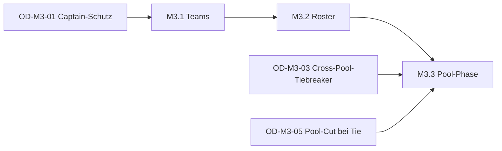

# M3 — Teams + Pool + Roster — Milestone-Plan

> Status: Entwurf, wartet auf Abnahme
> Datum: 2026-05-26
> Bezug: `architecture.md` (dieses Verzeichnis), `docs/plans/tournament-foundation/milestone-plan.md` §M3

## Überblick

M3 wird in drei Sub-Milestones zerlegt. Sie sind sequenziell, aber jedes Sub-Milestone ist demobar und kann einzeln abgenommen werden.

| Sub-Milestone | Inhalt | Aufwand | Demobar |
|---|---|---|---|
| M3.1 | Teams — Bounded Context `team/` (Schema, RPCs, UI für Pool-Management) | 4–5 Tage | Ja, ohne Turnier-Bezug |
| M3.2 | Tournament-Roster — Team-Anmeldung, Roster-Editor, Mid-Tournament-Substitution | 3–5 Tage | Ja, Team-Turnier ohne Pool |
| M3.3 | Pool-Phase — Domain, Server, Wizard-Erweiterung, Pool-Standings | 3–4 Tage | Ja, vollständig |

Summe: 10–14 Tage Senior-Tempo (Faktor 0.8). Deckt sich exakt mit dem Headline-Budget aus dem Tournament-Foundation-Plan.

Reihenfolge ist nicht beliebig:

- M3.1 muss vor M3.2 fertig sein — Roster-Slots referenzieren `team_memberships.user_id` und `team_guest_players.id`.
- M3.3 kann theoretisch nach M3.1 starten (Pool-Phase funktioniert auch für Einzelturniere), aber die echten Akzeptanzkriterien testen Team-Pool-Phase — daher nach M3.2.

## M3.1 — Teams (4–5 Tage)

Bounded Context `team/` ohne Turnier-Bezug. Demobar als isolierter Flow.

### Tasks

| ID | Task | Grösse | Vorbedingung |
|---|---|---|---|
| M3.1-T1 | Migration `20260615000001_team_schema.sql` — fünf Tabellen plus Indices und RLS-SELECT-Policies | L | — |
| M3.1-T2 | Migration `20260615000002_team_rpcs.sql` — alle zehn RPCs aus `architecture.md` §3.2 | L | M3.1-T1 |
| M3.1-T3 | pgTAP-Tests für RPCs — Happy-Path plus Authorization-Fail plus BR-Edge-Cases (FR-TEAM-19 Last-Member-Auto-Dissolve, FR-TEAM-8 Invitation-Lifecycle) | M | M3.1-T2 |
| M3.1-T4 | Value Objects in `kubb_domain/values/ids.dart` — `TeamGuestPlayerId`, `TeamMembershipId`, plus `TeamInvitationId` falls UI sie braucht | S | — |
| M3.1-T5 | Wire-Models in `lib/features/team/data/team_models.dart` — vier Klassen mit freezed | M | M3.1-T4 |
| M3.1-T6 | `lib/features/team/data/team_repository.dart` — Supabase-Adapter, eine Methode pro RPC | M | M3.1-T5 |
| M3.1-T7 | Riverpod-Provider — `team_list_provider`, `team_detail_provider`, `team_invitations_provider`, `team_membership_controller` | M | M3.1-T6 |
| M3.1-T8 | `team_list_screen.dart` — zwei Tabs (Meine / Suchen), Karten-Layout, Route `/teams` | M | M3.1-T7 |
| M3.1-T9 | `team_create_screen.dart` — Name, Liga (Default B), optional Logo-URL (kein Upload in M3) | S | M3.1-T7 |
| M3.1-T10 | `team_detail_screen.dart` — Pool-Liste mit Rollen-Badge, Aktionen Einladen / Gast hinzufügen / Verlassen | L | M3.1-T7 |
| M3.1-T11 | `team_invitation_screen.dart` plus Inbox-Item-Type — Einladungen annehmen / ablehnen | M | M3.1-T7 |
| M3.1-T12 | l10n — DE-Strings für alle neuen Team-Screens | S | M3.1-T8..T11 |
| M3.1-T13 | Routing-Anbindung in `lib/app/router.dart` plus Eintrag im Home-Screen | S | M3.1-T8..T11 |
| M3.1-T14 | Widget-Tests `team_membership_controller_test.dart` plus Snapshot-Tests für Card-Layout | M | M3.1-T7..T11 |

### Akzeptanz (Auswahl)

- Given Nutzer A loggt sich ein When er `/teams/new` öffnet und "Hammer-Crew" mit Liga B erstellt Then eine `teams`-Row existiert und A ist erstes Pool-Mitglied; Audit-Event `team_created` ist geschrieben.
- Given Nutzer A in Team T When A Nutzer B einlädt Then B sieht den Inbox-Eintrag, kann akzeptieren, und ist danach in `team_memberships`.
- Given Team T mit zwei registrierten Mitgliedern A und B When A das Team verlässt Then T hat noch ein Mitglied (B). When B auch verlässt Then T ist automatisch dissolved (FR-TEAM-19).
- Given Nutzer ohne Pool-Mitgliedschaft When er `team_remove_member` aufruft Then RPC wirft 403 `NOT_POOL_MEMBER`.
- Given Pool-Mitglied A entfernt Pool-Mitglied B per `team_remove_member` When Audit-Event geschrieben Then Inbox-Notification geht an alle anderen Pool-Mitglieder (OD-M3-01).

### Demobarkeit M3.1

Zwei Phones, drei Nutzer-Accounts. Nutzer 1 gründet "Test-Crew", lädt Nutzer 2 ein, fügt Gast "Toni Tester" hinzu, Nutzer 2 akzeptiert. Pool zeigt drei Einträge. Nutzer 3 sucht "Test-Crew", findet das Team, sieht die Pool-Liste. Demo-Dauer: 5 Min.

## M3.2 — Tournament-Roster (3–5 Tage)

Team-Anmeldung und Mid-Tournament-Roster-Wechsel. Pool-Phase ist hier noch nicht aktiviert — das Team-Turnier läuft als klassisches Round-Robin mit Team-Slots.

### Tasks

| ID | Task | Grösse | Vorbedingung |
|---|---|---|---|
| M3.2-T1 | Migration `20260615000003_tournament_team_roster.sql` — `team_id`, `roster_locked_at`, `user_id` nullable, neue `tournament_roster_slots`-Tabelle plus BR-5-Trigger | L | M3.1-T1 |
| M3.2-T2 | Migration `20260615000004_tournament_team_rpcs.sql` — drei RPCs (`tournament_register_team`, `tournament_roster_replace`, `tournament_roster_list`) | L | M3.2-T1 |
| M3.2-T3 | pgTAP — Happy-Path Team-Registrierung mit 3-Slot-Roster, BR-5-Verletzung, Roster-Replace vor und nach Finalize | M | M3.2-T2 |
| M3.2-T4 | `TournamentRemote`-Port-Erweiterung um `registerTeam`, `replaceRosterSlot`, `getRoster`. Plus `RosterSlotInput` und `RosterSlot` Value Objects. Plus Fake-Adapter und Supabase-Adapter | M | M3.2-T2 |
| M3.2-T5 | Property-Tests in `kubb_domain` — Roster-Slot-Validierung (genau eines von memberUserId / guestPlayerId, slotIndex in Range) | S | M3.2-T4 |
| M3.2-T6 | `tournament_repository.dart` — drei neue Methoden additiv | S | M3.2-T4 |
| M3.2-T7 | `register_team_screen.dart` plus `roster_composition_widget.dart` — Pool-Liste, Drag-Zuordnung in Slots 1..N, FR-REG-12-Validierung clientseitig (min. 1 registriertes Mitglied) | L | M3.2-T6 |
| M3.2-T8 | `roster_editor_screen.dart` — Mid-Tournament-Ansicht: Slots mit aktuellen Occupants, Replace-Dialog mit Pool-Liste plus optionalem Grund | L | M3.2-T6 |
| M3.2-T9 | Anpassung `tournament_register_screen.dart` — Weiche zwischen Einzel-Anmeldung (M1) und Team-Anmeldung anhand `tournaments.team_size > 1` | M | M3.2-T7 |
| M3.2-T10 | Anpassung `tournament_detail_screen.dart` — Roster-Tab sichtbar wenn `team_id IS NOT NULL`. Sichtbarkeit Pool-Liste plus aktuell aktive Slots | M | M3.2-T8 |
| M3.2-T11 | l10n — DE-Strings für neue Screens | S | M3.2-T7..T10 |
| M3.2-T12 | Integrations-Test — Team A vs. Team B in 4-Team-Round-Robin, einmal Mid-Tournament-Substitution, Audit-Trail verifiziert | M | alle |

### Akzeptanz (Auswahl)

- Given Turnier mit `team_size=3` in Status `registration_open` When Nutzer A öffnet Register-Screen Then er sieht Liste seiner Teams (nicht Einzel-Anmeldung).
- Given A wählt Team T und ordnet drei Pool-Mitglieder (1 registriertes, 2 Gäste) als Roster zu When Submit Then RPC wirft Error `MIN_ONE_REGISTERED` (FR-REG-12).
- Given Roster-Slot belegt mit Spieler X When A "Replace" mit Spieler Y aus Pool wählt Then alte Slot-Zeile bekommt `replaced_at`, neue Zeile wird angelegt, Audit-Event geschrieben.
- Given Turnier in Status `finalized` When A `replaceRosterSlot` aufruft Then RPC wirft `ROSTER_LOCKED` (FR-TEAM-15).
- Given Spieler Y bereits Roster-Slot in Team T1 desselben Turniers When A versucht Y in Team T2 zu registrieren Then RPC wirft `BR_5_VIOLATION`.

### Demobarkeit M3.2

Vier Phones, vier Team-Captains, ein Veranstalter-Tablet. Veranstalter legt 4-Team-Round-Robin (`team_size=3`) an, jedes Team meldet sich mit dem eigenen Roster an. Eine Substitution mid-Turnier ("Spieler hat sich verletzt"). Turnier läuft durch, Audit-Trail zeigt die Substitution. Demo-Dauer: ~20 Min.

## M3.3 — Pool-Phase (3–4 Tage)

Group-Round-Robin als Vorrundenvariante mit Top-N-Cut pro Gruppe.

### Tasks

| ID | Task | Grösse | Vorbedingung |
|---|---|---|---|
| M3.3-T1 | Property-Tests `pool_phase_test.dart` — Determinismus, korrekte Gruppen-Verteilung bei snake / random / seeded, BYE-Verhalten pro Gruppe (TDD vor Implementation) | M | — |
| M3.3-T2 | `pool_phase.dart` plus `pool_phase_generator.dart` in `kubb_domain` — `PoolPhaseConfig` mit Validierung, `generatePools` pure Funktion | M | M3.3-T1 |
| M3.3-T3 | Property-Tests `pool_cut_test.dart` — Top-N-Auswahl deterministisch, Cross-Pool-Tiebreaker stabil bei Punktegleichstand | M | — |
| M3.3-T4 | `pool_cut.dart` in `kubb_domain` — `selectQualifiers` mit existierender `TiebreakerChain` | S | M3.3-T3 |
| M3.3-T5 | Migration `20260615000005_tournament_pool_phase.sql` — `group_label`-Spalten plus RPC `tournament_start_pool_phase` plus Helper `_tournament_compute_pools` | L | M3.2 done |
| M3.3-T6 | Erweiterung `tournament_start_ko_phase` (M2-RPC) um Pool-Cut-Pfad — wenn `group_label IS NOT NULL` in den Pool-Matches, ruft den neuen `_tournament_compute_pool_cut`-Helper vor `_tournament_compute_ko_bracket` | M | M3.3-T5 |
| M3.3-T7 | Property-Parität-Tests (pgTAP + Dart-Integration) — Dart `generatePools` vs. plpgsql `_tournament_compute_pools` für n in {8, 12, 16, 24, 32} Teilnehmer und g in {2, 3, 4, 6, 8} Gruppen | M | M3.3-T5 |
| M3.3-T8 | `TournamentRemote.startPoolPhase` plus `getPoolStandings` plus `PoolGroupStandings`-Value-Object | S | M3.3-T5 |
| M3.3-T9 | `tournament_repository` Erweiterung um zwei Methoden additiv | S | M3.3-T8 |
| M3.3-T10 | Wizard-Erweiterung — bedingter Schritt "Pool-Konfiguration" (Anzahl Gruppen, Qualifier pro Gruppe, Grouping-Strategie) sichtbar wenn Format hybrid plus `match_format.pool_phase=true` Toggle | M | M3.3-T2 |
| M3.3-T11 | `tournament_pool_standings_screen.dart` — eine Karte pro Gruppe mit Standings, oben Cross-Pool-Übersicht | M | M3.3-T9 |
| M3.3-T12 | `tournament_detail_screen.dart` Tab "Gruppen" sichtbar wenn Pool-Phase aktiv | S | M3.3-T11 |
| M3.3-T13 | l10n — DE-Strings | S | M3.3-T10..T12 |
| M3.3-T14 | Integrations-Test — 16-Team-Turnier in 4 Gruppen à 4, Top-2 ins KO, Pool-Standings nachvollziehbar, Seeding für KO ist Cross-Pool-bereinigt | L | alle |

### Akzeptanz (Auswahl)

- Given Veranstalter wählt im Wizard Format `round_robin_then_ko` plus aktiviert Pool-Phase mit 4 Gruppen plus 2 Qualifier When Submit Then `tournaments.match_format.pool_phase={...}` ist persistiert.
- Given 16-Team-Turnier, alle approved When `startPoolPhase(groups=4, top=2, snake)` aufgerufen Then 4 Gruppen à 4 Teams sind im `group_label` markiert, 4 × 6 = 24 Pool-Matches sind angelegt, alle mit `phase='group'` plus passendem `group_label`.
- Given alle Pool-Matches finalized When `startKoPhase` aufgerufen Then 8 KO-Teams entstehen (4 Gruppen × 2 Qualifier), Seeding ist nach Pool-Standings plus Cross-Pool-Tiebreaker bereinigt.
- Given Pool A hat Tabellenführer mit 4 Siegen, Pool B hat Tabellenführer mit 4 Siegen plus besserer Buchholz When Cross-Pool-Tiebreaker greift Then Pool B's Erster bekommt Seed 1.

### Demobarkeit M3.3

16 Team-Anmeldungen vorab, Pool-Phase über mehrere Pitches parallel, KO-Phase im Anschluss. Owner sieht "Gruppen"-Tab live, sieht Top-2-pro-Gruppe-Hervorhebung, "KO starten" übergibt sauber ans M2-KO-Bracket. Demo-Dauer: ~30 Min (kompakt durchgespielt).

## Was nach M3 demobar ist

Der vollständige M3-Demo-Flow am Owner-Tablet:

1. Drei Captains gründen Teams ("Hammer-Crew", "Block-Mafia", "Helikopter-Heroes") und füllen Pools mit registrierten Mitgliedern und Gästen.
2. Veranstalter legt 16-Team-Turnier `round_robin_then_ko` mit Pool-Phase (4 Gruppen, Top-2), `team_size=3`, KO mit Spiel-um-Platz-3 an.
3. Captains melden ihre Teams mit Roster-Auswahl an.
4. Pool-Phase läuft, alle Spiele gespielt.
5. Eine Mid-Tournament-Substitution ("Spieler verletzt sich vor Pool-Match 3").
6. Top-2 pro Gruppe rücken ins KO, Seeding ist Cross-Pool-bereinigt.
7. KO läuft inkl. Spiel-um-Platz-3 (aus M2).
8. Endrangliste mit Plätzen 1, 2, 3, 4 plus Pool-Stand-Rangierung für Plätze 5–16.

Demo-Dauer: 45–60 Min vollständig durchgespielt.

## Vergleich zur M0+M1+M2-Cadence

Aus den Plan-Dokumenten und Git-Logs:

- **M0 — 5 Tage real** bei 4–6 Tagen Schätzung. TDD-vor-Implementation lieferte saubere Domain.
- **M1 — Korridor 9–12 Tage** — Score-Eingabe-UI war der dickste Block (M1-T12, M1-T13). Setup-Wizard MVP ging schneller als gedacht.
- **M2 — Plan 8–10 Tage** in drei Sub-Milestones — Lehre: Sub-Milestone-Split mit eigenen Demo-Points hilft beim Owner-Review.

M3 nimmt diese Cadence auf:

- M3.1 ist konsequent CRUD — sollte schneller laufen als M1 (vergleichbare Schemagröße, aber kein Konsens-Protokoll).
- M3.2 hat den teuersten UI-Block (Roster-Composition-Widget mit Drag-Zuordnung). Schätzung 1–1.5 Tage allein für diesen Task plus Tests.
- M3.3 nutzt M0/M2-Pattern (pure Domain + plpgsql-Spiegelung + Property-Parität-Tests). Aufwand vergleichbar mit M2.1+M2.2.

Risiko: BR-5-Trigger ist neu im Tournament-Pfad. Wenn der Trigger Edge-Cases hat, kann M3.2 leicht 1 Tag extra brauchen. Im Risiko-Doc adressiert.

## FR-Coverage M3

| FR | Beschreibung | abgedeckt in |
|---|---|---|
| FR-TEAM-1 | Team gründen | M3.1 |
| FR-TEAM-2 | Team-Stammdaten | M3.1 |
| FR-TEAM-3 | Pool unbegrenzt | M3.1 (kein hartes Limit) |
| FR-TEAM-4 | Pool: Nutzer plus Gäste | M3.1 |
| FR-TEAM-5 | Captain-Rechte aller Mitglieder | M3.1 |
| FR-TEAM-6 | Gäste ohne Captain-Rechte | M3.1 |
| FR-TEAM-7 | Gründer ohne Sonderrechte | M3.1 (Audit-Trail vermerkt aber Gründer) |
| FR-TEAM-8 | Invite-Bestätigung | M3.1 |
| FR-TEAM-9 | Gast-Spieler hinzufügen | M3.1 |
| FR-TEAM-11 | Mehrfach-Pool-Mitgliedschaft | M3.1 plus BR-5 in M3.2 |
| FR-TEAM-12 | Roster bei Anmeldung | M3.2 |
| FR-TEAM-13 | Mid-Tournament-Roster-Wechsel | M3.2 |
| FR-TEAM-14 | Audit-Trail Roster-Wechsel | M3.2 |
| FR-TEAM-15 | Roster-Lock nach Turnierende | M3.2 |
| FR-TEAM-17 | Team-Liga | M3.1 (Init), Liga-Wechsel-Mechanik M5 |
| FR-TEAM-18 | Liga-Default B | M3.1 |
| FR-TEAM-19 | Auflösung mit Consent oder Last-Member | M3.1 |
| FR-TEAM-20 | Aufgelöste Teams archiviert | M3.1 |
| FR-REG-2 | Team-Anmeldung durch Pool-Mitglied | M3.2 |
| FR-REG-7 | Rückzug durch Pool-Mitglied | M3.2 (Extension von M1) |
| FR-REG-12 | Mindestens 1 registriertes Mitglied im Roster | M3.2 |
| FR-FMT-5 | Gruppenphase plus KO | M3.3 |
| BR-5 | Kein Spieler in zwei Rostern desselben Turniers | M3.2 (Trigger) |
| BR-9 | Score-Eingabe nur durch Pool-Mitglieder | M3.2 (Anpassung der M1 Score-RPCs auf Team-Pfad) |
| BR-27 | Identische Captain-Rechte | M3.1 |
| BR-29 | Roster-Anpassung bis Turnierende | M3.2 |
| NFR-AUDIT-3 | Roster-Änderungen protokolliert | M3.2 |
| NFR-AUDIT-5 | Pool-Mitgliedschaftsänderungen protokolliert | M3.1 |

Nicht in M3:

- FR-TEAM-10 (Gast claimt registrierten Account) — M5+
- FR-TEAM-16 (Reservespieler im Roster) — KANN-Erweiterung, OD-M3-04 verschiebt das
- FR-REG-11 (Liga-Nachweis bei Shared Tournaments) — Shared Tournaments sind M5+
- FR-CLUB (Vereine) — späterer Milestone
- FR-PUB-9 vollständig (Team-Statistiken) — Header plus Pool reichen für M3

## Abhängigkeiten und Reihenfolge

Kritischer Pfad:

- OD-M3-01 (Captain-Schutz) muss vor M3.1-T2 entschieden sein (beeinflusst RPC-Logik).
- OD-M3-03 und OD-M3-05 müssen vor M3.3-T4 entschieden sein (beeinflussen Pool-Cut-Algorithmus).
- M3.2 ist hart gekoppelt an M3.1 (Schema-FK).
- M3.3 nutzt M3.2 nur im Akzeptanz-Test — könnte parallel zu M3.2 laufen wenn Owner Team-Resourcing zulässt. Default ist sequenziell.
