# M3 — Sprint-Plan

> Stand: 2026-05-26
> Bezug: `milestone-plan.md`, `architecture.md`, `open-decisions.md` (alle 7 ODs resolved), `risks-and-deferrals.md`, ADR-0018, ADR-0019, ADR-0020
> Tasks: `tasks.md` (atomare Liste)

## Zweck

Dieser Sprint-Plan zerlegt M3 (Teams, Roster, Pool-Phase) in drei Sub-Milestones und elf Waves. Jede Wave hat ein klares Eingangs- und Ausgangs-Gate. Innerhalb einer Wave laufen Tasks parallel; zwischen Waves wird gemergt.

## Resolved Open Decisions

Alle sieben ODs sind entschieden — die Tasks-Briefings referenzieren die jeweilige Empfehlung:

| OD | Resolution | Wirkung auf Tasks |
|---|---|---|
| OD-M3-01 | Audit + Inbox-Notification bei kritischen Aktionen (kein Voting, kein Cooldown) | M3.1 RPCs schreiben Audit-Event plus Inbox-Item bei `team_remove_member`/`team_dissolve` |
| OD-M3-02 | Team-Grössen {2, 3, 4, 5, 6} im Wizard | Wizard rendert dynamisch; Roster-Composer ist responsive bis 6 Slots |
| OD-M3-03 | Cross-Pool-Tiebreaker via bestehende `TiebreakerChain` mit `direct_comparison`-Skip | `pool_cut.dart` nimmt `TiebreakerChain`-Parameter und filtert die `directComparison`-Stufe wenn Cross-Pool |
| OD-M3-04 | Kein Reserve-Konzept in M3 | `tournament_roster_slots` hat keine `role`-Spalte |
| OD-M3-05 | RPC wirft `TIEBREAKER_NEEDS_RESOLUTION` bei vollständigem Pool-Cut-Tie; Veranstalter-Override per UI | RPC `tournament_start_ko_phase` retourniert ERRCODE bei Tie; neuer Dialog in M3.3 löst auf |
| OD-M3-06 | Match-Sieg-Punkte (3/1/0) konsistent zu M1 | Keine Schema-Änderung; `standings.dart` bleibt unangetastet |
| OD-M3-07 | Substitution nur zwischen Matches | `tournament_roster_replace` prüft `NOT EXISTS (... matches WHERE status='awaiting_results')` |

## Sub-Milestones

### M3.1 — Teams (Wave 1 bis 4, Tage 1–5)

**Demo-Akzeptanz**: Owner-Demo am Tablet plus Phone. Nutzer 1 gründet "Test-Crew", lädt Nutzer 2 ein (Inbox-Eintrag), fügt Gast hinzu, Nutzer 2 akzeptiert. Pool zeigt drei Einträge. Nutzer 3 sucht "Test-Crew" und sieht die Pool-Liste. `flutter test test/features/team/` ist grün. pgTAP- (oder Dart-Integration-) Tests für alle Team-RPCs sind grün. Audit-Trail enthält für jede kritische Aktion einen Event-Eintrag plus Inbox-Item bei Removal/Dissolve (OD-M3-01).

Inhalt: Migrations `20260615000001_team_schema.sql` und `20260615000002_team_rpcs.sql`, Value Objects (`TeamGuestPlayerId`, `TeamMembershipId`, `TeamInvitationId`), Wire-Models, Repository, Riverpod-Provider, vier Screens (List, Detail, Create, Invitation), Inbox-Item-Type-Erweiterung, l10n, Routing.

### M3.2 — Tournament-Roster (Wave 5 bis 7, Tage 6–9)

**Demo-Akzeptanz**: Vier Phones, vier Captains, ein Veranstalter-Tablet. Veranstalter legt 4-Team-Round-Robin (`team_size=3`) an, jedes Team meldet sich mit Roster an. BR-5-Violation wirft sichtbaren Fehler im UI. Eine Mid-Tournament-Substitution mit Audit-Trail. Score-Eingabe durch beliebiges Pool-Mitglied funktioniert (BR-9). `flutter test` plus pgTAP/Dart-Integration-Tests grün. Integrations-Test `team_round_robin_e2e_test.dart` grün.

Inhalt: Migration `20260615000003_tournament_team_roster.sql` (Schema + BR-5-Trigger), `20260615000004_tournament_team_rpcs.sql` (drei RPCs plus Score-RPC-Anpassung für Team-Pfad), `TournamentRemote`-Port-Erweiterung, Pool-Conflict-Helper, `RegisterTeamScreen` plus `RosterCompositionWidget`, `RosterEditorScreen`, Detail-Screen-Anpassung, l10n.

### M3.3 — Pool-Phase (Wave 8 bis 11, Tage 10–14)

**Demo-Akzeptanz**: 16-Team-Turnier in vier Gruppen à vier, Top-2 ins KO, Pool-Standings nachvollziehbar, Seeding für KO ist Cross-Pool-bereinigt. TIEBREAKER_NEEDS_RESOLUTION-Dialog wird im manuellen Smoke einmal ausgelöst und vom Veranstalter aufgelöst. Property-Parität Dart ↔ plpgsql für n in {8, 12, 16, 24, 32} und g in {2, 3, 4, 6, 8} grün. Owner sieht die Mermaid-State-Machine-Übergänge `live_pool → live_ko` live. Vollständiger Demo-Flow aus `milestone-plan.md` §"Was nach M3 demobar ist" läuft am Tablet durch.

Inhalt: Pure-Domain Pool-Phase (`pool_phase.dart`, `pool_phase_generator.dart`, `pool_cut.dart`) mit glados-Property-Tests, Migration `20260615000005_tournament_pool_phase.sql` mit plpgsql-Helpern, RPC-Spiegelung plus Property-Parität-Tests, Cross-Pool-Tiebreaker-Resolution-Dialog, Wizard-Erweiterung, `PoolStandingsScreen`, Detail-Tab "Gruppen", Integrations-Test, Demo-Script.

## Senior-Disziplin

- **TDD-Pflicht im Domain**: jeder Impl-Task in `packages/kubb_domain/` hat einen vorgelagerten Test-Task in einer früheren Wave. Test-Task definiert die Public-API als Acceptance — der Impl-Task macht die roten Tests grün.
- **Senior-Sizing**: max 100 LOC, max 3 Files, max 1h netto. Verstoss → Splitten.
- **Conventional Commits**: Task-ID in Commit-Message (`feat(team): TASK-M3.1-T4 add team value objects`).
- **Wave-Paralleltritt**: Tasks in derselben Wave dürfen sich nicht gegenseitig blocken. Worker laufen in eigenen Worktrees, Cherry-pick + Merge nach Wave-Ende.
- **Contract-Sharing**: Wave-N-Tasks zitieren in `Notes` den Contract (Type-Signatur, RPC-Signatur, Tabellen-Spalten) aus Wave-(N-1)-Vorgängern, damit der Impl-Worker nicht raten muss. Kritische Contracts in diesem Sprint:
  - **RPC-Signaturen-Contract** zwischen M3.1-T6 (Migration RPCs) und M3.1-T9 (Repository): SQL-Signatur + Return-Shape steht in Notes von T6, wird in T9 zitiert.
  - **`TournamentRemote`-Erweiterung** zwischen M3.2-T7a (Port-Interface) und M3.2-T7b/c (Impls): Method-Signaturen aus `architecture.md` §3.5 (Code-Block) sind verbindlicher Contract.
  - **`PoolPhaseConfig` und `RosterSlot{Input}`-Values** zwischen den Test-Tasks (M3.3-T1, M3.2-T5) und den Impl-Tasks (M3.3-T2, M3.2-T4): Tests legen die Constructor-Form fest.
  - **`group_label` Schema-Contract** zwischen M3.3-T5 (Migration) und M3.3-T9 (Repository-Read) bzw. M3.3-T11 (UI): Spalten-Defaults und Phasen-Semantik (`phase='group'` vs `phase='ko'`) gehören in Notes von T5.
  - **`tournament_compute_pool_cut`-Helper-Contract** zwischen M3.3-T5 (Helper) und M3.3-T6 (RPC-Erweiterung): Signatur `(p_tournament_id, p_group_label, p_top_n) returns jsonb` mit Tie-Verhalten `TIEBREAKER_NEEDS_RESOLUTION` ist Pflicht-Eintrag in Notes von T5.
- **`league_eligible` aus M2** bleibt unverändert — M3 fügt additiv `teams.league_membership` hinzu, kein Konflikt.

## Wave-Plan

### Wave 1 (M3.1, Tag 1) — Test-First Values + Migration-Schema

- T1: Migration `20260615000001_team_schema.sql` (fünf Tabellen, Indices, RLS-SELECT-Policies)
- T2: Value Objects in `kubb_domain/values/ids.dart` (`TeamGuestPlayerId`, `TeamMembershipId`, `TeamInvitationId`)
- T3: pgTAP-Tests (oder Dart-Integration) Skelett für Migration — Tabellen existieren, Constraints greifen, RLS-Policies aktiv

T1 und T2 sind unabhängig (verschiedene Dateien). T3 hängt an T1 (braucht Schema), läuft als Test-First gegen die noch-leeren RPCs.

### Wave 2 (M3.1, Tag 2) — Team-RPCs + Audit/Inbox

- T4: Migration `20260615000002_team_rpcs.sql` Teil A — `team_create`, `team_list_for_caller`, `team_get`, `team_invite`, `team_invitation_respond`
- T5: Migration `20260615000002_team_rpcs.sql` Teil B — `team_add_guest`, `team_remove_member`, `team_remove_guest`, `team_leave`, `team_dissolve` (mit Audit-Event plus Inbox-Notification gemäss OD-M3-01)
- T6: Inbox-Item-Type-Erweiterung `team_invitation` und `team_member_removed` plus DE-Strings

T4 und T5 sind eigene Statement-Blöcke in der Migration — können parallel als zwei Teilmigrationen geschrieben werden (T4 → `_a.sql`, T5 → `_b.sql`) oder in einem Worktree sequentiell. Empfehlung: zwei getrennte Migrations-Dateien `20260615000002_team_rpcs_a.sql` und `20260615000002_team_rpcs_b.sql` für saubere Parallelität. T6 ist eigene Datei (`inbox_items` Type-Definition), parallel.

### Wave 3 (M3.1, Tag 3) — Server-Tests + Data-Layer

- T7: pgTAP/Dart-Integration-Tests für Team-RPCs (Happy-Path plus Auth-Fail plus FR-TEAM-19 Last-Member-Auto-Dissolve plus FR-TEAM-8 Invitation-Lifecycle)
- T8: Wire-Models `team_models.dart` (`TeamWire`, `TeamMembershipWire`, `TeamInvitationWire`, `GuestPlayerWire`) mit freezed
- T9: `team_repository.dart` — Riverpod-`Provider`, eine Methode pro RPC

T7 hängt auf T4/T5/T6. T8 hängt auf T2 (Value Objects). T9 hängt auf T8 plus T4/T5 (RPC-Signatur-Contract aus T4/T5 Notes).

### Wave 4 (M3.1, Tag 4–5) — App-Layer + UI + Routing

- T10: Riverpod-Provider `team_list_provider`, `team_detail_provider`, `team_invitations_provider`, `team_membership_controller`
- T11: `team_list_screen.dart` (zwei Tabs)
- T12: `team_create_screen.dart` (Wizard-leicht)
- T13: `team_detail_screen.dart` (Pool-Liste, Rollen-Badge, Aktionen) plus `widgets/team_member_card.dart`
- T14: `team_invitation_screen.dart` plus Inbox-Hook
- T15: l10n DE-Strings für alle Team-Screens
- T16: Routing-Anbindung `lib/app/router.dart` plus Eintrag im Home-Screen
- T17: Widget-Tests `team_membership_controller_test.dart` plus Snapshot-Tests für Card-Layout

T10 hängt auf T9. T11–T14 hängen auf T10 (Provider-API) und sind untereinander unabhängig (vier Files). T15/T16/T17 hängen auf T11–T14 (l10n braucht alle Screen-Keys, Router braucht alle Routen, Widget-Tests greifen auf Provider und Widgets).

### Wave 5 (M3.2, Tag 6) — Roster-Schema + Trigger

- T1: Migration `20260615000003_tournament_team_roster.sql` (Spalten + neue Tabelle `tournament_roster_slots` + BR-5-Trigger + CHECK-Constraint für `(team_id, user_id)`-Konsistenz)
- T2: pgTAP/Dart-Integration-Tests für BR-5-Trigger (Happy-Path, Doppel-Roster-Violation, Cross-Tournament-Independenz)
- T3: Property-Tests in `kubb_domain` — `RosterSlot{Input}`-Validierung (genau eines von memberUserId / guestPlayerId, slotIndex in 1..6)

T1 ist isolierte Migration. T2 hängt auf T1. T3 ist unabhängig (Pure Domain, Test-First für M3.2-T4).

### Wave 6 (M3.2, Tag 7) — Tournament-Team-RPCs + Port-Iface

- T4: `RosterSlotInput`, `RosterSlot`, `PoolGroupStandings` Value Objects in `kubb_domain`
- T5: `TournamentRemote`-Port-Erweiterung um `registerTeam`, `replaceRosterSlot`, `getRoster` (Interface-Datei in `kubb_domain/ports/`)
- T6: Migration `20260615000004_tournament_team_rpcs.sql` — `tournament_register_team`, `tournament_roster_replace` (OD-M3-07-Validierung: kein offenes Match), `tournament_roster_list`
- T7: Score-RPC-Anpassung — `tournament_propose_set_score` und Co. für Team-Pfad (Submitter via `team_memberships`-Lookup, BR-9)
- T8: pgTAP/Dart-Integration-Tests für drei Tournament-Team-RPCs (Happy-Path 3-Slot-Roster, BR-5-Violation, Roster-Replace vor und nach `finalized`, OD-M3-07-Block bei offenem Match)

T4 hängt auf T3 (Test-Contract). T5 hängt auf T4. T6 ist eigene Migration. T7 ist Patch auf bestehende M1-RPCs (eigene Datei). T8 hängt auf T6 plus T7.

### Wave 7 (M3.2, Tag 8–9) — Adapter + UI + e2e

- T9: `SupabaseTournamentRemote`-Impl der drei neuen Port-Methoden
- T10: `FakeTournamentRemote`-Impl (für Widget-Tests)
- T11: Property-Tests Domain — `RosterSlot{Input}`-Invarianten plus Test für FR-REG-12 (min. 1 registriertes Mitglied)
- T12: Pool-Conflict-Helper-RPC `team_pool_with_tournament_conflicts(p_team_id, p_tournament_id)` (R-M3-G2-Mitigation, kleine plpgsql-Function)
- T13: `RosterCompositionWidget` — Tap-Select-Pattern (siehe R-M3.2-3-Mitigation), Pool-Liste mit Conflict-Markierung
- T14: `RegisterTeamScreen` — Team-Auswahl plus `RosterCompositionWidget` plus Submit
- T15: `RosterEditorScreen` — Mid-Tournament-Ansicht, Replace-Dialog mit Grund-Feld
- T16: Weiche in `tournament_register_screen.dart` (Einzel vs. Team)
- T17: Anpassung `tournament_detail_screen.dart` — Roster-Tab sichtbar wenn `team_id IS NOT NULL`; Match-Header zeigt "Team A (Roster: X, Y, Z)"
- T18: l10n DE-Strings für M3.2-Screens
- T19: Integrations-Test `team_round_robin_e2e_test.dart` (4-Team-Round-Robin + Mid-Substitution + Audit-Trail-Verifikation)

T9/T10 hängen auf T5. T11 hängt auf T3/T4. T12 ist eigene Migration. T13 hängt auf T4 (RosterSlotInput) und T12 (Conflict-Helper). T14 hängt auf T9 (Repository) und T13 (Widget). T15 hängt auf T9 und T4. T16 hängt auf T14. T17 hängt auf T9. T18 hängt auf T13–T17. T19 hängt auf alle UI-Tasks.

### Wave 8 (M3.3, Tag 10) — Test-First Pure-Domain Pool-Phase

- T1: Property-Tests `pool_phase_test.dart` (Validierung von `PoolPhaseConfig`, snake/random/seeded-Determinismus, BYE-Verhalten pro Gruppe)
- T2: Property-Tests `pool_cut_test.dart` (Top-N-Determinismus, Cross-Pool-Tiebreaker mit `direct_comparison`-Skip per OD-M3-03)

Zwei Test-Tasks parallel. Beide laufen rot und definieren die API für Wave 9.

### Wave 9 (M3.3, Tag 11) — Pure-Domain-Impl

- T3: `pool_phase.dart` plus `pool_phase_generator.dart` in `kubb_domain` (`PoolPhaseConfig` mit Validierung, `generatePools` pure Funktion)
- T4: `pool_cut.dart` — `selectQualifiers` mit `TiebreakerChain` (`direct_comparison`-Skip wenn Cross-Pool gemäss OD-M3-03; `TIEBREAKER_NEEDS_RESOLUTION`-Marker im Resultat wenn vollständiger Tie gemäss OD-M3-05)

T3/T4 parallel — zwei eigene Files. T3 hängt auf T1, T4 hängt auf T2.

### Wave 10 (M3.3, Tag 12) — Server + Property-Parität

- T5: Migration `20260615000005_tournament_pool_phase.sql` — `group_label`-Spalten auf `tournament_matches` und `tournament_participants`; Helper `_tournament_compute_pools` (plpgsql-Spiegelung von `generatePools`); RPC `tournament_start_pool_phase`; Helper `_tournament_compute_pool_cut(p_group_label, p_top_n)`
- T6: Erweiterung `tournament_start_ko_phase` (M2-RPC) — wenn Pool-Matches vorhanden (`phase='group'`), ruft `_tournament_compute_pool_cut` pro Gruppe; bei vollständigem Tie wirft RPC `ERRCODE 'TIEBREAKER_NEEDS_RESOLUTION'` (OD-M3-05)
- T7: Property-Parität-Test (pgTAP plus Dart-Integration) — Dart `generatePools` vs. plpgsql `_tournament_compute_pools` für n in {8, 12, 16, 24, 32} und g in {2, 3, 4, 6, 8}
- T8: `TournamentRemote.startPoolPhase` plus `getPoolStandings` plus `resolveCrossPoolTie`-Method-Stub (für TIEBREAKER_NEEDS_RESOLUTION-Auflösung); `SupabaseTournamentRemote`- und `FakeTournamentRemote`-Impls

T5 hängt auf T3 (Helper spiegelt `generatePools`). T6 hängt auf T5 und auf T4 (Cut-Logik). T7 hängt auf T5 plus T3. T8 hängt auf T5 plus T6.

### Wave 11 (M3.3, Tag 13–14) — UI + Integration + Demo

- T9: Wizard-Erweiterung — bedingter Schritt "Pool-Konfiguration" (Anzahl Gruppen, Qualifier pro Gruppe, Grouping-Strategie); sichtbar wenn Format hybrid + `match_format.pool_phase=true` Toggle
- T10: `tournament_pool_standings_screen.dart` — eine ExpansionTile-Karte pro Gruppe (R-M3.3-4-Mitigation), oben Cross-Pool-Übersicht
- T11: Cross-Pool-Tiebreaker-Resolution-Dialog — wird ausgelöst wenn `startKoPhase` `TIEBREAKER_NEEDS_RESOLUTION` retourniert; Veranstalter sortiert betroffene Teilnehmer manuell, ruft `resolveCrossPoolTie` (OD-M3-05)
- T12: `tournament_detail_screen.dart` Tab "Gruppen" sichtbar wenn Pool-Phase aktiv plus Anpassung `tournament_bracket_provider` damit Pool-Phase-Daten geladen werden
- T13: l10n DE-Strings für M3.3-Screens
- T14: Integrations-Test `pool_phase_ko_e2e_test.dart` — 16-Team-Turnier, 4 Gruppen à 4, Top-2 ins KO, Cross-Pool-Bereinigung verifiziert
- T15: Demo-Script `docs/plans/m3-teams-pools-roster/demo-script.md` für Owner-Abnahme (Full-Flow)

T9 hängt auf T3 (`PoolPhaseConfig`-Wertobjekt). T10 hängt auf T8 (`getPoolStandings`). T11 hängt auf T8 plus T6. T12 hängt auf T10. T13 hängt auf T9–T12. T14 hängt auf alle Code-Tasks. T15 ist Doku.

## Mermaid-Dependency-Graph

```mermaid
graph LR
    %% Wave 1 - M3.1 schema + values
    W1T1[T1 schema migration]
    W1T2[T2 value objects]
    W1T3[T3 schema tests]

    %% Wave 2 - M3.1 rpcs
    W2T4[T4 rpcs A]
    W2T5[T5 rpcs B audit inbox]
    W2T6[T6 inbox item type]

    %% Wave 3 - server tests + data
    W3T7[T7 team rpc tests]
    W3T8[T8 wire models]
    W3T9[T9 team repository]

    %% Wave 4 - app + ui + routing
    W4T10[T10 team providers]
    W4T11[T11 team list screen]
    W4T12[T12 team create screen]
    W4T13[T13 team detail screen]
    W4T14[T14 team invitation screen]
    W4T15[T15 team l10n]
    W4T16[T16 routing home]
    W4T17[T17 widget tests]

    %% Wave 5 - roster schema
    W5T1[T1 roster migration]
    W5T2[T2 br5 trigger tests]
    W5T3[T3 roster slot tests]

    %% Wave 6 - tournament team rpcs
    W6T4[T4 roster values]
    W6T5[T5 port iface]
    W6T6[T6 tournament team rpcs]
    W6T7[T7 score rpc patch]
    W6T8[T8 rpc tests]

    %% Wave 7 - adapter + ui + e2e
    W7T9[T9 supabase adapter]
    W7T10[T10 fake adapter]
    W7T11[T11 domain props]
    W7T12[T12 conflict helper rpc]
    W7T13[T13 roster composition widget]
    W7T14[T14 register team screen]
    W7T15[T15 roster editor screen]
    W7T16[T16 register switch]
    W7T17[T17 detail roster tab]
    W7T18[T18 roster l10n]
    W7T19[T19 team e2e test]

    %% Wave 8 - pool tests
    W8T1[T1 pool_phase tests]
    W8T2[T2 pool_cut tests]

    %% Wave 9 - pool impl
    W9T3[T3 pool_phase impl]
    W9T4[T4 pool_cut impl]

    %% Wave 10 - server pool
    W10T5[T5 pool migration helpers]
    W10T6[T6 start_ko_phase extend]
    W10T7[T7 parity tests]
    W10T8[T8 pool port adapters]

    %% Wave 11 - ui pool + demo
    W11T9[T9 wizard pool step]
    W11T10[T10 pool standings screen]
    W11T11[T11 tiebreaker resolve dialog]
    W11T12[T12 detail groups tab]
    W11T13[T13 pool l10n]
    W11T14[T14 pool e2e test]
    W11T15[T15 demo script]

    %% deps
    W1T1 --> W1T3
    W1T1 --> W2T4
    W1T1 --> W2T5
    W1T2 --> W3T8
    W2T4 --> W3T7
    W2T5 --> W3T7
    W2T6 --> W3T7
    W3T8 --> W3T9
    W2T4 --> W3T9
    W2T5 --> W3T9
    W3T9 --> W4T10
    W4T10 --> W4T11
    W4T10 --> W4T12
    W4T10 --> W4T13
    W4T10 --> W4T14
    W4T11 --> W4T15
    W4T12 --> W4T15
    W4T13 --> W4T15
    W4T14 --> W4T15
    W4T11 --> W4T16
    W4T13 --> W4T16
    W4T11 --> W4T17
    W4T13 --> W4T17

    W1T1 --> W5T1
    W5T1 --> W5T2
    W6T5 --> W6T6
    W5T3 --> W6T4
    W6T4 --> W6T5
    W5T1 --> W6T6
    W5T1 --> W6T7
    W6T6 --> W6T8
    W6T7 --> W6T8

    W6T5 --> W7T9
    W6T5 --> W7T10
    W5T3 --> W7T11
    W6T4 --> W7T11
    W5T1 --> W7T12
    W6T4 --> W7T13
    W7T12 --> W7T13
    W7T9 --> W7T14
    W7T13 --> W7T14
    W7T9 --> W7T15
    W6T4 --> W7T15
    W7T14 --> W7T16
    W7T9 --> W7T17
    W7T13 --> W7T18
    W7T14 --> W7T18
    W7T15 --> W7T18
    W7T17 --> W7T18
    W7T14 --> W7T19
    W7T15 --> W7T19
    W7T16 --> W7T19
    W7T17 --> W7T19

    W8T1 --> W9T3
    W8T2 --> W9T4
    W9T3 --> W10T5
    W9T4 --> W10T6
    W10T5 --> W10T6
    W10T5 --> W10T7
    W9T3 --> W10T7
    W10T5 --> W10T8
    W10T6 --> W10T8

    W9T3 --> W11T9
    W10T8 --> W11T10
    W10T8 --> W11T11
    W10T6 --> W11T11
    W11T10 --> W11T12
    W11T9 --> W11T13
    W11T10 --> W11T13
    W11T11 --> W11T13
    W11T12 --> W11T13
    W11T9 --> W11T14
    W11T10 --> W11T14
    W11T11 --> W11T14
    W11T12 --> W11T14
    W11T14 --> W11T15

    %% cross-sub deps
    W4T17 --> W5T1
    W7T19 --> W8T1
    W7T19 --> W8T2
```

## Kritische Pfade

1. **Schema-Migration M3.1-T1** ist Bottleneck für M3.1 (blockt T3, T4, T5) und für M3.2-T1 (Roster-Schema referenziert `teams`-FK). Muss in Wave 1 zuverlässig landen.
2. **`TournamentRemote`-Port-Iface M3.2-T5** ist Bottleneck für alle Adapter (T9/T10) und damit für alle UI-Tasks der Wave 7. Wenn das Interface sich nach Adapter-Impl ändert, müssen alle Adapter nachgezogen werden.
3. **Property-Parität M3.3-T7** ist Pflicht-Gate für M3.3-Merge. Wenn `_tournament_compute_pools` (plpgsql) von `generatePools` (Dart) abweicht, blockt das die ganze M3.3.
4. **Helper `_tournament_compute_pool_cut` M3.3-T5** ist Sub-Contract zwischen Schema-Migration und RPC-Erweiterung (T6). Beide Tasks in Wave 10 — bei Drift wird T6 rot, dann T5 nachziehen.
5. **`tournament_setup_wizard.dart` als Single-File-Risiko**: Wizard-Erweiterung in M3.3-T9 berührt dieselbe Datei wie der M2-Wizard. Wenn parallele Arbeit am Wizard läuft, wird die Datei zum Konflikt-Hotspot — gleiche Lösung wie M2-Sprint-Plan: Step-Helper-Widgets (`_PoolConfigStep`) auslagern, dann konfliktfrei.
6. **BR-5-Trigger M3.2-T1**: neuer Pfad im Tournament-Schema. Wenn Trigger Edge-Cases hat (Race bei parallelen Inserts), kann M3.2 Tag 8 nicht starten. Mitigation per pgTAP-Test in M3.2-T2.

## Empfohlene Reihenfolge der Waves

Sequenziell von Wave 1 bis Wave 11. Owner-Abnahme-Punkte:

- Nach Wave 4: M3.1-Demo (Team-CRUD ohne Turnier-Bezug).
- Nach Wave 7: M3.2-Demo (4-Team-Round-Robin mit Roster und Mid-Substitution).
- Nach Wave 11: M3.3-Demo plus voller End-to-End-Flow.

Optionaler Speedup: Wave 8 + Wave 9 (Pure-Domain Pool) brauchen nur die Domain aus M0 (`pool.dart`, `tiebreaker.dart`, `standings.dart`) und keine M3.1/M3.2-Artefakte. Wenn Owner Team-Resourcing zulässt, können Wave 8/9 parallel zu Wave 5/6/7 laufen — dokumentierte Wave-Verschachtelung. Default bleibt sequenziell.

## Out of Scope (zur Klarstellung)

- **Reservespieler-Konzept** (OD-M3-04): bleibt komplett raus.
- **Logo-Upload**: `teams.logo_url` ist text — URL only.
- **Vereine**: `home_club_id`-FK ist Stub, ohne `clubs`-Tabelle.
- **Realtime**: Polling, kein FCM/Push. M4.
- **iOS / Web / Linux / Windows**: Android-only (ADR-0015 gilt).
- **Set-State-Tracking für Mid-Set-Substitution**: M4/M5.

## Quality-Gates (per Sub-Milestone)

| Gate | Sub-Milestone | Bedingung |
|---|---|---|
| G1 | M3.1 | `flutter test test/features/team/` grün, pgTAP/Dart-Integration für alle Team-RPCs grün, Audit-Trail-Smoke verifiziert, Owner-Demo Phone+Tablet |
| G2 | M3.2 | RPC-Tests (Happy + BR-5 + Roster-Replace) grün, Property-Tests RosterSlot-Invarianten grün, Integrations-Test `team_round_robin_e2e_test.dart` grün, Pool-Conflict-Marker im Composition-Widget sichtbar |
| G3 | M3.3 | Property-Parität Dart ↔ plpgsql über n × g Sweep grün, Integrations-Test `pool_phase_ko_e2e_test.dart` grün, TIEBREAKER_NEEDS_RESOLUTION-Pfad einmal manuell durchgespielt, Demo-Script am Tablet abgearbeitet |

## Senior-Cadence

Insgesamt 14 Tage Senior-Tempo (Faktor 0.8). Über 14 Tage gestreckt entspricht das ca. 11.2 effektiven Personentagen — im Rahmen der Headline-Schätzung 10–14 Tage aus `milestone-plan.md`. M3.1 ist 5 Tage (4 Waves), M3.2 ist 4 Tage (3 Waves), M3.3 ist 5 Tage (4 Waves).
