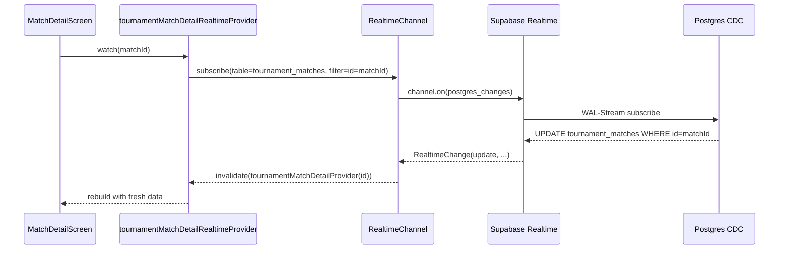
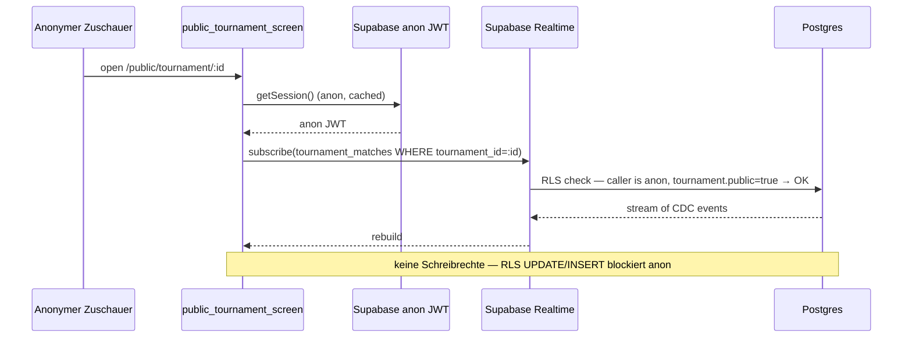
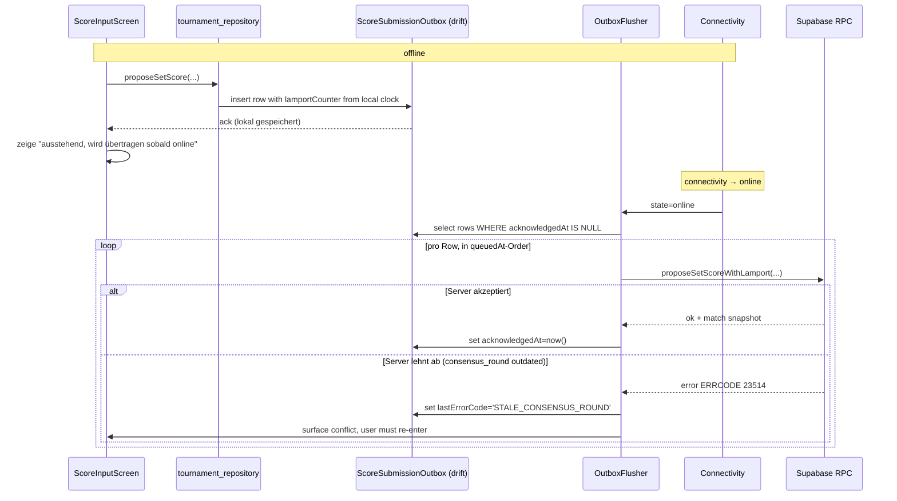
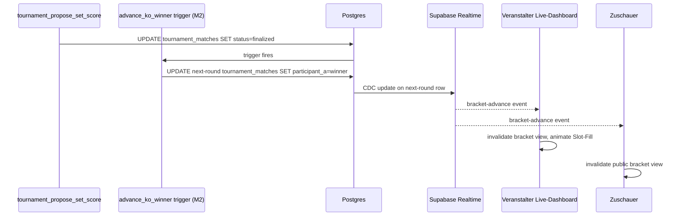
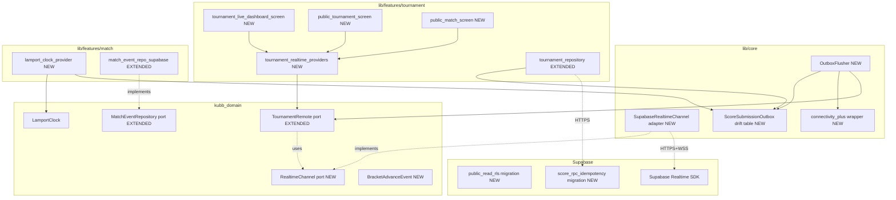
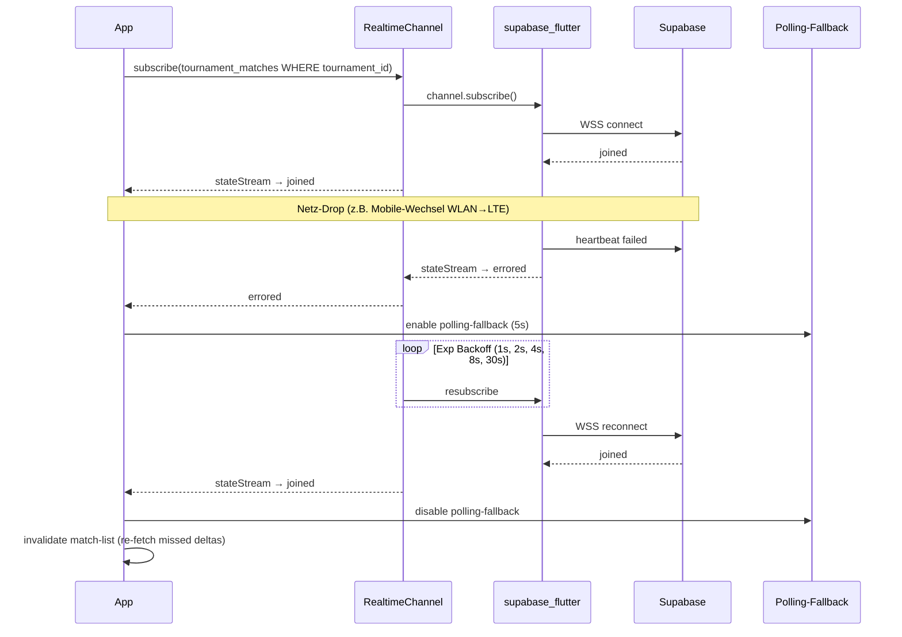

# M4 — Realtime, Live-Dashboard, Offline — Architektur

> Status: Entwurf, wartet auf Abnahme
> Datum: 2026-05-27
> Bezug: `docs/plans/tournament-foundation/architecture.md` §M4, `docs/plans/m2-ko-bracket/architecture.md`, `docs/plans/m3-teams-pools-roster/architecture.md`, ADR-0001, ADR-0002, ADR-0004, ADR-0006, ADR-0014, ADR-0015

## 1. Übersicht

M4 ersetzt das 5-Sekunden-Polling aus M1–M3 durch Supabase Realtime (Postgres-CDC über WebSocket), führt eine Spectator-View für laufende Turniere ein (Read-only, optional ohne Login) und ergänzt eine pragmatische Offline-Toleranz für die Score-Eingabe. Es entsteht kein neuer Bounded Context — Realtime und Offline sind Cross-Cut-Layer am Rand des `tournament/`-Kontexts. Der `match/`-Kontext bleibt unangetastet, aber sein `match_events`-Pfad bekommt zum ersten Mal eine Realtime-Subscription, was die Lamport-Invarianten aus ADR-0006 produktiv aktiviert.

Drei Bausteine:

- **Realtime-Subscription-Layer** (App-seitig + Supabase-Channel-Setup) — eine Channel-Klasse pro geöffnetem Turnier, fünfminütiger Auto-Resubscribe bei Disconnect, Fallback auf Polling wenn Subscribe scheitert.
- **Live-Dashboard + Spectator-View** — Read-only Sicht für Veranstalter (alle Pitches eines laufenden Turniers in einer Übersicht) und für anonyme/eingeloggte Zuschauer (öffentliches Turnier mit Live-Stand). Liegt auf einer offenen Public-Read-RLS-Schicht ohne Session-Cookies.
- **Offline-Toleranz** — drift-basierte Sync-Outbox für ausstehende Score-Submissions, Lamport-Clock-Hydration beim App-Start, Server-seitige Idempotenz-Schicht über `(match_id, consensus_round, submitter, set_index, lamport_counter)`. Konfliktauflösung folgt dem bestehenden Drei-Versuche-Konsens aus M1.

Out of Scope: Push-Notifications (eigener Folge-Milestone), Streaming-/Vollbild-Sicht (FR-PUB-10), pro-Wurf-Events.

## 2. Bounded Context

Kein neuer Kontext. Erweiterungen leben in den bestehenden:

- **`tournament/`** bekommt Realtime-Subscriptions, Live-Dashboard-Screens, Spectator-Read-Pfad, Sync-Outbox.
- **`match/`** bekommt die Lamport-Hydration und die Realtime-Subscribe-Methode auf `MatchEventRepository`. Solo-Match-Codepfad bleibt unverändert (ADR-0014), der Subscribe-Pfad ist additiv.
- **Cross-Cutting `core/`** bekommt einen `RealtimeChannel`-Port nach ADR-0004 §"Pre-work …" Punkt 5, plus eine `OutboxFlusher`-Komponente, die unabhängig von den Feature-Modulen läuft.

Begründung: Realtime ist Transport, kein Domain-Concept. Spectator ist eine andere RLS-Sicht auf dieselben Daten, keine zweite Wahrheit. Offline-Outbox ist Infrastruktur für die bestehende Score-Eingabe — kein neuer Use-Case. Wer Bounded Context ist, ist `tournament/` und `match/` — wir bauen ihre Adapter aus.

## 3. Komponenten

### 3.1 Realtime-Subscription-Layer (Cross-Cut)

**Port** in `packages/kubb_domain/lib/src/ports/realtime_channel.dart` (neu):

```dart
abstract interface class RealtimeChannel {
  /// Subscribes to row-level change events on [table] filtered to rows
  /// where [filterColumn] equals [filterValue]. Emits one event per
  /// inserted, updated, or deleted row. The stream is broadcast — the
  /// underlying WebSocket is shared across all listeners on the same
  /// channel key.
  Stream<RealtimeChange> subscribe({
    required String table,
    required String filterColumn,
    required String filterValue,
  });

  /// Tears down the underlying channel when no listeners remain.
  Future<void> close(String channelKey);

  /// Current connection state for the channel (`connecting`, `joined`,
  /// `closed`, `errored`). Riverpod surfaces this so the UI can show a
  /// "reconnecting…" banner.
  Stream<RealtimeChannelState> stateStream(String channelKey);
}

@immutable
class RealtimeChange {
  const RealtimeChange({
    required this.eventType,
    required this.table,
    required this.rowId,
    required this.newRow,
    required this.oldRow,
    required this.receivedAt,
  });

  final RealtimeEventType eventType; // insert | update | delete
  final String table;
  final String rowId;
  final Map<String, Object?> newRow;
  final Map<String, Object?> oldRow;
  final DateTime receivedAt;
}
```

**Adapter** in `lib/core/data/realtime/supabase_realtime_channel.dart` (neu): Hält pro Channel-Key eine `supabase.channel(name)`-Instanz, dedupliziert Subscribes (gleicher Key → ein WebSocket). Re-Connect mit exponentiellem Backoff (1 s, 2 s, 4 s, 8 s, dann 30 s). Bei `errored`-State länger als 60 s schaltet die UI auf Polling-Fallback (`tournamentMatchListPollingProvider` aus M1 bleibt im Code, wird nur deaktiviert solange Channel `joined` ist).

**Application-Layer** in `lib/features/tournament/application/tournament_realtime_provider.dart` (neu):

- `tournamentMatchListRealtimeProvider.family<TournamentId>` — ersetzt das Polling-Provider-Verhalten. Subscribed `tournament_matches`-Updates für die Turnier-ID und invalidiert `tournamentMatchListProvider`. Polling-Provider bleibt als Notfall-Switch via Feature-Flag.
- `tournamentMatchDetailRealtimeProvider.family<TournamentMatchId>` — Detail-Match-Subscribe, invalidiert `tournamentMatchDetailProvider` bei jedem Change.
- `tournamentBracketRealtimeProvider.family<TournamentId>` — Bracket-Refresh wenn KO-Match in dem Turnier finalisiert wird.

Polling-Provider werden nicht gelöscht — sie sind der Fallback, wenn Realtime fehlschlägt.

### 3.2 Live-Dashboard (Veranstalter)

**Screens** in `lib/features/tournament/presentation/`:

- `tournament_live_dashboard_screen.dart` (neu) — Grid-Layout, eine Karte pro Pitch. Farbcodes: grün (Match läuft, beide Teams haben gemeldet), gelb (laufend, aber nicht aktualisiert seit >2 min), rot (`disputed`), grau (`scheduled`, noch nicht gestartet). Pflicht-Spalten: Pitch-Nummer, Match-Number, Teams, aktueller Score (Sets), Status. Pull-to-refresh zwingt einmaligen Re-Subscribe.
- `tournament_pitch_detail_screen.dart` (neu, optional) — Klick auf Pitch-Karte öffnet bestehenden Match-Detail-Screen aus M1 — kein neuer Code.

**Provider** `tournamentLiveDashboardProvider.family<TournamentId>` aggregiert `tournamentMatchListRealtimeProvider` und gruppiert nach `pitch_number`.

### 3.3 Spectator-View (anonym oder eingeloggt)

**Screens**:

- `public_tournament_screen.dart` (neu) — öffentliche URL `/public/tournament/:id`. Read-only. Header: Turnier-Name, Status, Aktuelle Runde, Anzahl Teilnehmer. Tabs: "Spielplan" (alle Matches gruppiert nach Runde), "Rangliste" (aktuelle Standings), "Bracket" (M2-Visualizer im Read-only-Mode).
- `public_match_screen.dart` (neu) — öffentliche Match-Sicht mit aktuellem Sets-Stand, ohne Eingabemöglichkeit.

**Auth-Modell**: Public-Read-RLS auf `tournaments`, `tournament_matches`, `tournament_participants`, `tournament_set_scores` für Rows mit `tournaments.public = true` (neue Spalte, Default true). Anonymes Supabase-JWT (`anon`-Role) ist Pflicht — Supabase Realtime erlaubt keine Channel-Subscribes ohne JWT, auch nicht für `anon`. Der Supabase-Client bezieht den anonymen Schlüssel beim Start (er ist Build-Time-Public).

**Konsequenz**: Anonyme Zuschauer können Realtime-Subscriben (RLS-gefiltert auf öffentliche Turniere). Spectator-Auth ist also "anonymes JWT mit Public-Read-RLS" — siehe OD-M4-03 für die Diskussion gegen "Light-Auth".

### 3.4 Offline-Toleranz + Sync-Outbox

**drift-Tabelle** `lib/core/data/tables/score_submission_outbox.dart` (neu):

```dart
@DataClassName('ScoreSubmissionOutboxRow')
class ScoreSubmissionOutbox extends Table {
  TextColumn get id => text()(); // UUIDv7
  TextColumn get matchId => text()();
  IntColumn get consensusRound => integer()();
  IntColumn get setIndex => integer()();
  TextColumn get submitterUserId => text()();
  TextColumn get payloadJson => text()();
  IntColumn get lamportCounter => integer()();
  TextColumn get lamportDeviceId => text()();
  DateTimeColumn get queuedAt => dateTime()();
  DateTimeColumn get firstAttemptAt => dateTime().nullable()();
  DateTimeColumn get lastAttemptAt => dateTime().nullable()();
  IntColumn get attemptCount => integer().withDefault(const Constant(0))();
  TextColumn get lastErrorCode => text().nullable()();
  DateTimeColumn get acknowledgedAt => dateTime().nullable()();

  @override
  Set<Column<Object>> get primaryKey => {id};
}
```

Eindeutigkeits-Index `UNIQUE (matchId, consensusRound, setIndex, submitterUserId, lamportCounter, lamportDeviceId)` schützt vor Duplikaten beim Reflush.

**Flusher** `lib/core/application/outbox_flusher.dart` (neu): Singleton-Provider. Beim App-Start einmal hydratisiert, dann auf `connectivity_plus`-Status-Changes (online ↔ offline) reagieren. Bei `online`: alle Rows mit `acknowledgedAt IS NULL`, sortiert nach `queuedAt ASC`, einzeln an `TournamentRemote.proposeSetScore(...)` weiterreichen. Bei Erfolg: `acknowledgedAt = now()`. Bei Konflikt-Fehler (`ERRCODE 40001` oder Server-seitige Lamport-Reject): Row markieren mit `lastErrorCode`, im UI als "Sync-Konflikt" anzeigen, manuelle Auflösung erforderlich.

**Server-Idempotenz**: RPC `tournament_propose_set_score` aus M1 wird um zwei Parameter erweitert (`p_lamport_counter int`, `p_device_id text`). Bei `(match_id, consensus_round, submitter, set_index, lamport_counter, device_id)`-Duplikat wird der Vorgang als bereits angekommen behandelt und der bestehende Match-Zustand zurückgegeben (idempotent statt 409). Migration `20260701000001_score_rpc_idempotency.sql`.

**Lamport-Hydration**: `LamportClock` (per ADR-0006) wird beim App-Start aus dem Outbox-Max-Counter pro `(match_id, device_id)` plus Server-Stream-Max-Counter rehydriert. Wenn Server nicht erreichbar: Outbox-Counter ist hinreichend, weil weitere Ticks alle höher werden. Implementations-Detail in `lib/features/match/application/lamport_clock_provider.dart` (neu).

### 3.5 Schnittstellen-Erweiterung an `TournamentRemote`

Additiv:

```dart
abstract interface class TournamentRemote {
  // ...M1-M3 Methoden...

  /// Realtime-Subscribe (M4). Replaces the M1 placeholder. Emits one
  /// match snapshot per row-update event from Supabase Realtime.
  /// Implementations route through the [RealtimeChannel] port and
  /// translate raw CDC payloads into [TournamentMatchRef]. Backward
  /// compat: returns an empty stream if Realtime is disabled by
  /// feature flag.
  @override
  Stream<TournamentMatchRef> watchMatch(TournamentMatchId id);

  /// Realtime-Subscribe für die Match-Liste eines Turniers. Fires
  /// on insert/update/delete of any [tournament_matches] row with the
  /// given [tournamentId]. Used by the live dashboard and the spectator
  /// view; for the latter the underlying subscription runs with the
  /// anon role, so RLS gates visibility.
  Stream<TournamentMatchRef> watchTournamentMatches(TournamentId tournamentId);

  /// Realtime-Subscribe für Bracket-Advances. Fires whenever a KO-row
  /// is finalised in this tournament — UI uses it to invalidate the
  /// bracket view. Convenience over [watchTournamentMatches] with a
  /// status-finalised filter.
  Stream<BracketAdvanceEvent> watchBracketAdvances(TournamentId tournamentId);

  /// Idempotent variant of [proposeSetScore] that carries the local
  /// Lamport tick alongside the payload. The server treats a repeated
  /// submission with identical (matchId, consensusRound, setIndex,
  /// submitter, counter, deviceId) as already-applied and returns the
  /// current state. Used by the outbox flusher to be safe under retry.
  Future<TournamentMatchRef> proposeSetScoreWithLamport({
    required TournamentMatchId matchId,
    required int consensusRound,
    required int setIndex,
    required UserId submitter,
    required SetScore score,
    required int lamportCounter,
    required String deviceId,
  });
}
```

`BracketAdvanceEvent` ist ein neuer Value-Type in `packages/kubb_domain/lib/src/tournament/`:

```dart
@immutable
class BracketAdvanceEvent {
  const BracketAdvanceEvent({
    required this.tournamentId,
    required this.advancedMatchId,
    required this.targetRound,
    required this.targetMatchNumber,
    required this.winnerParticipant,
    required this.at,
  });

  final TournamentId tournamentId;
  final TournamentMatchId advancedMatchId;
  final int targetRound;
  final int targetMatchNumber;
  final TournamentParticipantId winnerParticipant;
  final DateTime at;
}
```

`MatchEventRepository` (für den Solo-Match-Pfad) bekommt analog `Stream<MatchEvent> watchEvents(MatchId id)`. Solo-Match-UI nutzt diese Methode in M4 noch nicht; nur Adapter und Port werden gleichgezogen, damit `match/`-Kontext nicht aus der Reihe fällt.

## 4. Datenfluss

### 4.1 Realtime-Subscribe (Match-Detail)



### 4.2 Spectator-Stream (anonym)



### 4.3 Offline-Edit-then-Sync



### 4.4 Bracket-Advance fan-out



## 5. Tech-Stack-Erweiterung

**Keine neuen Top-Level-Libraries** — Supabase Realtime ist im `supabase_flutter`-SDK (ADR-0001) enthalten. drift, riverpod, freezed bleiben.

Neu erforderlich:

- `connectivity_plus` (Pub.dev, official Flutter Plugin) — zum Auslösen des Outbox-Flushes bei Netz-Recovery. **Kein eigener ADR nötig** — ist Standard-Plugin der Flutter-Community, MIT-License, aktive Pflege. Wird mit dem ersten Outbox-Task in `pubspec.yaml` aufgenommen und in Commit-Message dokumentiert.

Geprüft (verworfen / verschoben):

- **`flutter_local_notifications`** für Push-Notifications — siehe OD-M4-04. Wenn entschieden, eigener ADR mit FCM- / APNs-Setup.
- **`web_socket_channel`** als Lower-Level-Fallback — nicht nötig, weil `supabase_flutter` den WS bereits kapselt.
- **`drift_dev`** Migrations-Codegen — bereits in dev_dependencies.

Bestehende Stack-Pflicht:

- ADR-0004 §"Pre-work" Punkt 5 verlangt `RealtimeChannel`-Abstraktion. M4 setzt das endlich um — bis jetzt war es nur Vorgabe.
- ADR-0006 verlangt Lamport-Hydration zum App-Boot. M4 implementiert das produktiv.

## 6. Diagramme

### 6.1 Component — Realtime + Outbox als Cross-Cut



### 6.2 Sequence — Reconnect-Recovery



## 7. Scale-Impact-Check

Per ADR-0004 §"Tier-transition triggers":

- **Realtime-Concurrency** ist der harte Tier-Trigger. Free-Tier max 200 concurrent Subscriptions, Pro max 500. M4 budgetiert pro geöffnetem Turnier eine Subscription pro angemeldetem Endgerät: bei 32-Team-Pilot-Turnier ~32 Geräte aktiv + 5–10 Zuschauer = 40 concurrent. Bei drei parallelen Turnieren in der Tier-1-Phase: ~120 concurrent — innerhalb des Free-Limits, aber ab Tier-1-Trigger Pro-Upgrade zwingend.
- **Channel-Strategie** (siehe OD-M4-01) entscheidet die Multiplikator-Rate. Per-Tournament-Channel mit RLS-Filterung → 1 Channel pro offenem Screen. Per-Match-Channel → N Channels pro Veranstalter-Dashboard (skaliert schlecht).
- **CDC-Last auf Postgres**: Supabase Realtime publiziert WAL-Events. Für Score-Eingabe ~1 UPDATE pro 30 s pro laufendem Match. Bei 16 Pitches × 1 UPDATE / 30 s = 0.53 Events / s. Vernachlässigbar.
- **Spectator-Anonymous-Load**: öffentliche Turnier-URL geht viral → potenziell 100+ concurrent Zuschauer. Free-Tier-Limit ist hier zuerst erreicht. Mitigation: Spectator-Channel mit aggressivem Read-Cache (15 s Stale), Realtime nur für eingeloggte Veranstalter-Sicht und für die Score-Eingabe-Devices. Anonymous Spectator nutzt Polling alle 10 s als Default; Realtime nur opt-in per Toggle "Live-Modus".

**Scale-Impact-Notiz** (Format aus tech-lead.md):

- **Trigger**: Concurrent Realtime-Subscriptions (Tier-1-Hard-Limit ist 500).
- **Bei welcher Tier kritisch**: 1 (~5k MAU). Free-Tier-Limit ist 200, Pro ist 500.
- **Mitigation**: per-Tournament-Channel (nicht per-Match), Spectator-Polling-Default, Push für Score-Events erst wenn Tier-1-Trigger fällt.
- **Performance-Budget**: p95 Realtime-Roundtrip (Score-Submit → andere Geräte sehen Update) < 1 s LAN, < 3 s LTE (ADR-0004 §"Performance budgets").
- **Migrationsrelevant?**: nein. Channel-Strategie ist Code-Change, kein Schema-Eingriff.

## 8. Sicherheits- und Privacy-Anker

- **Public-Read-RLS**: neue Spalte `tournaments.public bool DEFAULT true`. RLS-Policy `tournaments_public_read FOR SELECT TO anon USING (public = true AND status IN ('published','registration_open','registration_closed','live','finalized'))`. Spectator sieht nichts von `draft`-Turnieren. Sichtbarkeit der Roster-Slots nur in dem Mass, wie `team_memberships`-View es zulässt (Spieler-Anzeigenamen ja, E-Mails nein).
- **Anonymes JWT**: Supabase-Anon-Key wird Build-Time im Public-Code ausgeliefert. Das ist Standard (Supabase-Modell), das Risiko ist akzeptabel weil RLS die Autorität ist, nicht der Key.
- **Outbox enthält PII**: lokale Outbox-Rows enthalten Score-Daten + Submitter-User-ID. Bleiben device-lokal, werden nach Sync gelöscht (Retention 30 Tage nach `acknowledgedAt`, dann GC). Kein Cloud-Sync der Outbox.
- **Lamport-Hydration ist devicelokal**: Server bekommt nur Counter-Werte als opaken Integer. Kein PII-Leak.
- **Spectator-Channel-Auth**: anon JWT ist Pflicht (Supabase Realtime erlaubt keine Channels ohne JWT). Public-Read-RLS schliesst Zugriff auf nicht-öffentliche Turniere ab. Begründung gegen "Light-Auth" siehe OD-M4-03.

## 9. Migration des bestehenden M1–M3-Codes

Additiv:

- Polling-Provider bleiben — sie werden Default-deaktiviert wenn Realtime joined ist. Fallback-Pfad bleibt im Code (für Test-Doppel, für Reset, für Tier-Limit-Fallback).
- `TournamentRemote.watchMatch` ändert von "empty stream" zu echtem Stream — Fakes brauchen Update, Tests sind anzupassen. Verträglich, weil die Methode in M1 als Placeholder dokumentiert ist.
- `tournament_propose_set_score` bekommt zwei optionale Parameter (`p_lamport_counter`, `p_device_id`). NULL bedeutet "Legacy-Aufruf ohne Lamport" — wird akzeptiert, keine Idempotenz-Erkennung, kein Bruch.
- `tournaments`-Tabelle bekommt `public bool DEFAULT true`. Alle bestehenden Rows werden auf true gesetzt — fachlich war der MVP-Demo immer öffentlich.
- drift-Schema-Version steigt um 1 für die neue `score_submission_outbox`-Tabelle. drift-Migration ist additiv, keine Daten-Migration.

## 10. Was in M4 explizit NICHT drin ist

- **Push-Notifications** (FCM / APNs) — OD-M4-04 verschiebt das auf einen eigenen Folge-Milestone "M4.5 Push" oder M5. Inbox-Items bleiben das primäre Notification-Mittel.
- **Pro-Set-/Pro-Wurf-Substitution während laufendem Match** — bleibt M5-Erweiterung (per OD-M3-07).
- **Streaming-/Vollbild-Sicht** (FR-PUB-10 KANN) — Spectator-View ist klassisch, kein Auto-Refresh-Vollbild-Modus mit grossen Zahlen.
- **Cross-Tournament-Spectator-Übersicht** ("alle aktuell laufenden Turniere auf einer Seite") — out of scope.
- **Realtime für Roster-Änderungen** — Roster ist langsam, bleibt Polling / On-Demand-Refresh.
- **Realtime auf `match_events` für Solo-Match-Live-View** — die Port-Erweiterung wird mitgemacht, aber das Solo-Match-UI nutzt die Methode in M4 noch nicht. Nur Solo-Match auf zwei Geräten gleichzeitig profitiert davon — Use-Case ist heute klein.
- **Konflikt-Auflösungs-UI für Outbox-Konflikte** — wenn der Outbox-Flush einen Server-Reject sieht, wird der Konflikt im UI nur angezeigt ("erneut eingeben"). Eine semantische Auto-Merge-Logik ist out of scope (würde dem Drei-Versuche-Konsens widersprechen).

## 11. Demobarkeit nach M4

Vollständiger M4-Demo-Flow:

1. Veranstalter öffnet Live-Dashboard auf Tablet — sieht alle Pitches mit Farbcodes.
2. Spieler trägt Score auf Phone A ein — Phone B (Gegner) sieht den Vorschlag sofort (< 1 s LAN, < 3 s LTE), Veranstalter-Dashboard zeigt Update.
3. Owner schaltet Tablet auf Flugmodus, trägt drei Set-Scores ein — UI zeigt "ausstehend". Flugmodus aus → Outbox flusht, Phones synchronisieren, Veranstalter-Dashboard rückt mit.
4. Anonymer Zuschauer öffnet `https://kubb.app/public/tournament/:id` im Browser — sieht Live-Stand, Bracket füllt sich animiert bei jedem Match-Advance.
5. KO-Bracket: Halbfinale finalisiert → Final-Slot füllt sich live in <1 s in beiden Sichten (Veranstalter + Spectator).
6. Reconnect-Test: WLAN aus, 20 s warten, WLAN ein → "reconnecting…"-Banner verschwindet binnen 5 s.

Demo-Dauer: ~30 Min vollständig durchgespielt.
