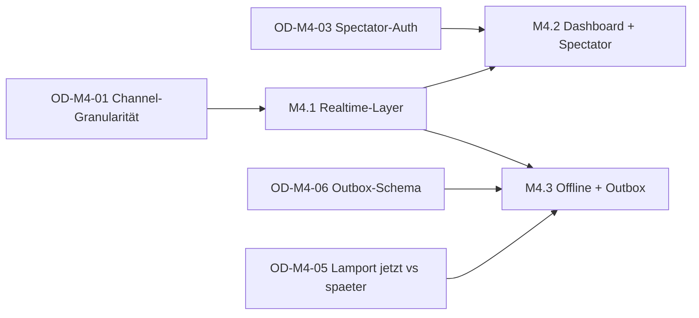

# M4 — Realtime + Live-Dashboard + Offline — Milestone-Plan

> Status: Entwurf, wartet auf Abnahme
> Datum: 2026-05-27
> Bezug: `architecture.md` (dieses Verzeichnis), `docs/plans/tournament-foundation/milestone-plan.md` §M4

## Überblick

M4 wird in drei Sub-Milestones zerlegt. Sequenziell, weil M4.2 die Realtime-Layer aus M4.1 als Voraussetzung hat und M4.3 den Lamport-Hydration-Pfad nutzt, den M4.1 vorbereitet.

| Sub-Milestone | Inhalt | Aufwand | Demobar |
|---|---|---|---|
| M4.1 | Realtime-Layer — Port + Adapter, Subscribe für Match-Liste/-Detail/Bracket, Reconnect, Polling-Fallback | 3–4 Tage | Ja, ohne neue Screens (bestehende Polling-Pfade werden Live) |
| M4.2 | Live-Dashboard + Spectator-View — Veranstalter-Übersicht, öffentliche Turnier-Sicht, anon-RLS | 3–4 Tage | Ja, vollständig |
| M4.3 | Offline + Sync-Outbox — drift-Outbox, Flusher, Lamport-Hydration, Server-Idempotenz | 3–4 Tage | Ja, vollständig |

Summe: 8–10 Tage Senior-Tempo (Faktor 0.8). Deckt sich mit dem Headline-Budget aus dem Tournament-Foundation-Plan (M4 8–10 Tage).

Owner-Abnahme zwischen den Sub-Milestones. M4.2 und M4.3 sind technisch unabhängig — könnten theoretisch parallel laufen, aber Senior-Disziplin empfiehlt Sequenz: M4.1 → M4.2 (am wertvollsten für Demo) → M4.3 (am riskantesten).

## M4.1 — Realtime-Layer (3–4 Tage)

Realtime ersetzt Polling für die drei wichtigsten Live-Pfade: Match-Liste, Match-Detail, Bracket-Advance.

### Tasks

| ID | Task | Grösse | Vorbedingung |
|---|---|---|---|
| M4.1-T1 | `RealtimeChannel`-Port in `packages/kubb_domain/lib/src/ports/realtime_channel.dart` plus `RealtimeChange`-Value-Type plus Tests gegen Fake-Adapter (TDD) | M | OD-M4-01 resolved |
| M4.1-T2 | `SupabaseRealtimeChannel`-Adapter in `lib/core/data/realtime/` — Channel-Sharing per Key, Exp-Backoff-Reconnect (1/2/4/8/30 s), `stateStream` | L | M4.1-T1 |
| M4.1-T3 | `TournamentRemote`-Erweiterung um `watchMatch`, `watchTournamentMatches`, `watchBracketAdvances` plus `BracketAdvanceEvent`-Value-Type | M | M4.1-T2 |
| M4.1-T4 | Riverpod-Provider `tournamentMatchListRealtimeProvider`, `tournamentMatchDetailRealtimeProvider`, `tournamentBracketRealtimeProvider` plus Polling-Fallback-Switch via Feature-Flag | M | M4.1-T3 |
| M4.1-T5 | Match-Detail-Screen + Match-List-Screen umstellen — Polling-Provider werden konditional aktiviert (nur wenn Channel `errored` oder Feature-Flag off) | S | M4.1-T4 |
| M4.1-T6 | Reconnect-Banner-Widget (`RealtimeStateBanner`) — zeigt "verbinde…" / "offline, Polling aktiv" / "live" je nach `stateStream` | S | M4.1-T4 |
| M4.1-T7 | `MatchEventRepository.watchEvents` Port-Erweiterung + Supabase-Adapter-Impl (Solo-Match-Stream, UI-seitig in M4 ungenutzt) | S | M4.1-T2 |
| M4.1-T8 | Integrations-Test `tournament_realtime_e2e_test.dart` — zwei Test-Phones, ein Score-Update auf A erscheint auf B in <1 s ohne Polling-Trigger | M | alle |

### Akzeptanz (Auswahl)

- Given Match-Detail-Screen ist offen When der Gegner per RPC einen Score vorschlägt Then der Screen aktualisiert sich in <1 s (LAN), ohne dass der Polling-Timer abgelaufen wäre.
- Given Live-Match-List ist offen When der Veranstalter ein neues Match einfügt (Round-Start) Then die Liste zeigt das Match in <2 s.
- Given Channel ist `joined` und der WLAN-Adapter wird deaktiviert When 5 s vergehen Then Channel-State ist `errored`, der Banner zeigt "Offline, Polling aktiv", Polling-Provider übernimmt.
- Given Channel ist `errored` und WLAN ist wieder verfügbar When Exp-Backoff-Reconnect erfolgreich Then Banner zeigt "Live", Polling-Provider wird deaktiviert.
- Given KO-Halbfinale wird finalisiert (via M2-Trigger `advance_ko_winner`) When die Bracket-Sicht offen ist Then der Final-Slot wird in <1 s animiert befüllt.

### FR-Coverage M4.1

- [FR-LIVE-2 Live-Bracket-Updates](../../specs/tournament-mode-spec.md#318-live-management-während-des-turniers-fr-live) — Realtime statt Polling.
- [FR-LIVE-9 Robustes Reconnect](../../specs/tournament-mode-spec.md#318-live-management-während-des-turniers-fr-live) — Exp-Backoff + Banner.

### Demobarkeit M4.1

Zwei Phones plus ein Tablet, ein bestehendes Round-Robin-Turnier aus M1-Setup. Phone A trägt einen Score ein → Phone B sieht den Vorschlag in <1 s, Tablet (Veranstalter-Liste) sieht den Status-Wechsel sofort. WLAN am Tablet aus → Banner "Polling aktiv", Tablet aktualisiert weiter mit 5 s Verzögerung. WLAN ein → Banner "Live" binnen 5 s. Demo-Dauer: 10 Min.

## M4.2 — Live-Dashboard + Spectator-View (3–4 Tage)

Zwei neue Read-only-Surfaces auf der Realtime-Layer aus M4.1.

### Tasks

| ID | Task | Grösse | Vorbedingung |
|---|---|---|---|
| M4.2-T1 | Migration `20260701000002_tournaments_public_flag.sql` — `tournaments.public bool DEFAULT true`, RLS-Policy `tournaments_public_read FOR SELECT TO anon` plus Policies für `tournament_matches`, `tournament_participants`, `tournament_set_scores` | L | OD-M4-03 resolved |
| M4.2-T2 | pgTAP — Anonymer Caller kann `SELECT` auf öffentlichen Turnieren, nicht auf `draft`. Anon kann nicht `UPDATE` / `INSERT` auf irgendeiner Tabelle | M | M4.2-T1 |
| M4.2-T3 | `tournamentLiveDashboardProvider.family<TournamentId>` — aggregiert aus `tournamentMatchListRealtimeProvider`, gruppiert nach `pitch_number`, berechnet Farbcodes | M | M4.1-T4 |
| M4.2-T4 | `tournament_live_dashboard_screen.dart` — Grid-Layout, eine Karte pro Pitch, Pull-to-Refresh, Klick → Match-Detail | L | M4.2-T3 |
| M4.2-T5 | Route `/tournaments/:id/live` plus Verlinkung im Veranstalter-Detail-Screen | S | M4.2-T4 |
| M4.2-T6 | `public_tournament_screen.dart` — öffentliche Route `/public/tournament/:id` mit drei Tabs (Spielplan / Rangliste / Bracket); nutzt bestehende Widgets im Read-only-Mode | L | M4.2-T1, M4.1-T4 |
| M4.2-T7 | `public_match_screen.dart` — minimale Read-only-Sicht auf Sets-Stand und Beteiligte | M | M4.2-T6 |
| M4.2-T8 | go_router-Anbindung für `/public/*`-Routen (nicht authentifiziert) plus Anon-Session-Bootstrap beim Public-Route-Hit | M | M4.2-T6 |
| M4.2-T9 | "Live-Modus"-Toggle auf `public_tournament_screen` — aktiviert Realtime-Subscribe für anonyme Zuschauer, sonst Polling alle 10 s (Scale-Mitigation per OD-M4-01) | S | M4.2-T6 |
| M4.2-T10 | l10n — DE-Strings für Live-Dashboard und Spectator-Screens | S | M4.2-T4..T7 |
| M4.2-T11 | Widget-Tests für Dashboard-Karten-Farblogik plus Snapshot-Tests für Public-Screens | M | M4.2-T4, M4.2-T7 |

### Akzeptanz (Auswahl)

- Given Veranstalter öffnet `/tournaments/:id/live` When ein Match auf Pitch 3 startet Then die Pitch-3-Karte wechselt von grau auf grün in <2 s.
- Given Match auf Pitch 5 ist `disputed` When der Veranstalter das Dashboard öffnet Then die Pitch-5-Karte ist rot mit Status-Text "strittig".
- Given Match-Status hat sich seit >2 min nicht geändert (Score-Stillstand) When das Dashboard rendert Then die Karte ist gelb.
- Given anonymer Browser ohne Login öffnet `/public/tournament/:id` für ein `published`-Turnier Then er sieht Spielplan, Rangliste, Bracket — alle Daten ohne Mutation.
- Given anonymer Browser öffnet `/public/tournament/:id` für ein `draft`-Turnier Then er sieht 404 / "nicht öffentlich".
- Given anonymer Browser versucht `tournament_propose_set_score` aufzurufen When RLS prüft Then `auth.uid() IS NULL` → 403.
- Given "Live-Modus" ist aus auf Public-Screen When ein Score aktualisiert wird Then Public-Screen rendert das in <11 s (Polling).
- Given "Live-Modus" ist an auf Public-Screen When ein Score aktualisiert wird Then Public-Screen rendert das in <2 s.

### FR-Coverage M4.2

- [FR-LIVE-1 Veranstalter-Live-Dashboard](../../specs/tournament-mode-spec.md#318-live-management-während-des-turniers-fr-live) — Pitches im Überblick mit Farbcode.
- [FR-PUB-1, FR-PUB-2, FR-PUB-3](../../specs/tournament-mode-spec.md#317-öffentliche-sichten-fr-pub) — öffentliche Sichten.
- [FR-PUB-11](../../specs/tournament-mode-spec.md#317-öffentliche-sichten-fr-pub) — Live-Updates in der öffentlichen Sicht.

Nicht abgedeckt in M4.2 (siehe `risks-and-deferrals.md`): FR-LIVE-5..-8 (Runden-Clock mit Pause/Verlängerung) — verschoben auf M4.4 / M5. FR-PUB-10 (Vollbild-Streaming-Sicht) — KANN, bleibt out of scope.

### Demobarkeit M4.2

Veranstalter-Tablet zeigt Live-Dashboard für laufendes 16-Team-Pool-Phase-Turnier aus M3. Vier Pitches grün, einer gelb (Stillstand), einer rot (`disputed`). Klick auf rote Karte → Match-Detail, Veranstalter löst Konflikt mit Override (M1-Pfad). Karte wird grün. Parallel öffnet ein Owner-Smartphone (ohne Login, Inkognito-Browser) `/public/tournament/:id` — sieht Spielplan und Rangliste live. Klick auf Bracket-Tab → KO-Bracket füllt sich animiert beim nächsten Match-Advance. Demo-Dauer: 15 Min.

## M4.3 — Offline + Sync-Outbox (3–4 Tage)

Pragmatische Offline-Toleranz für die Score-Eingabe. Score-Submissions werden lokal in drift gequeut und bei Reconnect serialisiert an den Server geflusht.

### Tasks

| ID | Task | Grösse | Vorbedingung |
|---|---|---|---|
| M4.3-T1 | drift-Tabelle `ScoreSubmissionOutbox` plus Migration in `app_database.dart` plus generierter DAO | M | — |
| M4.3-T2 | Migration `20260701000001_score_rpc_idempotency.sql` — `tournament_propose_set_score` plus zwei optionale Parameter `p_lamport_counter int`, `p_device_id text` plus Idempotency-Check via UNIQUE-Index auf `tournament_set_scores(match_id, consensus_round, set_index, submitter_user_id, lamport_counter, device_id)` | L | OD-M4-06 resolved |
| M4.3-T3 | pgTAP — Idempotenter Re-Submit gibt identischen `match` zurück ohne neue Set-Score-Row. Submit ohne Lamport-Felder funktioniert wie Legacy (keine Idempotency-Erkennung). | M | M4.3-T2 |
| M4.3-T4 | `TournamentRemote.proposeSetScoreWithLamport` Port-Methode plus Supabase-Adapter-Impl plus Fake-Adapter | M | M4.3-T2 |
| M4.3-T5 | `OutboxFlusher`-Komponente in `lib/core/application/` — Connectivity-Listener (per `connectivity_plus`), `queuedAt`-Order-Flush, Idempotenz-Retry-Loop, Konflikt-Marker | L | M4.3-T1, M4.3-T4 |
| M4.3-T6 | `tournament_repository.proposeSetScore` umstellen — schreibt zuerst in Outbox, ruft dann sofort den Flusher; bei online sofortiger Flush, bei offline gequeut | M | M4.3-T5 |
| M4.3-T7 | `LamportClock`-Hydration beim App-Start (`lamport_clock_provider.dart`) — liest MAX(`lamport_counter`) aus Outbox pro `(match_id, device_id)`, observed aus aktuellem Server-Stream falls verbunden, hält pro Match einen Clock | M | OD-M4-05 resolved, M4.3-T1 |
| M4.3-T8 | UI-Marker im Score-Eingabe-Screen — Indikator "ausstehend, wird übertragen" plus Konflikt-State "erneut eingeben" wenn Outbox `STALE_CONSENSUS_ROUND` reportet | M | M4.3-T5 |
| M4.3-T9 | Outbox-GC-Task — purge von `acknowledgedAt < now() - 30 days` beim App-Start | S | M4.3-T1 |
| M4.3-T10 | Integrations-Test `score_offline_sync_e2e_test.dart` — Flugmodus + 3 Set-Scores + Flugmodus aus + assert 3 Sets korrekt synchronisiert plus zweiter Flush ist No-Op (Idempotenz) | L | alle |
| M4.3-T11 | Property-Test in `kubb_domain` — `LamportClock` nach Hydration aus n Mock-Events liefert für n+1-ten Tick einen Counter > MAX | M | M4.3-T7 |

### Akzeptanz (Auswahl)

- Given Device ist offline und Spieler trägt Set-Score ein When Submit Then Outbox-Row mit `acknowledgedAt IS NULL` existiert, UI zeigt "ausstehend".
- Given Outbox hat 3 ungesendete Rows When Device wird online Then Flusher sendet sie in `queuedAt`-Order, alle 3 bekommen `acknowledgedAt`-Wert in <5 s.
- Given Outbox-Row wurde gesendet, Acknowledgement-Antwort geht verloren When Flusher die Row erneut sendet Then Server erkennt Idempotency (gleicher Lamport-Counter + Device-ID), keine Duplikat-Score-Row entsteht, Outbox-Row wird trotzdem ackd.
- Given Outbox-Row referenziert `consensus_round=1` und Server ist schon bei `consensus_round=2` When Flusher sendet Then Server liefert `ERRCODE 23514` mit `STALE_CONSENSUS_ROUND`, Outbox-Row wird mit `lastErrorCode` markiert, UI zeigt Konflikt-Marker.
- Given App-Start mit 2 ungesendeten Outbox-Rows When `LamportClock` hydratisiert Then der nächste `tick()` liefert Counter > MAX(Outbox-Counter).
- Given `acknowledgedAt` einer Outbox-Row ist 31 Tage alt When App startet Then GC löscht die Row.

### FR-Coverage M4.3

- [FR-LIVE-10 Offline-Toleranz](../../specs/tournament-mode-spec.md#318-live-management-während-des-turniers-fr-live).
- DSCORE-94..-104 (Score-Outbox-Spec aus `docs/specs/score-input-conflict-spec.md`).
- ADR-0006 Lamport-Hydration produktiv.
- ADR-0004 §"Pre-work" Punkt 5 (Realtime-Abstraktion) — durch M4.1 erfüllt, hier nicht erneut.

### Demobarkeit M4.3

Owner-Phone mit aktivem Match. Flugmodus aktivieren — drei Set-Scores eintragen — UI zeigt ausstehend. Flugmodus aus — Outbox flusht, Counter springen synchron auf Phone B (Gegner) hoch. Owner-Phone wird zweimal hintereinander online geschaltet (Flugmodus-On/Off in Sekunden) → keine Duplikate, Idempotenz greift. Demo-Dauer: 10 Min.

## Was nach M4 demobar ist

Vollständiger M4-Demo-Flow (kombiniert):

1. Veranstalter-Tablet auf Live-Dashboard für laufendes Pool-Phase-Turnier.
2. Vier Pitches grün, ein gelber (Stillstand), ein roter (`disputed`).
3. Owner öffnet anonymen Inkognito-Tab → `/public/tournament/:id`, sieht Spielplan, Rangliste, Bracket.
4. Spieler trägt Score auf Phone ein → Tablet und Public-Tab aktualisieren sich in <2 s.
5. Phone wird offline geschaltet, zwei weitere Set-Scores werden eingetragen → UI zeigt "ausstehend".
6. Phone wird wieder online → Outbox flusht, Tablet + Public-Tab rücken synchron mit.
7. KO-Halbfinale-Sieger wird finalisiert → Final-Bracket-Slot füllt sich animiert in beiden Sichten.

Demo-Dauer: 25–35 Min vollständig.

## Vergleich zur M0+M1+M2+M3-Cadence

- M0 — 5 Tage real bei 4–6 Tagen Schätzung (TDD-vor-Implementation hat Tempo gemacht).
- M1 — 9–12 Tage. Score-Eingabe-UI dickster Block.
- M2 — 8–10 Tage in drei Sub-Milestones — Sub-Milestone-Split hat geholfen.
- M3 — 10–14 Tage. Pool-Phase als Property-Parity-Pflicht war der Bottleneck.

M4 nimmt diese Cadence auf:

- M4.1 (Realtime) ist Adapter-Arbeit — die Komplexität ist im Reconnect-Verhalten und im Test-Doppel-Setup. Sollte 3–4 Tage tragen.
- M4.2 (Dashboard + Spectator) hat viele kleine UI-Stücke aber wenig Algorithmus. 3–4 Tage realistisch.
- M4.3 (Offline) ist algorithmisch der riskanteste Block. Lamport-Hydration plus Idempotency-Index plus Connectivity-Listener — viele Edge-Cases. 3–4 Tage knapp, könnte 5 brauchen.

Risiko: M4.3-T10 (Integrations-Test mit Flugmodus) ist schwer zu automatisieren. Manueller Smoke-Test reicht für Demo, automatischer Test wird L statt M.

## FR-Coverage M4

| FR | Beschreibung | abgedeckt in |
|---|---|---|
| FR-LIVE-1 | Veranstalter-Live-Dashboard | M4.2 |
| FR-LIVE-2 | Live-Bracket-Updates | M4.1 |
| FR-LIVE-9 | Robustes Reconnect | M4.1 |
| FR-LIVE-10 | Offline-Toleranz Score-Eingabe | M4.3 |
| FR-PUB-1 | Öffentliche Turnier-Sicht | M4.2 |
| FR-PUB-2 | Öffentliche Bracket-Sicht | M4.2 |
| FR-PUB-3 | Öffentliche Rangliste | M4.2 |
| FR-PUB-11 | Live-Updates in öffentlichen Sichten | M4.2 |
| DSCORE-94..-104 | Score-Outbox (Mobile-Pfad) | M4.3 |

Nicht abgedeckt:

- FR-LIVE-3..-8 (Runden-Clock mit Pause / Verlängerung / vorzeitigem Ende) — eigener Folge-Milestone "M4.4 Live-Management" oder M5. Begründung: Clock-Mechanik braucht eigenen Algorithmus (Pausen, Time-Outs, Notifications) und ist orthogonal zum Realtime-Layer.
- FR-NOT-1..-7 (Push-Notifications) — siehe OD-M4-04. Eigener Folge-Milestone "M4.5 Push" oder zusammen mit M5.
- FR-PUB-10 (Vollbild-Streaming-Sicht) — KANN, bleibt out of scope.

## Abhängigkeiten und Reihenfolge

Kritischer Pfad:

- OD-M4-01 (Channel-Granularität) muss vor M4.1-T1 entschieden sein — beeinflusst Port-Signatur.
- OD-M4-03 (Spectator-Auth) muss vor M4.2-T1 entschieden sein — beeinflusst RLS-Policy-Form.
- OD-M4-05 (Lamport-Aktivierung) muss vor M4.3-T7 entschieden sein — beeinflusst Hydration-Pfad.
- OD-M4-06 (Outbox-Schema) muss vor M4.3-T1 entschieden sein — beeinflusst drift-Tabelle.
- M4.2 ist hart gekoppelt an M4.1 (Realtime-Provider).
- M4.3 nutzt M4.1 nur indirekt (Idempotency-Re-Subscribe-Pfad), kann parallel laufen wenn Owner zwei Worker zuteilt. Default: sequenziell.
