# M4 — Sprint-Plan

> Stand: 2026-05-27
> Bezug: `milestone-plan.md`, `architecture.md`, `open-decisions.md` (alle 7 ODs resolved), `risks-and-deferrals.md`, ADR-0021, ADR-0022, ADR-0023, ADR-0004, ADR-0006, ADR-0015
> Tasks: `tasks.md` (atomare Liste)

## Zweck

Dieser Sprint-Plan zerlegt M4 (Realtime, Live-Dashboard + Spectator, Offline + Outbox) in drei Sub-Milestones und neun Waves. Jede Wave hat ein klares Eingangs- und Ausgangs-Gate. Innerhalb einer Wave laufen Tasks parallel; zwischen Waves wird gemergt.

## Resolved Open Decisions

Alle sieben ODs sind entschieden — die Task-Briefings referenzieren die jeweilige Empfehlung:

| OD | Resolution | Wirkung auf Tasks |
|---|---|---|
| OD-M4-01 | Per-Tournament-Channel (gefiltert auf `tournament_id`) | M4.1-T1 Port-Signatur `subscribe(table, filterColumn, filterValue)`; Match-Detail-Provider filtern clientseitig |
| OD-M4-02 | Polling-Fallback bleibt aktiv als Notfall (operative Resilience) | M4.1-T7 Polling-Provider-Switch im Code; M4.1-T8 Reconnect-Banner zeigt "Polling aktiv" |
| OD-M4-03 | Anonymes JWT mit Public-Read-RLS plus pro-Turnier `public`-Flag | M4.2-T1 Migration legt `tournaments.public bool DEFAULT true` an plus RLS-Policies `TO anon` |
| OD-M4-04 | Push-Scope ist eigener M4.5-Folge-Milestone, NICHT in M4 | Keine Push-Tasks in dieser Liste; Inbox-Items aus M3 decken In-App-Notification ab |
| OD-M4-05 | Lamport-Aktivierung wird in M4.3 produktiv (ADR-0006-Folgemassnahme) | M4.3-T2 Migration ergänzt `p_lamport_counter`, `p_device_id`; M4.3-T7 Hydration beim App-Start |
| OD-M4-06 | Eigene drift-Tabelle `score_submission_outbox` | M4.3-T1 drift-Table-Definition; Draft-Tabelle bleibt unverändert |
| OD-M4-07 | RLS-basierte Channel-Auth (kein ChannelAuthToken) | M4.1-T3 Adapter braucht nur Standard-JWT; M4.2-T1 RLS-Policy ist die Wahrheit |

## Sub-Milestones

### M4.1 — Realtime-Layer (Wave 1 bis 3, Tage 1–4)

**Demo-Akzeptanz**: Zwei Phones plus ein Tablet, ein bestehendes Round-Robin-Turnier aus M1/M3. Phone A trägt einen Score-Vorschlag ein — Phone B sieht ihn in <1 s LAN. Tablet (Match-Liste) zeigt den Status-Wechsel sofort. WLAN am Tablet aus → Banner "Polling aktiv", Tablet aktualisiert weiter mit 5 s Polling-Verzögerung. WLAN ein → Banner "Live" binnen 5 s, Polling-Provider deaktiviert sich. Integrations-Test `tournament_realtime_e2e_test.dart` grün. `flutter test test/features/tournament/realtime/` grün.

Inhalt: `RealtimeChannel`-Port + `RealtimeChange`-Value-Type + `FakeRealtimeChannel` (Test-Support), `SupabaseRealtimeChannel`-Adapter mit Reference-Counter und Exp-Backoff (1/2/4/8/30 s), `TournamentRemote`-Erweiterung um drei Watch-Methoden plus `BracketAdvanceEvent`, drei Realtime-Provider, Polling-Fallback-Switch via Channel-State, `RealtimeStateBanner`-Widget, Match-Detail/Match-List-Screen-Umstellung, `MatchEventRepository.watchEvents`-Port-Erweiterung plus Adapter.

### M4.2 — Live-Dashboard + Spectator-View (Wave 4 bis 6, Tage 5–8)

**Demo-Akzeptanz**: Veranstalter-Tablet zeigt Live-Dashboard für laufendes 16-Team-Pool-Phase-Turnier aus M3. Vier Pitches grün, einer gelb (Stillstand), einer rot (`disputed`). Klick auf rote Karte → Match-Detail, Veranstalter löst Konflikt per Override (M1-Pfad). Karte wird grün. Parallel öffnet ein Owner-Smartphone (ohne Login, Inkognito-Browser) `/public/tournament/:id` — sieht Spielplan, Rangliste, Bracket. Klick auf Bracket-Tab → KO-Bracket füllt sich animiert beim nächsten Match-Advance. pgTAP-Tests für Anon-RLS grün (`public=true` lesbar, `public=false` nicht lesbar, anon kann nicht schreiben). Widget-Tests Dashboard-Farblogik grün.

Inhalt: Migration `20260701000002_tournaments_public_flag.sql` (Spalte + vier RLS-Policies), pgTAP-Anon-Lese-/Schreib-Tests, `tournamentLiveDashboardProvider`, `tournament_live_dashboard_screen.dart` (Grid mit Farbcodes), Route `/tournaments/:id/live`, `public_tournament_screen.dart` mit drei Tabs (Spielplan/Rangliste/Bracket), `public_match_screen.dart`, go_router-Anbindung für `/public/*` plus Anon-Session-Bootstrap, Live-Modus-Toggle (Default aus für Anon, Polling alle 10 s), l10n DE.

### M4.3 — Offline + Sync-Outbox (Wave 7 bis 9, Tage 9–12)

**Demo-Akzeptanz**: Owner-Phone mit aktivem Match aus M1/M3. Flugmodus an → drei Set-Scores eintragen → UI zeigt "ausstehend, wird übertragen". Flugmodus aus → Outbox flusht in `queuedAt`-Order, Counter springen auf Phone B (Gegner) synchron hoch. Owner-Phone wird zweimal hintereinander Online/Offline geschaltet → keine Duplikate (Idempotenz greift). Manueller `STALE_CONSENSUS_ROUND`-Smoke: Phone A queued offline einen Score während Phone B schon zur nächsten Konsens-Runde gegangen ist → Konflikt-Banner mit "erneut eingeben". `score_offline_sync_e2e_test.dart` grün. Property-Test `LamportClock`-Hydration grün. pgTAP-Idempotency-Test grün.

Inhalt: drift-Tabelle `ScoreSubmissionOutbox` + DAO + Schema-Bump, Migration `20260701000001_score_rpc_idempotency.sql` (zwei optionale Parameter + UNIQUE-Index), pgTAP-Idempotency-Test, `TournamentRemote.proposeSetScoreWithLamport` Port + Supabase- und Fake-Adapter, `OutboxFlusher`-Komponente (Connectivity-Listener, Order-Flush, Konflikt-Marker), `LamportClock`-Hydration-Provider, `connectivity_plus`-Wrapper, Repository-Umstellung auf Outbox-Write, UI-Marker für pending/conflict, Offline-Banner, Outbox-GC (Retention 30 Tage), Demo-Script.

## Senior-Disziplin

- **TDD-Pflicht im Domain und für Conflict-Resolver/Outbox-Flush**: Test-Task in vorgelagerter Wave definiert die Public-API. Impl-Task macht die roten Tests grün. Betrifft konkret M4.1-T1/T2 (Port + Fake), M4.3-T4 (`LamportClock`-Hydration-Tests vor T7-Impl), M4.3-T6 (OutboxFlusher-Tests vor Impl-Wave). 
- **Senior-Sizing**: max 100 LOC, max 3 Files, max 1h netto pro Task. Verstoss → Splitten.
- **Conventional Commits**: Task-ID in Commit-Message (`feat(realtime): TASK-M4.1-T3 add supabase channel adapter`).
- **Wave-Paralleltritt**: Tasks in derselben Wave dürfen sich nicht gegenseitig blocken. Worker laufen in eigenen Worktrees, Cherry-pick + Merge nach Wave-Ende.
- **Contract-Sharing zwischen Waves**: Wave-N-Tasks zitieren in `Notes` den Contract (Port-Signatur, RPC-Signatur, drift-Spalten) aus Wave-(N-1)-Vorgängern, damit der Impl-Worker nicht raten muss. Kritische Contracts in diesem Sprint:
  - **`RealtimeChannel`-Port-Contract** zwischen M4.1-T1 (Port + Tests) und M4.1-T3 (Supabase-Adapter) bzw. M4.1-T2 (Fake-Adapter): Method-Signaturen aus `architecture.md` §3.1 (Code-Block) sind verbindlicher Contract.
  - **`TournamentRemote`-Erweiterung** zwischen M4.1-T4 (Port-Methoden) und M4.1-T6/T7 (Provider): Signaturen aus `architecture.md` §3.5 verbindlich.
  - **`tournaments.public` Schema-Contract** zwischen M4.2-T1 (Migration) und M4.2-T4 (Dashboard-Provider) bzw. M4.2-T8 (Public-Screen): Spalten-Default und RLS-Policy-Form in Notes von T1.
  - **`ScoreSubmissionOutbox` drift-Schema-Contract** zwischen M4.3-T1 (Table-Definition) und M4.3-T6 (Flusher) bzw. M4.3-T9 (Repository): Spalten + UNIQUE-Index in Notes von T1.
  - **`proposeSetScoreWithLamport`-RPC-Contract** zwischen M4.3-T2 (Migration) und M4.3-T5 (Port + Adapter): Parameter-Namen, Idempotency-Tupel, Return-Shape in Notes von T2.
  - **`LamportClock`-Hydration-Contract** zwischen M4.3-T4 (Property-Tests) und M4.3-T7 (Provider-Impl): Public-API (`hydrateFromOutbox(matchId, deviceId)`, `observeFromStream(...)`) liegt in Test-Datei und ist verbindlich.
- **Bestehende Polling-Provider bleiben unverändert** — werden in M4.1-T7 nur conditional aktiviert. Kein Lösch-Patch in M4.

## Wave-Plan

### Wave 1 (M4.1, Tag 1) — Test-First Port + Fake-Adapter

- T1: `RealtimeChannel`-Port in `packages/kubb_domain/lib/src/ports/realtime_channel.dart` plus `RealtimeChange`/`RealtimeEventType`/`RealtimeChannelState`-Value-Types
- T2: `FakeRealtimeChannel` in `packages/kubb_domain/lib/src/test_support/` plus Tests (`fake_realtime_channel_test.dart`) — In-Memory-StreamController, emittiert manuell injizierte Events
- T3: `BracketAdvanceEvent`-Value-Type in `packages/kubb_domain/lib/src/tournament/`

T1 und T3 unabhängig (verschiedene Files). T2 hängt auf T1 (implementiert die Port-Schnittstelle).

### Wave 2 (M4.1, Tag 2) — Supabase-Adapter + Port-Erweiterung

- T4: `SupabaseRealtimeChannel`-Adapter in `lib/core/data/realtime/supabase_realtime_channel.dart` — Reference-Counter pro Key, Exp-Backoff-Reconnect (1/2/4/8/30 s), 500 ms Debounce vor finalem Close
- T5: `TournamentRemote`-Port-Erweiterung um `watchMatch`, `watchTournamentMatches`, `watchBracketAdvances` (Interface-Datei in `packages/kubb_domain/lib/src/ports/tournament_remote.dart`)
- T6: `MatchEventRepository.watchEvents`-Port-Erweiterung (Interface in `packages/kubb_domain/lib/src/ports/match_event_repository.dart`)
- T7: Adapter-Smoke-Test `supabase_realtime_channel_test.dart` — Reference-Counter-Increment/Decrement, Backoff-Timing (mit FakeClock), Debounce-Verhalten

T4 hängt auf T1 (Port-Iface). T5 hängt auf T1 plus T3 (`BracketAdvanceEvent`). T6 hängt auf T1. T7 hängt auf T4.

### Wave 3 (M4.1, Tag 3–4) — Provider + UI + Polling-Switch + e2e

- T8: `tournamentMatchListRealtimeProvider.family<TournamentId>` plus `tournamentMatchDetailRealtimeProvider.family<TournamentMatchId>` plus `tournamentBracketRealtimeProvider.family<TournamentId>` in `lib/features/tournament/application/tournament_realtime_provider.dart`
- T9: `SupabaseTournamentRemote`-Impl der drei neuen `watch*`-Methoden plus `FakeTournamentRemote`-Impl plus Adapter-Impl von `MatchEventRepository.watchEvents`
- T10: Polling-Fallback-Switch — Polling-Provider werden conditional aktiviert (nur wenn Channel `errored` oder Feature-Flag `realtime_enabled=false`); Switch in `lib/features/tournament/application/realtime_fallback_provider.dart` (neu)
- T11: `RealtimeStateBanner`-Widget in `lib/features/tournament/presentation/widgets/` plus Einbindung in Tournament-Detail/Match-Detail-Screen-Header (zeigt "verbinde…" / "offline, Polling aktiv" / "live" je nach `stateStream`)
- T12: Match-Detail-Screen und Match-List-Screen umstellen — neue Realtime-Provider konsumieren statt direkter Polling-Provider; Polling-Switch aus T10 als Fallback
- T13: l10n DE-Strings für Banner (`realtimeLive`, `realtimePolling`, `realtimeConnecting`)
- T14: Integrations-Test `tournament_realtime_e2e_test.dart` — zwei Test-Phones (FakeRealtimeChannel mit injizierten Events), Score-Update auf A erscheint auf B in <1 s ohne Polling-Trigger; plus Reconnect-Smoke (Channel `errored` → Polling-Provider aktiv → Channel `joined` → Polling deaktiviert)

T8 hängt auf T5. T9 hängt auf T5/T6 plus T4. T10 hängt auf T8. T11 hängt auf T4 (`stateStream`) plus T8. T12 hängt auf T8/T10/T11. T13 hängt auf T11. T14 hängt auf alle Code-Tasks der Wave.

### Wave 4 (M4.2, Tag 5) — Public-RLS-Migration + Anon-Tests

- T1: Migration `20260701000002_tournaments_public_flag.sql` — Spalte `tournaments.public bool DEFAULT true`, RLS-Policy `tournaments_public_read FOR SELECT TO anon USING (public = true AND status IN (...))`, analoge `FOR SELECT TO anon`-Policies für `tournament_matches`, `tournament_participants`, `tournament_set_scores`; View `public_tournament_roster_view` (nur display_name, kein E-Mail)
- T2: pgTAP-Tests `public_rls_test.sql` — drei Pflicht-Fälle (anon liest `public=true`, anon liest NICHT `public=false`, anon kann nicht UPDATE/INSERT auf den vier Tabellen)
- T3: Anon-Session-Bootstrap in `lib/core/data/supabase/anon_session.dart` (neu) — beim ersten Public-Route-Hit `signInAnonymously()` oder Token-Refresh, gespeichert in `flutter_secure_storage`

T1 isolierte Migration. T2 hängt auf T1. T3 ist unabhängig (eigenes File), wird in Wave 6 von Public-Routes konsumiert.

### Wave 5 (M4.2, Tag 6) — Live-Dashboard für Veranstalter

- T4: `tournamentLiveDashboardProvider.family<TournamentId>` in `lib/features/tournament/application/tournament_live_dashboard_provider.dart` — aggregiert aus `tournamentMatchListRealtimeProvider`, gruppiert nach `pitch_number`, berechnet Farbcodes (grau/grün/gelb/rot per Status + Idle-Timeout)
- T5: `tournament_live_dashboard_screen.dart` in `lib/features/tournament/presentation/` — Grid-Layout, Pitch-Card-Widget, Pull-to-refresh erzwingt Re-Subscribe, Klick → bestehender Match-Detail-Screen
- T6: Route `/tournaments/:id/live` in `lib/app/router.dart` plus Button im Veranstalter-Tournament-Detail-Screen ("Live-Dashboard öffnen")
- T7: Widget-Tests `tournament_live_dashboard_screen_test.dart` — Farblogik (vier Status-Permutationen), Pitch-Karte-Layout-Snapshot, FakeRealtimeChannel injiziert Match-Updates

T4 hängt auf M4.1 Wave-3 (T8). T5 hängt auf T4. T6 hängt auf T5. T7 hängt auf T5 plus T4 (FakeRealtimeChannel aus M4.1 Wave-1).

### Wave 6 (M4.2, Tag 7–8) — Public-Spectator-Screens + Toggle + l10n

- T8: `public_tournament_screen.dart` in `lib/features/tournament/presentation/public/` — drei Tabs (Spielplan/Rangliste/Bracket), nutzt bestehende Widgets im Read-only-Mode
- T9: `public_match_screen.dart` in `lib/features/tournament/presentation/public/` — minimale Read-only-Sicht auf Sets-Stand und Beteiligte (ohne Eingabe)
- T10: go_router-Anbindung für `/public/tournament/:id` und `/public/match/:matchId` plus Trigger Anon-Session-Bootstrap aus T3 beim ersten Public-Route-Hit
- T11: Live-Modus-Toggle auf `public_tournament_screen` — Default AUS für Anon (Scale-Mitigation R-M4.2-3), bei AUS Polling alle 10 s; bei AN aktiviert Realtime-Subscribe via Provider aus T8 (M4.1)
- T12: l10n DE-Strings für M4.2-Screens (`publicTournamentSchedule`, `publicTournamentStandings`, `publicTournamentBracket`, `liveDashboardTitle`, `liveModeToggle`, etc.) plus Status-Texte "läuft", "strittig", "Stillstand"
- T13: Widget/Snapshot-Tests `public_tournament_screen_test.dart` und `public_match_screen_test.dart` — Read-only-Verhalten, Anon-JWT-Bootstrap-Mock, Live-Modus-Toggle schaltet Provider

T8 hängt auf M4.1 Wave-3 (T8 — `tournamentMatchListRealtimeProvider`). T9 hängt auf T8 (gemeinsame Layout-Bausteine). T10 hängt auf T8/T9 plus T3 (Anon-Bootstrap). T11 hängt auf T8 plus M4.1-T8. T12 hängt auf T5/T8/T9. T13 hängt auf T8/T9/T11.

### Wave 7 (M4.3, Tag 9) — Outbox-Schema + RPC-Idempotency + Lamport-Tests

- T1: drift-Tabelle `ScoreSubmissionOutbox` in `lib/core/data/tables/score_submission_outbox.dart` plus drift-Migration in `app_database.dart` plus generierter DAO (`score_submission_outbox_dao.dart`)
- T2: Migration `20260701000001_score_rpc_idempotency.sql` — Erweiterung von `tournament_propose_set_score` um optionale Parameter `p_lamport_counter int`, `p_device_id text`; UNIQUE-Index auf `tournament_set_scores(match_id, consensus_round, set_index, submitter_user_id, lamport_counter, device_id)`; Idempotency-Check via `ON CONFLICT … DO NOTHING` plus Return-existing-Match
- T3: pgTAP-Tests `score_rpc_idempotency_test.sql` — Re-Submit mit gleichem Tupel gibt identischen Match zurück ohne neue Set-Score-Row; Submit ohne Lamport-Felder funktioniert wie Legacy (keine Idempotency-Erkennung)
- T4: Property-Tests `lamport_clock_hydration_test.dart` in `packages/kubb_domain/test/values/` — `LamportClock.hydrateFromOutbox(matchId, deviceId)` Test-Contract: nach Hydration aus n Mock-Outbox-Counter-Werten liefert nächster `tick()` Counter > MAX
- T5: Property-Tests `outbox_flusher_test.dart` (Test-First) in `lib/core/application/` — Order-Flush nach `queuedAt`, Idempotency-Retry-Loop bei Network-Error, Konflikt-Marker-Pfad bei `STALE_CONSENSUS_ROUND`

T1 unabhängig (drift-File). T2 unabhängig (SQL-Migration). T3 hängt auf T2. T4 unabhängig (Pure-Domain-Test). T5 unabhängig (Test-First, definiert Public-API für T9 in Wave 8).

### Wave 8 (M4.3, Tag 10) — Port + Adapter + Flusher + Connectivity

- T6: `TournamentRemote.proposeSetScoreWithLamport` Port-Methode in `packages/kubb_domain/lib/src/ports/tournament_remote.dart` plus `SupabaseTournamentRemote`-Impl plus `FakeTournamentRemote`-Impl
- T7: `OutboxFlusher`-Komponente in `lib/core/application/outbox_flusher.dart` — Singleton-Provider, `queuedAt`-Order-Flush, Retry-Loop, `lastErrorCode`-Marking bei `STALE_CONSENSUS_ROUND`; macht T5-Property-Tests grün
- T8: `LamportClock`-Hydration-Provider in `lib/features/match/application/lamport_clock_provider.dart` — `hydrateFromOutbox(matchId, deviceId)` plus `observeFromStream(stream)` (per ADR-0006); macht T4-Property-Tests grün
- T9: `connectivity_plus`-Wrapper in `lib/core/data/connectivity/connectivity_service.dart` — abstrahiert `connectivity_plus` hinter eigenem `ConnectivityService`-Port, eigener Fake für Tests; plus Pubspec-Eintrag `connectivity_plus: ^x.y.z`

T6 hängt auf T2 (RPC-Signatur-Contract). T7 hängt auf T1 plus T6 plus T9 plus T5 (rote Tests). T8 hängt auf T1 plus T4 (rote Tests). T9 unabhängig (Wrapper-File + pubspec).

### Wave 9 (M4.3, Tag 11–12) — Repository-Integration + UI + GC + e2e + Demo

- T10: `tournament_repository.proposeSetScore` umstellen — schreibt zuerst in Outbox (T1), ruft dann sofort `OutboxFlusher` (T7); bei online sofortiger Flush, bei offline gequeut; alte Direkt-Pfad-Methode wird entfernt
- T11: UI-Marker im Score-Eingabe-Screen — Indikator "ausstehend, wird übertragen" bei Outbox-Row ohne `acknowledgedAt`; Konflikt-State "Vorschlag konnte nicht übertragen werden — bitte erneut eingeben" wenn `lastErrorCode='STALE_CONSENSUS_ROUND'` (siehe R-M4.3-3-Mitigation)
- T12: Offline-Banner-Widget in `lib/features/tournament/presentation/widgets/` — global im App-Scope sichtbar wenn `ConnectivityService.isOffline=true`; zeigt Outbox-Queue-Size
- T13: Outbox-GC-Task in `lib/core/application/outbox_gc_task.dart` — beim App-Start `DELETE FROM score_submission_outbox WHERE acknowledged_at < now() - 30 days`
- T14: l10n DE-Strings für M4.3 (`scorePending`, `scoreConflictReenter`, `offlineBannerQueueSize`, etc.)
- T15: Integrations-Test `score_offline_sync_e2e_test.dart` — FakeConnectivityService simuliert offline, drei Set-Scores eintragen, online schalten, assert drei Sets korrekt synchronisiert plus zweiter Flush ist No-Op (Idempotenz)
- T16: Demo-Script `docs/plans/m4-realtime-dashboard-offline/demo-script.md` für Owner-Abnahme (Full-Flow nach §11 in `architecture.md`) plus Pre-Demo-Checklist (Web-Build, Realtime-Connect, Flugmodus-Toggle)

T10 hängt auf T1/T7. T11 hängt auf T1/T7 (Outbox-Row-Schema). T12 hängt auf T9 plus T1 (DAO für Queue-Size). T13 hängt auf T1. T14 hängt auf T11/T12. T15 hängt auf alle Code-Tasks. T16 ist Doku, hängt logisch auf alle Sub-Milestones.

## Mermaid-Dependency-Graph

```mermaid
graph LR
    %% Wave 1 - M4.1 port + fake
    W1T1[T1 realtime port + values]
    W1T2[T2 fake adapter + tests]
    W1T3[T3 bracket advance event]

    %% Wave 2 - adapter + port extensions
    W2T4[T4 supabase channel adapter]
    W2T5[T5 tournament remote watch ext]
    W2T6[T6 match event repo watch ext]
    W2T7[T7 adapter smoke tests]

    %% Wave 3 - providers + ui + e2e
    W3T8[T8 realtime providers]
    W3T9[T9 supabase + fake remote impls]
    W3T10[T10 polling fallback switch]
    W3T11[T11 realtime state banner]
    W3T12[T12 screen migration]
    W3T13[T13 banner l10n]
    W3T14[T14 realtime e2e test]

    %% Wave 4 - public rls migration
    W4T1[T1 public flag migration]
    W4T2[T2 anon rls pgTAP]
    W4T3[T3 anon session bootstrap]

    %% Wave 5 - dashboard
    W5T4[T4 dashboard provider]
    W5T5[T5 dashboard screen]
    W5T6[T6 dashboard route + entry]
    W5T7[T7 dashboard widget tests]

    %% Wave 6 - public spectator
    W6T8[T8 public tournament screen]
    W6T9[T9 public match screen]
    W6T10[T10 public router + anon bootstrap]
    W6T11[T11 live mode toggle]
    W6T12[T12 public l10n]
    W6T13[T13 public widget tests]

    %% Wave 7 - outbox + idempotency + lamport tests
    W7T1[T1 outbox drift table + dao]
    W7T2[T2 score rpc idempotency mig]
    W7T3[T3 idempotency pgTAP]
    W7T4[T4 lamport hydration tests]
    W7T5[T5 outbox flusher tests]

    %% Wave 8 - port + adapter + flusher
    W8T6[T6 propose lamport port + adapters]
    W8T7[T7 outbox flusher impl]
    W8T8[T8 lamport hydration provider]
    W8T9[T9 connectivity wrapper]

    %% Wave 9 - repo + ui + gc + e2e + demo
    W9T10[T10 tournament repo outbox write]
    W9T11[T11 pending + conflict marker ui]
    W9T12[T12 offline banner]
    W9T13[T13 outbox gc task]
    W9T14[T14 m43 l10n]
    W9T15[T15 offline sync e2e]
    W9T16[T16 demo script]

    %% M4.1 internal deps
    W1T1 --> W1T2
    W1T1 --> W2T4
    W1T1 --> W2T5
    W1T3 --> W2T5
    W1T1 --> W2T6
    W2T4 --> W2T7
    W2T5 --> W3T8
    W2T5 --> W3T9
    W2T6 --> W3T9
    W2T4 --> W3T9
    W3T8 --> W3T10
    W2T4 --> W3T11
    W3T8 --> W3T11
    W3T8 --> W3T12
    W3T10 --> W3T12
    W3T11 --> W3T12
    W3T11 --> W3T13
    W3T8 --> W3T14
    W3T9 --> W3T14
    W3T10 --> W3T14
    W3T11 --> W3T14
    W3T12 --> W3T14

    %% M4.2 internal + cross deps to M4.1
    W4T1 --> W4T2
    W3T8 --> W5T4
    W5T4 --> W5T5
    W5T5 --> W5T6
    W5T5 --> W5T7
    W5T4 --> W5T7
    W3T8 --> W6T8
    W6T8 --> W6T9
    W6T8 --> W6T10
    W6T9 --> W6T10
    W4T3 --> W6T10
    W6T8 --> W6T11
    W3T8 --> W6T11
    W5T5 --> W6T12
    W6T8 --> W6T12
    W6T9 --> W6T12
    W6T8 --> W6T13
    W6T9 --> W6T13
    W6T11 --> W6T13
    W4T1 --> W6T8
    W4T1 --> W6T9

    %% M4.3 internal deps
    W7T2 --> W7T3
    W7T2 --> W8T6
    W7T1 --> W8T7
    W8T6 --> W8T7
    W8T9 --> W8T7
    W7T5 --> W8T7
    W7T1 --> W8T8
    W7T4 --> W8T8
    W7T1 --> W9T10
    W8T7 --> W9T10
    W7T1 --> W9T11
    W8T7 --> W9T11
    W8T9 --> W9T12
    W7T1 --> W9T12
    W7T1 --> W9T13
    W9T11 --> W9T14
    W9T12 --> W9T14
    W9T10 --> W9T15
    W9T11 --> W9T15
    W9T12 --> W9T15
    W8T7 --> W9T15
    W8T8 --> W9T15
    W9T15 --> W9T16

    %% cross-sub gates
    W3T14 --> W4T1
    W6T13 --> W7T1
```

## Kritische Pfade

1. **`RealtimeChannel`-Port M4.1-T1** ist Bottleneck der gesamten M4. Alle Adapter (T2, T4), alle Port-Erweiterungen (T5, T6) und alle Provider (T8) hängen daran. Muss in Wave 1 zuverlässig landen — Test-First-Disziplin in T2 sichert das ab.
2. **`SupabaseRealtimeChannel`-Adapter M4.1-T4** ist der eine Code-Pfad, der Supabase wirklich anfasst. Reference-Counter und Backoff-Timing sind die häufigsten Fehlerquellen (siehe R-M4.1-2). Wenn T4 wackelt, kippt Wave 3 komplett, weil Realtime-Provider auf einem instabilen Adapter sitzen.
3. **Public-RLS-Policy M4.2-T1** ist sicherheitskritisch (R-M4.2-1). Wenn T2-pgTAP rot ist, wird kein einziger Public-Screen merged. Drei Test-Fälle (anon liest `public=true`, anon liest NICHT `public=false`, anon schreibt nicht) sind Pflicht-Gate.
4. **`tournament_propose_set_score` Migration M4.3-T2** ist der Server-Idempotency-Anker. Wenn UNIQUE-Index falsch (z.B. `consensus_round` vergessen), gehen Duplikate durch. T3-pgTAP-Test (Re-Submit-No-Op) ist Merge-Gate für M4.3.
5. **drift-Migration M4.3-T1** ist nicht-trivial in einem ausgelieferten App-Bestand (R-M4.3-1). Additiv via `CREATE TABLE IF NOT EXISTS`, Migration-Test mit alter DB-Fixture im Wave-7-Task vorgesehen. Wenn das wackelt, wird T1 von M auf L.
6. **`OutboxFlusher`-Komponente M4.3-T7** ist algorithmisch der komplexeste Block der M4. Connectivity-Listener + Retry-Loop + Konflikt-Marker. Test-First in T5 (Wave 7) ist Pflicht — Impl-Worker in Wave 8 macht die roten Tests grün.
7. **`LamportClock`-Hydration M4.3-T8** verlangt ADR-0006-Aktivierung. Wenn Test-Contract in T4 falsch (z.B. `observeFromStream` vergessen), kippen alle nachgelagerten Outbox-Tests. Property-Test-First in Wave 7 ist Pflicht.
8. **Single-File-Risiko `lib/app/router.dart`**: M4.2-T6 (Dashboard-Route) und M4.2-T10 (Public-Routes) ändern beide diese Datei. Sequenzielle Bearbeitung innerhalb Wave 5/6 oder route-helper-Pattern (separate Files für Route-Definitionen) — Wave-Worker müssen das im Wave-Merge berücksichtigen.

## Empfohlene Reihenfolge der Waves

Sequenziell von Wave 1 bis Wave 9. Owner-Abnahme-Punkte:

- Nach Wave 3: M4.1-Demo (Realtime ersetzt Polling in bestehenden Screens, Reconnect-Banner sichtbar).
- Nach Wave 6: M4.2-Demo (Live-Dashboard + Public-Spectator).
- Nach Wave 9: M4.3-Demo + voller M4-End-to-End-Flow.

Optionaler Speedup: Wave 7 (Outbox-Tests + drift-Schema + Migration) ist technisch unabhängig von M4.2 (nur ADR-0006 plus Server-RPC). Wenn Owner Team-Resourcing zulässt, könnten Wave 7 (Tests + Schema) parallel zu Wave 4/5 laufen — dokumentierte Wave-Verschachtelung. Default bleibt sequenziell (Senior-Disziplin, Owner-Abnahme nach jedem Sub-Milestone).

## Vergleich zur M0+M1+M2+M3-Cadence

- M0 — 5 Tage real bei 4–6 Tagen Schätzung. TDD-vor-Implementation hat Tempo gemacht.
- M1 — 9–12 Tage. Score-Eingabe-UI dickster Block.
- M2 — 8–10 Tage in drei Sub-Milestones — Sub-Milestone-Split hat Cadence gerettet.
- M3 — 10–14 Tage in elf Waves. Pool-Phase-Property-Parität war Bottleneck.
- **M4 — 8–12 Tage in neun Waves**. Realtime-Adapter-Komplexität (Reconnect, Channel-Sharing) und Outbox-Algorithmik (Lamport-Hydration, Flusher-Retry-Loop) treiben die obere Schätzung. M4.2 ist UI-lastig aber algorithmisch arm — schneller als die anderen Sub-Milestones.

Vergleichbares Risikoprofil zu M3: drei Sub-Milestones, drei Demo-Stops, ein algorithmischer Block (M3.3 Pool-Phase ↔ M4.3 Outbox + Lamport). Cadence-Disziplin: jeder Sub-Milestone hat ein eigenes Demo, Owner kann nach jedem abnehmen, Pausen sind absorbierbar.

## Out of Scope (zur Klarstellung)

- **Push-Notifications** (OD-M4-04): eigener Folge-Milestone M4.5. Nicht in dieser Task-Liste.
- **Runden-Clock mit Pause / Verlängerung** (FR-LIVE-5..-8): M4.4 oder M5.
- **Pro-Wurf-Events**: bleibt out of scope (ADR-0014).
- **Vollbild-Streaming-Sicht** (FR-PUB-10 KANN): nicht priorisiert.
- **Cross-Tournament-Spectator-Übersicht**: out of scope.
- **Realtime für Roster-Änderungen**: Polling reicht, nicht priorisiert.
- **iOS / Linux / Windows**: bleibt Android-only auf Mobile (ADR-0015). Web wird mit M4.2 Pflicht (Spectator-Path).
- **Konflikt-Auto-Merge für Outbox-Konflikte**: widerspricht Drei-Versuche-Konsens, nicht priorisiert.
- **Solo-Match-Live-Multi-Device-UI**: Port-Erweiterung (`MatchEventRepository.watchEvents`) wird gemacht, UI-Konsum erst M5+.

## Quality-Gates (per Sub-Milestone)

| Gate | Sub-Milestone | Bedingung |
|---|---|---|
| G1 | M4.1 | `flutter test test/features/tournament/realtime/` grün, `tournament_realtime_e2e_test.dart` grün, Reconnect-Banner verifiziert im manuellen Smoke (WLAN-Drop), Polling-Fallback springt nach 60 s an, Adapter-Smoke-Test (Reference-Counter + Backoff-Timing) grün |
| G2 | M4.2 | pgTAP-Anon-RLS-Tests (drei Fälle) grün, Dashboard-Widget-Tests (Farblogik vier Permutationen) grün, Public-Screen-Snapshot-Tests grün, manueller Inkognito-Browser-Smoke für `/public/tournament/:id` (Web-Build vorausgesetzt — siehe R-M4-G1), Live-Modus-Toggle Default-AUS verifiziert |
| G3 | M4.3 | pgTAP-Idempotency-Test grün, Property-Tests `LamportClock`-Hydration grün, Property-Tests `OutboxFlusher` grün, drift-Migration-Test gegen alte DB-Fixture grün, `score_offline_sync_e2e_test.dart` grün, manueller Flugmodus-Smoke (3 Scores offline → online → Idempotency-Re-Flush), Demo-Script am Tablet/Phone abgearbeitet |

## Senior-Cadence

Insgesamt 12 Tage Senior-Tempo (Faktor 0.8). Über 12 Tage gestreckt entspricht das ca. 9.6 effektiven Personentagen — im Rahmen der Headline-Schätzung 8–10 Tage aus `milestone-plan.md` (oberes Ende, weil Lamport-Aktivierung + drift-Migration als L statt M zu erwarten sind). M4.1 ist 4 Tage (3 Waves), M4.2 ist 4 Tage (3 Waves), M4.3 ist 4 Tage (3 Waves). Symmetrische Cadence, im Gegensatz zu M3 (5/4/5).
