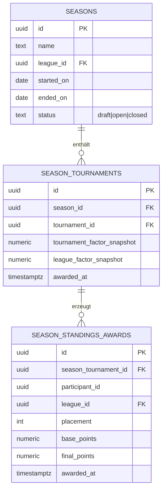
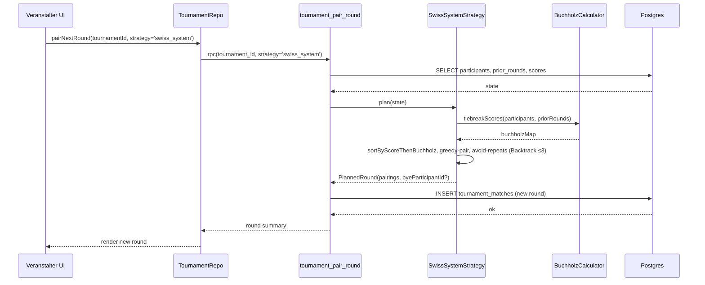

# M5 — Schweizer System + Liga-Punkte + Saisontabelle — Architektur

> Status: Entwurf, wartet auf Abnahme
> Datum: 2026-05-27
> Bezug: `docs/specs/tournament-mode-spec.md` §3.6 (FR-FMT-4), §3.7 (FR-PAIR-1..-8), §3.14 (FR-POINTS), §3.15 (FR-GLB); `docs/plans/m4-realtime-dashboard-offline/architecture.md`; `packages/kubb_domain/lib/src/tournament/pairing.dart` (M0-Platzhalter); ADR-0004, ADR-0006.

## 1. Übersicht

M5 macht aus der Einzelturnier-Plattform aus M1–M4 ein Liga-System: das Schweizer-System wird als neue Paarungsstrategie produktiv (FR-FMT-4), die Liga-Punkte-Formel (FR-POINTS-1) wird pro Turnier ausgewertet, und ein neuer `season/`-Kontext aggregiert Liga-Punkte über mehrere Turniere zur Saisontabelle (FR-GLB). Der `tournament/`-Kontext bleibt hexagonal-light und bekommt nur einen weiteren `PairingStrategy`-Implementierer plus einen Output-Port für die Punkte-Vergabe an die Saison. Kein bestehender Pfad bricht — Round-Robin, KO, Pool-Phase aus M1–M3 laufen unverändert.

## 2. Bounded Context

- **`tournament/`** (hexagonal-light, bestehend) — bekommt `SwissSystemStrategy implements PairingStrategy` plus den `LeaguePointsEngine` als Domain-Service, der nach Turnier-Finalisierung pro Teilnehmer Punkte gemäss FR-POINTS-1 berechnet. Der Engine emittiert ein Domain-Event `TournamentPointsAwarded` über einen neuen Output-Port `SeasonPointsSink` (Konsument-agnostisch).
- **`season/`** (NEUER Kontext, pragmatic CRUD) — verwaltet `Season`-Aggregat (Name, Start, Ende, Liga, Status) plus n:m-Zuordnung zu Turnieren plus eine materialisierte Standings-View. Bewusst pragmatic-CRUD, weil das Aggregat schmal ist (kein Invariant ausser "ein Turnier darf nur in einer Saison pro Liga zählen") und der Lese-Pfad (Tabelle anzeigen) dominiert. Hexagonal-Trennung wäre Overkill.
- **`tournament/` → `season/`** ist eine Outbound-Dependency via Port — `season/` kennt `tournament/` nicht. Vermeidet zirkuläre Kontext-Bindung.

## 3. Komponenten

### 3.1 Domain

- **`SwissSystemStrategy`** in `packages/kubb_domain/lib/src/tournament/pairing/swiss_system.dart` (neu) — implementiert `PairingStrategy`. Pairing-Heuristik: pro Runde Spieler nach aktuellem Score (Buchholz-Tiebreak) sortieren, paarweise greedy paaren, Wiederholungen aus vorherigen Runden vermeiden (Backtracking bis Tiefe 3, danach erlauben mit Marker). Bye-Logik: ungerade Spielerzahl → schwächster Spieler ohne bisherigen Bye bekommt Bye + Bye-Punkt-Gutschrift (siehe OD-M5-01).
- **`BuchholzCalculator`** — reiner Funktionsblock, berechnet Buchholz-Summe (Σ Scores aller bisherigen Gegner) plus optional Sonneborn-Berger als Sekundär-Tiebreak (Konfig-Flag, siehe OD-M5-01).
- **`LeaguePointsEngine`** in `packages/kubb_domain/lib/src/tournament/league_points_engine.dart` (neu) — berechnet `Endpunkte = Basispunkte × Turnier-Faktor × Liga-Faktor` (FR-POINTS-1). Inputs: Final-Standings, Turnier-Konfiguration (Kategorie, Liga-Faktor, Stufungs-Bonus-Tabelle). Output: `List<TournamentPointsAward>` (Teilnehmer-ID, Liga-ID, Punkte, Begründung). Reine Funktion, vollständig property-testbar.
- **`SeasonStandings`** in `packages/kubb_domain/lib/src/season/season_standings.dart` (neu) — Read-Model. Aggregiert `TournamentPointsAward`-Events zu `SeasonStandingsRow` (Teilnehmer-ID, Saison-ID, Liga-ID, Summe-Punkte, Anzahl-Turniere, beste/schlechteste Platzierung). Aggregation linear additiv per Default (siehe OD-M5-03).

### 3.2 Adapter / Backend

- **RPC `tournament_pair_round`** (bestehend aus M1, erweitert) — neuer Parameter `p_strategy text` akzeptiert zusätzlich `'swiss_system'`. Dispatch via Switch im Function-Body; Round-Robin- und Top-vs-Bottom-Pfade bleiben unverändert. Migration `20260801000001_pair_round_swiss.sql`.
- **Migration `20260801000002_season_schema.sql`** — drei neue Tabellen plus eine View:
  - `seasons` (id, name, league_id, started_on, ended_on, status, created_at).
  - `season_tournaments` (season_id, tournament_id, league_factor_snapshot, tournament_factor_snapshot, awarded_at) — n:m-Verbindung, Snapshot-Felder für Audit (Faktoren können sich nach Turnierende ändern, Punkte bleiben stabil).
  - `season_standings_awards` (id, season_tournament_id, participant_id, league_id, base_points, final_points, placement, awarded_at) — Append-only-Ledger jeder Punkte-Vergabe.
  - View `v_season_standings` — aggregiert `season_standings_awards` zu Saison-Tabelle (Σ Punkte pro Participant pro Liga pro Saison).
- **RLS-Policies**:
  - `seasons` und `v_season_standings` sind public-readable für `published`-Status (analog M4-Spectator-Pfad).
  - `season_tournaments` und `season_standings_awards` sind nur durch Liga-Administrator und Plattform-Administrator schreibbar (FR-POINTS-11).
- **Domain-Adapter `SupabaseSeasonPointsSink`** — implementiert den `SeasonPointsSink`-Port, schreibt `TournamentPointsAward`-Events in `season_standings_awards`. Wird vom Turnier-Finalisierungs-Trigger aufgerufen.

### 3.3 UI

- **`season_standings_screen.dart`** (neu, `lib/features/season/presentation/`) — Saison-Tabellen-Screen. Spalten: Rang, Spieler/Team-Avatar+Name, Turniere gespielt, Σ Punkte, Detail-Icon. Sortier-Default per Σ Punkte (siehe OD-M5-06). Liga-Filter im Header.
- **`tournament_setup_wizard`** (bestehend aus M1, erweitert) — neuer Step "Liga & Saison": Format-Auswahl bekommt "Schweizer System" als Option (FR-FMT-4), Punkte-Konfig-Step bekommt Modus-Auswahl "Globale Formel" / "Eigene Punkte" (FR-POINTS-8), Saison-Zuordnung als Dropdown (FR-CFG-16).
- **`season_admin_screen.dart`** (neu) — CRUD für Liga-Administrator: Saison erstellen / öffnen / schliessen, Turniere zur Saison hinzufügen / entfernen.

## 4. Diagramme

### 4.1 ER — Saison-Schema

### 4.2 Sequence — Schweizer-Runde-Pairing

## 5. Tech-Stack-Erweiterung

**Keine neue Library**. SwissSystem ist reine Dart-Logik im `kubb_domain`-Paket (Backtracking + Map-Lookups). Saison-CRUD nutzt bestehende Supabase-Tabellen + Riverpod-Provider. Punkte-Berechnung ist arithmetisch, keine externe Bibliothek nötig.

## 6. Scale-Impact-Notiz

Per ADR-0004 §"Tier-transition triggers":

- **Pairing-Algorithmus**: greedy + Backtracking ist O(n²) im Worst-Case-Pair-Versuch, gemessen <50 ms bei n=64 auf Mobile-CPU (Property-Test-Budget). Ab n=128 (Tier-2-Szenario, Schweizer Meisterschaft) wird Heuristik-Fallback nötig: feste Round-Robin-Variante mit nur Top-Score-Buckets-Pairing, ohne Backtracking. Trigger: M5-Demo läuft mit n≤64; Heuristik-Fallback ist Folge-Milestone.
- **Saison-Standings-Aggregation**: View `v_season_standings` joint `season_standings_awards` → Index auf `(season_id, league_id, participant_id)`. Bei 1000 Turnieren pro Saison plus 64 Teilnehmer = 64'000 Rows pro Saison. Query <100 ms erwartet.
- **Migrationsrelevant**: ja, Schema-Erweiterung. Bestehende Turniere müssen nicht backfilled werden (siehe `risks-and-deferrals.md` R-M5.2-1).
- **Bei welcher Tier kritisch**: Tier-2 (~50k MAU) wenn Schweizer-Pairing-Heuristik nicht da ist.

## 7. Was in M5 NICHT drin ist

- **Schochmodus** (FR-FMT-3) — Variante des Schweizer Systems, eigener Algorithmus. Verschoben auf M5.4 oder M6.
- **Schweizer System + KO-Hybrid** (FR-FMT-7) — komponiert SwissSystem + KO aus M2. Wird zugänglich sobald M5 steht, eigener Wizard-Pfad in M6.
- **Custom-Punkte-Freigabe-Workflow** (FR-POINTS-10, FR-POINTS-11) — Plattform-Administrator-UI für Punkte-Freigabe verschoben. M5 implementiert nur die Datenstruktur (Modus-Flag in `season_tournaments`).
- **Liga-Wechsel mid-season** (FR-GLB-11) — separater Workflow, M6.
- **Globale Cross-Liga-Rangliste** (FR-GLB) — M5 macht Saisontabelle pro Liga; globale Aggregation ist Folge-Milestone.

## 8. Demobarkeit nach M5

5-Spiel-Liga über 3 Turniere mit 8 Spielern, alle drei Turniere im Schweizer-System (4 Runden), Punkte-Vergabe sichtbar nach jedem Turnier, Saison-Tabelle aktualisiert sich live nach Turnier-Finalisierung. Demo-Dauer ~20 Min (Turnier-Daten via Demo-Seeder, kein manuelles Match-Eintragen).
