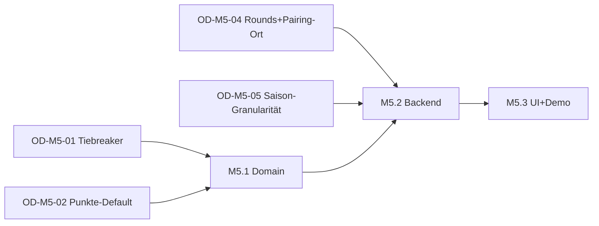

# M5 — Schweizer System + Liga-Punkte + Saisontabelle — Milestone-Plan

> Status: Entwurf, wartet auf Abnahme
> Datum: 2026-05-27
> Bezug: `architecture.md` (dieses Verzeichnis), `docs/specs/tournament-mode-spec.md` §3.6 / §3.14 / §3.15

## Überblick

M5 wird in drei Sub-Milestones zerlegt. Sequenziell: M5.2 (Backend) braucht Domain-Verträge aus M5.1, M5.3 (UI) braucht beides.

| Sub-Milestone | Inhalt | Aufwand | Demobar |
|---|---|---|---|
| M5.1 | Domain — SwissSystemStrategy + LeaguePointsEngine + Buchholz + SeasonStandings | 4–5 Tage | Nein (Library-Layer), Property-Tests grün |
| M5.2 | Backend — Season-Schema-Migration, RPC `tournament_pair_round` erweitern, RLS, Punkte-Sink-Adapter | 3–4 Tage | Teilweise (per RPC-Call gegen Test-DB) |
| M5.3 | UI — Saison-Tabellen-Screen, Wizard-Erweiterung, Demo-Seeder, Liga-Admin-Screen | 5–6 Tage | Ja, vollständig |

Summe: 12–15 Tage Senior-Tempo. Liegt am oberen Ende der Foundation-Schätzung — vor allem weil das Schweizer-System algorithmisch heikel ist (Backtracking + Bye-Logik) und der Saison-Kontext neu eingeführt wird.

Owner-Abnahme nach jedem Sub-Milestone. M5.3 ist parallel-isierbar (UI-Polish vs Demo-Seeder), aber pro Worker bleibt es sequenziell.

## M5.1 — Domain (4–5 Tage)

Reine Library-Arbeit im `kubb_domain`-Paket. TDD strikt.

### Tasks

| ID | Task | Grösse | Vorbedingung |
|---|---|---|---|
| M5.1-T1 | `BuchholzCalculator` mit Property-Tests (Σ-Score-Map über prior Runds, Sonneborn-Berger als Option) | M | OD-M5-01 resolved |
| M5.1-T2 | `SwissSystemStrategy` Skelett: `implements PairingStrategy`, sortByScoreThenBuchholz, greedy-pair ohne Backtracking | M | M5.1-T1 |
| M5.1-T3 | Backtracking-Layer (Tiefe ≤3) für Wiederholungs-Vermeidung, plus Bye-Selektion (schwächster ohne Bye gemäss FR-PAIR-5) | L | M5.1-T2, OD-M5-01 |
| M5.1-T4 | `LeaguePointsEngine` mit FR-POINTS-1-Formel + Property-Tests (Identity bei Faktor=1, Linearität bei Faktor-Skalierung) | M | OD-M5-02 resolved |
| M5.1-T5 | `SeasonStandings`-Read-Model + Aggregations-Tests (linear additiv, OD-M5-03) | S | M5.1-T4 |

### Akzeptanz (Auswahl)

- Given 8 Spieler, 4 geplante Runden When SwissSystemStrategy.plan() Then alle Pairings unique über die 4 Runden (keine Wiederholungen), Buchholz-Sortierung in Runde 2+ stabil.
- Given 7 Spieler (ungerade) When Runde 1 geplant Then genau ein Bye-Slot, Bye-Empfänger ist gemäss OD-M5-01-Empfehlung ausgewählt.
- Given Standings mit Stufungs-Bonus-Tabelle When LeaguePointsEngine.compute() Then Endpunkte = (N−Platz+1+Bonus) × TF × LF mit numerischer Toleranz <0.01.
- Property: für jede Permutation der Eingabe-Standings ist `Σ awards` bis auf Reihenfolge identisch.

## M5.2 — Backend (3–4 Tage)

Schema-Migration + RPC-Erweiterung + RLS.

### Tasks

| ID | Task | Grösse | Vorbedingung |
|---|---|---|---|
| M5.2-T1 | Migration `20260801000002_season_schema.sql` — `seasons`, `season_tournaments`, `season_standings_awards` + View `v_season_standings` + Indices | L | OD-M5-05 resolved |
| M5.2-T2 | RLS-Policies — public-read für `seasons`+View, Schreibrecht für Liga-Admin/Plattform-Admin auf `season_*` | M | M5.2-T1 |
| M5.2-T3 | Migration `20260801000001_pair_round_swiss.sql` — RPC `tournament_pair_round` um `swiss_system`-Dispatch erweitern (Body ruft Dart-portierten Pairing-Helper via PL/pgSQL-Stub oder reicht an Client-Side-Domain durch — siehe OD-M5-04) | L | M5.1-T3 |
| M5.2-T4 | pgTAP-Tests — Season-RLS (Anon liest published, kann nicht insert), Idempotenz Punkte-Sink (zweimal Finalize liefert nicht doppelte Awards) | M | M5.2-T1..T3 |

### Akzeptanz

- Given Turnier mit Status `finalized` und Saison-Zuordnung When Punkte-Sink-Adapter feuert Then `season_standings_awards` enthält N Rows (eine pro Teilnehmer), `v_season_standings` zeigt Summen.
- Given anonymer Caller When SELECT auf `v_season_standings` einer `open`-Saison Then Daten sichtbar; bei `draft`-Saison: leer.

## M5.3 — UI + Demo (5–6 Tage)

### Tasks

| ID | Task | Grösse | Vorbedingung |
|---|---|---|---|
| M5.3-T1 | `tournament_setup_wizard` — Format-Step bekommt "Schweizer System"-Option, Validation für Runden-Anzahl (Default ceil(log2(n)), siehe OD-M5-04) | M | M5.2-T3 |
| M5.3-T2 | `tournament_setup_wizard` — neuer Step "Liga & Saison" mit Punkte-Modus (Globale Formel / Eigene Punkte), Saison-Dropdown | M | M5.2-T1 |
| M5.3-T3 | `season_standings_screen.dart` — Tabellen-Widget mit Avatar, Rang, Punkte, Anzahl Turniere, Liga-Filter | L | M5.2-T1 |
| M5.3-T4 | `season_admin_screen.dart` — CRUD-Screen für Liga-Admin (Saison erstellen / Turniere zuordnen / schliessen) | M | M5.2-T2 |
| M5.3-T5 | Demo-Seeder `demo_swiss_league.dart` — generiert 8-Spieler-Liga mit 3 Turnieren in einer Saison, alle Punkte vergeben | M | M5.3-T3 |
| M5.3-T6 | l10n DE-Strings + Widget-Tests + Snapshot-Tests Saison-Tabelle | S | M5.3-T3..T5 |

### Akzeptanz

- Given Veranstalter öffnet Wizard When Format=Schweizer System gewählt Then Runden-Anzahl-Vorschlag = ceil(log2(Teilnehmer-Default)), editierbar.
- Given Saison hat 3 finalisierte Turniere When `season_standings_screen` öffnet Then Tabelle zeigt Σ Punkte korrekt, Sortierung absteigend nach Punkten, Tiebreak per Anzahl-Turniere.
- Given Liga-Admin öffnet `season_admin_screen` When neue Saison erstellt + zwei Turniere zugeordnet Then beide Turniere erscheinen im Saison-Detail.

## Demobarkeits-Check — was nach M5 demobar ist

5-Spiel-Liga über 3 Turniere, 8 Spieler pro Turnier, Schweizer System mit 4 Runden:

1. Liga-Admin öffnet `season_admin_screen`, erstellt Saison "Frühling 2026 — Liga B", legt Start- und Enddatum fest.
2. Veranstalter erstellt Turnier 1 via Wizard, wählt "Schweizer System", ordnet der Saison zu, startet.
3. Demo-Seeder simuliert Match-Ergebnisse — nach 4 Runden Turnier finalisiert, Punkte werden vergeben (sichtbar in Saison-Tabelle).
4. Schritte 2–3 für Turnier 2 und 3 wiederholt.
5. `season_standings_screen` zeigt Σ Punkte aller 8 Spieler über die 3 Turniere, Liga-B-Tabelle abrufbar.
6. Bonus: einer der Spieler bekommt ein Bye in Turnier 2 — Bye-Punkt sichtbar in Detail-Ansicht.

Demo-Dauer: ~20 Min mit Seeder, ~60 Min ohne (manuell).

## Risiken & Reihenfolge

Siehe `risks-and-deferrals.md` und `open-decisions.md`. Kritische Pfad-Punkte:

- OD-M5-01 (Tiebreaker-Reihenfolge) muss vor M5.1-T1 entschieden sein.
- OD-M5-04 (Round-Count + Pairing-Ort) muss vor M5.2-T3 entschieden sein — bestimmt, ob Pairing auf Server (PL/pgSQL) oder Client (Dart) läuft.
- OD-M5-05 (Saison-Granularität / Termin-Vergabe) muss vor M5.2-T1 entschieden sein.

## Risiken (Auszug)

- **Bye-Handling bei ungerader Spielerzahl** — eigener OD (OD-M5-01) plus R-M5.1-1 in `risks-and-deferrals.md`.
- **Wiederholungs-Pairing-Vermeidung** — Backtracking hat keinen Korrektheits-Beweis für alle n; bei Sackgasse muss erlaubt werden zu wiederholen (Marker im UI). Siehe R-M5.1-2.
- **Bestehende M1-Turniere ohne Saison-Bezug** — Backfill-Strategie nötig (R-M5.2-1).
