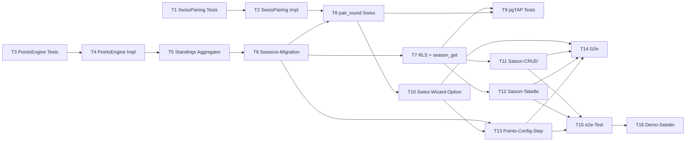

# M5 — Sprint-Plan

> Status: Entwurf, wartet auf Abnahme
> Datum: 2026-05-27
> Bezug: `tasks.md`, `milestone-plan.md`

## Wave-Modell

Vier sequenzielle Wellen. Innerhalb einer Welle können Tasks parallel laufen, sofern sie keine Cross-Task-Dependency haben.

| Wave | Sub-Milestone | Tasks | Parallelisierbar | LOC-Summe |
|------|---------------|-------|------------------|-----------|
| 1 | M5.1 Domain | T1–T5 | T1+T3 parallel (Tests); T2+T4 parallel (Impl); T5 sequenziell nach T4 | ~420 |
| 2 | M5.2 Backend | T6–T9 | T6 sequenziell; T7+T8 parallel nach T6; T9 nach T7+T8 | ~370 |
| 3 | M5.3 UI | T10–T14 | T10+T11+T12 parallel; T13 nach T10; T14 nach T10–T13 | ~440 |
| 4 | M5.3 Demo | T15–T16 | T15 vor T16 | ~180 |

**Gesamt-LOC-Budget**: ~1410 LOC über alle Tasks (Test- + Impl-Code). Anteil Domain ≈ 30%, Backend ≈ 26%, UI ≈ 31%, Demo+e2e ≈ 13%.

## Dependency-Graph

## Kritischer Pfad

Längster Pfad: `T3 → T4 → T5 → T6 → T7 → T11 → T15 → T16` (8 Tasks, ~640 LOC). Bei Senior-Tempo (Faktor 0.8) ≈ 7–8 Tage.

Paralleler Nebenpfad `T1 → T2 → T8 → T10 → T13` blockt T15 nicht direkt, kann aber Engpass werden falls Pairing-Algorithmus schwerer als geplant. Erwartung: ~5 Tage.

## Wave-Reihenfolge / Owner-Abnahme-Punkte

1. **Wave 1 (Domain)** abgeschlossen → Owner-Abnahme: Property-Tests grün, Library-Layer demoreif.
2. **Wave 2 (Backend)** abgeschlossen → Owner-Abnahme: Migrationen sauber, RLS getestet, pgTAP grün.
3. **Wave 3 (UI)** abgeschlossen → Owner-Abnahme: Wizard und Saison-Screens manuell durchspielbar.
4. **Wave 4 (Demo)** abgeschlossen → Owner-Abnahme: e2e grün, Demo-Skript läuft in <2 Min.

## Open-Decisions Blocker pro Wave

| Wave | Blockiert durch ODs |
|------|---------------------|
| 1 | OD-M5-01 (Tiebreak), OD-M5-02 (Punkte-Schema) — vor T1/T3 entschieden |
| 2 | OD-M5-04 (Pairing-Ort), OD-M5-05 (Saison-Granularität), OD-M5-07 (Append-only) |
| 3 | OD-M5-06 (Sortier-Default) — vor T12 entschieden |
| 4 | — keine offenen ODs |

## LOC-Budget pro Task (Senior ≤100)

| Task | LOC | Task | LOC |
|------|-----|------|-----|
| T1 | 90 | T9 | 100 |
| T2 | 100 | T10 | 90 |
| T3 | 80 | T11 | 100 |
| T4 | 80 | T12 | 100 |
| T5 | 70 | T13 | 90 |
| T6 | 100 | T14 | 60 |
| T7 | 90 | T15 | 100 |
| T8 | 80 | T16 | 80 |

Alle Tasks innerhalb des Senior-Limits (≤100 LOC, ≤3 Files, ≤1h).
