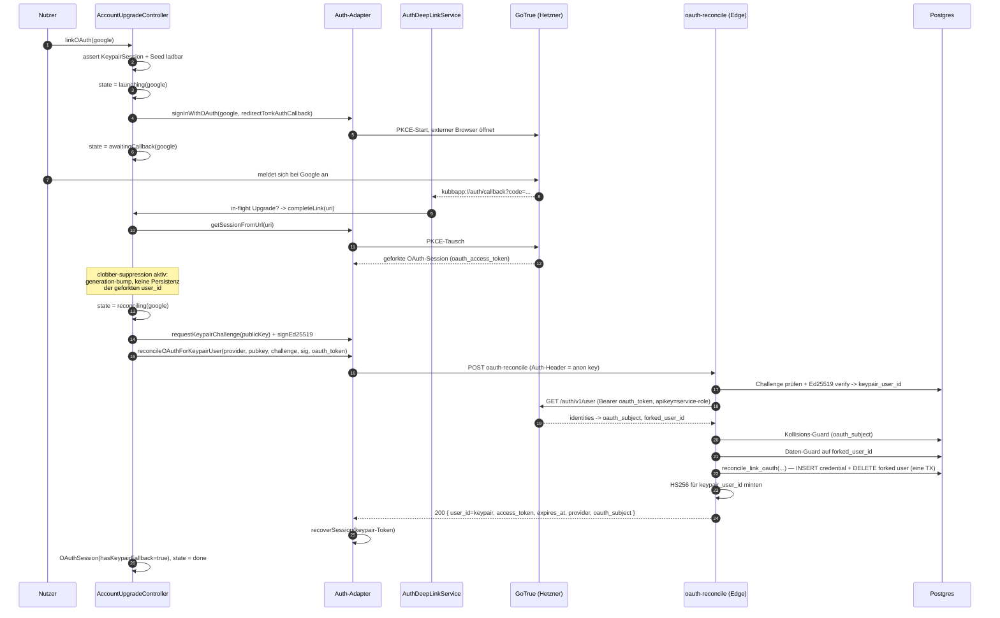
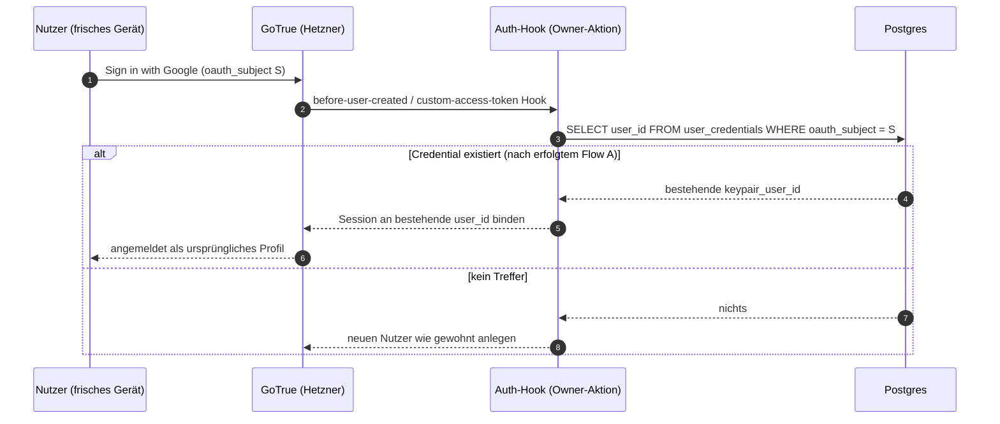

# OAuth-an-Keypair-Konto verknüpfen — Architektur

## Übersicht

Ein zurückkehrender Gast/Keypair-Nutzer kann heute kein Google- oder Apple-Konto an sein bestehendes Profil hängen. Der Versuch schlägt fehl, und der Nutzer sieht ein festes Fehler-Banner. Diese Architektur ersetzt den kaputten Pfad durch einen serverseitigen Reconcile: die App startet den OAuth-Browser-Flow, fängt den Callback über ein Deep-Link, und eine neue Edge-Function bindet die OAuth-Identität an die **bestehende** Keypair-user_id — gegen zwei unabhängige Beweise. Die interne user_id bleibt erhalten (ADR-0010 §Account upgrade path), Turnierhistorie geht nicht verloren.

## Warum der alte Pfad bricht

Ein wiederkehrender Keypair-Nutzer hält eine **selbst-geminte HS256-Session**. Die `keypair-verify`-Edge-Function signiert sie mit dem `SUPABASE_JWT_SECRET` (zufällige `session_id`, keine `auth.sessions`-Zeile, kein Refresh-Token). Der Client adoptiert sie lokal über `recoverSession`. GoTrue kennt diesen Token nie.

`linkOAuthToCurrentUser` ruft client-seitig `linkIdentity()` — ein authentifizierter GET an GoTrue `/user/identities/authorize` mit genau diesem Token. GoTrue hat für einen nie ausgestellten Token keine Session und keine Identität, wirft, und der Fehler wird in ein festes deutsches Banner geschluckt. Dazu kommen drei verstärkende Lücken: kein Backend schreibt je eine `oauth_*`-Credential gegen die bestehende Keypair-user_id, es gibt keinen `kubbapp://auth/callback`-Handler, und der Controller feuert `done()` sofort und verschluckt den echten Fehler.

## Bounded Context

`auth/` (pragmatic). Kein neuer Context. `kubb_domain/` bleibt unberührt und Flutter-frei — das gesamte Reconcile-Wissen lebt in der Edge-Function (Deno/TS), in der Migration (SQL) und im App-Data-Layer (Dart).

## Entscheidung in einem Satz

Statt client-seitigem `linkIdentity` für Keypair-Nutzer: ein **serverseitiger Reconcile**, der Keypair-Besitz über eine signierte Challenge (derselbe Mechanismus, dem `keypair-verify` schon vertraut) **und** OAuth-Besitz über einen GoTrue-autoritativen Token-Read beweist, bevor er die Credential schreibt und den geforkten GoTrue-Nutzer löscht.

## Die zwei Flows

### Flow A — OAuth aus der App heraus hinzufügen (jetzt gebaut, vollständig)

Der Nutzer ist als Keypair angemeldet und tippt im Account-Link-Screen auf „Mit Google verknüpfen". Voraussetzung, die der Controller hart prüft: aktuelle Session ist `KeypairSession` (oder eine OAuth-Session mit noch vorhandener Keypair-Credential) **und** der Seed ist aus dem Secure Storage ladbar. Fehlt der Seed, bricht der Controller sofort mit einem echten Fehler ab — der Browser startet gar nicht erst.



Schritt für Schritt:

1. Controller setzt `launching(google)`, lädt den Seed, merkt sich Keypair-user_id und Seed für die Dauer des Flows.
2. `signInWithOAuth(provider, redirectTo: kAuthCallback)` öffnet den Browser. PKCE-`code_verifier` landet im GoTrue-Local-Storage. Die Keypair-Session ist noch die aktive.
3. Provider leitet auf `kubbapp://auth/callback?code=...`. Das Android-Intent-Filter (bzw. iOS CFBundleURLTypes) routet die URI zurück in die laufende `singleTop`-Activity.
4. `AuthDeepLinkService` (neu) empfängt die URI. Weil ein Upgrade in flight ist, gibt er sie an `completeLink(uri)` — **nicht** an den generischen Sign-in-Pfad.
5. `completeLink` tauscht den Code über `getSessionFromUrl(uri)`. GoTrue speichert die geforkte OAuth-Session lokal und emittiert `signedIn`. Hier greift die Clobber-Suppression (siehe Security-Modell): die geforkte user_id darf nicht in den Drift-Cache.
6. Controller hat jetzt beide Beweise: Seed im Speicher und einen Live-OAuth-Bearer. Er holt eine frische Challenge und signiert die rohen Challenge-Bytes (wie `keypair-verify` sie erwartet).
7. `reconcileOAuthForKeypairUser(...)` ruft die `oauth-reconcile`-Edge-Function. Der Authorization-Header ist auf den anon-Key gepinnt, damit der transiente OAuth-Bearer **nicht** der autorisierende Principal ist — beide Beweise reisen im Body.
8. Die Edge-Function prüft (Reihenfolge bindend): Challenge + Signatur (Keypair-Besitz -> keypair_user_id), OAuth-Token gegen `/auth/v1/user` (OAuth-Besitz -> forked_user_id + oauth_subject), Kollisions-Guard, Daten-Guard, dann INSERT der Credential + DELETE des geforkten Nutzers in einer Transaktion, dann frischer HS256-Token für keypair_user_id.
9. Bei 200 ruft der Client `recoverSession` mit dem **zurückgegebenen Keypair-Token** (nicht dem toten OAuth-Bearer), setzt `OAuthSession(hasKeypairFallback: true)` mit unveränderter user_id und `state = done`.
10. Bei jedem Fehler mappt der Controller den typisierten Code auf ein spezifisches deutsches Banner. Die user_id bleibt unangetastet, der Nutzer landet nie sessionless.

### Flow B — Cold-Start „Mit Google anmelden" zurück auf die Keypair-user_id (gestaged, nicht gebaut)

Der Add-Pfad oben ist korrekt, weil der Seed beim Upgrade nachweislich auf dem Gerät liegt. Ein späterer Cold-Start „Mit Google anmelden" (`sign_in_screen._dispatchOAuth`) hat **keinen** Seed und forkt heute eine zweite `auth.users`-Zeile. ADR-0010 §Sign-in collision rule verbietet Auto-Merge per E-Mail; kein Client-Code reconciled.



Warum gestaged: die dauerhafte Cold-Login-Auflösung braucht **eine** Owner-seitige GoTrue-Änderung auf der Hetzner-Box (ein Auth-Hook, der `oauth_subject` in `user_credentials` nachschlägt). GoTrue konsultiert `user_credentials` nicht von selbst. Bis der Hook existiert, forkt ein Cold-Google-Login für ein bereits verknüpftes Subject weiterhin. Das Schema, das Flow A schreibt (eine `oauth_*`-Zeile gegen die Keypair-user_id), reicht für den Hook ohne spätere Migration. Details und der exakte Hook-Vertrag stehen in ADR-0042 §Staged. Der Schutz dagegen, dass die Lücke stillschweigend falsch wird: der Daten-Guard im Reconcile löscht nie einen Nutzer mit echter Historie, und das `oauth_subject`-Unique-Index plus der 409-Guard blockieren Subject-Übernahmen.

## oauth-reconcile — Edge-Function-Vertrag

Neue Function `supabase/functions/oauth-reconcile/index.ts`. In `supabase/config.toml`: `[functions.oauth-reconcile] verify_jwt = false` — der Aufrufer beweist Identität über zwei body-getragene Beweise, nicht über das Request-JWT (gleiche Begründung wie `keypair-verify`).

**Request** (POST JSON):

```jsonc
{
  "provider": "google" | "apple",
  "public_key": "<base64-std, 32 Bytes>",
  "challenge_b64": "<base64-std>",
  "signature_b64": "<base64-std, 64 Bytes>",
  "oauth_access_token": "<GoTrue-Bearer aus getSessionFromUrl>"
}
```

**Env**: `SUPABASE_URL`, `SUPABASE_SERVICE_ROLE_KEY`. Admin-Client via `createClient(url, serviceRoleKey, { auth: { persistSession: false } })`. Kein JWT-Mint-Secret nötig? Doch — Schritt 6 mintet den Keypair-Token, also wird `resolveJwtSecret()` aus `keypair-verify` kopiert (multi-source: `SUPABASE_JWT_SECRET`, dann `SUPABASE_INTERNAL_JWT_SECRET`, dann `SUPABASE_JWKS`).

**Verify-/Reconcile-Schritte, alle müssen passen, in Reihenfolge:**

1. **Methode + Form**: POST sonst 405; JSON-Parse sonst 400 `invalid_json`; alle 5 Felder vorhanden sonst 400 `missing_field`; `provider` in `{google, apple}` sonst 400 `invalid_provider`; base64 + Längen (pubkey 32, sig 64) sonst 400 `invalid_base64` / `invalid_public_key_length` / `invalid_signature_length`.
2. **Keypair-Besitz** (Proof A, exakt `keypair-verify`-Pfad): Challenge in `keypair_challenges` per `(public_key, hex-escaped bytea)` `maybeSingle` — nicht gefunden 401 `challenge_not_found`; TTL 60s ab `issued_at`, abgelaufen löschen + 410 `challenge_expired`; `ed.verifyAsync(sig, challengeBytes, pubkeyBytes)` über **rohe** Challenge-Bytes, falsch 401 `signature_invalid`. `keypair_user_id` aus `user_credentials WHERE kind='keypair' AND public_key=b64`, keine Zeile 401 `no_account_for_public_key`. Challenge-Zeile löschen (Single-Use).
3. **OAuth-Besitz** (Proof B, GoTrue-autoritativ): `GET ${SUPABASE_URL}/auth/v1/user` mit Headern `{ Authorization: 'Bearer '+oauth_access_token, apikey: SERVICE_ROLE_KEY }`. Non-200 -> 401 `oauth_token_invalid`. Body parsen: `forked_user_id = json.id`; `identities` durchsuchen, die Identität mit passendem `provider` picken, deren `id` (= Provider-`sub`) den `oauth_subject` ergibt. Keine passende Identität mit non-null `id` -> 422 `oauth_provider_mismatch`. **Niemals** `admin.getUser(token).identities` vertrauen (Access-Token-Claims tragen `sub` nicht zuverlässig), **niemals** `oauth_subject` aus dem Request-Body lesen.
4. **Idempotenz-Kurzschluss**: ist `forked_user_id == keypair_user_id`, ist das Konto schon dasselbe -> 200 `already_linked`.
5. **Kollisions-Guard** (vor jedem Delete): `SELECT user_id FROM user_credentials WHERE kind='oauth_'||provider AND oauth_subject=S`. Existiert eine Zeile mit `user_id == keypair_user_id` -> idempotent 200 `already_linked`. Existiert sie mit `user_id != keypair_user_id` -> 409 `oauth_subject_in_use`, **nichts** anfassen (kein Insert, kein Delete — der Übernahme-Block).
6. **Daten-Guard** (vor dem Delete): `EXISTS`-Check, ob `forked_user_id` echte Zeilen besitzt (`tournament_registrations.user_id`, Score-Submissions `submitter_user_id`, weitere vom Owner bestätigte Tabellen). Trifft zu -> 409 `forked_user_has_data`, **nichts** anfassen. Die Liste der zu prüfenden Tabellen ist eine offene Owner-Entscheidung (siehe ADR-0042).
7. **Mutation** über die SECURITY-DEFINER-RPC `reconcile_link_oauth` (mit Service-Role aufgerufen) in einer DB-Transaktion: INSERT `user_credentials(user_id=keypair, kind, oauth_subject)` `ON CONFLICT (kind, oauth_subject) DO NOTHING`, dann `DELETE FROM auth.users WHERE id = forked_user_id AND id <> keypair_user_id`. Cascades räumen die leeren Hilfszeilen des geforkten Nutzers.
8. **Mint** (atomar, in derselben Antwort): HS256 für `keypair_user_id` — Mint-Block aus `keypair-verify` kopiert, aber `app_metadata.providers = ['keypair', provider]`, `provider` bleibt `'keypair'` (so klassifiziert `_kindForUser` weiter als keypair-backed mit nun angehängter OAuth-Credential).

**Response 200**:

```jsonc
{
  "user_id": "<keypair-user-id>",
  "nickname": "<aus user_profiles>",
  "access_token": "<frischer HS256>",
  "expires_at": 1234567890,
  "token_type": "bearer",
  "linked_provider": "google" | "apple",
  "oauth_subject": "<sub>",
  "forked_user_deleted": true
}
```

**Fehlercodes** (jeder auf ein eigenes Banner gemappt): 400 `invalid_json` / `missing_field` / `invalid_provider` / `invalid_base64` / `invalid_public_key_length` / `invalid_signature_length`; 401 `challenge_not_found` / `signature_invalid` / `no_account_for_public_key` / `oauth_token_invalid`; 409 `oauth_subject_in_use` / `forked_user_has_data`; 410 `challenge_expired`; 422 `oauth_provider_mismatch`; 500 `server_misconfigured` / `reconcile_failed`.

**Verifikation** (manuell, kein Edge-Test-Harness im Repo): `supabase functions serve oauth-reconcile`; Happy-Path curlen mit echtem `getSessionFromUrl`-Bearer + frisch signierter Challenge -> 200 + Keypair-user_id, danach 2 Zeilen in `user_credentials` für die user_id, geforkte `auth.users`-Zeile weg; re-curlen -> 200 `already_linked`; stale Challenge -> 410; `provider=apple` mit Google-Bearer -> 422; `oauth_subject` schon an anderen Nutzer gebunden -> 409 `oauth_subject_in_use` ohne Delete; geforkter Nutzer mit Registrierung -> 409 `forked_user_has_data` ohne Delete.

## Migration — DDL + RPC

Neue Datei `supabase/migrations/20261325000000_oauth_reconcile.sql` (sortiert nach dem aktuell höchsten `20261320000000`).

**Kein neues Column.** `oauth_subject` existiert (`20260504000001:29`), der Shape-CHECK erlaubt `oauth_*`-Zeilen mit non-null `oauth_subject` + null `public_key`, und `user_credentials_oauth_subject_idx UNIQUE (kind, oauth_subject) WHERE oauth_subject IS NOT NULL` ist der DB-Level-Übernahme-Guard.

**(A) Neuer Unique-Index** — der Brief flaggte, dass nichts zwei `oauth_google`-Zeilen pro Nutzer verhindert:

```sql
CREATE UNIQUE INDEX IF NOT EXISTS user_credentials_user_kind_idx
  ON user_credentials (user_id, kind)
  WHERE kind <> 'keypair';
```

Keypair ist ausgenommen, damit es nie kollidiert. Ein Nutzer hält höchstens je eine `oauth_google`- und `oauth_apple`-Zeile. Das macht die Idempotenz aus Schritt 5 zu einer DB-Invariante statt App-Logik.

**(B) SECURITY-DEFINER-RPC** `reconcile_link_oauth(p_keypair_user_id uuid, p_kind text, p_oauth_subject text, p_forked_user_id uuid) RETURNS jsonb`, `LANGUAGE plpgsql`, `SECURITY DEFINER`, `SET search_path = public, auth`. Body:

- `p_kind IN ('oauth_google','oauth_apple')` sonst `RAISE ... ERRCODE='22023'`.
- INSERT `user_credentials(user_id, kind, oauth_subject)` `VALUES (p_keypair_user_id, p_kind, p_oauth_subject)` `ON CONFLICT (kind, oauth_subject) WHERE oauth_subject IS NOT NULL DO NOTHING` — ob eine Zeile eingefügt wurde, wird festgehalten.
- Defence-in-depth: existiert die `oauth_subject`-Zeile gebunden an eine **andere** `user_id`, `RAISE 'OAUTH_SUBJECT_IN_USE' USING ERRCODE='23505'` (die Edge-Function prüft das schon, die RPC prüft erneut).
- Guard `p_forked_user_id <> p_keypair_user_id`, dann `DELETE FROM auth.users WHERE id = p_forked_user_id` (Cascades räumen die leeren `oauth_credential`/`profile`-Zeilen des geforkten Nutzers).
- `RETURN jsonb_build_object('user_id', p_keypair_user_id, 'kind', p_kind, 'oauth_subject', p_oauth_subject, 'forked_user_deleted', <bool>)`.

**(C) GRANT** — ausschliesslich Service-Role:

```sql
REVOKE ALL ON FUNCTION reconcile_link_oauth(uuid, text, text, uuid) FROM PUBLIC;
GRANT EXECUTE ON FUNCTION reconcile_link_oauth(uuid, text, text, uuid) TO service_role;
```

Nie aufrufbar aus einer Geräte-Session (sie nimmt `keypair_user_id` als Parameter; das Vertrauen entsteht erst, nachdem die Edge-Function beide Hälften bewiesen hat).

**(D) RLS** — keine neue Policy. Die bestehende `user_credentials_owner_insert WITH CHECK (user_id = auth.uid())` deckt diesen Insert bewusst nicht ab; der einfügende Principal (Service-Role) umgeht RLS, was korrekt ist, weil Owner-RLS „füge eine OAuth-Zeile für einen per detached Challenge bewiesenen Keypair-Nutzer ein" nicht ausdrücken kann.

**(E)** Der Daten-Guard aus Edge-Schritt 6 läuft als `EXISTS`-Lookup über die Service-Role-Verbindung **vor** dem RPC-Aufruf. Er steht nicht in der RPC, weil die zu prüfende Tabellenliste eine Owner-Entscheidung ist und sich ändern kann, ohne die RPC neu zu definieren. Optional kann ein zweiter Guard direkt in `reconcile_link_oauth` als letzte Verteidigung ergänzt werden.

## RPC-Signaturen

| Signatur | Eigenschaften | Aufrufer |
|---|---|---|
| `public.reconcile_link_oauth(p_keypair_user_id uuid, p_kind text, p_oauth_subject text, p_forked_user_id uuid) RETURNS jsonb` | `SECURITY DEFINER`, `SET search_path = public, auth`, `REVOKE FROM PUBLIC`, `GRANT TO service_role` | nur `oauth-reconcile` via Service-Role-Admin-Client |
| `public.keypair_challenge(p_public_key text) RETURNS jsonb` (bestehend, unverändert) | `SECURITY DEFINER`, `GRANT TO anon, authenticated` | Reconcile-Flow holt seine Challenge hierüber |

Nicht genutzt: die Legacy-`keypair_verify`-SQL-Stub (`20260504000005:90`) verifiziert keine Signatur und ist nie der Trust-Anchor.

## Adapter-Branching

`supabase_auth_adapter.dart` (abstract): `linkOAuthToCurrentUser(provider)` bleibt, Vertrag neu als „starte den OAuth-Browser-Flow für ein Upgrade". Neue Methode:

```dart
Future<AuthAdapterState> reconcileOAuthForKeypairUser({
  required AuthOAuthProvider provider,
  required List<int> publicKey,
  required List<int> challenge,
  required List<int> signature,
  required String oauthAccessToken,
});
```

`supabase_auth_adapter_impl.dart`:

1. `linkOAuthToCurrentUser` **branscht** auf den Session-Kind. Für eine **echte** GoTrue-Session (anonymous, oder echte `oauth_*`-Identität auf `user.identities`) bleibt `_client.auth.linkIdentity(...)` — der unterstützte GoTrue-Manual-Link, der funktioniert, weil der Bearer server-ausgestellt ist. Für eine **Keypair**-Session (der selbst-gemintete HS256-Fall, erkannt an `currentState.kind == keypair`) **darf** `linkIdentity` nicht aufgerufen werden; stattdessen nur `signInWithOAuth(provider, redirectTo: kAuthCallback)` starten und zurückkehren — der Abschluss läuft über den Deep-Link-Service + `completeLink`, nicht über diese Methode.
2. `reconcileOAuthForKeypairUser` ruft die Edge-Function via `_client.functions.invoke('oauth-reconcile', body {...})`, **Authorization auf den anon-Key gepinnt** (siehe unten). Non-2xx -> `throw` einer typisierten `ReconcileException`, die den Server-Fehlercode trägt (damit der Controller pro Code branchen kann, nicht ein generisches `toString()`). Bei 200 **kein** `recoverSession` des OAuth-Tokens (der Nutzer wird gelöscht); stattdessen `recoverSession` mit dem **zurückgegebenen Keypair-Token** und Rückgabe des aktualisierten Keypair-States.

Der anon-Key-Pin: `requestKeypairChallenge` pinnt über `builder.setHeader('Authorization', 'Bearer $_anonKey')` auf dem RPC-Builder. `functions.invoke` ist eine andere API-Fläche — der Implementer muss verifizieren, dass der Pin dort greift (z.B. über den `headers`-Parameter von `invoke`, oder einen FunctionsClient mit explizitem Header). Beide Beweise reisen im Body; das Request-JWT darf nicht der geforkte Bearer sein.

`_kindForUser` (impl:253-267) bleibt: ein reconcilte Session ist weiter `provider:'keypair'` in `app_metadata` ohne GoTrue-Identities-Array, klassifiziert also als keypair — korrekt, weil der Keypair die primäre Credential bleibt (ADR-0010 „keypair stays valid as fallback").

## Client-UX-Fix

`AccountUpgradeController` wird von Fire-and-Forget zur echten State-Machine. Neuer `AccountUpgradeState`:

```dart
idle
| launching(AuthProvider provider)
| awaitingCallback(AuthProvider provider)
| reconciling(AuthProvider provider)
| done
| failed(String code, AuthProvider? provider)
```

- `linkOAuth(provider)`: (1) assert aktuelle `AuthSession` ist `KeypairSession` oder OAuth-Session mit Keypair-Fallback, sonst `failed('not_keypair')`. (2) Seed aus `keypairStorageProvider` laden; null -> `failed('keypair_seed_missing')` und **kein** OAuth-Start. (3) `state = launching`; Keypair-user_id + Seed im Notifier halten. (4) `signInWithOAuth` für den Keypair-Branch; dann `state = awaitingCallback`. **Kein** `done()` hier (killt den Premature-Done-Bug an Controller-Zeile 41). Ein Timeout (3 min) kippt `awaitingCallback -> failed('callback_timeout')`.
- `completeLink(Uri uri)` (vom Deep-Link-Service gerufen): `getSessionFromUrl(uri)` für den OAuth-Bearer + Subject; `state = reconciling`; Challenge holen + signieren; `reconcileOAuthForKeypairUser(...)`; bei Erfolg `OAuthSession(hasKeypairFallback: true, userId = unverändert)` in den `authController` schieben, `telemetry.accountUpgrade`, `state = done`; bei `ReconcileException` den typisierten Code auf `state = failed(code)`.
- `account_link_screen.dart`: das einzelne feste `l10n.authLinkErrorBanner` durch einen Switch auf `failed.code` ersetzen — eigene Strings für `oauth_subject_in_use`, `forked_user_has_data`, `oauth_token_invalid`/`oauth_provider_mismatch`, `challenge_*`, `callback_timeout`, `keypair_seed_missing`, plus generischer Fallback. Spinner für `launching | awaitingCallback | reconciling`.
- `account_section.dart`: die Link-Zeile ist heute nur auf `isAnonymous` gegated (Zeile 72-80). Erweitern, sodass „Google/Apple verknüpfen" auch für eine `KeypairSession` und für eine `OAuthSession`, der der andere Provider fehlt, erscheint (ADR-0010 §Multi-credential users — die UI hinkt der Regel hinterher).
- `OAuthSession.hasKeypairFallback` wird auf der Post-Reconcile-Session endlich `true` gesetzt, damit die Uj die Fallback-Notiz wahrheitsgemäss zeigt.

Alle Banner-Strings: Schweizer Schriftdeutsch, echte `ä/ö/ü`, kein `ß`.

## Deep-Link-Konfiguration

**Geteilte Konstante**: `const kAuthCallback = 'kubbapp://auth/callback'` in `lib/features/auth/data/auth_redirect.dart`. Ersetzt die zwei Inline-Literale (impl:61 und :209).

**Android** (`android/app/src/main/AndroidManifest.xml`): zweites `<intent-filter>` in der bestehenden `.MainActivity` (schon `singleTop`, `exported=true`):

```xml
<intent-filter android:autoVerify="false">
    <action android:name="android.intent.action.VIEW"/>
    <category android:name="android.intent.category.DEFAULT"/>
    <category android:name="android.intent.category.BROWSABLE"/>
    <data android:scheme="kubbapp" android:host="auth"/>
</intent-filter>
```

`singleTop` heisst, der Callback kommt über `onNewIntent` auf der bestehenden Activity, was `app_links` über `uriLinkStream` durchreicht.

**iOS** (`ios/Runner/` ist heute unvollständig — keine `Info.plist`, kein `AppDelegate.swift`, keine `project.pbxproj`): `CFBundleURLTypes` mit einem Dict `{ CFBundleURLName='app.kubb.auth', CFBundleURLSchemes=['kubbapp'] }` wird geschrieben, aber iOS bleibt geparkt — der Runner braucht volles Scaffolding, bevor irgendein iOS-Build läuft. Android ist der Ship-Target dieses Zyklus (ADR-0015 §Android first). Keine Universal Links nötig — ein Custom-Scheme genügt und entspricht dem, was `redirectTo` schon nutzt. `config.toml` listet `kubbapp://auth/callback` bereits in `additional_redirect_urls` (Zeilen 44-47).

**Wiring**: neuer `AuthDeepLinkService` (`lib/features/auth/data/auth_deep_link_service.dart`) instanziiert `AppLinks()`, abonniert `uriLinkStream` **und** wartet `getInitialLink()` ab (Cold-Start, wenn die App vom Callback gestartet wurde). Für jede `kubbapp://auth/callback`-URI: ist `AccountUpgradeController` in `awaitingCallback` -> `completeLink(uri)`; sonst (Cold-OAuth-Sign-in-Pfad) -> `_client.auth.getSessionFromUrl(uri)`, damit der Standard-Sign-in abschliesst und `onAuthStateChange` feuert (das fixt nebenbei den toten Cold-Start-OAuth-Pfad). Disambiguierung: der Service prüft das in-flight Upgrade **zuerst**, bevor er auf `getSessionFromUrl` zurückfällt — ein Upgrade-Callback wird nie versehentlich als geforkter Sign-in installiert.

`main.dart` instanziiert den Service **nach** `Supabase.initialize` und hält eine Referenz für die App-Lebenszeit (wie `realtimeAdapter`); der `ProviderScope` exponiert ihn, damit Controller und Router ihn erreichen.

## Security-Modell

Zwei **unabhängige** Beweise sind nötig, bevor irgendeine Credential geschrieben wird, und keiner ist das Request-JWT (`verify_jwt=false`) — das macht den Call durch einen gestohlenen Bearer allein nicht spoofbar.

**Proof A (Keypair-Besitz)**: gültige Ed25519-Signatur über eine server-ausgestellte, Single-Use-, 60s-TTL-Challenge, gebunden an einen `public_key`, der schon auf eine Keypair-Credential-Zeile mappt. Exakt der Mechanismus, dem `keypair-verify` vertraut. Liefert die **Ziel**-user_id (Keypair-Konto). Wer den 32-Byte-Seed nicht hält, kommt nicht vorbei.

**Proof B (OAuth-Besitz)**: ein GoTrue-Access-Token, das der **Server** über `GET ${SUPABASE_URL}/auth/v1/user` (Server-zu-Server, Service-Role-`apikey`) re-validiert. GoTrue bestätigt die Echtheit und liefert die autoritativen `identities`/`oauth_subject` — der Client kann das Subject nicht fälschen, weil die Function es aus GoTrues Antwort liest, nicht aus dem Request-Body. Liefert das **Quell**-`oauth_subject` + geforkte user_id.

Verknüpft wird nur, wenn **beide** passen, und nur das bewiesene `oauth_subject` an die bewiesene Keypair-user_id.

Was Übernahme stoppt:

1. Angreifer mit der Challenge-Signatur eines Opfers, aber ohne OAuth-Token, bekommt nichts (Proof B scheitert).
2. Angreifer mit eigenem Google-Token, aber ohne den Seed des Opfers, kann nur sein eigenes Subject an sein eigenes Keypair-Konto hängen (Proof A pinnt das Ziel auf den, der die Challenge signiert hat).
3. Angreifer kann das Google des Opfers nicht an sein eigenes Keypair hängen: der `oauth_subject`-Unique-Index + der 409-`oauth_subject_in_use`-Guard weisen ab, ein Subject zu binden, das schon einem anderen Nutzer gehört, und der Angreifer hält das OAuth-Token des Opfers nicht.
4. E-Mail wird **nie** zum Mergen genutzt (ADR-0010 §Sign-in collision rule) — nur das kryptografisch bewiesene Subject.
5. Die mutierende RPC ist Service-Role-only und nimmt die Keypair-user_id als Parameter, also nur erreichbar **nachdem** die Edge-Function beide Hälften bewiesen hat (`REVOKE FROM PUBLIC`).
6. Der geforkte `auth.users`-Eintrag wird in derselben Transaktion wie der Link-Insert gelöscht — ein Subject ist nie gleichzeitig auf zwei Nutzern gültig (kein Split-Brain-Fenster).
7. Der transiente OAuth-Bearer wird aus dem Authorization-Header gepinnt (anon-Key-Pin), kann also nicht mit dem mutierenden Principal verwechselt werden.

### Clobber-Fenster — explizit geschlossen

`getSessionFromUrl` ruft `_saveSession()` und emittiert `signedIn` für den **geforkten** OAuth-Nutzer, dessen user_id sich von der Keypair-user_id unterscheidet. Der bestehende `isAnonymousDowngrade`-Guard (`auth_controller.dart:332-337`) feuert nur für `AnonymousSession` über `KeypairSession` mit **gleicher** user_id — er unterdrückt die geforkte OAuth-Emission **nicht**, und `_persistSession` würde die geforkte user_id in den Drift-Cache schreiben. Ohne Gegenmassnahme hält der Cache bei einem Kill mitten im Flow die geforkte user_id und bricht die user_id-Erhaltung beim nächsten Cold-Start.

Schliessung: solange `AccountUpgradeController` in `awaitingCallback` oder `reconciling` ist, wird `_onAdapterState` so gegatet, dass eine Nicht-Keypair-Emission für eine unerwartete user_id verworfen wird, bis der Reconcile zurückkehrt und den Keypair-Token re-mintet. Umsetzung: ein „Upgrade in flight"-Flag (Provider, vom Controller gesetzt), das `auth_controller` liest, plus optional ein Generation-Bump, damit die transiente geforkte Emission als veraltet fällt. Ein Test killt die App mitten im Flow und prüft, dass der Cache weiter die Keypair-user_id hält.

### Re-Mint atomar

Der Keypair-Token wird **in** der `oauth-reconcile`-Function gemintet und in derselben 200 zurückgegeben (Mint-Block aus `keypair-verify` kopiert, `app_metadata.providers = ['keypair', provider]`). Der Client `recoverSession`t auf die Keypair-user_id in einem Schritt — ein fehlschlagender separater Re-Mint kann den Nutzer nicht sessionless lassen, nachdem der geforkte Bearer tot ist.

## Scale-Impact

**Trigger**: Sync-relevant (neue Credential-Art) + Email/OAuth-Provider-Versand.
**Bei welcher Tier kritisch**: 3.
**Mitigation**: Reconcile ist ein einmaliger Vorgang pro Nutzer-Link, kein Hot-Path. Die `oauth_subject`-Unique-Indizes sind schon vorhanden; der neue `(user_id, kind)`-Index ist partiell und klein. Der `/auth/v1/user`-Roundtrip pro Reconcile ist vernachlässigbar bei Link-Frequenz.
**Performance-Budget**: keines nötig (kein User-facing-Latenz-Pfad ausser dem einmaligen Link).
**Migrationsrelevant?**: no.

## Offene Owner-Entscheidungen

1. **GoTrue-Prod-Config (Hetzner)**: `google`/`apple`-Provider aktivieren (`config.toml` hat sie auf `enabled=false`, Zeilen 67/73) und `redirect_uri`/`client_id`/`secret` über `SUPABASE_AUTH_*`-Env setzen. Owner-Aktion; ohne sie ist der Reconcile end-to-end nicht ausführbar.
2. **Cold-Login-Auflösung**: GoTrue `before-user-created`/`custom-access-token`-Hook auf Hetzner jetzt (schliesst die Fork-on-Cold-Login-Lücke), oder die gestagte Lücke akzeptieren und auf den In-App-Add-Pfad setzen? Empfehlung: In-App-Add jetzt shippen, Hook als separater Owner-gegateter Task mit eigenem ADR.
3. **iOS**: iOS-Runner jetzt scaffolden, oder iOS nach ADR-0015 deferred lassen und nur Android-Deep-Link-Wiring landen? Empfehlung: Android-only jetzt; iOS-Config geschrieben, aber geparkt.
4. **Daten-Guard-Tabellen**: welche Tabellen zählen als „echte Historie" eines geforkten Nutzers? Kandidaten: `tournament_registrations` (FK CASCADE), Score-Submissions `submitter_user_id` (FK CASCADE). `tournaments.created_by` ist `ON DELETE SET NULL` — Historie überlebt, aber der Autor wird null; gilt das als Datenverlust? Empfehlung: Registrierungen und Submissions als blockierend, `created_by`-SET-NULL toleriert.
