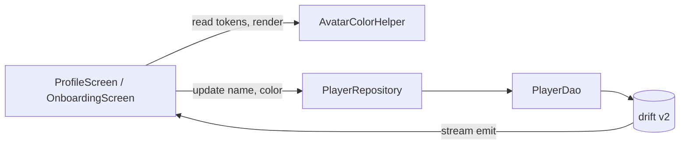

# Architektur — Profile Edit + Avatar (F2)

## Übersicht

Profil-CRUD wird um `update` und um eine neue Spalte `avatarColor` erweitert. Der Avatar selbst ist ein reines View-Konzept: ein Circle mit Initiale und einer Farbe aus der Token-Palette. Farb-Auswahl ist optional — fehlt sie, wird die Default-Farbe deterministisch aus der Player-ID abgeleitet, damit der Avatar bei jedem Render gleich aussieht.

## Bounded Context

- `player/` — bleibt pragmatisch CRUD. Kein Hexagonal-Aufbau nötig.
- `core/data/` — drift-Schema bumpt v1 → v2.
- `core/ui/widgets/` — neuer wiederverwendbarer `AvatarCircle`.

Keine Cross-Context-Abhängigkeiten.

## Schema-Delta

Tabelle `players`: neue Spalte `avatarColor TEXT NULL`.

```dart
TextColumn get avatarColor => text().nullable()();
```

Migration: schemaVersion 2, `MigrationStrategy.onUpgrade` mit `m.addColumn(players, players.avatarColor)`. In-Memory-Tests gehen über `onCreate` und sehen die Spalte direkt.

## Komponenten-Delta

| Komponente | Verantwortlichkeit | Lebt in | Status |
|---|---|---|---|
| `Players` | Schema mit avatarColor | `lib/core/data/tables/players.dart` | changed |
| `AppDatabase` | schemaVersion 2 + onUpgrade | `lib/core/data/app_database.dart` | changed |
| `PlayerDao.update` | Update-by-id | `lib/core/data/dao/player_dao.dart` | changed |
| `PlayerRepository.update` | Wrapper über DAO | `lib/features/player/data/player_repository.dart` | changed |
| `AvatarColorHelper` | Hash → Palette + Initiale | `lib/features/player/presentation/avatar_color.dart` | new |
| `AvatarCircle` | Renderwidget | `lib/core/ui/widgets/avatar_circle.dart` | new |
| `OnboardingScreen` | Vorschau eingebaut | `lib/features/player/presentation/onboarding_screen.dart` | changed |
| `ProfileScreen` | Edit-Mode + Color-Picker | `lib/features/player/presentation/profile_screen.dart` | changed |

## Datenfluss

1. UI tippt Save → ruft `PlayerRepository.update(id, name, avatarColor)`.
2. Repo delegiert an `PlayerDao.update(...)` (drift `update().replace()`).
3. drift Stream emittiert → `currentProfileProvider` → `ProfileScreen` rendert neu.

## Avatar-Color-Palette

6 Token-Farben: `meadow500, meadow700, wood400, wood600, stone500, stone700`. Speicherung als Hex-String, z.B. `0xFF3A7C2E`. Default-Wahl bei `avatarColor == null`: `palette[hash(player.id) % palette.length]`.

## Tech-Stack-Erweiterung

Keine. Alles in bestehendem Stack.

## Diagramm



## Scale-Impact

Keiner. Reines lokal-Profil-CRUD, kein Sync, keine Listen-Pagination, kein User-Wachstum-Trigger.
