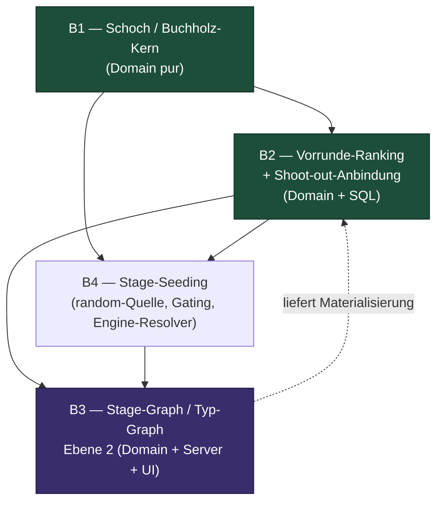
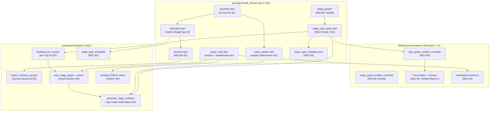

# Architektur — Schoch/Buchholz, Vorrunde-Ranking, Stage-Graph & Stage-Seeding

**Status:** Architektur-Entwurf fuer die gemeinsame Umsetzung von vier Specs.
**Datum:** 2026-06-21
**Bounded Context:** `tournament/` (hexagonal-light, ADR-0002). Domain bleibt
Flutter-frei (`packages/kubb_domain/`).
**Bezug:** ADR-0030 (Stage-Graph-Framework), ADR-0033 (Wizard-Redesign), ADR-0034
(KO-Matchup/Tiebreak-Konsum), ADR-0019 (Pool-Phase), ADR-0024 (Tiebreaker/Punkte).
**Specs:**
- `docs/specs/schoch-swiss-pairing-buchholz-spec.md`
- `docs/specs/vorrunde-ranking-spec.md`
- `docs/specs/stage-graph-and-stage-type-modeling-spec.md`
- `docs/specs/stage-seeding-spec.md`

---

## 1. Uebersicht

Die vier Specs greifen alle in den Turnier-Setup- und Turnier-Run-Pfad ein, aber
auf sehr unterschiedlicher Tiefe. Zwei davon sind enge, klar abgegrenzte
Korrekturen an reiner Domain-Logik (Schoch/Buchholz, Vorrunde-Ranking). Zwei sind
strukturelle Erweiterungen, die Domain, Server, UI und das Datenmodell betreffen
(Stage-Seeding klein, Stage-Graph-Modellierung gross).

Die zentrale Architektur-Aussage: **die zwei Ranking-Korrekturen sind das
Fundament, auf dem alles andere richtig wird.** Die Vorrunden-Rangfolge speist das
`aus Vorrunde`-Seeding der KO-Stufe; die korrigierte Buchholz-Formel speist die
Schoch-Rangfolge; die Schoch-Paarung speist die Materialisierung der Vorrunde-Stufe
im Typ-Graphen. Wer den Stage-Graph zuerst baut, baut ihn auf einer falschen
Rangfolge auf und muss zweimal nacharbeiten.

Eine zweite Architektur-Aussage betrifft die **doppelte Wahrheit Dart vs. SQL.**
Die testbare Domain-Logik liegt in `kubb_domain` (pure Dart), die live gespielte
Wahrheit liegt heute in `>10` SQL-Migrationen. Beide Ranking-Pfade haengen den
Buchholz-Fallback hart an. Ein Fix, der nur eine Seite trifft, laesst Anzeige und
gespielten Cut auseinanderlaufen. Diese Architektur verlangt fuer jede
Ranking-Aenderung **beide Pfade in einem Milestone** und einen Paritaets-Test
(Golden-Dataset Dart, danach SQL-Spiegelung gegen dieselben Soll-Werte).

---

## 2. Reihenfolge der vier Bereiche (uebergreifende Abhaengigkeit)



**Begruendung der Kette:**

1. **B1 — Schoch/Buchholz-Kern zuerst.** Reine Domain-Korrektur ohne Migration,
   kein UI. Liefert die kubb.live-konforme Buchholz-Formel und die stabile
   Startnummer-Sortierung. Alles andere, das Buchholz oder Schoch-Reihenfolge
   braucht, baut darauf auf. Kleinstes Risiko, hoechster Hebel.

2. **B2 — Vorrunde-Ranking + Shoot-out.** Trennt die Rangfolge pro Vorrunden-Typ
   (Gruppenphase = `points -> kubb_difference -> shootout`, Schoch =
   `points -> buchholz -> shootout`). Braucht den korrigierten Buchholz aus B1.
   Muss Dart UND alle SQL-Ranking-Funktionen gleichzeitig anfassen. Die
   Shoot-out-Maschinerie ist zu ~85% gebaut und wird nur an die neuen Chains
   gekoppelt.

3. **B4 — Stage-Seeding.** Kann teils parallel zu B2 laufen (nur Buchholz aus B1
   noetig fuer den `fromPrevRanking`-Resolver, der die Vorrunden-Rangliste
   konsumiert — diese Konsumption gehoert eigentlich zu B2). Bringt die neue
   Seeding-Quelle `random` (deterministisch via Seed), das UI-Gating der
   Optionsliste je Stufenart und den fehlenden Engine-Resolver, der
   `node.seeding` ueberhaupt erst auswertet. Reduziert die Pool-Verteilung auf
   Snake.

4. **B3 — Stage-Graph / Typ-Graph (Ebene 2).** Der grosse Brocken. Braucht die
   korrigierte Schoch-Paarung (B1) und die per-Typ-Rangfolge (B2) fuer die
   Materialisierung der Vorrunde-Stufe, und die Seeding-Quellen aus B4 fuer das
   Seeding pro Stufe/Runde. Kommt deshalb zuletzt. Innerhalb von B3 gilt die
   Etappenfolge der Spec (Datenmodell -> Editor -> Templates -> Engine -> Summary).

**Faustregel:** B1 -> {B2, B4 parallel, B2 vor dem B4-`fromPrevRanking`-Resolver}
-> B3.

---

## 3. Bereich B1 — Schoch / Swiss / Buchholz-Kern

### 3.1 Komponenten

| Layer | Komponente | REUSE / NEU |
|---|---|---|
| Domain | `pairing/buchholz.dart` (`BuchholzCalculator.scoreFor`) | REUSE-Geruest, Kern-Fix |
| Domain | `tiebreaker.dart` (`ParticipantStats._buchholz`) | Fix (gleiche Formel) |
| Domain | `pairing/swiss_system.dart` (Sort + Paarung + Freilos) | REUSE, RNG-jitter ersetzen |
| Domain | `standings.dart` (`byeScoreForUnopposedParticipant`) | Fix: Schoch = fest 16 |
| Tests | Golden-Fixture SM Einzel 2026 + Test-Harness | NEU |
| Server | `tournament_stage_ranking.sql`, `stage_generate_de_cons_swiss.sql` | Fix (siehe ADR-0036) |

### 3.2 Der Buchholz-Fix (Kern)

Die heutige Formel summiert nur die Gegner-Endpunkte (naiv) — fuer Buschi 746 statt
682. Die Korrektur ist pro Gegner der Abzug von `scoreOf(opp gegen P)`:

```
Buchholz(P) = Sum ueber Gegner G von ( totalPoints(G) - scoreOf(G gegen P) )
```

Der Fix ist lokal in `BuchholzCalculator.scoreFor`: pro Gegner-Match zusaetzlich
die Punkte abziehen, die der Gegner in genau diesem Match gegen P erzielt hat.
`buchholzMinusH2H` in `tiebreaker.dart` ist **nicht** diese Formel (zieht nur den
H2H gegen den einen verglichenen Gegner ab) und bleibt unangetastet — wird in der
Schoch-Chain schlicht nicht mehr verwendet.

### 3.3 Stabile Startnummer statt RNG-jitter

`swiss_system.dart` nutzt heute `math.Random(tournamentId.hashCode ^ roundNumber)`
als 3. Sortier-Schluessel — ein per-Runde frisch geseedeter Zufall, der gegen §6.4
(kein Zufall pro Runde) und gegen Determinismus ueber Prozessgrenzen verstoesst
(`String.hashCode` ist in Dart nicht stabil). Ersatz: eine ueber das ganze Turnier
**stabile Startnummer/Seed** als 3. Schluessel. Die Quelle dieser Startnummer ist
die Stufen-Setzliste aus B4 (`StageSeedingSource`, inkl. der neuen `random`-Quelle
mit gespeichertem Seed). Bis B4 steht, dient der bestehende Seed-Index aus
`seedFromStandings` als Uebergangsquelle.

### 3.4 Freilos = fest 16 Punkte (Schoch)

`byeScoreForUnopposedParticipant` ist heute Default 0, Tests nutzen 3. Schoch
verlangt fest 16 (voller Sieg, kein Gegner-Eintrag). Wichtig: die 16 fliessen via
`oppTotal` in den Buchholz aller Gegner des Freilos-Spielers — der Golden-Test
muss diese Querwirkung treffen (Meff = 411 exakt). Die 16 gelten als Schoch-Default;
ob unbedingt fuer alle Swiss-Formate, ist Owner-Entscheid (siehe §8).

### 3.5 Golden-Dataset als Quality-Gate

Ohne das SM-Einzel-2026-Fixture (`rangliste/` + `alle-runden/`) sind die Gates
§7.1-7.5 nicht ausfuehrbar. Das Dataset muss als Test-Fixture ins Repo
(`packages/kubb_domain/test/tournament/golden/`). Datenschutz/Pseudonyme klaeren
(Owner-Entscheid). Gates: Punkte 73/73, Buchholz 73/73 (Vektoren Buschi=682,
Beni=691, Sparringspartner=720, Meff=411, Die Nase=390), Freilos 8/8, Rematch 0/288,
Paarungs-Reproduktion R2-R8 >= 77 %, R3-R8 >= 87 %, R6 = 36/36, Fold-Negativtest.

### 3.6 Source-of-Truth-Frage

Der Dart-`SwissSystemStrategy` ist heute **nirgends** in `lib/` verdrahtet; die
Live-Standings/Routing laufen ueber SQL (`tournament_stage_ranking` ohne Buchholz).
Ein Dart-only-Fix aendert das gespielte Verhalten nicht. ADR-0036 legt die
Source-of-Truth fest (Heuristik in Dart, Server validiert — analog OD-M5-04) und
zieht den Buchholz in die SQL-Schoch-Rangfolge nach.

---

## 4. Bereich B2 — Vorrunde-Ranking & Shoot-out

### 4.1 Komponenten

| Layer | Komponente | REUSE / NEU |
|---|---|---|
| Domain | `tiebreaker.dart` (`TiebreakerChain`, `kubbDifference`) | REUSE, Chain-Selektor NEU |
| Domain | per-Typ-Chain-Builder `chainForStageType(...)` | NEU |
| Domain | `shootout.dart` (`detectShootoutGroups`, `resolveWithShootouts`) | REUSE (~85 %) |
| Server | alle Ranking-`row_number`-Funktionen (>10 Migrationen) | Fix per neuer Migration |
| Server | `_tournament_detect_shootout_groups` tied-Key | Erweitern (Schoch: Buchholz) |
| Persist | per-Stage Ranking-Chain in `StageNode.config` | NEU (siehe ADR-0035) |

### 4.2 Per-Typ-Rangfolge trennen

Heute gilt **eine** globale `tiebreakerOrder` pro Turnier; der SQL-`row_number`
haengt zusaetzlich immer `-e.buchholz`, `-kubb_diff`, `-h2h_sum` als Fallback an.
Das ist die harte Spec-Verletzung: Gruppenphase darf Buchholz in **keinem** Pfad
enthalten.

Loesung: die Rangfolge wird **aus dem Stage-Typ abgeleitet**, nicht frei
konfiguriert (ADR-0035):

- Gruppenphase: `total_points -> kubb_difference -> mighty_finisher_shootout`.
- Schoch: `total_points -> buchholz(Formel B1) -> mighty_finisher_shootout`.

Dart bekommt einen Builder `chainForStageType(type)`, der die richtige
`TiebreakerChain` liefert; `computeStandings` nimmt sie schon heute als Parameter
(REUSE). Server bekommt eine neue Migration, die in jeder Ranking-Funktion nach
Stage-Typ verzweigt und den pauschalen Buchholz-Fallback fuer `group_phase`
entfernt.

### 4.3 Shoot-out-Anbindung

Die Shoot-out-Erkennung (`detectShootoutGroups`, straddle-cut) ist fertig und
korrekt. Sie haengt heute an einem tied-Key aus `total_points/wins/kubb_difference`.
Fuer Gruppenphase ist das exakt richtig. Fuer Schoch muss der Server-tied-Key um
den korrigierten Buchholz erweitert werden, sonst loest er Shoot-outs aus, die
Buchholz bereits getrennt haette. Der Flow bleibt: pending Shoot-out-Gruppe
blockiert `tournament_start_ko_phase` (`P0001`), Ergebnis legt `orderedWinners`
fest, kein stiller ID-Fallback.

---

## 5. Bereich B4 — Stage-Seeding

### 5.1 Komponenten

| Layer | Komponente | REUSE / NEU |
|---|---|---|
| Domain | `StageSeedingSource` (+ Wert `random`) | Erweitern |
| Domain | pure `seedRandom(ids, seed)` (Fisher-Yates) | NEU (aus `pool_phase` heben) |
| Domain | ELO-Resolver `seedFromElo` | REUSE |
| Domain | `PoolGroupingStrategy` (random/seeded aus UI nehmen) | Umbau |
| UI | `seedingSourcesFor(stageType, isRoot)` Gate-Helper | NEU |
| UI | Seeding-Dropdown in beiden Editoren | Erweitern |
| Server | CHECK-Constraint `seeding` um `random` widenen | Migration NEU |
| Server | Boot/Runner: Seed-Resolution aus `node.seeding` | NEU (Kern-Luecke) |

### 5.2 Die neue Quelle `random`

`StageSeedingSource` kennt heute `from_elo`, `from_prev_ranking`, `manual`,
`as_routed`. Ergaenzt wird `random('random')`. Der Determinismus-Baustein existiert
bereits (gespeicherter `random_seed` + Fisher-Yates in `pool_phase.dart`); er wird
zu einer puren `seedRandom(ids, seed)` gehoben und als Seeding-Quelle verdrahtet.
Der Seed wird **einmal bei Stufenstart** gezogen und persistiert (nicht pro Aufruf),
damit Vorschau == gespielte Liste und damit die Schoch-Startnummer (B1 §3.3) stabil
bleibt.

Folge-Stellen, die exhaustiv ueber `StageSeedingSource.values` switchen
(`stageSeedingSourceLabel`), brechen ohne `random`-Case — der Linter erzwingt
Vollstaendigkeit (gewollt). Die Server-CHECK-Constraint muss **additiv** geweitet
werden (Muster aus `20261293000000`), sonst lehnt die laufende alte App-Version
Schreibvorgaenge ab.

### 5.3 Gating der Optionsliste

Heute bietet das Dropdown alle Quellen fuer jede Stufe an — Vorrunde bekommt
faelschlich `aus Vorrunde`. Neuer Gate-Helper:

- Vorrunde / Root (keine eingehende Kante): {ELO, Zufall, Manuell}.
- KO / Folge-Stufe (eingehende Kante): {aus Vorrunde, ELO, Zufall, Manuell}.

Die Root/Folge-Erkennung existiert bereits in `stage_validation.dart` (V5) und wird
fuer das UI-Gating wiederverwendet. Die Validierung bleibt als Sicherheitsnetz.
Muster: `selectableStageNodeTypes` zeigt das gefilterte-Enum-Dropdown-Pattern.

### 5.4 Pool-Verteilung auf Snake reduzieren

`PoolGroupingStrategy { snake, random, seeded }` wird auf Snake als einzige
**UI-Auswahl** reduziert; Zufalls-Gruppen entstehen sauber durch Quelle = Zufall +
Snake. Empfehlung (ADR fuer Migrationssicherheit): den Enum-Wert nicht hart
loeschen, sondern aus der UI nehmen und im plpgsql/Reader einen Fallback
`random/seeded gespeichert -> snake gelesen` einziehen, damit alte Drafts/Templates
nicht brechen. Der `seeded`-Default in `tournament_config_draft.dart` wird auf
`snake` umgestellt.

### 5.5 Engine-Resolver (Kern-Luecke)

Heute konsultiert die Engine `node.seeding` **gar nicht**: Root wird immer nach der
turnier-weiten `seed`-Spalte gesetzt, Folge-Stufen nach Routing-Ordinal. Es gibt
keinen Pfad `resolve seed order FROM node.seeding`. NEU: eine per-Stufe
Seed-Resolution im Boot (`tournament_start_stage_graph`) und im Runner
(`tournament_stage_runner`), die je nach Quelle aufloest:

- `from_elo` -> `tournament_autoseed_from_elo` (REUSE).
- `random` -> Fisher-Yates mit persistiertem Seed (Dart-Parity-Test gegen plpgsql).
- `manual` -> pro-Stufe-Liste (siehe Owner-Entscheid pro-Stufe vs. pro-Turnier).
- `from_prev_ranking` -> Vorrunden-Schlussrangliste aus B2 (`chainForStageType`).

---

## 6. Bereich B3 — Stage-Graph / Typ-Graph (Ebene 2)

### 6.1 Die zwei Ebenen

Ebene 1 (Stage-Graph: Stufen als Kacheln + Edges) existiert und ist reif — wird nur
erweitert/aufgeraeumt. Ebene 2 (Typ-Graph: eine Stufe selbst als Graph aus Runden,
Feldern F1..Fn, Sieger-/Verlierer-Edges) **fehlt komplett** und ist der Kern dieser
Spec.

### 6.2 Datenmodell-Entscheid (ADR-0037)

Das Feld/Runde/Edge-Modell wird als eigene, pure Domain-Struktur gebaut
(`stage_type_graph.dart`: `TypeRound`, `TypeField`, `FieldEdge`) und als
`jsonb`-Sub-Graph in `StageNode.config` serialisiert — kein neues Tabellen-Set.
Begruendung: das Stage-Graph-Modell (`stage_node.dart`, `stage_edge.dart`,
`edge_selector.dart`) ist das exakte Vorbild (immutable, wire-stabile
`toJson/fromJson`, sealed Selektor mit `kind`-Diskriminator). Die Edge-Selektoren
`winners`/`losers_of_rounds` sind bereits die Sieger/Verlierer-Sprache der Spec. Ein
jsonb-Sub-Graph haelt das Template-Format teilnehmer-agnostisch und vermeidet eine
zweite Tabellen-/RLS-Schicht. Details und Alternativen in ADR-0037.

### 6.3 Komponenten

| Layer | Komponente | REUSE / NEU |
|---|---|---|
| Domain | `stage_type_graph.dart` (Runde/Feld/Edge-Modell) | NEU (Vorbild stage_graph) |
| Domain | `stage_type_validation.dart` (fallend/konstant/offen/Kapazitaet x2) | NEU (Vorbild validateStageGraph) |
| Domain | `generateRound1(category, count)` (F1..F(n/2)) | NEU |
| Domain | `MatchFormatSpec`, `KoMatchup`, `KoTiebreakMethod` | REUSE 1:1 |
| Application | Typ-Graph-Builder-Controller (ein Provider) | NEU (Vorbild stage_graph_builder_controller) |
| UI | Handy-Form-Editor fuer Runden/Felder/Edges | NEU (Vorbild stage_graph_builder_screen) |
| UI | Desktop-Canvas Port->Port fuer Felder | NEU (Vorbild stage_graph_canvas) |
| UI | `ko_round_block.dart` Editor-Widget | REUSE |
| Data | Stufen-Typ-Template-Tabelle + save/apply RPC + Repo | NEU (Vorbild 20261230000000) |
| Server | Materialisierung aus Typ-Graph (Feld->Feld Sieger/Verlierer) | NEU + REUSE Routing |
| Server | `ko_tiebreak_method` server-autoritativ pro Feld | Erweitern |
| Server | Stage-KO-Runden 2+ Scheduling (`ko_round_formats[r]`) | NEU |
| UI | Summary um Runden/Felder-Detail erweitern | Erweitern |

### 6.4 Validierung (Ebene 2)

Zusaetzlich zu V1-V7 (`validateStageGraph`, REUSE-Skelett):

- KO: Teilnehmerzahl pro Runde strikt fallend, letzte Runde = 1 Feld.
- Vorrunde: konstant.
- Jedes Feld braucht fuer Sieger und Verlierer ein Ziel oder den expliziten Zustand
  `offen` (offen = Warnung, kein Error — `ValidationSeverity` REUSE).
- Keine Sackgassen ausser Terminal, azyklisch (Kahn REUSE), Kapazitaet konsistent
  (eingehend = Felder x 2 in KO-Runde).
- Speichern/Veroeffentlichen bei Errors blockiert (`hasErrors` REUSE).

### 6.5 Editor-Paritaet

Strikt ein Provider, eine Serialisierung — wie Ebene 1. Beide Views (Handy-Form +
Desktop-Canvas) mutieren denselben State, jede Mutation re-validiert live. Das ist
die einzige Versicherung gegen AC §9.5 (gleiches serialisiertes Modell auf beiden
Geraeten). Ohne diese Disziplin divergiert der State.

### 6.6 Engine-Materialisierung

`tournament_generate_stage_matches` ist heute typ-fix (CASE ueber 7 Typen). NEU: ein
generischer Materializer, der aus dem Typ-Graphen Felder als Matches erzeugt und
Sieger/Verlierer entlang der Feld-Edges schiebt. Die Routing-/Advance-Maschinerie
(`tournament_route_completed_stage`, `tournament_advance_ko_winner`,
`_tournament_compute_ko_bracket`) ist die starke REUSE-Basis. Dieser Materializer
ist gross und sprengt das 100-LOC-Task-Limit deutlich — der Scrum-Master muss fein
nach Runden-Materialisierung / Sieger-Advance / Verlierer-Route / Scheduling
splitten.

Zwei bereits (teil-)gebaute Lueckenmeldungen der Spec sind veraltet und nicht neu zu
bauen: `ko_tiebreak_method` wird am Match-Detail bereits konsumiert (nur
server-autoritative Durchsetzung pro Feld fehlt), und die Summary rendert die
Stage-Config bereits H2-konform (nur Runden/Felder-Ebene fehlt). Der Implementer
plant gegen den Ist-Code, nicht gegen den Spec-Status-Text.

---

## 7. Komponenten- und Abhaengigkeits-Diagramm



---

## 8. ADRs

### ADR-0035: Vorrunden-Rangfolge aus dem Stage-Typ ableiten (nicht frei konfigurierbar)

- **Status**: Proposed
- **Date**: 2026-06-21
- **Depends on**: ADR-0024, ADR-0030

**Context.** Heute gibt es eine globale `tiebreaker_order` pro Turnier, und der
SQL-Cut haengt ueberall pauschal Buchholz/H2H/kubb_diff an. Die Vorrunde-Spec
verlangt zwei feste, getrennte Rangfolgen je Vorrunden-Typ und verbietet Buchholz in
der Gruppenphase in **jedem** Pfad — auch als stillen Fallback.

**Decision.** Die Vorrunden-Rangfolge wird **strikt aus dem Stage-Typ abgeleitet**:
Gruppenphase = `points -> kubb_difference -> shootout`, Schoch =
`points -> buchholz -> shootout`. Kein User-Override pro Stufe. Dart liefert die
Chain ueber `chainForStageType(type)`; jede SQL-Ranking-Funktion verzweigt nach
Stage-Typ und der pauschale Buchholz-Fallback entfaellt fuer `group_phase`.

**Alternatives considered.** Frei konfigurierbare Chain pro Stufe (verworfen: laedt
genau die Spec-Verletzung wieder ein, die der Owner bewusst ausschliesst, und
braucht zusaetzliche UI). Globale Chain beibehalten und nur den Default aendern
(verworfen: trennt die Typen nicht, Gruppenphase behielte Buchholz im Fallback).

**Consequences.** Setup-Wizard exponiert die Vorrunden-Rangfolge nicht mehr als
freie Wahl — weniger UI, weniger Fehlbedienung. Bestehende Turniere mit
abweichender `tiebreaker_order` aendern ihr Cut-Verhalten; Migrationspfad fuer
laufende Turniere pruefen. Die Chain wird pro `StageNode` aus dem Typ bestimmt,
nicht persistiert — keine zusaetzliche Spalte.

### ADR-0036: Buchholz und Schoch-Ranking server-autoritativ; Dart bleibt Heuristik + Test-Truth

- **Status**: Proposed
- **Date**: 2026-06-21
- **Depends on**: ADR-0030, OD-M5-04

**Context.** Buchholz/Swiss liegt doppelt vor: testbar in `kubb_domain` (heute nicht
in `lib/` verdrahtet) und live in SQL (`tournament_stage_ranking`, das Buchholz
bewusst weglaesst). Ein Dart-only-Fix aendert das gespielte Verhalten nicht; ein
SQL-only-Fix trifft die Golden-Tests nicht.

**Decision.** Der Server bleibt autoritativ fuer Live-Standings, Cut und Routing —
die SQL-Schoch-Rangfolge wird um den korrigierten Buchholz (Formel §5) ergaenzt. Die
Dart-Domain bleibt die getestete Source-of-Truth der Formel (Golden-Dataset) und die
Heuristik-Quelle fuer die Paarung; der Client schlaegt Paarungen vor, der Server
validiert (analog OD-M5-04). Jede Ranking-Aenderung trifft beide Pfade in einem
Milestone, mit Paritaets-Test gegen dieselben Soll-Werte.

**Alternatives considered.** Nur Dart, Server ruft Dart nicht (verworfen: Live-Cut
bliebe spec-widrig). Nur SQL, Golden-Tests gegen SQL (verworfen: keine pure-Dart
Property-Tests, Bounded-Context-Bruch). Buchholz komplett in eine Edge-Function
auslagern (verworfen: neue Infrastruktur, kein Mehrwert gegen plpgsql).

**Consequences.** Doppelte Pflege der Formel (Dart + plpgsql) mit Paritaets-Test als
Sicherung. Live-Schoch-Cut wird spec-konform. `tournament_stage_ranking` aendert
sich fuer Schoch-Stages rueckwirkend — bestehende Daten pruefen.

### ADR-0037: Typ-Graph (Ebene 2) als jsonb-Sub-Graph in StageNode.config

- **Status**: Proposed
- **Date**: 2026-06-21
- **Depends on**: ADR-0030

**Context.** Das Feld/Runde/Sieger-Verlierer-Modell einer Stufe (Ebene 2) fehlt. Die
Spec laesst offen, ob es als jsonb-Sub-Graph in `StageNode.config` oder als eigenes
Tabellen-/Domain-Set lebt. Die Wahl praegt Serialisierung, Validierung, Engine und
Template-Format.

**Decision.** Das Modell wird als eigene, pure Domain-Struktur (`stage_type_graph.dart`)
gebaut und als **jsonb-Sub-Graph in `StageNode.config`** serialisiert. Es folgt 1:1
dem Stage-Graph-Vorbild (immutable, wire-stabile `toJson/fromJson`, sealed Edge mit
`kind`-Diskriminator). Templates speichern den Sub-Graphen als Teil der
Node-Config — teilnehmer-agnostisch, ohne zweite Tabellen-/RLS-Schicht.

**Alternatives considered.** Eigene Tabellen `stage_type_round` / `stage_type_field`
/ `stage_type_field_edge` (verworfen fuer Phase 1: doppelte RLS, Join-Komplexitaet,
Template-Format wird schwerer; vertretbar erst wenn Felder serverseitig
quergeprueft werden muessen). Felder implizit aus Teilnehmerzahl generieren ohne
persistiertes Modell (verworfen: bricht Editor-Paritaet und Summary-Vollstaendigkeit).

**Consequences.** Ein konsistentes Serialisierungs-Muster ueber beide Ebenen. Die
Validierung und der Materializer lesen aus der Node-Config. Wachstumsgrenze: sehr
grosse Typ-Graphen blaehen die jsonb-Config; bei Bedarf spaeter auf Tabellen
migrierbar, da die Domain-Struktur die Persistenz kapselt.

### ADR-0038: Seeding-Quelle `random` mit persistiertem Seed; Pool-Verteilung auf Snake

- **Status**: Proposed
- **Date**: 2026-06-21
- **Depends on**: ADR-0019, ADR-0030, schoch-swiss-pairing-buchholz-spec.md

**Context.** `StageSeedingSource` kennt kein `random`; Zufall existiert heute nur als
Pool-Verteilungsstrategie (snake/seeded/random). Die Seeding-Spec verlangt eine
Seeding-Quelle `random` (deterministisch via Seed) fuer Vorrunde und KO und reduziert
die Pool-Verteilung auf Snake — Zufalls-Gruppen entstehen aus Quelle = Zufall +
Snake, nicht aus zwei Zufalls-Schaltern.

**Decision.** `random('random')` wird zu `StageSeedingSource` ergaenzt. Der Seed wird
**einmal bei Stufenstart** gezogen und persistiert; gleicher Seed -> gleiche
Setzliste (Fisher-Yates, geteilt zwischen Dart-Vorschau und plpgsql-Materialisierung,
Parity-Test). Die SQL-CHECK-Constraint wird additiv geweitet. Die Pool-Verteilung
bietet im UI nur noch Snake; `random/seeded` bleiben als gespeicherte Werte
abwaertskompatibel lesbar (Fallback -> Snake), werden aber nicht mehr angeboten und
der Draft-Default wird Snake.

**Alternatives considered.** Seed bei jedem Aufruf neu wuerfeln (verworfen: bricht
Reproduzierbarkeit und die stabile Schoch-Startnummer). Enum-Wert `random/seeded`
hart aus `PoolGroupingStrategy` loeschen (verworfen: breiter Blast-Radius ueber
Draft/Controller/Wizard/ARB/plpgsql/Tests, alte Templates brechen). `random` nur fuer
den Stage-Graph-Pfad, nicht klassisch (offen, Owner-Entscheid §9).

**Consequences.** Eine einzige Zufallsquelle, sauberes mentales Modell. Der Seed wird
zur stabilen Startnummer fuer Schoch (B1). Alte Drafts mit `seeded`-Verteilung
verhalten sich nach dem Fallback wie Snake — Verhalten gegen Bestandsdaten testen.

---

## 9. Owner-Entscheidungen vor der Umsetzung

Konsolidiert aus den `openQuestions` der vier Gap-Analysen. Reihenfolge nach
Blockier-Wirkung.

1. **Source-of-Truth Schoch/Buchholz (blockiert B1/B2).** Server-autoritativ mit Dart
   als Test-/Heuristik-Truth (Empfehlung, ADR-0036) — oder rein Dart bzw. rein SQL?
   Bestimmt, wo der Buchholz-Fix landet und ob der Live-Cut spec-konform wird.

2. **Golden-Dataset SM Einzel 2026 ins Repo (blockiert B1-Gates).** Duerfen die
   kubb.live-Daten (`rangliste/` + `alle-runden/`) als Test-Fixture eingecheckt werden
   (Datenschutz/Pseudonyme)? Ohne sie sind die Quality-Gates §7.1-7.5 nicht
   ausfuehrbar.

3. **Vorrunden-Rangfolge fix-pro-Typ vs. user-konfigurierbar (blockiert B2,
   ADR-0035).** Empfehlung: fix aus dem Stage-Typ ableiten. Bestimmt, ob UI ergaenzt
   oder Chain hartverdrahtet wird, und den Migrationspfad bestehender
   `tiebreaker_order`.

4. **Datenmodell Ebene 2: jsonb-Sub-Graph vs. eigene Tabellen (blockiert B3,
   ADR-0037).** Empfehlung: jsonb in `StageNode.config`. Praegt Serialisierung,
   Validierung, Engine und Template-Format — vor dem Bau zu fixieren.

5. **Seeding pro-Stufe vs. pro-Turnier (blockiert B4-Engine-Resolver).** Erbt die
   Root-Stufe die turnier-weite Seedliste (`tournament_participants.seed`) und nur
   Folge-Stufen werden per `node.seeding` aufgeloest, oder bekommt jede Stufe eigenen
   Seeding-Speicher (`tournament_stage_seeding_overrides`)? Bestimmt Datenmodell und
   Migrationsumfang.

6. **OFFEN-1 Vorrunde-Routing im Typ-Graph (blockiert die Vorrunde-Kategorie in B3).**
   Braucht eine Vorrunde-Stufe ueberhaupt explizite Feld-Edges, oder nur Runden +
   Paarungsregel (Gruppe/Schoch)? Haengt an Gruppenphase- bzw. Schoch-Logik.

Nachgelagerte (nicht-blockierende) Klaerungen: ELO-Quelle/Fallback bei fehlendem
ELO (OFFEN-2 Seeding); `PoolGroupingStrategy`-Enum hart loeschen oder nur UI-seitig
ausblenden; `random` auch fuer den klassischen `SeedingMode`-Pfad; OFFEN-2/3 des
Stage-Graphen (BYE/ungerade Zahlen, 7 fixe Typen als Vorlagen); Template-Scope
`organizer_teams` jetzt oder mit dem Berechtigungskonzept-Milestone; gruppen-
uebergreifende Kubb-Differenz-Normalisierung.

---

## 10. Risiken & Migrations-Hinweise

| Risiko | Wirkung | Gegenmassnahme |
|---|---|---|
| Doppelte Wahrheit Dart vs. >10 SQL-Ranking-Funktionen | Anzeige und gespielter Cut divergieren | Jede Ranking-Aenderung beide Pfade in einem Milestone + Paritaets-Test |
| Pauschaler Buchholz-Fallback in vielen Migrationen kopiert | Eine Stelle wird uebersehen, Gruppenphase behaelt Buchholz | Eine neue Migration ueber alle Ranking-Funktionen, Audit-Grep nach `e.buchholz` |
| Buchholz-Korrektur aendert Schoch-Ranglisten rueckwirkend | Bestehende/gestartete Turniere verschieben Cut | Golden-Test als Netz, Verhalten gegen Bestandsdaten pruefen |
| Engine-Materializer aus Typ-Graph >> 100 LOC | Senior-Task-Limit gesprengt | Fein splitten: Runden-Materialisierung / Sieger-Advance / Verlierer-Route / R2+-Scheduling |
| Paritaet zweiter Graph-Editor (Canvas + Handy) | State divergiert, AC §9.5 bricht | Strikt ein Provider, eine Serialisierung, Live-Revalidierung (wie Ebene 1) |
| Dart-Random != plpgsql-Random | Vorschau != gespielte Setzliste | Geteilter Fisher-Yates, Golden-Parity-Test gegen Seed |
| Enum-Erweiterung bricht exhaustive switches | Compile-Fehler | Gewollt — Linter erzwingt `random`-Case + ARB-Key |
| `PoolGroupingStrategy.seeded`-Default + alte Templates | Bestandsdaten brechen bei Hart-Entfernung | Wert behalten, Fallback `-> snake`, Draft-Default auf Snake |
| Spec-Drift (ko_tiebreak konsumiert, Summary zeigt Config) | Doppelarbeit | Gegen Ist-Code planen, nicht gegen Spec-Status-Text |

**Migration / `db push`.** Mehrere additive Migrationen sind noetig und muessen vom
Owner per `supabase db push` eingespielt werden, in dieser Reihenfolge:

1. **B2** — neue Ranking-Migration (per-Typ-Chain, Buchholz-Fix in SQL,
   Schoch-tied-Key fuer Shoot-out). Ersetzt den pauschalen Fallback.
2. **B4** — additive CHECK-Constraint-Weitung `seeding ... 'random'` (deploy-safe,
   Muster `20261293000000`) + Seed-Resolver-Funktionen im Boot/Runner.
3. **B3** — Stufen-Typ-Template-Tabelle + save/apply RPC + RLS; generischer
   Typ-Graph-Materializer + R2+-Scheduling + server-autoritativer
   `ko_tiebreak_method`.

Alle Migrationen sind additiv und abwaertskompatibel zu halten (alte App-Version
darf weiter schreiben). Kein destruktives Drop von Enum-Werten oder Spalten in
Phase 1.

---

## 11. Scale-Impact

**Trigger**: Bracket-/Pool-/Swiss-Materialisierung mit potenziell > 32 Teilnehmern;
Ranking-`row_number` ueber alle Vorrunden-Teilnehmer pro Cut.
**Bei welcher Tier kritisch**: 2.
**Mitigation**: Materializer pro Stufe begrenzt (Felder = Teilnehmer/2), kein
Cross-Stage-Join; Ranking-CTE bereits indexiert ueber `tournament_id`. Golden-Dataset
hat 73 Spieler / 8 Runden — ausreichend als Performance-Budget-Smoke. Seed-Resolver
ist O(n) Fisher-Yates.
**Performance-Budget**: Materialisierung einer Stufe < 200 ms serverseitig bei 73
Teilnehmern.
**Migrationsrelevant?**: yes — Owner muss `db push` ausfuehren (siehe §10).
