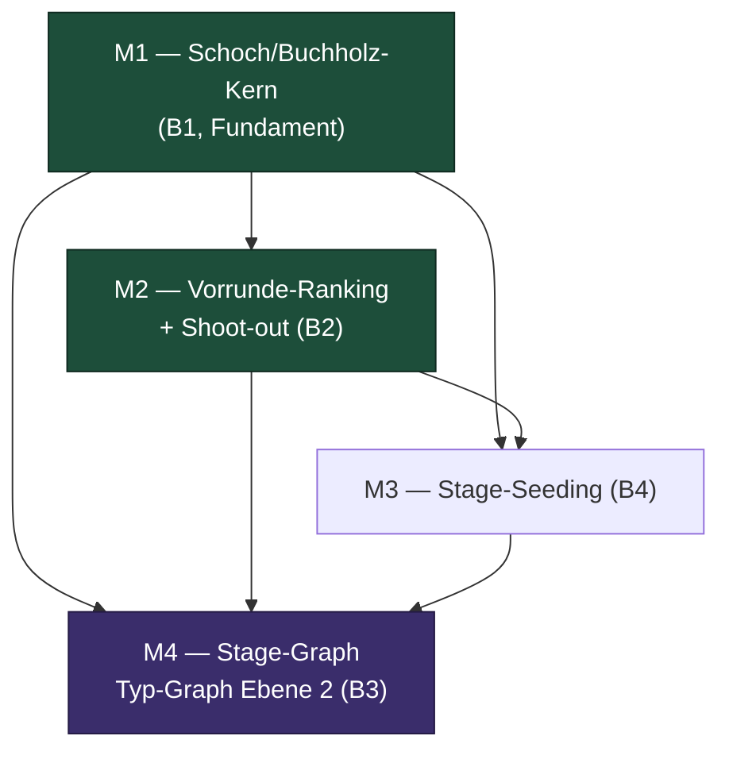

# Sprint-Plan — Schoch/Buchholz, Vorrunde-Ranking, Stage-Seeding & Stage-Graph

**Status:** Meta-Uebersicht zum Backlog `tasks.md`.
**Bezug:** `architecture.md` (Reihenfolge B1->B2->B4->B3), ADR-0035..0038.
**Level:** senior (TDD-first, Conventional-Commit-Scopes, Paritaets-Tests).

---

## 1. Milestone-Liste

| Milestone | Bereich | Inhalt | Tasks | Deps |
|---|---|---|---|---|
| **M1** | B1 — Schoch/Buchholz-Kern | Buchholz-Formel-Fix (Gegenpunkt-Abzug), stabile Startnummer statt RNG-jitter, Freilos=16 (Schoch), Golden-Fixture, SQL-Nachzug + Paritaet | 12 | — |
| **M2** | B2 — Vorrunde-Ranking + Shoot-out | Rangfolge fix pro Vorrunden-Typ (Gruppenphase `points->kubb_diff`, Schoch `points->buchholz`), pauschalen SQL-Buchholz-Fallback raus, Schoch-Shoot-out-Key | 9 | M1 |
| **M3** | B4 — Stage-Seeding | Quelle `random` + persist. Seed, Optionslisten-Gating, Snake-only-Pool, Engine-Seed-Resolver, Parity | 12 | M1 (Seed), M2 (fromPrevRanking-Resolver) |
| **M4** | B3 — Stage-Graph/Typ-Graph Ebene 2 | Feld/Runde/Edge-Modell, zwei paritaere Editoren, Validierung, Templates, generischer Materializer, Summary | 21 | M1, M2, M3 |

**Anzahl Milestones:** 4.
**Anzahl Tasks gesamt:** 54.

---

## 2. Task-Verteilung je Milestone

| Milestone | domain | data | tests | frontend | infra | Summe |
|---|---|---|---|---|---|---|
| M1 | 4 | 1 | 6 | 0 | 1 | 12 |
| M2 | 2 | 2 | 5 | 0 | 0 | 9 |
| M3 | 2 | 2 | 4 | 4 | 0 | 12 |
| M4 | 4 | 7 | 6 | 4 | 0 | 21 |
| **Summe** | **12** | **12** | **21** | **8** | **1** | **54** |

Test-Anteil 39 % (21/54) — senior-typisch (TDD-first + Paritaets-/Audit-Tests).

---

## 3. Kritischer Pfad

Der laengste Abhaengigkeitspfad laeuft von der Buchholz-Korrektur ueber die
per-Typ-Rangfolge und den Seed-Resolver bis in den Engine-Materializer des
Typ-Graphen:

```
M1-T01 (Golden-Fixture)
  -> M1-T02 (Failing-Test Buchholz)
  -> M1-T03 (Buchholz-Fix)
  -> M1-T11 (SQL-Buchholz Schoch)
  -> M2-T05 (SQL-Ranking per Typ)
  -> M3-T11 (Seed-Resolver Boot+Runner)
  -> M4-T14 (Runden-Materializer)
  -> M4-T15 (Sieger-Advance)
  -> M4-T19 (Engine-Integrationstest)
```

**Erste 5-8 Tasks des kritischen Pfads:**
M1-T01 -> M1-T02 -> M1-T03 -> M1-T11 -> M2-T05 -> M3-T11 -> M4-T14 -> M4-T15.

Pfadlaenge: 9 Tasks. Geschaetzte Pfad-Dauer (senior-Faktor 0.8):
M(2) + M(2) + S(0.8) + M(2) + L(4) + L(4) + L(4) + M(2) + M(2) ≈ **23 h reine
Pfadarbeit** (ohne Parallelitaet der uebrigen Tasks).

---

## 4. Abhaengigkeitsdiagramm (Milestone-Ebene)



M3 darf teils **parallel** zu M2 starten (nur M3-T11 `fromPrevRanking`-Resolver wartet
auf M2-T05). M4 startet erst, wenn M1/M2/M3 stehen.

---

## 5. Groessen-Summe (Aufwandsschaetzung)

Schaetz-Mitten: S=0.75h, M=2h, L=4h, danach senior-Faktor 0.8.

| Milestone | S | M | L | Brutto (h) | Senior x0.8 (h) |
|---|---|---|---|---|---|
| M1 | 6 | 5 | 0 | 14.5 | 11.6 |
| M2 | 5 | 3 | 1 | 13.75 | 11.0 |
| M3 | 4 | 5 | 2 | 21.0 | 16.8 |
| M4 | 3 | 9 | 6 | 44.25 | 35.4 |
| **Summe** | **18** | **22** | **9** | **93.5** | **≈ 74.8** |

**Geschaetzte Gesamt-Effektivarbeit: ~75 h** (ohne Buffer/Test-Review-Aufschlag —
Test-Tasks sind bereits als eigene Tasks enthalten). M4 traegt knapp die Haelfte des
Aufwands; hier liegt das groesste Risiko (siehe `architecture.md` §10).

> **LOC-Sprenger:** M2-T05, M3-T11, M4-T14 sind als L gefuehrt und koennen das
> 100-LOC/3-Dateien-Limit reissen. Sie werden bei Bedarf in `<id>a/b`-Unter-Tasks
> gesplittet (nach Funktionsgruppe / Seeding-Quelle / Materialisierungsphase) — das
> erhoeht die finale Task-Zahl, aber nicht den Gesamtaufwand.

---

## 6. Owner-Abnahme-Checkpoints

| Checkpoint | Wann | Entscheidung(en) | Blockiert |
|---|---|---|---|
| **CP-0** | vor M1 | Source-of-Truth (ADR-0036) + Golden-Dataset-Freigabe (Pseudonyme) | M1, M2 |
| **CP-1** | vor M2 | Vorrunden-Rangfolge fix-pro-Typ (ADR-0035) | M2 |
| **CP-2** | vor M3 | Seeding pro-Stufe vs. pro-Turnier | M3-T11 |
| **CP-3** | vor M4 | Datenmodell Ebene 2 jsonb (ADR-0037) + OFFEN-1 Vorrunde-Routing | M4 |

**CP-0 und CP-1 sind BLOCKING** (echte Owner-Level-Eskalationen): ohne die
Source-of-Truth-Entscheidung und das freigegebene Golden-Dataset sind die
Quality-Gates §7.1-7.5 der Schoch-Spec nicht ausfuehrbar und M1 kann nicht starten.
CP-2/CP-3 koennen als ADR-Bestaetigung durchlaufen, sofern der Owner den
Empfehlungen (ADR-0037/0038, OFFEN-1: nur Runden + Paarungsregel) folgt.

---

## 7. Risiken (Kurzfassung, Details in architecture.md §10)

- Doppelte Wahrheit Dart vs. >10 SQL-Ranking-Funktionen -> jede Ranking-Aenderung
  beide Pfade in einem Milestone + Paritaets-Test (M1-T12, M2-T06, M3-T12).
- Pauschaler Buchholz-Fallback in vielen Migrationen -> Audit-Grep `e.buchholz` (M2-T06).
- Engine-Materializer >> 100 LOC -> fein gesplittet (M4-T14..T18).
- Editor-Paritaet (Canvas + Handy) -> ein Provider, eine Serialisierung, Paritaets-Test
  (M4-T07, M4-T10).
- Alle Migrationen additiv/abwaertskompatibel; kein destruktives Enum-/Spalten-Drop in
  Phase 1.
