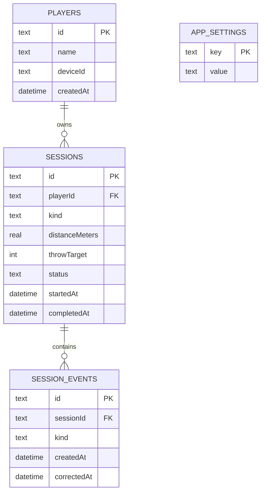
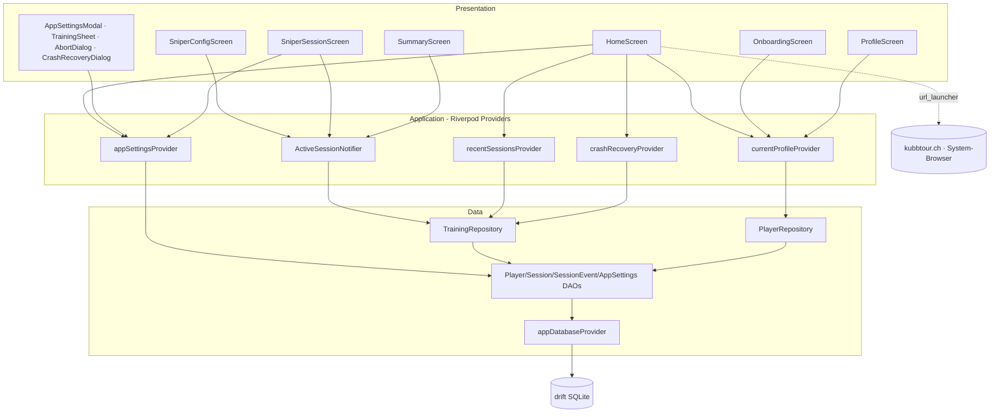

# Architektur — Sniper-Training MVP (F1)

- **Status**: Draft
- **Date**: 2026-05-02
- **Bezug**: `po-output.md` (gleiches Verzeichnis), ADR-0001, ADR-0002, ADR-0005, ADR-0008

## Übersicht

F1 baut die erste lauffähige Iteration der App: ein lokales Spielerprofil, einen HomeScreen mit FAB-Modus-Picker, den Sniper-Trainings-Flow (Konfiguration → Session mit 1-Tap-Counter → Summary) und ein App-Settings-Modal mit Theme- und Tracking-Toggles. Alles offline, alles in drift, kein Cloud-Anteil. Das Feature ist der derisking-Slice für ADR-0008 (Theme-System), die drift-Pipeline und die Riverpod-Integration.

## Bounded-Context-Zuordnung

Alle drei betroffenen Contexts laufen pragmatisch (Riverpod direkt zu drift, kein Domain-Package, keine hexagonale Schichtung). `packages/kubb_domain/` wird nicht angefasst — es gehört zu `match/` und `tournament/`.

| Context | Layer-Stil | Pfade in F1 |
|---|---|---|
| `core/` | gemeinsam | `lib/core/data/` (drift DB + DAOs), `lib/core/ui/` (Theme, Tokens, AppBar, TapPad, Icons, BottomSheet) |
| `training/` | pragmatic | `lib/features/training/data/` (Session-Repo + DAO-Wrapper), `lib/features/training/application/` (Riverpod-Notifier), `lib/features/training/presentation/` (Screens, Sheets) |
| `player/` | pragmatic CRUD | `lib/features/player/data/`, `lib/features/player/application/`, `lib/features/player/presentation/` |
| `app/` | shell | `lib/app/router.dart`, `lib/app/app.dart` (MaterialApp.router-Wrapper, `themeMode` aus Provider) |

Cross-Context-Joins gibt es nicht: training liest `playerId` als opaken FK, mehr nicht. Es gibt keinen Service, der über drift hinweg Spieler-Stats berechnet (das kommt erst in F3).

## Komponenten

### Core — Theme & Persistenz

| Komponente | Verantwortung | Pfad | Status |
|---|---|---|---|
| `KubbTokens` | `ThemeExtension<KubbTokens>` mit allen Hand-Tuned-Tokens aus ADR-0008 (Farben, Spacing, Touch-Targets, Radii, Schriften). Drei Instanzen: light, dark, highContrast. | `lib/core/ui/theme/kubb_tokens.dart` | neu |
| `KubbTheme` | Builder-Klasse mit drei statischen Methoden `light()`, `dark()`, `highContrast()`, die je `ThemeData` zurückgeben (ColorScheme aus Tokens, TextTheme via google_fonts Bricolage Grotesque + JetBrains Mono, ThemeExtension registriert). | `lib/core/ui/theme/kubb_theme.dart` | neu |
| `ThemeChoice` (enum: `light`, `dark`, `highContrast`) | Wahl-Typ für Settings-Provider. Konvertierungs-Helper auf `ThemeMode` + Picker für die HC-Variante. | `lib/core/ui/theme/theme_choice.dart` | neu |
| `AppDatabase` | Drift-Database, schemaVersion 1, vier Tabellen (`Players`, `Sessions`, `SessionEvents`, `AppSettings`). Native via `NativeDatabase.createInBackground` für Android/Linux; Web bleibt für F1 ungetestet (per ADR-0005 ohnehin nur Read-Cache-Pfad). | `lib/core/data/app_database.dart` | neu |
| DAOs (`PlayerDao`, `SessionDao`, `SessionEventDao`, `AppSettingsDao`) | Tabellen-spezifische Read/Write-Operationen. Streams für Watch-Operationen, Futures für Mutations. | `lib/core/data/dao/*.dart` | neu |
| `appDatabaseProvider` | Riverpod-Provider, hält Singleton der `AppDatabase`. Keep-alive. | `lib/core/data/app_database.dart` | neu |

### App-Shell

| Komponente | Verantwortung | Pfad | Status |
|---|---|---|---|
| `KubbApp` | `ConsumerWidget`, baut `MaterialApp.router` mit `theme`, `darkTheme`, `themeMode` und `localizationsDelegates`. Theme-Auswahl (Hell/Dunkel/HighContrast) kommt aus `appSettingsProvider`. | `lib/app/app.dart` | neu |
| `appRouter` | go_router-Konfiguration mit Onboarding-Redirect (siehe Routing-Sektion). | `lib/app/router.dart` | neu |
| `main()` | Bootstrap: WidgetsFlutterBinding, ProviderScope, runApp. | `lib/main.dart` | geändert |

### Training-Context

| Komponente | Verantwortung | Pfad | Status |
|---|---|---|---|
| `TrainingRepository` | Dünner Wrapper über `SessionDao` + `SessionEventDao`. Methoden: `startSession`, `appendEvent`, `softDeleteLastEvent`, `markCompleted`, `discard`, `watchActiveSession`, `watchRecentCompleted`, `loadActiveOrNull`. | `lib/features/training/data/training_repository.dart` | neu |
| `trainingRepositoryProvider` | Riverpod-Provider, der das Repo aus den DAOs zusammenbaut. | `lib/features/training/data/training_repository.dart` | neu |
| `ActiveSessionNotifier` (Riverpod `AsyncNotifier`) | Hält den State der laufenden Session (Counts derived from non-deleted events), kapselt Tap-Logik, ruft Repo + Haptik + Settings-Provider. Methoden: `recordHit`, `recordMiss`, `recordHeli`, `undoLast(kind)`, `complete`, `abortAndDelete`. | `lib/features/training/application/active_session_notifier.dart` | neu |
| `recentSessionsProvider` | Streamt die letzten 3 abgeschlossenen Sessions (nach `completedAt DESC`, `LIMIT 3`), bereitet sie für die HomeScreen-Liste auf (Heli-Filter siehe Heli-Filter-Sektion). | `lib/features/training/application/recent_sessions_provider.dart` | neu |
| `crashRecoveryProvider` | `FutureProvider`, prüft beim Start, ob eine `active`-Session existiert. Wird vom HomeScreen geconsumed; Result triggert den Recovery-Dialog. | `lib/features/training/application/crash_recovery_provider.dart` | neu |
| `OnboardingScreen` | Nur erreichbar via Redirect, wenn kein Profil existiert. Name-Eingabe + Validierung. | `lib/features/player/presentation/onboarding_screen.dart` | neu |
| `HomeScreen` | Top-Bar (Hamburger + Logo + Profil-Icon), Greeting, Tournier-Karte (toast-only), News-Karte (öffnet `https://kubbtour.ch` im System-Browser via `url_launcher`), "Zuletzt"-Section, FAB → TrainingSheet. Konsumiert `recentSessionsProvider`, `crashRecoveryProvider`, `currentProfileProvider`. | `lib/features/training/presentation/home_screen.dart` | neu |
| `SniperConfigScreen` | Distanz-Slider (4.0–8.0 m, 0.5er-Step), optional Zielwurf-Chips (∞, 25, 50, 100, 200) plus Custom-Eingabe (1–999). Bestätigen → erstellt Session in drift, navigiert auf Session. | `lib/features/training/presentation/sniper_config_screen.dart` | neu |
| `SniperSessionScreen` | Counter-Strip (Hit/Miss/Heli, mit Eye-Toggle-Maskierung), Remaining-Anzeige, 4er- oder 6er-TapPad-Grid (abhängig von `heliTracking`), End-Button, Abbrechen-Button. AppBar zeigt Distanz; Settings-Icon ist disabled (per Q-9). | `lib/features/training/presentation/sniper_session_screen.dart` | neu |
| `SummaryScreen` | Verdict-Block mit Trefferquote-Big-Number, Detail-Rows (Treffer/Miss/Heli/Dauer, Heli nur wenn Tracking on), drei Aktionen Verwerfen/Speichern/Neu starten. | `lib/features/training/presentation/summary_screen.dart` | neu |

### Player-Context

| Komponente | Verantwortung | Pfad | Status |
|---|---|---|---|
| `PlayerRepository` | Dünner Wrapper über `PlayerDao`: `currentOrNull`, `create(name)`, `watchCurrent`. Single-Profile-Annahme (F1: max 1 Row in `players`). | `lib/features/player/data/player_repository.dart` | neu |
| `currentProfileProvider` | `StreamProvider`, liefert das aktuelle Profil (oder `null` wenn keins existiert — triggert dann Onboarding-Redirect). | `lib/features/player/application/current_profile_provider.dart` | neu |
| `ProfileScreen` | Read-only-Anzeige Name + DeviceId + Erstellungsdatum. Kein Edit, kein Avatar, keine Auth-Provider. AppBar mit Back-Button. | `lib/features/player/presentation/profile_screen.dart` | neu |

### Settings

| Komponente | Verantwortung | Pfad | Status |
|---|---|---|---|
| `AppSettings` (freezed) | Sealed Wert: `themeChoice`, `heliTracking`, `vibration`, `sniperEyeToggleHidden`. Defaults: light, on, on, false. | `lib/core/data/app_settings.dart` | neu |
| `appSettingsProvider` (Riverpod `AsyncNotifier`) | Lädt Settings beim Start aus `AppSettingsDao` (Key-Value-Tabelle), exponiert `setTheme`, `setHeliTracking`, `setVibration`, `setEyeHidden`. Persistiert pro Mutation, push-update an UI. | `lib/core/ui/settings/app_settings_provider.dart` | neu |
| `AppSettingsModal` | Bottom-Sheet mit vier Rows: Sprache (read-only "Deutsch"), Theme (segmented Hell/Dunkel/HighContrast), Heli-Tracking (toggle), Vibration (toggle). Wird vom HomeScreen geöffnet, vom Hamburger-Icon. | `lib/features/training/presentation/widgets/app_settings_modal.dart` | neu |

### Reusable Widgets

| Komponente | Verantwortung | Pfad | Status |
|---|---|---|---|
| `KubbAppBar` | App-eigene App-Bar mit Eyebrow + Title + optional Back + optional Right-Slot. Folgt `shared.jsx`-Spec. | `lib/core/ui/widgets/kubb_app_bar.dart` | neu |
| `KubbTapPad` | Grosse Tap-Fläche für Hit/Miss/Heli (Plus + Minus). 84 dp Mindesthöhe, Tone-Variante (hit, miss, heli, ghost). Trigger-Callback für Haptik. | `lib/core/ui/widgets/kubb_tap_pad.dart` | neu |
| `KubbCounter` | Stat-Anzeige (Label oben, Big-Number unten) mit Tabular-Numerals und Tone-Color. Maskierungs-Modus für Eye-Toggle. | `lib/core/ui/widgets/kubb_counter.dart` | neu |
| `KubbBottomSheet` | Sheet-Container mit Grabber, Header, runden Top-Ecken — wiederverwendet vom TrainingSheet, AppSettingsModal, AbortDialog. | `lib/core/ui/widgets/kubb_bottom_sheet.dart` | neu |
| `KubbIcons` | Brand-Icons (Heli, King, Cup, Trophy, Star, Flame, Stat, Target, Profile) als `CustomPainter`-Widgets. Generic Icons aus `lucide_icons`. | `lib/core/ui/icons.dart` | neu |
| `TrainingSheet` | Bottom-Sheet vom HomeScreen FAB: zwei Mode-Karten (Sniper-Training aktiv, Finisseur als Coming-Soon mit Toast). | `lib/features/training/presentation/widgets/training_sheet.dart` | neu |
| `AbortDialog` | Modal-Dialog "Speichern / Verwerfen / Zurück" beim Session-Abbruch (mit Variante "nur Verwerfen / Zurück" für 0-Throw-Sessions). | `lib/features/training/presentation/widgets/abort_dialog.dart` | neu |
| `CrashRecoveryDialog` | Modal-Dialog beim App-Start, wenn `loadActiveOrNull()` ein Result liefert. Drei Buttons: Fortsetzen / Speichern als beendet / Verwerfen. | `lib/features/training/presentation/widgets/crash_recovery_dialog.dart` | neu |

## Schnittstellen

### DAOs (drift-generiert, manuell erweitert um Stream/Future-Methoden)

```dart
// PlayerDao
Future<PlayerRow?> currentOrNull();
Stream<PlayerRow?> watchCurrent();
Future<int> insertPlayer(PlayerCompanion row);

// SessionDao
Future<SessionId> insertSession(SessionCompanion row);
Future<SessionRow?> activeOrNull();
Stream<SessionRow?> watchActive();
Stream<List<SessionRow>> watchRecentCompleted({int limit = 3});
Future<void> markCompleted(SessionId id, DateTime at);
Future<void> markDiscarded(SessionId id);
Future<void> hardDeleteSession(SessionId id);   // cascades to events via FK ON DELETE CASCADE

// SessionEventDao
Future<void> appendEvent(SessionEventCompanion row);
Future<SessionEventRow?> latestNonDeletedOfKind(SessionId id, EventKind kind);
Future<void> softDelete(EventId id, DateTime at);
Stream<List<SessionEventRow>> watchEventsOfSession(SessionId id);

// AppSettingsDao
Future<AppSettings> load();
Future<void> save(AppSettings settings);
```

### Riverpod-Notifier-API

```dart
class ActiveSessionNotifier extends AsyncNotifier<ActiveSessionState?> {
  Future<void> startSession({required double distance, int? throwTarget});
  Future<void> recordHit();
  Future<void> recordMiss();
  Future<void> recordHeli();
  Future<void> undoLast(EventKind kind);   // soft-delete most recent
  Future<void> complete();                  // → Summary-Route
  Future<void> abortAndDelete();            // hard delete
  Future<void> resumeFromCrash();           // re-hydrate from drift
}

class AppSettingsNotifier extends AsyncNotifier<AppSettings> {
  Future<void> setTheme(ThemeChoice choice);
  Future<void> setHeliTracking(bool on);
  Future<void> setVibration(bool on);
  Future<void> setEyeHidden(bool hidden);
}
```

`ActiveSessionState` ist ein freezed-Record: `sessionId`, `distance`, `throwTarget`, `startedAt`, `hits`, `misses`, `helis`, `eyeHidden`. Counts werden im Notifier aus `watchEventsOfSession` derived (Filter: `correctedAt IS NULL`).

## Daten-Modell

### Drift-Schema (v1)

```dart
class Players extends Table {
  TextColumn get id => text()();                        // UUIDv7
  TextColumn get name => text().withLength(min: 1, max: 60)();
  TextColumn get deviceId => text()();                  // UUIDv7
  DateTimeColumn get createdAt => dateTime()();
  @override Set<Column> get primaryKey => {id};
}

class Sessions extends Table {
  TextColumn get id => text()();                        // UUIDv7
  TextColumn get playerId => text().references(Players, #id, onDelete: KeyAction.restrict)();
  TextColumn get kind => text()();                      // 'sniper' (extensible)
  RealColumn get distanceMeters => real()();            // 4.0..8.0
  IntColumn get throwTarget => integer().nullable()();  // 1..999 or null
  TextColumn get status => text()();                    // 'active' | 'completed' | 'discarded'
  DateTimeColumn get startedAt => dateTime()();
  DateTimeColumn get completedAt => dateTime().nullable()();
  @override Set<Column> get primaryKey => {id};
}

class SessionEvents extends Table {
  TextColumn get id => text()();                        // UUIDv7
  TextColumn get sessionId => text().references(Sessions, #id, onDelete: KeyAction.cascade)();
  TextColumn get kind => text()();                      // 'hit' | 'miss' | 'heli'
  DateTimeColumn get createdAt => dateTime()();
  DateTimeColumn get correctedAt => dateTime().nullable()();   // soft-delete (Undo)
  @override Set<Column> get primaryKey => {id};
}

class AppSettingsTable extends Table {
  TextColumn get key => text()();                       // 'theme', 'heliTracking', 'vibration', 'eyeHidden'
  TextColumn get value => text()();                     // JSON-encoded scalar
  @override Set<Column> get primaryKey => {key};
}
```

### Indizes

- `Sessions(status, completedAt DESC)` — für `recentSessionsProvider` und `loadActiveOrNull` (drift-`Index`-Annotation oder roher `CREATE INDEX`-Statement in der Migration).
- `SessionEvents(sessionId, correctedAt, createdAt DESC)` — für die Counter-Aggregation und Undo-Lookup.

### ER-Diagramm



## Routing

go_router-Setup mit zwei Redirect-Regeln. Die Recovery-Logik läuft NICHT im Router, sondern als Dialog-Trigger auf dem HomeScreen — der Router weiss nichts von der aktiven Session.

| Path | Builder | Redirect |
|---|---|---|
| `/onboarding` | `OnboardingScreen` | wenn Profil existiert → `/` |
| `/` | `HomeScreen` | wenn kein Profil → `/onboarding` |
| `/profile` | `ProfileScreen` | — |
| `/training/sniper/config` | `SniperConfigScreen` | — |
| `/training/sniper/session/:id` | `SniperSessionScreen(sessionId: id)` | — |
| `/training/summary/:id` | `SummaryScreen(sessionId: id)` | — |

Globaler `redirect`-Hook im go_router prüft beim ersten Navigation-Event den `currentProfileProvider`. Solange der Provider noch lädt, wird auf eine `SplashScreen`-Route gehalten (kein eigener Screen — go_router-`refreshListenable` mit `currentProfileProvider`).

## Tech-Stack-Erweiterung

Neue Dependencies (alle als ADR-0008-Followups bzw. F1-implizit):

| Paket | Zweck | Position |
|---|---|---|
| `url_launcher` | News-Karte → öffnet `https://kubbtour.ch` im System-Browser (per Q-5 final, ersetzt initial geplante WebView-Lösung) | `dependencies` |
| `google_fonts` | Bricolage Grotesque + JetBrains Mono via Asset-Loading (per ADR-0008) | `dependencies` |
| `lucide_icons` | Generic 24px-Outlined-Icons (per ADR-0008) | `dependencies` |
| `package_info_plus` | App-Version-Anzeige im AppSettingsModal-Footer ("v0.1.0") | `dependencies` |

Keine neuen Dev-Deps. `glados` ist im Stack bereits drin, wird in F1 aber nicht genutzt (Property-Tests greifen erst bei Match-Domain).

## Komponenten-Diagramm (C4 Container-Level)



## Crash-Recovery-Strategie

Es gibt keinen Lifecycle-Listener. Recovery ist **lese-basiert**: beim ersten Mount des HomeScreens wird `crashRecoveryProvider` evaluiert. Der Provider ruft `TrainingRepository.loadActiveOrNull()` — eine `SELECT * FROM sessions WHERE status='active' LIMIT 1`-Abfrage. Wenn ein Row zurückkommt, hat die App entweder einen Crash überlebt oder wurde force-killed; in beiden Fällen ist der Effekt derselbe.

Reihenfolge beim App-Start:

1. `main()` → `runApp(KubbApp())`.
2. `KubbApp` baut `MaterialApp.router`. Router-`refreshListenable` hängt am `currentProfileProvider`.
3. Wenn Profil null → Redirect auf `/onboarding`. Recovery wird in diesem Fall NICHT geprüft (es existiert konzeptuell auch keine Session ohne Profil; der FK in `Sessions.playerId` stellt das sicher).
4. Wenn Profil vorhanden → Route `/` mountet `HomeScreen`.
5. `HomeScreen.initState()` ruft `ref.read(crashRecoveryProvider.future)`. Wenn das Future eine `SessionRow` liefert → `showDialog(CrashRecoveryDialog)`. Solange der Dialog offen ist, ist der Rest der UI per `barrierDismissible: false` blockiert (FAB nicht erreichbar).
6. Dialog-Aktionen:
   - **Fortsetzen**: navigiert auf `/training/sniper/session/:id`. `ActiveSessionNotifier` hydriert den State aus drift.
   - **Speichern als beendet**: `markCompleted(now)` + Navigation auf `/training/summary/:id`.
   - **Verwerfen**: `hardDeleteSession(id)` + Dialog schliesst, HomeScreen bleibt.

Da jeder Tap pro AC-2 sofort persistiert wird (keine Batched-Writes), enthält die wiederhergestellte Session alle Würfe bis zum letzten erfolgreichen drift-Commit — Verlust ist auf max. einen einzelnen Tap begrenzt.

Edge Case: zwei `active`-Sessions sollten unmöglich sein (bei `startSession` markiert das Repo defensive ältere `active`-Rows auf `discarded`, mit Logging-Warnung). Aber falls doch zwei: `loadActiveOrNull` nimmt die jüngste nach `startedAt`.

## Heli-Filter-Strategie

Wichtige Trennung (per Q-9): Heli-Events bleiben in drift erhalten (audit), aber die UI filtert sie konditional. Es gibt drei Layer, auf denen das stattfinden könnte; die Wahl ist bewusst:

**Filter lebt im Application-Layer (Riverpod-Selektor), NICHT im Repository.**

Begründung:

- Das Repo bleibt simpel und symmetrisch — ein Repo-Aufruf liefert immer alle Events, der Caller entscheidet, was er anzeigt.
- Wäre der Filter im Repo, müsste jeder Caller einen `bool includeHeli`-Parameter übergeben — das vergiftet die Schnittstelle und macht das Repo settings-aware.
- Im Application-Layer hat der Notifier ohnehin Zugriff auf `appSettingsProvider`. `recentSessionsProvider` und `ActiveSessionNotifier` lesen `heliTracking` aus den Settings und mappen die Aggregate entsprechend:
  - Wenn `heliTracking == true`: zeige Heli-Counter, Hit-Rate = `hits / (hits+misses+helis)`. *(Hinweis: AC-2 spezifiziert das Verhalten beim Tracking; AC-7/AC-10 spezifizieren das Display. Ist Heli ein "Treffer"? Per Owner-Decision Q-9 Sub-(b): Hit-Rate = `hit / (hit+miss)` ohne Heli. Also auch bei `tracking=on` zählt Heli weder als Hit noch als Miss in der Quote — der Counter zeigt sie nur separat. Das ist konsistent.)*
  - Wenn `heliTracking == false`: blende Heli-Counter aus, Hit-Rate = `hits / (hits+misses)`, Heli-Rows in Summary verschwinden, TapPad-Grid hat 4 statt 6 Buttons.

Die `SniperSessionScreen` verzweigt das TapPad-Grid am Settings-Toggle:

```dart
final showHeli = ref.watch(appSettingsProvider.select((s) => s.heliTracking));
return GridView.count(
  crossAxisCount: 2,
  children: [
    HitPad(...), HitMinusPad(...),
    MissPad(...), MissMinusPad(...),
    if (showHeli) ...[ HeliPad(...), HeliMinusPad(...) ],
  ],
);
```

Persistenz von Heli-Events während `tracking=off`: ist nicht erreichbar, weil die TapPads gar nicht angezeigt werden. Die Settings können während aktiver Session nicht umgeschaltet werden (per Q-9 Sub-(a) — Hamburger ist disabled in `SniperSessionScreen`), also gibt es keinen Mid-Session-Wechsel.

## Offene Risiken

- **Multi-Session-Profile**: Drift-Schema unterstützt bereits FK auf `playerId`, aber Code-Pfad nimmt überall an, dass nur 1 Profil existiert. Wenn das in F2+ aufgebrochen wird (mehrere Spieler-Profile pro Device), muss `currentProfileProvider` zu `selectedProfileProvider` werden. Kein Schema-Change nötig, aber UI-Refactor.
- **Theme-Re-Renders**: ADR-0008-Theme bringt three-way Choice. Beim Toggle muss `MaterialApp.themeMode` UND der HC-Modus reaktiv sein. Riverpod `ref.watch` löst das, aber das `KubbTokens`-`ThemeExtension` muss korrekt für jeden Mode neu instanziiert werden — sonst zeigt z.B. der HC-Mode noch Light-Tokens. Lösung: separate `ThemeData`-Instanzen, alle drei mit eigenen Tokens registriert.
- **AppLocalizations**: F1 nutzt nur `de`, aber wir setzen die Pipeline ordentlich auf (`l10n.yaml`, `app_de.arb`, `gen_l10n` in build-step). Andere Locales kommen ohne Code-Change dazu.

## Owner-Klärung offen

- Keine. Alle 10 Q-Punkte aus dem PO-Output sind beantwortet.

## Owner-Decisions (Revisionen)

- **Q-5 final**: News-Karte öffnet `https://kubbtour.ch` im System-Browser via `url_launcher`. Revision der initialen In-App-WebView-Wahl. Begründung: konsistente Erfahrung über alle Plattformen, kein Linux-Sonderfall, kleineres Bundle, keine Plattform-spezifischen WebView-Quirks.

## Tasks-Skizze (Hinweis an Scrum Master)

Grobe Aufteilung (atomar wird im Sprint-Plan gemacht):

- **core/theme**: Tokens, ThemeData (Light/Dark/HC), Fonts-Setup
- **core/data**: AppDatabase, vier Tabellen, Migrationen, DAOs
- **core/ui-widgets**: KubbAppBar, KubbTapPad, KubbCounter, KubbBottomSheet, Brand-Icons
- **player/data + provider**: Repo, currentProfileProvider
- **player/onboarding**: Screen mit Validierung
- **player/profile-view**: Read-only-Screen
- **training/data**: TrainingRepository
- **training/notifier**: ActiveSessionNotifier mit Tap-Logik + Hydrate
- **training/recent + recovery**: zwei Provider
- **training/screens**: HomeScreen (inkl. `url_launcher`-OnTap auf News-Karte), SniperConfig, SniperSession, Summary
- **training/dialogs + sheets**: TrainingSheet, AbortDialog, CrashRecoveryDialog, AppSettingsModal
- **app-shell**: router.dart mit Redirects, app.dart, main.dart
- **i18n**: app_de.arb komplett, l10n.yaml
- **tests**: drift-In-Memory-Tests für Repo + DAOs, Notifier-Tests mit fake repo, Widget-Tests für SniperSession (Tap → Counter), Goldens für SummaryScreen Light/Dark/HC

Ungefähr 12–15 atomare Tasks. Test-Tasks vor den jeweiligen Implementation-Tasks bei training/notifier (wo die Logik nicht-trivial ist). Reine UI-Tasks ohne TDD.
