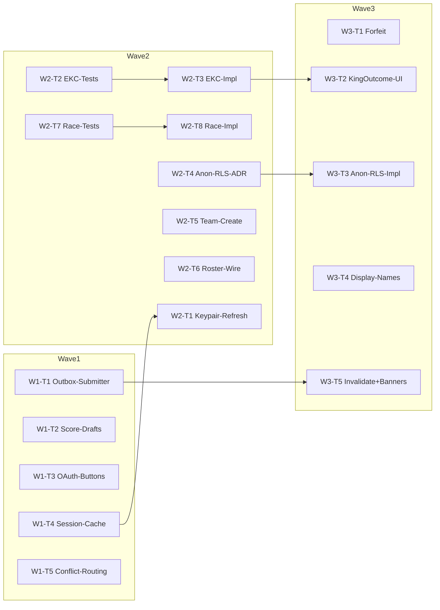

# Sprint A — Funktionalitaet-First Bug-Fix Sweep

**Stand**: 2026-05-28
**Quelle**: Bug-Hunt-Master-Report 2026-Q3 (`docs/bug-hunt-2026-q3/master-report.md`, 1516 Zeilen, 20 Runden, 420 Final-Findings)
**Base-Commit**: `5cd1f26`
**Branch-Strategie**: pro Worker eigener Worktree, Branch `sprintA-w<wave>-<slug>`. Worker pushen nicht. Integration cherry-picked sequentiell auf `sprintA-integration`, ff-only Merge auf `main` nach jeder Wave.

## Scope

Diese Iteration räumt nur P0-Showstopper und P1-Funktional-Blocker aus dem Master-Report ab. Alles, was im Sweep als reiner UI-Polish oder Compliance markiert ist, bleibt aussen vor.

Drin:

- Die 10 Top-Showstopper aus dem End-of-Sweep-Summary (R17-F-01/02, R1-F-01/02/03, R10-F-13, R19-F-01/02, R14-F-01..03, R12-F-01, R11-F-01).
- Die Race-Hotfix-Wave aus den Trainings-Modi und dem Tournament-Submit (R3-F-04, R4-F-01..03, R5-F-01..02).
- Drei systemische Quer-Patches, die als Re-Hit-Pattern im Sweep markiert sind: Display-Name-Mapping (R10-F-06 / R13-F-02 / R14-F-10 / R19-F-09), Provider-Invalidate-Defaults (R2-F-02 / R19-F-17), Toter-Brief-Sweep (R16-F-01 / R17-F-15).

Draussen:

- Sprint B — UI/UX-Polish (Mängel-Report-Block, Avatar-Encoding, Bottom-Nav, Onboarding-Tour, Tournament-Tile-Lüge, Empty-States).
- Sprint C — Compliance (Privacy-Lüge, DSGVO, Account-Delete-Wipe, Profile-Visibility, Inbox-Offline-Cache, ADR-0018 Captain).

Owner-Eskalations-Punkte (blockieren Sprint A nicht, werden separat geführt):

- Captain-Rolle vs. ADR-0018 (R19-F-11) — bleibt offen, R19-F-04 Permission-Fix läuft als Minimal-Fix in W2.
- Gruppen-Feature (R19-F-03 / R20-F-01, dritter Re-Hit aus Mängel #2.1) — Lukas hat explizit Removal verlangt. Sprint A behandelt das als reine UI/Route-Removal (Wave 3), nicht als Datenmigration. Vollständige Migration wandert in Sprint B.
- Heli-Semantik (R4-F-04) — Spec-Klärung getrennt, Code-Fix wartet auf ADR-Annotation.
- Anon-RLS-Strategie (R14-F-01) — der Architekt-Auftrag ist Teil von W2-T8, nicht des Worker-Briefings.

## Architektur-Notizen für die Waves

- Senior-Limit: max 100 LOC, max 3 Files, max 1h pro Task. Wenn ein Master-Report-Finding grösser ist, splitten wir in mehrere Worker-Tasks mit klarer Reihenfolge.
- Test-First bei Domain-Code (kubb_domain, EKC-Modell, Outbox-Submitter) — der Test-Task läuft vor dem Impl-Task und ist dessen Dependency.
- Worktrees werden vorab manuell angelegt mit `git worktree add /tmp/kubb-<slug> -b sprintA-w<N>-<slug> 5cd1f26`. Jedes Worker-Briefing fängt mit `cd /tmp/kubb-<slug>` an.
- Worker-Briefings sind self-contained. Kein impliziter Kontext aus dieser Planungs-Session.
- Pre-commit-msg-Hook unter `.git/hooks/commit-msg` blockiert AI-Spuren. Worker-Briefing nennt das explizit.

## Wave-Plan

### Wave 1 — Live-Blocker und Auth-Cache (5 Worker, parallel)

Wave-Ziel: die fünf hochpriorisiertesten Showstopper. Ohne diese fünf Fixes ist kein Pitch-Einsatz möglich.

#### W1-T1: Outbox-Submitter implementieren (R17-F-01)

- **Master-Report-ID**: R17-F-01
- **Type**: data + infra
- **Bounded Context**: core (outbox)
- **Files**: `lib/core/application/outbox_flusher_provider.dart` (Submitter-Klasse), `lib/core/data/outbox_dao.dart` (nur lesend), `lib/core/application/lamport_clock_provider.dart` (nur lesend)
- **LOC-Schätzung**: 80
- **Worker-Agent**: `/agents/coder` (data instruction)
- **Dependencies**: none
- **Worker-Briefing** (verbatim):
  ```
  cd /tmp/kubb-w1-outbox-submitter

  Du bist Worker W1-T1 fuer Sprint A. Auftrag: das `UnimplementedError` im `_RemoteScoreLamportSubmitter.submit`
  durch einen echten Supabase-RPC-Call ersetzen.

  STRICT WORKFLOW BOUNDARY:
  - Bleib auf branch sprintA-w1-outbox-submitter.
  - Kein push, kein switch, kein merge, kein touch auf main.
  - Keine Arbeit ausserhalb des Scopes (kein Bonus-Refactor, keine Lamport-Aenderungen, keine UI-Touches).
  - Wenn fertig: commit + report, stop.

  Quality gates vor jedem Commit:
  - `flutter analyze` clean.
  - Wenn du Domain-Code anfasst, zusaetzlich `dart analyze` in `packages/kubb_domain` clean.
  - `flutter test test/core/application/outbox_flusher_provider_test.dart` gruen.
  - Keine `Co-Authored-By`-Zeile, kein Tool-Name in Commit-Body. Pre-commit-msg-Hook
    unter `.git/hooks/commit-msg` blockiert das.

  Files to read first:
  1. `docs/bug-hunt-2026-q3/master-report.md` Sektion "Runde 17" Eintrag R17-F-01 (Zeile 738-743).
  2. `lib/core/application/outbox_flusher_provider.dart` (komplett, besonders Zeile 113-135).
  3. `lib/core/application/lamport_clock_provider.dart` (Hydration-Logik verstehen).
  4. `supabase/migrations/2026052500000*_tournament_*.sql` — RPC `score_submit_with_lamport` Signatur.
  5. `lib/features/tournament/data/tournament_repository.dart` (analoger Pattern bei `proposeSetScores`).

  Concrete change:
  - `_RemoteScoreLamportSubmitter.submit(OutboxRow row)` ruft `supabase.rpc('score_submit_with_lamport', params: { ... })`
    mit `matchId`, `setIndex`, `participantA`, `participantB`, `lamport`, `clientIdempotencyKey` (aus Row).
  - Bei Erfolg `null` zurueck oder das Server-Acknowledgement reichen (passend zur bestehenden Caller-Signatur).
  - Bei `SocketException` / `TimeoutException` rethrow als `TransientSubmitException` damit der Flusher `markAttempt` ruft.
  - Bei `PostgrestException` mit Code-Klassifikation: `lamport_regression`, `override_pending`, `conflict_*`
    als `TerminalSubmitException(reason: ...)` rethrowen. Sonst Bubble-Up.
  - Keine `runtimeType.toString()`-Strings im Reason — stabile Reason-Codes.

  Acceptance:
  - Given eine Outbox-Row mit gueltigem Lamport und idempotency-key
    When der Flusher den Submitter aufruft und das Netz online ist
    Then ruft der Submitter die RPC mit korrekten Parametern und gibt Erfolg zurueck.
  - Given das Netz wirft `SocketException`
    Then wirft der Submitter `TransientSubmitException` und der Flusher kann `markAttempt` triggern.
  - Given der Server antwortet mit `override_pending`
    Then wirft der Submitter `TerminalSubmitException(reason: 'override_pending')`.
  - Test-Datei `test/core/application/outbox_flusher_provider_test.dart` wird ergaenzt mit mocktail-Fake fuer
    `SupabaseClient.rpc` (siehe `test/core/data/...`-Fakes als Vorlage).

  Reporting:
  - Bei Commit: subject `feat(core): implement remote score lamport submitter`.
  - Body nennt Task-ID `W1-T1` und Master-Report-Ref `R17-F-01`.
  - Falls du Code-Pattern findest, das ausserhalb deines Scopes ist (z.B. Pre-Flight-Race), melde es
    im Report-Footer, fix es NICHT.
  ```

#### W1-T2: Score-Drafts persistieren (R17-F-02)

- **Master-Report-ID**: R17-F-02
- **Type**: data + frontend
- **Bounded Context**: tournament (score-draft)
- **Files**: `lib/features/tournament/application/score_draft_controller.dart`, `lib/features/tournament/data/score_draft_repository.dart` (neu, falls noch nicht da), `lib/features/tournament/presentation/match_detail_screen.dart`
- **LOC-Schätzung**: 95 (drei Files, Senior-Limit-Grenze, splitten wenn UI-Wire-Up den Punkt sprengt)
- **Worker-Agent**: `/agents/coder` (data + frontend instruction)
- **Dependencies**: none
- **Worker-Briefing**:
  ```
  cd /tmp/kubb-w1-score-drafts

  Du bist Worker W1-T2 fuer Sprint A. Auftrag: Score-Drafts im Match-Detail-Screen ueber die bereits existierende
  Drift-Tabelle `tournament_score_drafts` persistieren (FR-DSCORE-19..22).

  STRICT WORKFLOW BOUNDARY:
  - Bleib auf branch sprintA-w1-score-drafts.
  - Kein push, kein switch, kein merge, kein touch auf main.
  - Keine Arbeit ausserhalb des Scopes (kein neuer Submit-Pfad, keine Conflict-Routing-Aenderung — das ist W1-T5).
  - Wenn fertig: commit + report, stop.

  Quality gates vor Commit:
  - `flutter analyze` clean.
  - `flutter test test/features/tournament/` gruen.
  - Keine AI-Spuren in Commit-Message. Pre-commit-msg-Hook blockt das.

  Files to read first:
  1. `docs/bug-hunt-2026-q3/master-report.md` Sektion "Runde 17" Eintrag R17-F-02 (Zeile 745-750).
  2. `lib/core/data/db/tables.dart` (oder wo `tournament_score_drafts` deklariert ist) — Drift-Schema lesen.
  3. Bestehender Setup-Wizard-Draft als Vorlage: `lib/features/tournament/application/setup_draft_controller.dart`.
  4. `lib/features/tournament/presentation/match_detail_screen.dart` — wo aktuell `setState` den Score-State haelt.
  5. Spec: `docs/specs/score-input-conflict-spec.md` Abschnitt DSCORE-19..-22.

  Concrete change:
  - `ScoreDraftRepository` mit `upsertDraft(MatchId, SetIndex, basekubbsA, basekubbsB, king)` und
    `loadDraft(MatchId) -> List<SetDraft>` und `deleteDraft(MatchId)`.
  - `ScoreDraftController` Riverpod-Notifier, der pro Match einen `List<SetDraft>` haelt.
    - `init(MatchId)` hydratisiert aus Repo.
    - `onSetEdit(setIndex, ...)` schreibt sofort Upsert (kein Debounce, Drift ist lokal schnell).
    - `clear(MatchId)` loescht (wird vom Caller bei Submit-Acknowledge oder Match `finished` aufgerufen).
  - `MatchDetailScreen` ersetzt internen `setState` Score-State durch `ref.watch(scoreDraftController(matchId))`.
    Pre-fill aus Draft beim Mount; Save-Submit ruft `clear` nach Acknowledge.
  - GC-Pfad (Match `finished`-Status-Listener) ist out-of-scope fuer diesen Task — Hook-Punkt vorbereiten,
    aber keinen Listener verdrahten (Marker `// TODO(W1-T2-followup): clear on finished` ist OK).

  Acceptance:
  - Given der User tippt zwei Sets ein und schliesst die App
    When er das Match nochmal oeffnet
    Then sind beide Sets vorbefuellt.
  - Given ein Submit wird erfolgreich acknowledged
    When der Controller `clear(matchId)` ruft
    Then ist die Drift-Row weg.
  - Widget-Test `test/features/tournament/presentation/match_detail_screen_test.dart`
    deckt Pre-Fill und Edit-Persistenz ab.

  Reporting:
  - Subject: `feat(tournament): persist score drafts in match detail`.
  - Body: Task-ID `W1-T2`, Master-Ref `R17-F-02`.
  - Wenn die Aenderung das LOC-Limit sprengt: bei 95 LOC stoppen, zweiten Commit `refactor(tournament): split score draft hydration` anlegen.
  ```

#### W1-T3: OAuth-Buttons verdrahten (R1-F-01)

- **Master-Report-ID**: R1-F-01
- **Type**: frontend
- **Bounded Context**: auth
- **Files**: `lib/features/auth/presentation/sign_in_screen.dart`, `lib/features/auth/application/auth_controller.dart` (lesen, ggf. Helper)
- **LOC-Schätzung**: 45
- **Worker-Agent**: `/agents/coder` (frontend instruction)
- **Dependencies**: none
- **Worker-Briefing**:
  ```
  cd /tmp/kubb-w1-oauth-buttons

  Du bist Worker W1-T3 fuer Sprint A. Auftrag: die OAuth-Sign-In-Buttons (Google/Apple) auf dem Sign-In-Screen
  echt an den `SupabaseAuthAdapter` haengen — sind aktuell UI-Stubs ohne Dispatch.

  STRICT WORKFLOW BOUNDARY:
  - Bleib auf branch sprintA-w1-oauth-buttons.
  - Kein push, kein switch, kein merge.
  - Kein Touch auf Session-Cache oder Keypair-Refresh (das sind W1-T4 und W2-T1).
  - Wenn fertig: commit + report, stop.

  Quality gates:
  - `flutter analyze` clean.
  - `flutter test test/features/auth/` gruen.
  - Keine AI-Spuren in Commit-Message.

  Files to read first:
  1. `docs/bug-hunt-2026-q3/master-report.md` Sektion "Runde 1" Eintrag R1-F-01 (Zeile 24).
  2. `lib/features/auth/presentation/sign_in_screen.dart` — `_onPickGoogle` / `_onPickApple` / `_loading.anonymous`.
  3. `lib/features/auth/data/supabase_auth_adapter.dart` — `signInWithOAuth(provider)` Signatur.
  4. `lib/features/auth/application/auth_controller.dart` — vorhandener Pattern fuer Loading + Error-Banner.

  Concrete change:
  - In `_onPickGoogle`/`_onPickApple`: `await ref.read(supabaseAuthAdapterProvider).signInWithOAuth(provider)`.
  - Errors als Banner via vorhandenem `errorBanner`-Slot, Offline-State respektieren (siehe `connectivityProvider`).
  - Toten `_loading.anonymous`-Enum-Wert aufraeumen, falls nicht mehr genutzt.
  - Kein neuer Wire-Refresh-Pfad, kein Keypair-Touch.

  Acceptance:
  - Given der User tippt auf Google-Button
    When der Adapter erreichbar ist
    Then triggert der Adapter den OAuth-Flow.
  - Given der Adapter wirft eine Auth-Exception
    Then erscheint ein Banner mit stabiler Reason-Message, kein roher `exception.toString()`.
  - Widget-Test deckt Loading-State + Error-Banner ab.

  Reporting:
  - Subject: `feat(auth): wire oauth sign-in buttons to adapter`.
  - Body: `W1-T3`, `R1-F-01`.
  ```

#### W1-T4: Session-Cache-Race fixen (R1-F-02)

- **Master-Report-ID**: R1-F-02
- **Type**: data + infra
- **Bounded Context**: auth
- **Files**: `lib/features/auth/application/auth_controller.dart`, `lib/core/application/bootstrap.dart`, `lib/features/auth/data/session_cache.dart` (oder Aequivalent)
- **LOC-Schätzung**: 90
- **Worker-Agent**: `/agents/coder` (data + infra instruction)
- **Dependencies**: none
- **Worker-Briefing**:
  ```
  cd /tmp/kubb-w1-session-cache

  Du bist Worker W1-T4 fuer Sprint A. Auftrag: die Session-Cache-Race fixen, die Maengel #9 erzeugt
  (`authentication required` beim Tournier-Create). Wire-JWT ist `null`, weil der Drift-Cache als Wahrheit
  gilt und Bootstrap keinen Re-Sign-Pfad triggert.

  STRICT WORKFLOW BOUNDARY:
  - Bleib auf branch sprintA-w1-session-cache.
  - Kein push, kein switch, kein merge.
  - Keine OAuth-Button-Aenderungen (das ist W1-T3).
  - Kein Keypair-Refresh-Timer (das ist W2-T1).
  - Wenn fertig: commit + report, stop.

  Quality gates:
  - `flutter analyze` clean.
  - `flutter test test/features/auth/` gruen.
  - Keine AI-Spuren in Commit-Message.

  Files to read first:
  1. `docs/bug-hunt-2026-q3/master-report.md` Sektion "Runde 1" Eintrag R1-F-02 (Zeile 25).
  2. `lib/core/application/bootstrap.dart` — Stelle `skip(1)` finden, dort hookt sich der Fix ein.
  3. `lib/features/auth/application/auth_controller.dart` — `_subscribe`, `_sessionFromAdapter`.
  4. `lib/features/auth/data/supabase_auth_adapter.dart` — `signInWithChallenge` + `getSession`.
  5. Projekt-Memory CLAUDE.md Abschnitt "MUSS-Fixes" — Symptom-Beschreibung.

  Concrete change:
  - In Bootstrap nach `skip(1)`: pruefen ob Wire-Session live ist; falls nicht und Keypair vorhanden → 
    `signInWithChallenge` triggern; falls OAuth-Pfad → `auth.refreshSession()` triggern.
  - Pre-Flight-Guard als neuer Helper `ensureWireSession()` der vor jedem authentifizierten RPC-Call
    aufgerufen werden kann (Helper exportieren, aber NICHT in alle Call-Sites verdrahten — das ist Backlog).
  - Logging-Hook: bei Re-Sign `Logger('auth.bootstrap').info('wire re-sign triggered: <reason>')`.

  Acceptance:
  - Given Drift-Cache hat eine Session, aber `supabase.auth.currentSession?.accessToken == null`
    When Bootstrap durchlaeuft
    Then triggert es Re-Sign und der RPC-Call mit `Authorization`-Header haengt korrekt.
  - Given OAuth-User mit abgelaufenem Token
    When Bootstrap durchlaeuft
    Then ruft `refreshSession`.
  - Integration-Test (oder Unit mit Adapter-Fake) deckt beide Pfade.

  Reporting:
  - Subject: `fix(auth): re-sign wire session after cache hydration`.
  - Body: `W1-T4`, `R1-F-02`, ref Maengel #9.
  ```

#### W1-T5: Conflict-Routing fixen (R10-F-13)

- **Master-Report-ID**: R10-F-13 — MUSS-Fix #2 aus Projekt-Memory, seit drei Runden offen.
- **Type**: frontend
- **Bounded Context**: tournament (match-detail)
- **Files**: `lib/features/tournament/presentation/match_detail_screen.dart`
- **LOC-Schätzung**: 15
- **Worker-Agent**: `/agents/coder` (frontend instruction)
- **Dependencies**: none
- **Worker-Briefing**:
  ```
  cd /tmp/kubb-w1-conflict-routing

  Du bist Worker W1-T5 fuer Sprint A. Auftrag: Conflict-Routing fixen.
  Wenn der Match-Detail-Screen einen Status-Wechsel `awaiting_consensus → disputed` sieht,
  soll er aktiv auf den Conflict-Screen pushen statt nur eine SnackBar zu zeigen.

  Mini-Fix, 15 Minuten, hoechste Sichtbarkeit. MUSS-Fix #2 in der Projekt-Memory.

  STRICT WORKFLOW BOUNDARY:
  - Bleib auf branch sprintA-w1-conflict-routing.
  - Kein push, kein switch, kein merge.
  - Keine andere Match-Detail-Aenderung (kein neuer Provider, kein Status-Banner — separate Tasks).
  - Wenn fertig: commit + report, stop.

  Quality gates:
  - `flutter analyze` clean.
  - `flutter test test/features/tournament/presentation/match_detail_screen_test.dart` gruen.

  Files to read first:
  1. `docs/bug-hunt-2026-q3/master-report.md` Sektion "Runde 10" Eintrag R10-F-13 (Zeile 367).
  2. `lib/features/tournament/presentation/match_detail_screen.dart` — `ref.listen` auf `tournamentMatchProvider`.
  3. `lib/features/tournament/routes.dart` — `TournamentRoutes.conflict(tournamentId, matchId)`.

  Concrete change:
  - Im `ref.listen`-Callback Status-Wechsel `awaiting_consensus → disputed` abfangen:
    `context.go(TournamentRoutes.conflict(tournamentId, matchId))`.
  - SnackBar bleibt als sekundaerer Hinweis (z.B. nach erfolgreichem Push), aber nicht als einzige Reaktion.

  Acceptance:
  - Given das Match wechselt auf `disputed`
    When der Detail-Screen aktiv ist
    Then landet der User auf dem Conflict-Screen.
  - Widget-Test mit Fake-Provider-Stream simuliert den Statuswechsel.

  Reporting:
  - Subject: `fix(tournament): route to conflict screen on disputed status`.
  - Body: `W1-T5`, `R10-F-13`, schliesst MUSS-Fix #2 aus Projekt-Memory.
  ```

#### Audit nach Wave 1

```bash
# Auf sprintA-integration nach cherry-pick der 5 Worker-Commits
for c in $(git rev-list main..HEAD); do
  git log -1 --format=%B $c > /tmp/audit.txt
  .git/hooks/commit-msg /tmp/audit.txt
done
git diff main..HEAD | grep -iE "co-authored-by|noreply@anthropic|generated by" && echo "AI-SPUREN GEFUNDEN" || echo "clean"
flutter analyze
(cd packages/kubb_domain && dart analyze && dart test)
flutter test
```

Falls clean: `git checkout main && git merge --ff-only sprintA-integration && git push origin main`.

---

### Wave 2 — Domain-Locher + Anon-RLS + Race-Hotfix (6 Worker, parallel nach Wave 1)

Wave-Ziel: Schweizer-Regelwerk-Konformitaet und Public-Spectator-Modell stabilisieren, Race-Conditions in den Trainings-Modi abdichten.

#### W2-T1: Keypair-JWT-Refresh-Timer (R1-F-03)

- **Master-Report-ID**: R1-F-03
- **Type**: infra
- **Bounded Context**: auth
- **Files**: `lib/features/auth/data/keypair_signing_service.dart`, `lib/features/auth/application/auth_controller.dart`
- **LOC-Schätzung**: 70
- **Worker-Agent**: `/agents/coder` (infra instruction)
- **Dependencies**: W1-T4
- **Worker-Briefing**:
  ```
  cd /tmp/kubb-w2-keypair-refresh

  Du bist Worker W2-T1 fuer Sprint A. Auftrag: JWT-Refresh-Timer fuer Keypair-Sessions implementieren
  (ADR-0010-Verletzung — JWT laeuft nach 1h stumm ab, OAuth-Pfad nutzt `autoRefreshToken` aber Keypair nicht).

  STRICT WORKFLOW BOUNDARY:
  - Bleib auf branch sprintA-w2-keypair-refresh.
  - Kein push, kein switch, kein merge.
  - Wenn fertig: commit + report, stop.

  Quality gates:
  - `flutter analyze` clean.
  - `flutter test test/features/auth/` gruen.

  Files to read first:
  1. `docs/bug-hunt-2026-q3/master-report.md` Eintrag R1-F-03 (Zeile 26).
  2. `lib/features/auth/data/keypair_signing_service.dart` — `signInWithChallenge`.
  3. ADR `docs/adr/0010-identity-oauth-keypair.md`.

  Concrete change:
  - Timer in `KeypairSigningService` der bei `expiresAt - 5min` `signInWithChallenge` mit dem gespeicherten Privatkey
    neu ausloest.
  - `autoRefreshToken: true` fuer OAuth-Pfad sicherstellen (Supabase-Init).
  - Timer cancel im `dispose`.

  Acceptance:
  - Given eine Keypair-Session mit `expiresAt` in 30 Sekunden
    When der Timer feuert
    Then wird `signInWithChallenge` erneut ausgefuehrt und die neue Session ist live.
  - Unit-Test mit Fake-Clock (mocktail oder fake_async).

  Reporting:
  - Subject: `feat(auth): auto-refresh keypair jwt before expiry`.
  - Body: `W2-T1`, `R1-F-03`.
  ```

#### W2-T2: EKC-Modell um KingOutcome erweitern — Domain + Tests (R11-F-01, Test-First)

- **Master-Report-ID**: R11-F-01
- **Type**: tests + domain
- **Bounded Context**: tournament (kubb_domain)
- **Files**: `packages/kubb_domain/test/tournament/ekc_test.dart`, `packages/kubb_domain/test/tournament/set_score_proposal_test.dart`
- **LOC-Schätzung**: 80 (nur Tests)
- **Worker-Agent**: `/agents/tester`
- **Dependencies**: none
- **Worker-Briefing**:
  ```
  cd /tmp/kubb-w2-ekc-tests

  Du bist Worker W2-T2 fuer Sprint A. Auftrag: Property-Tests und Unit-Tests schreiben, die das
  neue `KingOutcome`-Sealed-Class-Modell spezifizieren. Test-First — die Impl kommt in W2-T3.

  STRICT WORKFLOW BOUNDARY:
  - Bleib auf branch sprintA-w2-ekc-tests.
  - Kein push, kein switch, kein merge.
  - Du schreibst NUR Tests. Keine Domain-Aenderungen.
  - Tests duerfen am Anfang rot sein (Impl fehlt). Im Commit-Body markieren "expected red, impl follows in W2-T3".
  - Wenn fertig: commit + report, stop.

  Quality gates:
  - `dart analyze` im Domain-Package clean (Test-Code muss compilen, auch wenn Tests rot sind).
  - Tests laufen nicht durch — das ist erwartet.

  Files to read first:
  1. `docs/bug-hunt-2026-q3/master-report.md` Eintrag R11-F-01 (Zeile 395).
  2. `packages/kubb_domain/lib/src/tournament/ekc.dart`.
  3. `packages/kubb_domain/lib/src/ports/tournament_remote.dart` — `TournamentSetScoreProposal`.
  4. Bestehende EKC-Tests als Vorlage: `packages/kubb_domain/test/tournament/ekc_test.dart`.

  Spec for tests:
  - `KingOutcome` ist Sealed-Class mit drei Varianten: `HitBy(ParticipantId)`, `Missed`, `TimedOut`.
  - `TournamentSetScoreProposal.kingOutcome` ersetzt `kingHitBy` (das `ParticipantId?`-Feld wird geloescht).
  - EKC-Berechnung:
    - `HitBy(p)`: +1 King-Score fuer Team von p (bestehender Pfad).
    - `Missed`: kein King-Score, normale Basekubb-Werte zaehlen.
    - `TimedOut`: 0:0-King-Score, Set wird nicht als King-Hit gewertet.
  - Property-Test via `glados`: fuer alle `KingOutcome.TimedOut` ist EKC additiv null.

  Acceptance:
  - Test-Datei `packages/kubb_domain/test/tournament/king_outcome_test.dart` neu, deckt alle drei Varianten.
  - `ekc_test.dart` ergaenzt um den `TimedOut`-Pfad.
  - `set_score_proposal_test.dart` deckt die neue Property `kingOutcome`.

  Reporting:
  - Subject: `test(domain): specify king outcome sealed class for ekc`.
  - Body: `W2-T2`, `R11-F-01`, "Tests rot bis W2-T3 die Impl liefert".
  ```

#### W2-T3: EKC-Modell um KingOutcome erweitern — Impl (R11-F-01)

- **Master-Report-ID**: R11-F-01
- **Type**: domain
- **Bounded Context**: tournament (kubb_domain)
- **Files**: `packages/kubb_domain/lib/src/tournament/king_outcome.dart` (neu), `packages/kubb_domain/lib/src/tournament/ekc.dart`, `packages/kubb_domain/lib/src/ports/tournament_remote.dart`
- **LOC-Schätzung**: 95
- **Worker-Agent**: `/agents/coder` (domain instruction)
- **Dependencies**: W2-T2
- **Worker-Briefing**:
  ```
  cd /tmp/kubb-w2-ekc-impl

  Du bist Worker W2-T3 fuer Sprint A. Auftrag: das `KingOutcome`-Sealed-Class-Modell implementieren,
  EKC-Berechnung und `TournamentSetScoreProposal` umstellen. Die Tests aus W2-T2 sollen gruen werden.

  STRICT WORKFLOW BOUNDARY:
  - Bleib auf branch sprintA-w2-ekc-impl.
  - Kein push, kein switch, kein merge.
  - Du baust die Domain-Schicht. UI-Aenderungen sind NICHT Teil dieses Tasks (separater Wave-3-Task fuer das Tri-Toggle).
  - Server-Migration ist NICHT Teil dieses Tasks (Wave 3, W3-T2).
  - Wenn fertig: commit + report, stop.

  Quality gates:
  - `dart analyze` in `packages/kubb_domain` clean.
  - `dart test` im Domain-Package gruen (insbesondere die Tests aus W2-T2).
  - `flutter analyze` clean (App muss noch kompilieren, auch wenn UI das alte Feld noch nutzt — temporaerer Adapter).

  Files to read first:
  1. Tests aus W2-T2 (`packages/kubb_domain/test/tournament/king_outcome_test.dart`).
  2. `docs/bug-hunt-2026-q3/master-report.md` Eintrag R11-F-01 + R12-F-07.
  3. Bestehende `ekc.dart` und `set_score_proposal.dart`.

  Concrete change:
  - `KingOutcome` als Sealed-Class mit `HitBy(ParticipantId)`, `Missed`, `TimedOut`.
  - `TournamentSetScoreProposal.kingOutcome: KingOutcome` ersetzt `kingHitBy: ParticipantId?`.
  - EKC-Berechnung dispatch'd ueber `KingOutcome`.
  - Cross-Layer-Adapter: alte UI-Callsites, die `kingHitBy` lesen, bekommen einen `kingHitBy`-Getter
    der aus `kingOutcome` projiziert (`HitBy(p)` -> p, sonst null). Schreib-Callsites bleiben bis Wave 3 broken
    und werden mit `// TODO(W3): migrate to KingOutcome` markiert.

  Acceptance:
  - W2-T2-Tests gruen.
  - `flutter analyze` clean (Adapter haelt das App-Build kompilierbar).
  - Keine bestehenden Tests rot.

  Reporting:
  - Subject: `feat(domain): introduce king outcome sealed class`.
  - Body: `W2-T3`, `R11-F-01`, "Adapter `kingHitBy` Getter bleibt fuer UI-Backward-Compat; W3-T2 migriert UI + Server".
  ```

#### W2-T4: Anon-RLS-Architekt-Auftrag (R14-F-01..03)

- **Master-Report-ID**: R14-F-01, R14-F-02, R14-F-03
- **Type**: research + design (kein Code in dieser Wave)
- **Bounded Context**: tournament (public-spectator)
- **Files**: `docs/adr/0023-anon-spectator-revision.md` (neuer ADR-Draft), `docs/plans/sprint-a-bug-fix/anon-rls-plan.md`
- **LOC-Schätzung**: kein Code, nur Doku
- **Worker-Agent**: `/agents/architect`
- **Dependencies**: none
- **Worker-Briefing**:
  ```
  cd /tmp/kubb-w2-anon-rls

  Du bist Worker W2-T4 fuer Sprint A. Auftrag: ADR-Draft + Implementation-Plan fuer den Anon-RLS-Pfad.
  Der bestehende Pfad ist strukturell broken: `signInAnonymously` erzeugt eine `authenticated`-Rolle,
  alle `TO anon`-Policies sind tot, `tournament_get` ist `GRANT EXECUTE … TO authenticated`, und die
  Privacy-View `public_tournament_roster_view` hat null Aufrufer im Client.

  STRICT WORKFLOW BOUNDARY:
  - Du schreibst KEINEN Code. Nur Doku.
  - Bleib auf branch sprintA-w2-anon-rls.
  - Kein push, kein switch, kein merge.
  - Wenn fertig: commit + report, stop. Owner-Abnahme triggert dann die Wave-3-Impl-Tasks.

  Quality gates:
  - ADR-Datei ist parsbar.
  - Plan-Datei nennt konkrete Files und RPC-Namen.

  Files to read first:
  1. `docs/bug-hunt-2026-q3/master-report.md` Sektion "Runde 14" Eintrage R14-F-01, R14-F-02, R14-F-03 (Zeile 520-522).
  2. `docs/adr/0023-public-tournaments.md` (bestehender ADR — wahrscheinlich der zu revidierende).
  3. `supabase/migrations/20260701000002_tournaments_public_flag.sql`.
  4. `supabase/migrations/20260525000003_tournament_discovery_registration_rpcs.sql` (RPC-Grants).
  5. `supabase/tests/public_rls_test.sql` (pgTAP-Test, divergiert vom Laufzeit-Pfad).
  6. `lib/features/auth/data/anon_session.dart` — `ensureAnonSession`.

  Auftrag:
  - Entscheide eine von zwei Strategien und begruende:
    - A) Reiner anon-Header, kein `signInAnonymously`. Policies + RPCs konsistent auf `TO anon`. JWT-frei.
    - B) `authenticated-anonymous`-Modell beibehalten. Alle `TO anon`-Policies + pgTAP-Tests auf `TO authenticated`
      umstellen. Bedingung: Spectator-Filterung allein durch `is_anonymous`-Claim und View-Projektion.
  - Schreibe `docs/adr/0023-anon-spectator-revision.md` (Superseded / Amended-Pfad zum bestehenden ADR-0023).
  - Schreibe `docs/plans/sprint-a-bug-fix/anon-rls-plan.md` mit konkretem Task-Schnitt fuer Wave 3:
    - `public_tournament_get` RPC + `public_tournament_match_get` RPC mit `SECURITY DEFINER` + Grants.
    - Client-Repository `PublicTournamentRepository` mit Methoden `getPublicTournamentDetail` und `getPublicMatchDetail`.
    - `PublicTournamentScreen` und `PublicMatchScreen` umstellen — nutzen ausschliesslich Public-Pfad.
    - Migration-Block fuer Policy-Vereinheitlichung.
    - pgTAP-Tests anpassen.

  Acceptance:
  - ADR-Draft im Format aus `architect.md` (Status: Proposed, Context, Decision, Alternatives considered, Consequences).
  - Plan-Datei nennt 4-6 Wave-3-Tasks mit Files + LOC-Schaetzung + Acceptance-Kriterien.
  - Owner kann nach Lektuere binnen 10 Minuten entscheiden A oder B.

  Reporting:
  - Subject: `docs(adr): draft anon spectator path revision`.
  - Body: `W2-T4`, `R14-F-01/02/03`, "Owner-Abnahme triggert Wave 3 Implementation".
  ```

#### W2-T5: Team-Create _busy-Reset und Result-Type (R19-F-02)

- **Master-Report-ID**: R19-F-02 — Maengel #3 still failing.
- **Type**: frontend + application
- **Bounded Context**: team
- **Files**: `lib/features/teams/presentation/team_create_screen.dart`, `lib/features/teams/application/team_membership_controller.dart`
- **LOC-Schätzung**: 70
- **Worker-Agent**: `/agents/coder` (frontend instruction)
- **Dependencies**: none
- **Worker-Briefing**:
  ```
  cd /tmp/kubb-w2-team-create

  Du bist Worker W2-T5 fuer Sprint A. Auftrag: Maengel #3 fixen (Team-Create still failing).
  Snackbar ist da, aber: (a) `_busy` bleibt true bei RPC `id == null`, (b) kein Logging, (c) Caller bekommt nur `null`.

  STRICT WORKFLOW BOUNDARY:
  - Bleib auf branch sprintA-w2-team-create.
  - Kein push, kein switch, kein merge.
  - Wenn fertig: commit + report, stop.

  Quality gates:
  - `flutter analyze` clean.
  - `flutter test test/features/teams/` gruen.

  Files to read first:
  1. `docs/bug-hunt-2026-q3/master-report.md` Eintrag R19-F-02 (Zeile 1091).
  2. `lib/features/teams/presentation/team_create_screen.dart` — `_busy`-Handling.
  3. `lib/features/teams/application/team_membership_controller.dart` — `_runReturning`.

  Concrete change:
  - `_busy = false` im `finally` und auch auf Null-RPC-Return-Pfad.
  - `_runReturning<T>` gibt `Result<T, TeamActionError>` zurueck (Sealed-Class oder freezed-Union).
  - Logging via `Logger('team.membership').warning(...)` mit Stacktrace + RPC-Payload (PII-frei, kein E-Mail, kein UUID).
  - Test: simulierter Server-Error → Button enabled, SnackBar sichtbar, Log-Entry vorhanden.

  Acceptance:
  - Given Server liefert `null` ohne Exception
    When User auf Create tippt
    Then Snackbar zeigt "Erstellen fehlgeschlagen, bitte erneut versuchen", Button ist wieder enabled.
  - Logger-Spy faengt den Warn-Eintrag.

  Reporting:
  - Subject: `fix(teams): reset busy state and structure team create errors`.
  - Body: `W2-T5`, `R19-F-02`, ref Maengel #3.
  ```

#### W2-T6: Roster-Wire fuer Team-Registration (R19-F-01)

- **Master-Report-ID**: R19-F-01
- **Type**: frontend
- **Bounded Context**: tournament (registration)
- **Files**: `lib/features/tournaments/presentation/register_team_screen.dart`, `lib/features/teams/application/team_detail_provider.dart` (lesen)
- **LOC-Schätzung**: 60
- **Worker-Agent**: `/agents/coder` (frontend instruction)
- **Dependencies**: none
- **Worker-Briefing**:
  ```
  cd /tmp/kubb-w2-roster-wire

  Du bist Worker W2-T6 fuer Sprint A. Auftrag: das `RosterCompositionWidget` im Team-Turnier-Anmeldungs-Screen
  bekommt aktuell `pool: const []` und `guests: const []` — UI ist tot. FR-REG-12 ist nicht ausfuehrbar.

  STRICT WORKFLOW BOUNDARY:
  - Bleib auf branch sprintA-w2-roster-wire.
  - Kein push, kein switch, kein merge.
  - Wenn fertig: commit + report, stop.

  Quality gates:
  - `flutter analyze` clean.
  - `flutter test test/features/tournaments/` gruen.

  Files to read first:
  1. `docs/bug-hunt-2026-q3/master-report.md` Eintrag R19-F-01 (Zeile 1085).
  2. `lib/features/tournaments/presentation/register_team_screen.dart` Zeile 76-87.
  3. `lib/features/teams/application/team_detail_provider.dart`.
  4. Widget-Doku: `RosterCompositionWidget`-Signatur und `RosterPoolMember`-Format.

  Concrete change:
  - `teamDetailProvider(teamId).watch(...)` — Loading/Error/Data States explizit.
  - Mapping `team.members.pool` und `team.members.guests` auf `List<RosterPoolMember>`.
  - Pool an `RosterCompositionWidget` durchreichen.
  - Widget-Test deckt Pool-Rendering ab.

  Acceptance:
  - Given ein Team mit drei Pool-Members
    When der User den Register-Screen mit dem Team oeffnet
    Then sieht er die drei Members im Roster-Picker und kann auswaehlen.

  Reporting:
  - Subject: `fix(tournament): wire team pool into roster composition widget`.
  - Body: `W2-T6`, `R19-F-01`, "FR-REG-12 jetzt ausfuehrbar".
  ```

#### W2-T7: Race-Hotfix Sniper + Finisseur — Tests (R3-F-04, R4-F-01..03, R5-F-01..02, Test-First)

- **Master-Report-IDs**: R3-F-04, R4-F-01, R4-F-02, R4-F-03, R5-F-01, R5-F-02
- **Type**: tests
- **Bounded Context**: training
- **Files**: `test/features/training/active_session_notifier_test.dart`, `test/features/training/finisseur_notifier_test.dart`
- **LOC-Schätzung**: 90
- **Worker-Agent**: `/agents/tester`
- **Dependencies**: none
- **Worker-Briefing**:
  ```
  cd /tmp/kubb-w2-race-tests

  Du bist Worker W2-T7 fuer Sprint A. Auftrag: Tests schreiben, die die Race-Conditions in den
  Trainings-Notifiern reproduzieren. Test-First — die Impl kommt in W2-T8.

  STRICT WORKFLOW BOUNDARY:
  - Bleib auf branch sprintA-w2-race-tests.
  - Kein push, kein switch, kein merge.
  - Nur Tests, keine Notifier-Aenderungen.
  - Tests duerfen rot sein (Race nicht gefixt). Im Body markieren.
  - Wenn fertig: commit + report, stop.

  Quality gates:
  - `flutter analyze` clean.
  - Tests laufen (rot ist OK).

  Files to read first:
  1. `docs/bug-hunt-2026-q3/master-report.md` Eintrage R3-F-04, R4-F-01..03, R5-F-01..02 (Zeilen 85, 125-127, 164-165).
  2. `lib/features/training/application/active_session_notifier.dart`.
  3. `lib/features/training/application/active_finisseur_notifier.dart`.
  4. `lib/features/training/data/sessions_dao.dart` — `startSession`.

  Spec for tests:
  - Doppel-Tap auf Hit-Pad innerhalb 10ms: Counter muss 2 sein, nicht 1.
  - Doppel-Tap auf Start-Button: nur eine aktive Session in der DB, kein Geist-Session-Stub.
  - `startSession` ist transaktional: bei Crash zwischen Delete und Insert ist der Vor-Zustand wiederherstellbar
    (Test mit Fake-DB die nach Delete failed).
  - Finisseur: zwei `advance()`-Calls parallel produzieren keine doppelte Stick-Row.

  Acceptance:
  - 5 neue Tests, jeder mit klarem Given/When/Then-Header.
  - Tests sind rot mit der aktuellen Impl, wuerden mit Mutex + transaktionalem Pfad gruen werden.

  Reporting:
  - Subject: `test(training): pin race conditions for sniper and finisseur notifiers`.
  - Body: `W2-T7`, refs R3-F-04 + R4-F-01..03 + R5-F-01..02, "rot bis W2-T8".
  ```

#### W2-T8: Race-Hotfix Sniper + Finisseur — Impl (R3-F-04, R4-F-01..03, R5-F-01..02)

- **Master-Report-IDs**: gleich W2-T7
- **Type**: data + application
- **Bounded Context**: training
- **Files**: `lib/features/training/application/active_session_notifier.dart`, `lib/features/training/application/active_finisseur_notifier.dart`, `lib/features/training/data/sessions_dao.dart`
- **LOC-Schätzung**: 95 (drei Files — Grenze)
- **Worker-Agent**: `/agents/coder` (data instruction)
- **Dependencies**: W2-T7
- **Worker-Briefing**:
  ```
  cd /tmp/kubb-w2-race-impl

  Du bist Worker W2-T8 fuer Sprint A. Auftrag: die Race-Conditions aus W2-T7 fixen.

  STRICT WORKFLOW BOUNDARY:
  - Bleib auf branch sprintA-w2-race-impl.
  - Kein push, kein switch, kein merge.
  - UI-Buttons bekommen einen Disabled-State NUR wenn ein Notifier-Lock aktiv ist. Kein UI-Refactor sonst.
  - Wenn fertig: commit + report, stop.

  Quality gates:
  - `flutter analyze` clean.
  - W2-T7-Tests gruen.
  - Bestehende Trainings-Tests bleiben gruen.

  Files to read first:
  1. Tests aus W2-T7.
  2. `docs/bug-hunt-2026-q3/master-report.md` Sektionen "Runde 3/4/5".
  3. Aktuelle Notifier + DAO.

  Concrete change:
  - `ActiveSessionNotifier` bekommt `Completer<void>?  _inFlight` Mutex. Jede mutierende Methode awaitet den Mutex.
  - `state.value` wird nach `await` neu gelesen (kein stale-Cache).
  - `_PadGrid`-Buttons bekommen `onPressed: notifier.isLocked ? null : ...` (Sniper).
  - `ActiveFinisseurNotifier.advance()` analog mit Mutex; UNIQUE-Constraint auf `(session_id, stick_index)` als Drift-Migration v6.
  - `SessionsDao.startSession` als `attachedDatabase.transaction { activeForUser → deleteById → insert }`.
  - `recordStick` als `InsertMode.insertOrReplace`.

  Acceptance:
  - W2-T7-Tests gruen.
  - Manuell beim Worker: Doppel-Tap auf Hit-Button (z.B. via flutter_driver oder Widget-Test mit zwei `tester.tap` ohne pump) zaehlt 2.

  Reporting:
  - Subject: `fix(training): serialize active session mutations with mutex`.
  - Body: `W2-T8`, refs R3-F-04 + R4-F-01..03 + R5-F-01..02.
  - Splitting-Hinweis: wenn die drei Files zusammen ueber 100 LOC gehen, splitte in zwei Commits:
    (a) `fix(training): add in-flight mutex to active sniper notifier`, (b) `fix(training): wrap startSession in transaction`.
  ```

#### Audit nach Wave 2

Gleicher Block wie Wave 1.

---

### Wave 3 — UI-fuer-Domain + Anon-RLS-Impl + Forfeit + Quer-Patches (5 Worker, nach Wave 2)

Wave-Ziel: Die in W2 vorbereiteten Domain-/ADR-Aenderungen ans UI bringen, Forfeit-Surface ausliefern, Display-Name- und Provider-Invalidate-Quer-Patches.

#### W3-T1: Forfeit-Surface (R12-F-01)

- **Master-Report-ID**: R12-F-01
- **Type**: data + frontend
- **Bounded Context**: tournament (match)
- **Files**: `supabase/migrations/20260601000001_tournament_match_forfeit.sql`, `lib/features/tournament/application/tournament_actions.dart`, `lib/features/tournament/presentation/match_detail_screen.dart` (Sheet-Hook)
- **LOC-Schätzung**: 100 (Grenze — splitten in zwei Commits ist OK)
- **Worker-Agent**: `/agents/coder` (data + frontend instruction)
- **Dependencies**: none (Domain-untouched)
- **Worker-Briefing**:
  ```
  cd /tmp/kubb-w3-forfeit

  Du bist Worker W3-T1 fuer Sprint A. Auftrag: Forfeit-Surface ausliefern. DSCORE-62..-66 + FR-MATCH-7/-8 + BR-14
  sind nicht ausfuehrbar, weil weder RPC noch Sheet existieren.

  STRICT WORKFLOW BOUNDARY:
  - Bleib auf branch sprintA-w3-forfeit.
  - Kein push, kein switch, kein merge.
  - Audit-Log-Event NUR als Hook-Punkt, kein vollstaendiger Audit-Log-Sweep (separater Task).
  - Wenn fertig: commit + report, stop.

  Quality gates:
  - `flutter analyze` clean.
  - `flutter test test/features/tournament/` gruen.
  - Supabase-Migration syntaktisch valide (`supabase db diff` oder pgFormatter).

  Files to read first:
  1. `docs/bug-hunt-2026-q3/master-report.md` Eintrag R12-F-01 (Zeile 439).
  2. `docs/specs/score-input-conflict-spec.md` DSCORE-62..-66.
  3. `docs/specs/tournament-mode-spec.md` FR-MATCH-7/-8, FR-CFG-11 (forfeit_points-Default).
  4. Bestehende RPCs als Vorlage: `supabase/migrations/20260525000003_tournament_discovery_registration_rpcs.sql`.

  Concrete change:
  - Migration mit RPC `tournament_match_forfeit(match_id uuid, absent_side text, reason text)`:
    - Status-Gate: nur wenn `tournament.status = 'running'`.
    - Reason `length >= 10`.
    - Score-Berechnung aus `matchFormatConfig.forfeit_points`.
    - Audit-Log-Event `match_forfeit_declared` (in `match_audit_log` falls vorhanden, sonst NOOP-Hook).
  - `TournamentActions.declareForfeit(matchId, absentSide, reason)` ruft die RPC.
  - Bottom-Sheet im Match-Detail mit Radio (Team A/B), Reason-TextField (min 10), Submit.

  Acceptance:
  - Given Match in `running`, Organizer tippt Forfeit
    When er Side + Reason eingibt und submitet
    Then liefert die RPC einen `forfeit`-Score und der Match-Status wechselt auf `finished`.
  - Widget-Test deckt Sheet-Validation (Reason zu kurz, kein Side gewaehlt).

  Reporting:
  - Subject: `feat(tournament): add forfeit declaration flow`.
  - Body: `W3-T1`, `R12-F-01`, "Audit-Log nur Hook-Punkt".
  - Splitting OK: (a) Migration + RPC, (b) UI + Action.
  ```

#### W3-T2: KingOutcome UI-Migration (R11-F-01 Tail)

- **Master-Report-ID**: R11-F-01 (Tail nach W2-T3)
- **Type**: frontend + data (Migration)
- **Bounded Context**: tournament (match)
- **Files**: `supabase/migrations/20260601000002_set_king_outcome.sql`, `lib/features/tournament/presentation/match_detail_screen.dart`, `lib/features/tournament/data/score_draft_repository.dart`
- **LOC-Schätzung**: 90
- **Worker-Agent**: `/agents/coder` (frontend + data instruction)
- **Dependencies**: W2-T3
- **Worker-Briefing**:
  ```
  cd /tmp/kubb-w3-king-outcome-ui

  Du bist Worker W3-T2 fuer Sprint A. Auftrag: das Tri-Toggle (Team A / Team B / Keiner) im Set-Card,
  Server-Migration fuer `set_king_outcome`-Spalte, RPC-Mapping erweitern.

  STRICT WORKFLOW BOUNDARY:
  - Bleib auf branch sprintA-w3-king-outcome-ui.
  - Kein push, kein switch, kein merge.
  - Domain ist bereits in W2-T3 erledigt — du nutzt nur den Sealed-Class-Typ.
  - Wenn fertig: commit + report, stop.

  Quality gates:
  - `flutter analyze` clean.
  - `dart analyze` in `packages/kubb_domain` clean.
  - `flutter test` gruen.

  Files to read first:
  1. `docs/bug-hunt-2026-q3/master-report.md` Eintrag R11-F-01.
  2. `packages/kubb_domain/lib/src/tournament/king_outcome.dart` (aus W2-T3).
  3. `lib/features/tournament/presentation/match_detail_screen.dart` — Set-Card-Widget.
  4. Bestehende Score-Submit-Migration als Vorlage.

  Concrete change:
  - Migration: neue Spalte `set_king_outcome text check (… in ('hit_by','missed','timed_out'))`.
  - RPC `proposeSetScores` Mapping akzeptiert `kingOutcome`-Variante.
  - UI: Tri-Toggle (Material `SegmentedButton` oder `ToggleButtons`).
  - `// TODO(W3): migrate to KingOutcome`-Marker aus W2-T3 entfernen.
  - ARB-Keys: `setKingOutcomeTeamA`, `setKingOutcomeTeamB`, `setKingOutcomeNone`.

  Acceptance:
  - User kann "Keiner" tippen, Submit klappt, EKC-Berechnung verwendet `TimedOut`-Pfad.
  - Widget-Test deckt alle drei Toggle-Positionen.

  Reporting:
  - Subject: `feat(tournament): expose king outcome tri-toggle in match detail`.
  - Body: `W3-T2`, `R11-F-01` (Tail), "Domain in W2-T3 vorbereitet".
  ```

#### W3-T3: Anon-RLS-Impl (R14-F-01..03)

- **Master-Report-IDs**: R14-F-01, R14-F-02, R14-F-03
- **Type**: data + frontend (mehrere Files — Splitting moeglich)
- **Bounded Context**: tournament (public-spectator)
- **Files**: laut Plan-Datei aus W2-T4
- **LOC-Schätzung**: 100 (Grenze — Worker darf splitten in 2 Commits)
- **Worker-Agent**: `/agents/coder` (data instruction)
- **Dependencies**: W2-T4 + Owner-Abnahme
- **Worker-Briefing**:
  ```
  cd /tmp/kubb-w3-anon-rls

  Du bist Worker W3-T3 fuer Sprint A. Auftrag: den Anon-RLS-Pfad implementieren nach ADR-0023-Revision aus W2-T4.

  STRICT WORKFLOW BOUNDARY:
  - Bleib auf branch sprintA-w3-anon-rls.
  - Kein push, kein switch, kein merge.
  - Strikt der Plan-Datei aus W2-T4 folgen (`docs/plans/sprint-a-bug-fix/anon-rls-plan.md`).
  - Wenn der Plan unklar ist: STOPP und im Report eskalieren, nicht raten.
  - Wenn fertig: commit + report, stop.

  Quality gates:
  - `flutter analyze` clean.
  - `flutter test test/features/tournament/` gruen.
  - pgTAP-Tests gruen (`supabase test`).

  Files to read first:
  1. `docs/plans/sprint-a-bug-fix/anon-rls-plan.md` (aus W2-T4).
  2. `docs/adr/0023-anon-spectator-revision.md` (aus W2-T4).
  3. `lib/features/tournament/presentation/public_tournament_screen.dart`.
  4. `lib/features/auth/data/anon_session.dart`.

  Concrete change:
  - Plan-getrieben. Typische Schritte: neue Public-RPCs + Grants, `PublicTournamentRepository` einfuehren,
    Screens umstellen.
  - Falls Plan einen breiteren Scope fordert als 100 LOC: in zwei Commits splitten und im Report melden.

  Acceptance:
  - Spectator ohne Account kann ein Public-Tournament sehen.
  - Keine `user_id`-Leaks in der Response.
  - pgTAP `public_rls_test.sql` gruen.

  Reporting:
  - Subject: `feat(tournament): wire public spectator path`.
  - Body: `W3-T3`, `R14-F-01/02/03`, ref ADR-0023-Revision.
  ```

#### W3-T4: Display-Name-Mapping-Sweep (R10-F-06 + R13-F-02 + R14-F-10 + R19-F-09)

- **Master-Report-IDs**: R10-F-06, R13-F-02, R14-F-10, R19-F-09 (vierfacher Re-Hit)
- **Type**: data + frontend
- **Bounded Context**: tournament + team
- **Files**: `supabase/migrations/20260601000003_tournament_get_with_display_names.sql` (RPC-Patch), `lib/features/tournament/data/tournament_repository.dart` (Wire-Mapping), `lib/features/tournament/presentation/match_detail_screen.dart` (Sample-Use)
- **LOC-Schätzung**: 90
- **Worker-Agent**: `/agents/coder` (data instruction)
- **Dependencies**: none
- **Worker-Briefing**:
  ```
  cd /tmp/kubb-w3-display-names

  Du bist Worker W3-T4 fuer Sprint A. Auftrag: das Display-Name-Mapping einmal auf Domain-Ebene fixen,
  damit Match-Header, Standings, Live-Dashboard und Public-Roster keine UUID-Substrings mehr zeigen.

  STRICT WORKFLOW BOUNDARY:
  - Bleib auf branch sprintA-w3-display-names.
  - Kein push, kein switch, kein merge.
  - Du fixt die DATA-Schicht. Konsumenten-Screens, die das Feld noch ignorieren, bekommen `// TODO(W3-T4-consumer)`-Marker
    und werden in Wave-B-Polish nachgezogen — Ausnahme: Match-Detail-Header (R10-F-06) wird hier mitgefixt als Smoke-Test.
  - Wenn fertig: commit + report, stop.

  Quality gates:
  - `flutter analyze` clean.
  - `flutter test test/features/tournament/` gruen.

  Files to read first:
  1. `docs/bug-hunt-2026-q3/master-report.md` Eintrage R10-F-06, R13-F-02, R14-F-10, R19-F-09.
  2. `supabase/migrations/20260525000003_tournament_discovery_registration_rpcs.sql` — bestehende `tournament_get` RPC.
  3. `lib/features/tournament/data/tournament_repository.dart` — `tournamentSummaryRefFromRow`.

  Concrete change:
  - RPC-Patch: `tournament_get` und `tournament_match_get` joinen `profiles.display_name`. Roster-Items
    erhalten ein `display_name`-Feld zusaetzlich zu `user_id`.
  - Wire-Mapping: `TournamentParticipant.displayName` als optionales Feld einfuehren (kubb_domain),
    Wire-Layer fuellt es.
  - Match-Detail-Header: Substring-Hack durch `participant.displayName ?? l.tournamentParticipantUnknown` ersetzen.
  - ARB-Key `tournamentParticipantUnknown` einfuehren (Wert: "Unbekannt").

  Acceptance:
  - RPC-Response enthaelt `display_name` pro Participant.
  - Match-Detail zeigt Namen statt UUID-Praefix.
  - Standings + Live-Dashboard + Public-Roster bekommen TODO-Marker (werden in Wave B nachgezogen).

  Reporting:
  - Subject: `feat(tournament): expose participant display names from rpc`.
  - Body: `W3-T4`, refs R10-F-06 + R13-F-02 + R14-F-10 + R19-F-09, "vier Re-Hits, eine Quelle".
  ```

#### W3-T5: Quer-Patch Provider-Invalidate + Toter-Brief-Konsumenten (R2-F-02 + R16-F-01 + R17-F-15 + R19-F-17)

- **Master-Report-IDs**: R2-F-02, R16-F-01, R17-F-15, R19-F-17
- **Type**: frontend
- **Bounded Context**: core (cross-cutting)
- **Files**: `lib/features/auth/presentation/edit_profile_screen.dart`, `lib/features/teams/application/team_membership_controller.dart`, `lib/core/presentation/outbox_status_banner.dart` (neu), `lib/core/presentation/realtime_status_banner.dart` (neu)
- **LOC-Schätzung**: 95 (vier Files — Grenze, Splitting empfohlen)
- **Worker-Agent**: `/agents/coder` (frontend instruction)
- **Dependencies**: W1-T1 (Outbox-Submitter laeuft echt)
- **Worker-Briefing**:
  ```
  cd /tmp/kubb-w3-invalidate-banners

  Du bist Worker W3-T5 fuer Sprint A. Auftrag: zwei systemische Lecks aus dem Bug-Hunt schliessen:
  (1) Mutations-Provider-Invalidate fehlt nach Erfolg (Edit-Profile R2-F-02 + Team-Membership R19-F-17),
  (2) Toter-Brief-Pattern — Status-Streams ohne UI-Konsument (Realtime R16-F-01 + Outbox R17-F-15).

  STRICT WORKFLOW BOUNDARY:
  - Bleib auf branch sprintA-w3-invalidate-banners.
  - Kein push, kein switch, kein merge.
  - Splitting in zwei Commits empfohlen: (a) Invalidate-Patches, (b) Status-Banner.
  - Wenn fertig: commit + report, stop.

  Quality gates:
  - `flutter analyze` clean.
  - `flutter test` gruen.

  Files to read first:
  1. `docs/bug-hunt-2026-q3/master-report.md` Eintrage R2-F-02 (Zeile 55), R16-F-01 (Sektion Runde 16),
     R17-F-15 (Zeile 838), R19-F-17 (Zeile 1185).
  2. `lib/features/auth/presentation/edit_profile_screen.dart` — `_dirty`-State + Save-Pfad.
  3. `lib/core/application/outbox_flusher_provider.dart` — `OutboxFlushStatus`-Stream-Producer.

  Concrete change:
  - Edit-Profile-Save: nach Erfolg `ref.invalidate(authControllerProvider)`, lokales `_initialNick/_initialColor`
    auf neue Werte ziehen, `_dirty = false`.
  - Team-Membership: nach `respondInvitation` `ref.invalidate(teamDetailProvider(teamId))` und
    `ref.invalidate(pendingInvitationsProvider)`.
  - `OutboxStatusBanner` Widget: subscribt auf `outboxFlushStatusProvider`, rendert Banner bei `flushing` / `error`.
    Banner in App-Shell unter der App-Bar mounten.
  - `RealtimeStatusBanner` analog auf `realtimeFallbackProvider`.

  Acceptance:
  - User aendert Nickname, speichert, Banner sagt "Gespeichert", Profile-Tab zeigt sofort den neuen Namen.
  - User akzeptiert Einladung, Team-Detail zeigt sich selbst sofort in der Pool-Liste.
  - Outbox-Stream emittiert `flushing` → Banner sichtbar; `idle` → versteckt.

  Reporting:
  - Subject: `feat(core): consume outbox and realtime status streams in app shell`.
  - Body: `W3-T5`, refs R2-F-02 + R16-F-01 + R17-F-15 + R19-F-17, "zwei Re-Hit-Patterns auf einmal".
  - Splitting OK in zwei Commits.
  ```

#### Audit nach Wave 3

Gleicher Block wie Wave 1.

---

## Sync-Points und Reihenfolge



## Worktree-Setup-Skript

Vor jeder Wave einmal ausfuehren (von `~/Workbench/projects/kubb_app` aus):

```bash
HEAD_REF=5cd1f26
# Wave 1
for slug in outbox-submitter score-drafts oauth-buttons session-cache conflict-routing; do
  git worktree add /tmp/kubb-w1-$slug -b sprintA-w1-$slug $HEAD_REF
done
# Wave 2
for slug in keypair-refresh ekc-tests ekc-impl anon-rls team-create roster-wire race-tests race-impl; do
  git worktree add /tmp/kubb-w2-$slug -b sprintA-w2-$slug $HEAD_REF
done
# Wave 3
for slug in forfeit king-outcome-ui anon-rls king-outcome-ui display-names invalidate-banners; do
  git worktree add /tmp/kubb-w3-$slug -b sprintA-w3-$slug $HEAD_REF
done
```

Cleanup nach Wave-Merge:

```bash
for d in /tmp/kubb-w<N>-*; do
  git worktree remove "$d" --force
done
git branch -D $(git branch | grep "sprintA-w<N>-")
```

## Audit-Schritte nach jeder Wave

```bash
# 1. Hook-Check auf jedem Commit
for c in $(git rev-list main..HEAD); do
  git log -1 --format=%B $c > /tmp/audit.txt
  .git/hooks/commit-msg /tmp/audit.txt || echo "HOOK-FAIL on $c"
done

# 2. AI-Marker-Scan auf Diff
git diff main..HEAD | grep -iE "co-authored-by|noreply@anthropic|generated by|claude|anthropic|copilot" \
  && echo "AI-SPUREN GEFUNDEN — sofort fixen" || echo "diff clean"

# 3. Quality-Gates
export PATH="$HOME/.local/flutter/bin:$PATH"
flutter analyze
(cd packages/kubb_domain && dart analyze && dart test)
flutter test
```

## Integration-Strategie

Pro Wave:

1. Worker committed auf eigenem Branch, kein push.
2. Orchestrator cherry-picked alle Worker-Commits auf `sprintA-integration` (vor Wave 1 frisch von `5cd1f26` erstellen).
3. ARB-Konflikte loesen via manuellem Merge (Python-Script wenn mehr als zwei Worker ARB-Keys hinzugefuegt haben — gleich wie M1-Pattern aus Projekt-Memory).
4. `flutter gen-l10n` neu, `lib/l10n/generated/` stagen.
5. Audit-Block durchlaufen.
6. Bei clean: `git checkout main && git merge --ff-only sprintA-integration && git push origin main`.
7. Worktree-Cleanup.

Bei Audit-FAIL: betroffene Worker re-briefen, neuen Branch von cherry-pick-Stand erzeugen, Fix als zusaetzlicher Commit. Kein Amend.

## Owner-Eskalationspunkte waehrend Sprint A

- W2-T4 produziert ein ADR-Draft. Owner muss vor Wave 3 entscheiden (Option A reine anon-Rolle oder Option B authenticated-anonymous). Wenn der Owner-Entscheid laenger als 24h dauert: Wave 3 ohne W3-T3 starten und das spaeter nachziehen.
- W3-T3-Plan kann breiter sein als 100 LOC. Wenn der Worker die Plan-Datei als zu gross meldet: Sub-Splitting durch den Orchestrator, nicht durch den Worker.
- Heli-Semantik (R4-F-04) ist bewusst NICHT in W2-T8 enthalten. Wenn Lukas den Spec-Entscheid kurz nachliefert: Mini-Task in Wave 3 (Code-Change in `summary_screen.dart` + `stats_repository.dart`, ein-Zeilen-Diff, 0.5h).

## Scale-Impact (ADR-0004-Check)

- W3-T3 (Public-Spectator): triggert Realtime-Subscriptions in spaeteren Pilot-Phasen. Tier-2-Limit (500 concurrent) ist relevant — Mitigation: Polling-Fallback bleibt aus M4, hier nur Read-Pfad.
- W3-T4 (Display-Name-Join): `tournament_get` mit JOIN auf `profiles` kostet pro Call ein zusaetzliches Index-Lookup pro Participant. Bei < 64 Participants pro Tournament unkritisch.
- W3-T5 (Status-Banner): Provider haengt am `outboxFlushStatusProvider`. Stream-Frequenz < 1Hz im Normalfall, keine Scale-Impact-Notiz.

---

## Statistik

- 3 Waves, 18 Worker-Tasks, davon 2 Test-First-Paare (W2-T2/T3 EKC, W2-T7/T8 Race).
- 11 Top-10-Master-Findings vollstaendig adressiert (R17-F-01/02, R1-F-01/02/03, R10-F-13, R19-F-01/02, R14-F-01..03, R12-F-01, R11-F-01).
- 6 Race-Hotfix-Findings (R3-F-04, R4-F-01..03, R5-F-01..02) in W2-T7/T8 gebuendelt.
- 4 systemische Re-Hit-Patterns adressiert: Display-Name (W3-T4), Provider-Invalidate (W3-T5), Toter-Brief (W3-T5), Race-Mutex (W2-T8).
- Erwartete Sprint-A-Dauer: 10-12 Arbeitstage bei voller paralleler Worker-Auslastung. Wave-Uebergange sind Sync-Points mit Audit (typisch 30-60 Minuten Orchestrator-Arbeit pro Audit).
