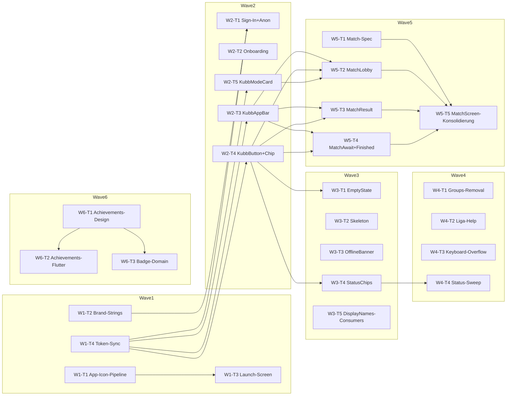

# Sprint B — UI/UX Polish + Kubb-Club Rebrand

**Stand**: 2026-05-28
**Quellen**:

- `docs/design/AUDIT.md` (Designer-Audit, Primärquelle für Reihenfolge)
- `docs/design/chats/chat1.md`, `chat2.md`, `chat3.md` (Design-Iterations-Logs)
- `docs/design/REBRAND_README.md` (Rebrand-Walk-Through)
- `docs/design/quality-gates/audit-summary.md` (kondensierte Audit-Essenz)
- `docs/design/quality-gates/mobile-kit-overview.md` (Mobile-Kit-Inventar)
- `docs/bug-hunt-2026-q3/master-report.md` Sektion „End-of-Sweep — Master-Summary" (Sprint-B-Empfehlungen aus Bug-Hunt)
- `docs/MAENGEL_REPORT_2026-05-25.md` (Owner-Mängel-Liste vom 25.05.)
- `docs/plans/sprint-a-bug-fix/sprint-plan.md` (Wave-Pattern, Worktree-Setup, Audit-Block)

**Base-Commit**: aktuelle `main` nach Sprint-A-Merge (Sprint A fängt mit Outbox-Submitter + Score-Drafts + Auth-Cache + Conflict-Routing + Roster-Wire + EKC-Domain + Race-Hotfix + Forfeit + Display-Names + Invalidate-Banners auf und mergt sequentiell auf main).

**Branch-Strategie**: pro Worker eigener Worktree, Branch `sprintB-w<wave>-<slug>`. Worker pushen nicht. Integration cherry-picked sequentiell auf `sprintB-integration`, ff-only Merge auf `main` nach jeder Wave. Pre-commit-msg-Hook unter `.git/hooks/commit-msg` bleibt scharf.

---

## Scope-Aufteilung

Sprint B ist der UI/UX-Polish-Sprint nach Sprint A. Die Bug-Hunt-Master-Summary nennt ihn `Sprint B — UI/UX-Polish` (~5–7 Tage). Wir splitten in fünf logische Slices plus ein klar abgegrenztes Backlog für später.

### Sprint-B-1: Rebrand-MVP (AUDIT §2 — Blocker)

Reihenfolge folgt AUDIT §6 Punkt 1–5.

1. App-Icon-Export-Pipeline (SVG → PNG, iOS + Android + Web + Favicon).
2. Brand-Strings ersetzen („Brosi" → „Kubb Club") in ARB-Files + Manifest-Stellen.
3. App-Title in `pubspec.yaml`, `AndroidManifest.xml`, `Info.plist`, `web/manifest.json`.
4. Launch Screen iOS/Android/Web.
5. Sign-In + Anonymous Signup Screens nachziehen (Designs liefern + Flutter-Polish).
6. Onboarding-Tour (3–4 Slides) bauen.

### Sprint-B-2: UI-Polish auf Bug-Hunt-Mängel + Design-Drift

Adressiert die im Mängel-Report 2026-05-25 als P2/P3 markierten Punkte sowie die im End-of-Sweep aufgeführten Display-Name- und Empty-State-Re-Hits, die noch offen sind nach Sprint A.

7. Mängel #1 Status-Visuals (Chips visuell differenzieren, semantische Akzentfarben pro Bereich).
8. Mängel #1 Empty-States (Bug-Hunt R18-F-14 + AUDIT §4.2).
9. Mängel #2.1 Gruppen-Feature entfernen (Bug-Hunt R19-F-03 + R20-F-01, Owner hat in Sprint-A-Plan Option A bestätigt).
10. Mängel #2.3 Liga-Klassen-Hilfetext + Liga-Feld-Eingabe reparieren.
11. Mängel #2.4 Keyboard-Overflow im Team-Create-Form (`SingleChildScrollView` + `viewInsets.bottom`).
12. Display-Name-Konsumenten (Standings, Live-Dashboard, Public-Roster) — Tail von Sprint-A-W3-T4, Wire ist da, Konsumenten ziehen nach.
13. Component-Library-Builds: `KubbButton`, `KubbChip`, `KubbModeCard`, `KubbAppBar` (mobile-kit-overview Punkt „AppBar nicht zentralisiert").

### Sprint-B-3: Empty/Loading/Offline-States (AUDIT §4.2–§4.4)

14. Empty-State-System (K+Crown-Vignette + CTA, ein Widget, alle Listen-Konsumenten umstellen).
15. Skeleton-Loading für Session-Liste, Stats, Standings (Shimmer oder eigene Animation).
16. Offline-Banner mit Sync-Status (`connectivityProvider` + Outbox-Status, baut auf Sprint-A-W3-T5 auf).

### Sprint-B-4: Match-Flow (AUDIT §6 Pkt 6 — High-Impact)

17. `MatchScreen.dart` (NEU im Design, kein konsolidiertes Flutter-Pendant) — Live-Tab-Konsolidierung mit 4-Action-Pad.
18. MatchLobby, MatchResult, MatchAwaitOthers, MatchFinished UI-Polish gegen den Mobile-Kit.

### Sprint-B-5: Achievements / Badges (AUDIT §4.6)

19. Achievements-Screen-Design (Designer-Pass nötig — Owner-Eskalation).
20. 12–15 Badges-Inventar + Brand-Glyphen (Initial-Set, CustomPainter optional Sprint C).

### Sprint-B-Backlog (Sprint-C-relevant oder später)

- Tablet/Desktop-Layout (AUDIT §4.1) — eigener Sprint nach C. Master/Detail-Pattern, Top-3-Screens (Home, Stats, Match).
- Custom Brand-Glyphen CustomPainter (AUDIT §5) — eigener Designer-Sprint, ersetzt Lucide-Stubs in `lib/core/ui/icons.dart`.
- Share/Match-Link UI (AUDIT §4.7).
- Heli-Toggle UX (AUDIT §4.8).
- Notifications & Match-Invites Push-Copy + In-App-Banner (AUDIT §4.5) — wartet auf Push-Infra.
- Local-Font-Bundling (AUDIT §5) — kleinere Aufgabe, kann in Sprint C.

---

## Architektur-Notizen für die Waves

- Senior-Limit: max 100 LOC, max 3 Files, max 1h pro Task. Wenn ein AUDIT-Punkt grösser ist (z.B. Match-Live-Screen), splitten in mehrere Worker-Tasks mit klarer Reihenfolge.
- Test-First bei Widget-Logik mit State (Onboarding-Page-Controller, MatchScreen-Tab-State, Empty-State-Conditional) — Widget-Test vorab.
- Worktrees vorab manuell anlegen mit `git worktree add /tmp/kubb-<slug> -b sprintB-w<N>-<slug> <head-sha>`. Worker-Briefing fängt mit `cd /tmp/kubb-<slug>` an.
- Worker-Briefings sind self-contained. Kein impliziter Kontext.
- Pre-commit-msg-Hook bleibt scharf. Worker-Briefing nennt das explizit.
- ARB-Konflikte sind erwartet (mehrere parallele UI-Worker schreiben in `lib/l10n/app_de.arb`). Integration-Strategie wie in Sprint A: Python-Merge-Script, `flutter gen-l10n`, dann fortfahren.

---

## Wave-Plan

### Wave 1 — Rebrand-Foundation (4 Worker, parallel)

Wave-Ziel: Asset-Pipeline + Brand-Strings + App-Title + Token-Konsistenz. Ohne diese vier ist kein TestFlight-/Play-Console-Submission möglich.

#### W1-T1: App-Icon-Export-Pipeline (AUDIT §2.1)

- **AUDIT-Ref**: §2.1
- **Type**: infra + docs
- **Bounded Context**: core (assets)
- **Files**: `tools/export_icons.sh` (neu) oder `tools/export_icons.dart`, `android/app/src/main/res/mipmap-*dpi*/ic_launcher.png` (5 Files überschreiben), `android/app/src/main/res/drawable/ic_launcher_foreground.xml` (neu), `ios/Runner/Assets.xcassets/AppIcon.appiconset/` (13 PNGs + `Contents.json`), `web/favicon.png`, `web/icons/Icon-192.png`, `web/icons/Icon-512.png`, `docs/design/assets/README.md` (Export-Anleitung).
- **LOC-Schätzung**: 70 (Script + Doku) — Asset-Files sind Binär-Output, zählen nicht.
- **Worker-Agent**: `/agents/coder` (infra instruction)
- **Dependencies**: none
- **Worker-Briefing**:

  ```
  cd /tmp/kubb-w1-icon-export

  Du bist Worker W1-T1 fuer Sprint B. Auftrag: Export-Pipeline fuer das Kubb-Club-Logo-Mark
  (Variante A "Meadow Badge", siehe docs/design/chats/chat1.md) auf alle Plattform-Groessen.

  STRICT WORKFLOW BOUNDARY:
  - Bleib auf branch sprintB-w1-icon-export.
  - Kein push, kein switch, kein merge, kein touch auf main.
  - Keine Arbeit ausserhalb des Scopes (kein Launch-Screen-Code, keine String-Aenderung).
  - Wenn fertig: commit + report, stop.

  Quality gates vor jedem Commit:
  - `flutter analyze` clean.
  - `flutter build apk --debug` (oder `flutter build appbundle`) baut durch — Icon-Verifikation.
  - Keine `Co-Authored-By`-Zeile, kein Tool-Name in Commit-Body. Pre-commit-msg-Hook unter
    `.git/hooks/commit-msg` blockiert das.

  Files to read first:
  1. `docs/design/AUDIT.md` Sektion 2.1.
  2. `docs/design/assets/logo-mark.svg` (Master-SVG, Variante A Meadow Badge).
  3. `docs/design/preview/brand-splash.html` (Splash-Vorlage).
  4. Bestehende Android-Mipmap-Struktur: `android/app/src/main/res/mipmap-*/`.
  5. iOS-Asset-Catalog-Konvention (Apple HIG-Spec).

  Concrete change:
  - Export-Script `tools/export_icons.sh` (oder `tools/export_icons.dart` mit `image`-package),
    das aus `docs/design/assets/logo-mark.svg` rastered PNGs in folgenden Groessen produziert:
    - iOS: 1024, 180, 167, 152, 120, 87, 80, 76, 60, 58, 40, 29, 20 (13 Sizes) — landen in
      `ios/Runner/Assets.xcassets/AppIcon.appiconset/` mit gueltiger `Contents.json`.
    - Android mipmap-*dpi*: 192 (xxxhdpi), 144 (xxhdpi), 96 (xhdpi), 72 (hdpi), 48 (mdpi) — ueberschreiben.
    - Android Adaptive Icon: `ic_launcher_foreground.xml` (Vector-Drawable mit K+Crown) und
      `ic_launcher_background.xml` (Meadow-Green Fill `#2D6324`).
    - Web: `web/icons/Icon-192.png`, `web/icons/Icon-512.png`, `web/icons/Icon-maskable-192.png`,
      `web/icons/Icon-maskable-512.png`.
    - Favicon: `web/favicon.png` (32) + `web/icons/apple-touch-icon-180.png`.
  - Tool-Chain: `rsvg-convert` (libRSVG) oder `inkscape --export-type=png` — Tooling im Script-Header
    dokumentieren.
  - `docs/design/assets/README.md` (neu, max 30 Zeilen) mit Export-Anleitung:
    Voraussetzung, Befehl, Output-Pfade.

  Acceptance:
  - Given das Script wird auf einem Linux/macOS mit rsvg-convert ausgefuehrt
    Then liegen alle PNG-Sizes im richtigen Verzeichnis und das Android-Build laeuft durch.
  - `Contents.json` ist valide (iOS).
  - `ic_launcher_foreground.xml` rendert ohne Crash (Android-Vector-Drawable-Convention).

  Reporting:
  - Subject: `chore(infra): add app-icon export pipeline for kubb club rebrand`.
  - Body: `W1-T1`, AUDIT §2.1.
  - Wenn `rsvg-convert` lokal fehlt: fallback auf `inkscape` oder als Installation-Hinweis
    in `docs/design/assets/README.md` dokumentieren; im Report-Footer melden.
  ```

#### W1-T2: Brand-String-Sweep (AUDIT §2.3)

- **AUDIT-Ref**: §2.3
- **Type**: frontend + i18n
- **Bounded Context**: core (l10n + manifests)
- **Files**: `lib/l10n/app_de.arb` (alle `Brosi`-Vorkommen ersetzen), `pubspec.yaml` (nur `description`, nicht `name` — siehe Note), `android/app/src/main/AndroidManifest.xml`, `ios/Runner/Info.plist`, `web/manifest.json`, `web/index.html` (`<title>`), `docs/design/ui_kits/app/SettingsScreen.jsx`, `docs/design/ui_kits/app/AppSettingsModal.jsx` (Footer-Strings laut `mobile-kit-overview.md`).
- **LOC-Schätzung**: 60
- **Worker-Agent**: `/agents/coder` (frontend instruction)
- **Dependencies**: none
- **Worker-Briefing**:

  ```
  cd /tmp/kubb-w1-brand-strings

  Du bist Worker W1-T2 fuer Sprint B. Auftrag: alle "Brosi"- und "Brosi's Kubb"-Strings durch
  "Kubb Club" ersetzen — ARB, Manifests, Web, Mobile-Kit-Footer.

  STRICT WORKFLOW BOUNDARY:
  - Bleib auf branch sprintB-w1-brand-strings.
  - Kein push, kein switch, kein merge.
  - Package-Rename `pubspec.yaml: name` NICHT anfassen — invasiv, separater Task (Backlog).
  - Wenn fertig: commit + report, stop.

  Quality gates:
  - `flutter analyze` clean.
  - `flutter gen-l10n` laeuft durch, generated Files staged.
  - `flutter test` gruen (App-Title-Asserts ggf. anpassen).
  - Keine AI-Spuren in Commit-Message.

  Files to read first:
  1. `docs/design/AUDIT.md` Sektion 2.3.
  2. `docs/design/REBRAND_README.md` (komplette Brand-Migration-Liste).
  3. `lib/l10n/app_de.arb` — `grep -i brosi` zeigt alle Stellen.
  4. `docs/design/quality-gates/mobile-kit-overview.md` Sektion "Rebrand-Aenderungen".

  Concrete change:
  - `lib/l10n/app_de.arb`: alle `Brosi`/`Brosi's Kubb`-Werte auf `Kubb Club`. ARB-Keys bleiben gleich.
  - `android/app/src/main/AndroidManifest.xml`: `android:label="Kubb Club"`.
  - `ios/Runner/Info.plist`: `CFBundleDisplayName` und `CFBundleName` auf `Kubb Club`.
  - `web/manifest.json`: `name: "Kubb Club"`, `short_name: "Kubb Club"`.
  - `web/index.html`: `<title>Kubb Club</title>` + `<meta name="description"...>` Wert.
  - Mobile-Kit Footer in `SettingsScreen.jsx` Zeile 35 und `AppSettingsModal.jsx` Zeile 53
    auf `Kubb Club · v0.1.0`.
  - `pubspec.yaml`: `description` updaten, `name` NICHT.

  Acceptance:
  - `git diff --stat` zeigt nur die genannten Files.
  - `grep -ri "Brosi" lib/ android/ ios/ web/ docs/design/ui_kits/app/` liefert keine Treffer mehr
    (Ausnahme: Mock-Klub-Name `Brosi's Kubb` in `ProfileScreen.jsx` Zeile 67 bleibt — laut
    mobile-kit-overview.md "Beispiel-Klub-Name").
  - App-Title auf Android/iOS-Emulator zeigt "Kubb Club".

  Reporting:
  - Subject: `feat(core): rebrand strings to kubb club across app and manifests`.
  - Body: `W1-T2`, AUDIT §2.3.
  ```

#### W1-T3: Launch Screen iOS/Android/Web (AUDIT §2.2)

- **AUDIT-Ref**: §2.2
- **Type**: infra + frontend
- **Bounded Context**: core (boot)
- **Files**: `ios/Runner/Base.lproj/LaunchScreen.storyboard`, `android/app/src/main/res/drawable/launch_background.xml` (+ `drawable-v21/`), `android/app/src/main/res/values/styles.xml`, `web/index.html` (`<body>`-Loader-HTML/CSS).
- **LOC-Schätzung**: 90 (drei Plattformen — Grenze)
- **Worker-Agent**: `/agents/coder` (infra instruction)
- **Dependencies**: W1-T1 (Assets liegen)
- **Worker-Briefing**:

  ```
  cd /tmp/kubb-w1-launch-screen

  Du bist Worker W1-T3 fuer Sprint B. Auftrag: Launch Screen auf allen drei Plattformen rebrand'en.
  Vorlage: `docs/design/preview/brand-splash.html` Variante A (Meadow + Wordmark) oder B (Mark Only).

  STRICT WORKFLOW BOUNDARY:
  - Bleib auf branch sprintB-w1-launch-screen.
  - Kein push, kein switch, kein merge.
  - Keine Animation-Implementation — statischer Splash reicht. Animationen sind Backlog.
  - Wenn fertig: commit + report, stop.

  Quality gates:
  - `flutter analyze` clean.
  - Android-Build laeuft.
  - iOS-Build laeuft (xcodebuild oder flutter build ios --no-codesign).

  Files to read first:
  1. `docs/design/AUDIT.md` Sektion 2.2.
  2. `docs/design/preview/brand-splash.html` (Vorlagen A/B/C/D/E).
  3. Aktuelle Launch-Configs:
     - `ios/Runner/Base.lproj/LaunchScreen.storyboard`
     - `android/app/src/main/res/drawable/launch_background.xml`
     - `android/app/src/main/res/drawable-v21/launch_background.xml`
     - `web/index.html`

  Concrete change:
  - iOS-Storyboard: Meadow-Background (`#2D6324`), zentriertes K+Crown-Glyph (aus W1-T1-Assets), kein Wordmark
    (Variante B "Mark Only" ist die App-Store-taugliche Wahl).
  - Android `launch_background.xml`: `<item android:drawable="@color/launch_meadow"/>` plus
    zentriertes K+Crown via `<bitmap android:src="@mipmap/ic_launcher_foreground"...>`.
    Color-Resource `launch_meadow` in `colors.xml` (`#2D6324`).
  - `styles.xml`: `LaunchTheme` bleibt Material, nur Background-Drawable ersetzt.
  - Web: `web/index.html` `<body>` bekommt einen Loader-Block: Meadow-Background, zentriertes
    ``, vor dem Flutter-Bootstrapping sichtbar. Wird durch Flutter
    nach `bootstrap.dart` removed.

  Acceptance:
  - Cold-Boot auf Android-Emulator: Meadow-Splash sichtbar bis Flutter-Engine bereit.
  - iOS-Sim analog.
  - Web: `flutter run -d chrome` zeigt Splash vor First-Frame.

  Reporting:
  - Subject: `feat(core): replace launch screens with kubb club brand`.
  - Body: `W1-T3`, AUDIT §2.2, depends `W1-T1`.
  ```

#### W1-T4: Token-Sync Flutter ↔ CSS (`--kc-*` direkt mappen)

- **AUDIT-Ref**: implizit aus `quality-gates/mobile-kit-overview.md` Token-Migration.
- **Type**: frontend + docs
- **Bounded Context**: core (theme)
- **Files**: `lib/core/ui/theme/kubb_tokens.dart`, `docs/design/quality-gates/mobile-kit-overview.md` (Checkliste updaten)
- **LOC-Schätzung**: 60
- **Worker-Agent**: `/agents/coder` (frontend instruction)
- **Dependencies**: none
- **Worker-Briefing**:

  ```
  cd /tmp/kubb-w1-token-sync

  Du bist Worker W1-T4 fuer Sprint B. Auftrag: `KubbTokens` in Flutter direkt auf den `--kc-*`-
  Canonical-Stack mappen (statt der `--bk-*`-Aliases). Sichtbar = identisch (CSS-Aliases sind 1:1),
  aber Code-Lesbarkeit + Mobile-Kit-Migration steht offen laut `mobile-kit-overview.md` Sektion
  "Cut-over-Pfad".

  STRICT WORKFLOW BOUNDARY:
  - Bleib auf branch sprintB-w1-token-sync.
  - Kein push, kein switch, kein merge.
  - Mobile-Kit bleibt auf `--bk-*` (kein JSX-Touch). Aliases bleiben in `colors_and_type.css`.
  - Wenn fertig: commit + report, stop.

  Quality gates:
  - `flutter analyze` clean.
  - `flutter test` gruen.
  - Goldens (falls vorhanden) regeneriert bei Bedarf.

  Files to read first:
  1. `docs/design/colors_and_type.css` (Canonical-Block `--kc-*` + Alias-Block `--bk-*`).
  2. `lib/core/ui/theme/kubb_tokens.dart` (aktuelle Wert-Tabelle).
  3. `docs/design/quality-gates/mobile-kit-overview.md` "Token-Migration".

  Concrete change:
  - `kubb_tokens.dart`: alle Konstanten-Kommentare auf `--kc-*`-Namen umstellen.
    Werte bleiben unveraendert (Alias-Block in CSS garantiert das).
  - Optional: Doc-Comment am Top des Files mit Verweis auf `colors_and_type.css` als Source-of-Truth.
  - `quality-gates/mobile-kit-overview.md`: Checkliste-Punkt "Token-Stack konsistent" auf `[x]`
    halten + Notiz dass Flutter jetzt direkt `--kc-*` referenziert.

  Acceptance:
  - Diff betrifft nur Kommentare/Doc-Comments + Memory-Hinweise, keine Wert-Aenderung.
  - App rendert identisch (Golden-Test als Smoke).

  Reporting:
  - Subject: `refactor(core): point kubb tokens at kc-canonical names`.
  - Body: `W1-T4`, mobile-kit-overview Token-Migration.
  ```

#### Audit nach Wave 1

```bash
for c in $(git rev-list main..HEAD); do
  git log -1 --format=%B $c > /tmp/audit.txt
  .git/hooks/commit-msg /tmp/audit.txt || echo "HOOK-FAIL on $c"
done
git diff main..HEAD | grep -iE "co-authored-by|noreply@anthropic|generated by|claude|anthropic|copilot" \
  && echo "AI-SPUREN GEFUNDEN" || echo "clean"
flutter analyze
(cd packages/kubb_domain && dart analyze && dart test)
flutter test
```

Falls clean: `git checkout main && git merge --ff-only sprintB-integration && git push origin main`.

---

### Wave 2 — Sign-In + Onboarding + Component-Library (5 Worker, nach Wave 1)

Wave-Ziel: AUDIT §6 Punkt 2 + 5, plus die in `mobile-kit-overview.md` als „offen" markierten Konsistenz-Punkte (AppBar zentralisieren, Component-Library als Basis für Sprint B-2/B-3).

#### W2-T1: Sign-In + Anonymous-Signup Designs nachziehen + Flutter-Polish

- **AUDIT-Ref**: §3 (Sign-In Hub + Anonymous Signup)
- **Type**: design + frontend
- **Bounded Context**: auth
- **Files**: `docs/design/ui_kits/app/SignInScreen.jsx` (neu), `docs/design/ui_kits/app/AnonymousSignupScreen.jsx` (neu), `lib/features/auth/presentation/sign_in_screen.dart`, `lib/features/auth/presentation/anonymous_signup_flow.dart`.
- **LOC-Schätzung**: 100 (Grenze, Splitting in zwei Commits OK: a) Mobile-Kit-Designs, b) Flutter-Polish)
- **Worker-Agent**: `/agents/coder` (frontend instruction)
- **Dependencies**: W1-T2 (Brand-Strings da), W1-T4 (Tokens umgezogen)
- **Worker-Briefing**:

  ```
  cd /tmp/kubb-w2-signin-anon

  Du bist Worker W2-T1 fuer Sprint B. Auftrag: Sign-In Hub + Anonymous Signup im Mobile-Kit
  designen + Flutter-Screens polishen. AUDIT §3 nennt beide als "high impact, im Router angelegt
  aber ohne UI-Vorlage".

  STRICT WORKFLOW BOUNDARY:
  - Bleib auf branch sprintB-w2-signin-anon.
  - Kein push, kein switch, kein merge.
  - OAuth-Verkabelung ist in Sprint A W1-T3 fertig — nicht anfassen.
  - Session-Cache ist in Sprint A W1-T4 gefixt — nicht anfassen.
  - Wenn fertig: commit + report, stop.

  Quality gates:
  - `flutter analyze` clean.
  - `flutter test test/features/auth/` gruen.
  - Mobile-Kit Files sind valides JSX (Browser laedt `ui_kits/app/index.html`).

  Files to read first:
  1. `docs/design/AUDIT.md` §3 (Tabelle Visuell fehlend).
  2. `docs/design/ui_kits/app/shared.jsx` (Icon-Set + AppBar-Pattern).
  3. `docs/design/ui_kits/app/HomeScreen.jsx` (Style-Referenz).
  4. `lib/features/auth/presentation/sign_in_screen.dart` (aktueller Stand nach Sprint A W1-T3).
  5. `lib/features/auth/presentation/anonymous_signup_flow.dart`.

  Concrete change:
  - `SignInScreen.jsx` neu: Sign-In Hub mit drei Buttons (Google, Apple, Anonym), Kubb-Club-Wordmark
    oben, EST.-Tagline unten. Inset-Card-Layout wie HomeScreen.
  - `AnonymousSignupScreen.jsx` neu: Display-Name-Input + Avatar-Initial-Preview + "Loslegen"-CTA.
    Disclaimer-Block "Anonyme Sessions koennen via Recovery-Phrase gerettet werden".
  - Flutter: `sign_in_screen.dart` Layout + Spacing an JSX angleichen. `anonymous_signup_flow.dart`
    bekommt den Avatar-Initial-Preview + verbessertes Spacing.
  - `index.html` im Mobile-Kit: zwei neue Pills/Routes.

  Acceptance:
  - Mobile-Kit zeigt Sign-In + Anonymous im Demo-Renderer.
  - Flutter-Screens rendern visuell konsistent mit dem Kit (Sichtprueung im Emulator).
  - Widget-Test `test/features/auth/presentation/sign_in_screen_test.dart` deckt Button-Layout.

  Reporting:
  - Subject (Commit a): `design(auth): add sign-in and anonymous signup mobile mocks`.
  - Subject (Commit b): `feat(auth): align sign-in and anonymous signup with mobile kit`.
  - Body: `W2-T1`, AUDIT §3, depends W1-T2 + W1-T4.
  ```

#### W2-T2: Onboarding-Tour 3–4 Slides (AUDIT §2.4)

- **AUDIT-Ref**: §2.4
- **Type**: frontend
- **Bounded Context**: auth (onboarding)
- **Files**: `docs/design/ui_kits/app/OnboardingScreen.jsx` (neu), `lib/features/auth/presentation/onboarding_tour.dart`, `lib/l10n/app_de.arb` (4 neue ARB-Keys).
- **LOC-Schätzung**: 95
- **Worker-Agent**: `/agents/coder` (frontend instruction)
- **Dependencies**: W1-T2, Owner-Approval der Slide-Texte (siehe Eskalation)
- **Worker-Briefing**:

  ```
  cd /tmp/kubb-w2-onboarding

  Du bist Worker W2-T2 fuer Sprint B. Auftrag: Onboarding-Tour mit 4 Slides bauen.
  Router referenziert `AuthRoutes.onboardingTour`, aber Visuals fehlen (AUDIT §2.4).

  STRICT WORKFLOW BOUNDARY:
  - Bleib auf branch sprintB-w2-onboarding.
  - Kein push, kein switch, kein merge.
  - PageView-Controller + 4 Slides + Skip/Naechste-Buttons + Done-Routing. Mehr nicht.
  - Wenn fertig: commit + report, stop.

  Quality gates:
  - `flutter analyze` clean.
  - `flutter gen-l10n` durchlaufen.
  - `flutter test test/features/auth/` gruen.

  Files to read first:
  1. `docs/design/AUDIT.md` §2.4 (Slide-Texte stehen dort).
  2. `lib/features/auth/presentation/onboarding_tour.dart` (aktueller Stub).
  3. `lib/features/auth/auth_routes.dart` (`onboardingTour`-Route).
  4. `docs/design/ui_kits/app/HomeScreen.jsx` (Style-Referenz).

  Slide-Texte (verbatim aus AUDIT, Owner-Approval Voraussetzung):
  1. "Sniper-Training fuer deine Wurf-Konstanz." (8m-Modus erklaert)
  2. "Finisseur — das Match-Endspiel ueben." (Finisseur erklaert)
  3. "Turniere & Ligen, online verfolgt." (Tournament-Modul)
  4. "Mit Freunden & Clubs trainieren." (Social-Modul)

  Concrete change:
  - `OnboardingScreen.jsx` im Mobile-Kit: PageView-Mock, 4 Slides je mit K+Crown-Vignette + Slogan + Bullet.
  - `onboarding_tour.dart`: `PageView.builder` mit 4 Slides, `SmoothPageIndicator`-Aequivalent
    (eigener Dot-Indicator, keine neue Dependency).
  - 4 ARB-Keys: `onboardingSlide1Title`, `onboardingSlide1Body`, ... Same fuer 2-4.
  - "Ueberspringen"-Button top-right + "Naechste"-CTA bottom; auf letzter Slide "Los geht's".
  - "Done"-Pfad: `context.go(AuthRoutes.signIn)` und Flag `onboarding_done=true` im
    `sharedPreferencesProvider` setzen (oder analog zu vorhandenem Pattern).

  Acceptance:
  - 4 Slides durchklickbar, Dot-Indicator wandert mit.
  - "Ueberspringen" und "Los geht's" beide routen auf Sign-In-Hub.
  - Wiederholtes Oeffnen mit `onboarding_done=true` skipped die Tour (Router-Logik bestaetigen
    oder Marker fuer Folge-Task setzen).

  Reporting:
  - Subject: `feat(auth): implement onboarding tour with four kubb club slides`.
  - Body: `W2-T2`, AUDIT §2.4, depends W1-T2 + Owner-Approval Slide-Texte.
  ```

#### W2-T3: KubbAppBar zentralisieren (Mobile-Kit-Overview Konsistenz)

- **Ref**: `mobile-kit-overview.md` Checkliste „AppBar nicht zentralisiert".
- **Type**: frontend
- **Bounded Context**: core (ui)
- **Files**: `lib/core/ui/widgets/kubb_app_bar.dart` (neu), 3–4 Konsumenten umstellen (Smoke-Test): `lib/features/training/presentation/home_screen.dart`, `lib/features/stats/presentation/stats_screen.dart`, `lib/features/player/presentation/profile_screen.dart`.
- **LOC-Schätzung**: 100 (3 Files Konsumenten + 1 neuer Widget — Splitting empfohlen)
- **Worker-Agent**: `/agents/coder` (frontend instruction)
- **Dependencies**: W1-T4
- **Worker-Briefing**:

  ```
  cd /tmp/kubb-w2-appbar

  Du bist Worker W2-T3 fuer Sprint B. Auftrag: zentrales `KubbAppBar`-Widget einziehen
  und 3 Konsumenten als Smoke-Test umstellen. Mobile-Kit-Pattern aus `shared.jsx` BK.AppBar
  (54/12/6-Padding, Eyebrow + Title + optional Icon-Slots).

  STRICT WORKFLOW BOUNDARY:
  - Bleib auf branch sprintB-w2-appbar.
  - Kein push, kein switch, kein merge.
  - Sweep-Migration (alle Konsumenten) ist NICHT Teil dieses Tasks — nur die drei genannten.
    Restliche bekommen TODO-Marker fuer Folge-Task.
  - Wenn fertig: commit + report, stop.

  Quality gates:
  - `flutter analyze` clean.
  - Widget-Test fuer `KubbAppBar` (Slot-Verwendung).
  - Bestehende Tests gruen.

  Files to read first:
  1. `docs/design/quality-gates/mobile-kit-overview.md` "AppBar"-Sektion.
  2. `docs/design/ui_kits/app/shared.jsx` Block `BK.AppBar`.
  3. Drei Konsumenten zum Lesen wie aktuell AppBar gebaut ist.

  Concrete change:
  - `lib/core/ui/widgets/kubb_app_bar.dart` mit:
    - `PreferredSizeWidget`-Konformitaet.
    - Named-Slots `leading`, `eyebrow`, `title`, `trailing`.
    - Padding-Spec aus shared.jsx exakt portiert.
    - Background = `KubbTokens.bg`.
  - Drei Konsumenten migrieren. Optisch identisch erwartet — Sichtpruefung.

  Acceptance:
  - `KubbAppBar`-Widget existiert, Widget-Test gruen.
  - Home + Stats + Profile rendern wie zuvor (Smoke).
  - Andere Screens bleiben unveraendert, bekommen `// TODO(sprintB-followup): migrate to KubbAppBar`-Marker.

  Reporting:
  - Subject: `feat(core): introduce kubb app bar widget and migrate home/stats/profile`.
  - Body: `W2-T3`, mobile-kit-overview Konsistenz.
  ```

#### W2-T4: KubbButton + KubbChip Component-Library

- **Ref**: `mobile-kit-overview.md` Component-Patterns.
- **Type**: frontend
- **Bounded Context**: core (ui)
- **Files**: `lib/core/ui/widgets/kubb_button.dart` (neu), `lib/core/ui/widgets/kubb_chip.dart` (neu), Beispiel-Konsument `lib/features/training/presentation/home_screen.dart`.
- **LOC-Schätzung**: 90
- **Worker-Agent**: `/agents/coder` (frontend instruction)
- **Dependencies**: W1-T4
- **Worker-Briefing**:

  ```
  cd /tmp/kubb-w2-button-chip

  Du bist Worker W2-T4 fuer Sprint B. Auftrag: `KubbButton` (Primary/Secondary/Ghost/Danger) und
  `KubbChip` (Status-Pille mit semantischen Tones) als Bausteine fuer die spaetere Komponenten-
  Library. Sweep-Migration aller Konsumenten ist NICHT Teil dieses Tasks.

  STRICT WORKFLOW BOUNDARY:
  - Bleib auf branch sprintB-w2-button-chip.
  - Kein push, kein switch, kein merge.
  - Wenn fertig: commit + report, stop.

  Quality gates:
  - `flutter analyze` clean.
  - Widget-Tests fuer beide Widgets (Variants + States).
  - `flutter test` gruen.

  Files to read first:
  1. `docs/design/quality-gates/mobile-kit-overview.md` "FAB" + "Stat-Tones"-Sektion.
  2. `docs/design/preview/components-buttons.html` (Vorlage).
  3. `docs/design/preview/components-chips.html`.
  4. `docs/design/ui_kits/app/shared.jsx` Block `saveBtn` / `nextBtn` / `applyBtn`.
  5. `lib/core/ui/theme/kubb_tokens.dart`.

  Concrete change:
  - `KubbButton({ KubbButtonVariant variant, KubbButtonSize size = medium, VoidCallback? onPressed, Widget child })`.
    Variants: primary (meadow-600), secondary (stone-200 surface), ghost (transparent), danger (miss).
    Sizes: medium (default), large (FAB-aequivalent), small (compact).
    States: enabled, disabled (40% opacity), loading (CircularProgressIndicator overlay).
  - `KubbChip({ KubbChipTone tone, String label, IconData? icon })`.
    Tones: neutral, hit, miss, heli, penalty, king, info.
  - Eine Konsumenten-Stelle (HomeScreen Action-Button) als Smoke umstellen.

  Acceptance:
  - Beide Widgets rendern alle Variants im Widget-Test.
  - HomeScreen-Action-Button nutzt `KubbButton.primary`.
  - Andere Konsumenten bekommen TODO-Marker fuer Folge-Task.

  Reporting:
  - Subject: `feat(core): add kubb button and chip components`.
  - Body: `W2-T4`, mobile-kit-overview Component-Patterns.
  ```

#### W2-T5: KubbModeCard Component (Home-Tile-Pattern)

- **Ref**: `mobile-kit-overview.md`, `HomeScreen.jsx` Mode-Cards.
- **Type**: frontend
- **Bounded Context**: core (ui)
- **Files**: `lib/core/ui/widgets/kubb_mode_card.dart` (neu), Smoke-Konsument `lib/features/training/presentation/home_screen.dart`.
- **LOC-Schätzung**: 75
- **Worker-Agent**: `/agents/coder` (frontend instruction)
- **Dependencies**: W1-T4
- **Worker-Briefing**:

  ```
  cd /tmp/kubb-w2-mode-card

  Du bist Worker W2-T5 fuer Sprint B. Auftrag: `KubbModeCard` als Baustein fuer Mode-Tiles
  (Sniper / Finisseur / Match / Tournament / 4m-Linie).

  STRICT WORKFLOW BOUNDARY:
  - Bleib auf branch sprintB-w2-mode-card.
  - Kein push, kein switch, kein merge.
  - Wenn fertig: commit + report, stop.

  Quality gates:
  - `flutter analyze` clean.
  - Widget-Test deckt Press-State + Disabled-State.

  Files to read first:
  1. `docs/design/preview/components-modecard.html`.
  2. `docs/design/ui_kits/app/HomeScreen.jsx` (Mode-Cards-Block).
  3. `lib/features/training/presentation/home_screen.dart`.

  Concrete change:
  - `KubbModeCard({ String title, String subtitle, IconData icon, KubbChipTone? accentTone, VoidCallback? onTap, bool disabled = false })`.
  - Layout: Inset-Card 14px border-radius, K+Crown-Vignette oder Icon links, Title (Display 18px Bold)
    + Subtitle (Body 13px stone-500) rechts, optional Accent-Stripe links via `accentTone`.
  - Press-State: scale 0.98, 120ms.
  - HomeScreen-Tiles auf `KubbModeCard` umstellen.

  Acceptance:
  - HomeScreen-Mode-Cards rendern identisch zum Mobile-Kit-Pendant.
  - Widget-Test deckt Press + Disabled.

  Reporting:
  - Subject: `feat(core): add kubb mode card component`.
  - Body: `W2-T5`, mobile-kit-overview Component-Patterns.
  ```

#### Audit nach Wave 2

Gleicher Block wie Wave 1.

---

### Wave 3 — Empty/Loading/Offline + Status-Chips + Display-Name-Konsumenten (5 Worker)

Wave-Ziel: AUDIT §4.2–§4.4 (Empty, Skeleton, Offline) ausliefern. Mängel-Report #1 (Status-Visuals + Empty-States). Display-Name-Konsumenten als Tail von Sprint-A-W3-T4.

#### W3-T1: Empty-State-System (`KubbEmptyState`)

- **AUDIT-Ref**: §4.2; Bug-Hunt R18-F-14; Mängel #1.
- **Type**: frontend
- **Bounded Context**: core (ui)
- **Files**: `lib/core/ui/widgets/kubb_empty_state.dart` (neu), 4 Konsumenten als Smoke: `lib/features/training/presentation/home_screen.dart` (Erst-Nutzer), `lib/features/social/presentation/friends_list_screen.dart`, `lib/features/tournament/presentation/tournament_list_screen.dart`, `lib/features/inbox/presentation/inbox_screen.dart`.
- **LOC-Schätzung**: 100 (Grenze — Splitting empfohlen: a) Widget, b) 4 Konsumenten)
- **Worker-Agent**: `/agents/coder` (frontend instruction)
- **Dependencies**: W2-T4 (KubbButton für CTA)
- **Worker-Briefing**:

  ```
  cd /tmp/kubb-w3-empty-state

  Du bist Worker W3-T1 fuer Sprint B. Auftrag: ein zentrales `KubbEmptyState`-Widget einziehen
  und 4 Konsumenten umstellen. AUDIT §4.2 + Maengel #1 + Bug-Hunt R18-F-14.

  STRICT WORKFLOW BOUNDARY:
  - Bleib auf branch sprintB-w3-empty-state.
  - Kein push, kein switch, kein merge.
  - Splitting in zwei Commits empfohlen: (a) Widget + Test, (b) 4 Konsumenten.
  - Wenn fertig: commit + report, stop.

  Quality gates:
  - `flutter analyze` clean.
  - Widget-Test fuer `KubbEmptyState`.
  - `flutter test` gruen.

  Files to read first:
  1. `docs/design/AUDIT.md` §4.2.
  2. `docs/bug-hunt-2026-q3/master-report.md` Eintrag R18-F-14 (Empty-States).
  3. `lib/core/ui/widgets/kubb_button.dart` (aus W2-T4).
  4. Vier Konsumenten-Screens (Erst-Nutzer-Pfade lesen).

  Concrete change:
  - `KubbEmptyState({ Widget vignette, String title, String body, KubbButton? cta })`.
    Vignette = K+Crown-SVG (aus `docs/design/assets/logo-monogram.svg`) tinted in `stone-400` opacity.
  - ARB-Keys (4 Sets je 3 Strings = 12 Keys):
    `emptySessionsTitle`, `emptySessionsBody`, `emptySessionsCta` (5 Sessions starten).
    `emptyFriendsTitle`, `emptyFriendsBody`, `emptyFriendsCta` (Freund hinzufuegen).
    `emptyTournamentsTitle`, `emptyTournamentsBody`, `emptyTournamentsCta` (Turnier suchen).
    `emptyInboxTitle`, `emptyInboxBody`, `emptyInboxCta` (Match starten).
  - Konsumenten ersetzen leere ListView-Branches durch `KubbEmptyState`.

  Acceptance:
  - 4 Erst-Nutzer-Erlebnisse zeigen K+Crown-Vignette + Satz + CTA.
  - CTA navigiert zur richtigen Stelle (oder ein NoOp mit Marker).
  - Widget-Test deckt alle Slots.

  Reporting:
  - Subject (a): `feat(core): add kubb empty state component`.
  - Subject (b): `feat(core): adopt kubb empty state in four list screens`.
  - Body: `W3-T1`, AUDIT §4.2 + R18-F-14 + Maengel #1.
  ```

#### W3-T2: Skeleton-Loading-Widgets

- **AUDIT-Ref**: §4.3
- **Type**: frontend
- **Bounded Context**: core (ui)
- **Files**: `lib/core/ui/widgets/kubb_skeleton.dart` (neu), Konsumenten: `lib/features/training/presentation/home_screen.dart` (Session-Liste), `lib/features/stats/presentation/stats_screen.dart` (Charts), `lib/features/tournament/presentation/tournament_standings_screen.dart`.
- **LOC-Schätzung**: 95
- **Worker-Agent**: `/agents/coder` (frontend instruction)
- **Dependencies**: W1-T4
- **Worker-Briefing**:

  ```
  cd /tmp/kubb-w3-skeleton

  Du bist Worker W3-T2 fuer Sprint B. Auftrag: Skeleton-Loading-Widgets fuer Session-Liste,
  Stats-Charts, Tournament-Standings (AUDIT §4.3). Eigene Shimmer-Animation, keine neue Dependency.

  STRICT WORKFLOW BOUNDARY:
  - Bleib auf branch sprintB-w3-skeleton.
  - Kein push, kein switch, kein merge.
  - Wenn fertig: commit + report, stop.

  Quality gates:
  - `flutter analyze` clean.
  - Widget-Test mit Fake-Timer (`fake_async`) zeigt Shimmer-Frames.

  Files to read first:
  1. `docs/design/AUDIT.md` §4.3.
  2. Drei Konsumenten-Screens.
  3. `lib/core/ui/theme/kubb_tokens.dart`.

  Concrete change:
  - `KubbSkeleton.bar({ double width, double height })` als rechteckiger Shimmer-Bar.
  - `KubbSkeleton.row({ int columns })` als Tabellen-Zeile.
  - `KubbSkeleton.chart()` als Wellen-Pattern.
  - Animation: 1.2s Linear-Repeat, `AnimatedBuilder` mit `AnimationController`, `Repeat.reverse`.
  - Drei Konsumenten zeigen Skeleton in `AsyncValue.loading`.

  Acceptance:
  - Session-Liste zeigt 3 Skeleton-Rows beim ersten Laden.
  - Stats-Chart zeigt Skeleton-Wellen.
  - Standings-Tabelle zeigt 5 Skeleton-Rows.

  Reporting:
  - Subject: `feat(core): add skeleton loading widgets and apply to three screens`.
  - Body: `W3-T2`, AUDIT §4.3.
  ```

#### W3-T3: Offline-Banner mit Sync-Status

- **AUDIT-Ref**: §4.4
- **Type**: frontend + application
- **Bounded Context**: core (ui + connectivity)
- **Files**: `lib/core/ui/widgets/kubb_offline_banner.dart` (neu), `lib/core/application/app_shell.dart` (oder Equivalent — Banner mounten), `lib/core/application/connectivity_provider.dart` (ggf. erweitern).
- **LOC-Schätzung**: 80
- **Worker-Agent**: `/agents/coder` (frontend instruction)
- **Dependencies**: Sprint-A-W3-T5 (`outboxFlushStatusProvider` ist live)
- **Worker-Briefing**:

  ```
  cd /tmp/kubb-w3-offline-banner

  Du bist Worker W3-T3 fuer Sprint B. Auftrag: Offline-Banner mit Sync-Status oben in der App-Shell.
  AUDIT §4.4 nennt "Offline · letzte Sync 2 min" als gelbe Pille top.

  STRICT WORKFLOW BOUNDARY:
  - Bleib auf branch sprintB-w3-offline-banner.
  - Kein push, kein switch, kein merge.
  - Realtime-Banner aus Sprint-A-W3-T5 bleibt eigenstaendig; dieser Task ist nur Connectivity + Outbox.
  - Wenn fertig: commit + report, stop.

  Quality gates:
  - `flutter analyze` clean.
  - Widget-Test mit Fake-Provider deckt Online/Offline/Syncing-States.

  Files to read first:
  1. `docs/design/AUDIT.md` §4.4.
  2. `lib/core/application/connectivity_provider.dart`.
  3. `lib/core/application/outbox_flusher_provider.dart` (`outboxFlushStatusProvider`).
  4. App-Shell-Datei (typisch `lib/main.dart` oder `lib/app.dart`).

  Concrete change:
  - `KubbOfflineBanner` Widget mit drei Zustaenden:
    - online + outbox idle → unsichtbar.
    - offline → gelbe Pille `KubbChip.tone(heli)` "Offline · letzte Sync vor {n} min".
    - online + outbox flushing → grosse Pille `KubbChip.tone(info)` "Sync laeuft…".
  - App-Shell mountet Banner unter der App-Bar (Stack oder Column).
  - ARB-Keys `offlineBannerOffline`, `offlineBannerSyncing`, `offlineBannerSyncedAgo`.

  Acceptance:
  - Connectivity-Toggle (Airplane-Mode im Sim) zeigt das Banner.
  - Outbox-flushing-Stream triggert "Sync laeuft…".

  Reporting:
  - Subject: `feat(core): add offline and sync banner in app shell`.
  - Body: `W3-T3`, AUDIT §4.4, depends Sprint-A-W3-T5.
  ```

#### W3-T4: Status-Chip-Differenzierung (Mängel #1)

- **Ref**: `docs/MAENGEL_REPORT_2026-05-25.md` Punkt 1; Bug-Hunt R10-F-06-Family.
- **Type**: frontend
- **Bounded Context**: tournament + match
- **Files**: `lib/features/tournament/presentation/match_detail_screen.dart`, `lib/features/tournament/presentation/tournament_list_screen.dart`, `lib/features/match/presentation/match_lobby_screen.dart`.
- **LOC-Schätzung**: 90
- **Worker-Agent**: `/agents/coder` (frontend instruction)
- **Dependencies**: W2-T4 (`KubbChip`)
- **Worker-Briefing**:

  ```
  cd /tmp/kubb-w3-status-chips

  Du bist Worker W3-T4 fuer Sprint B. Auftrag: Status-Chips (Match-Status, Tournament-Status,
  Registration-Status) visuell differenzieren. Lukas in Maengel #1: "Chips wirken alle gleich".

  STRICT WORKFLOW BOUNDARY:
  - Bleib auf branch sprintB-w3-status-chips.
  - Kein push, kein switch, kein merge.
  - Wenn fertig: commit + report, stop.

  Quality gates:
  - `flutter analyze` clean.
  - `flutter test` gruen.
  - Goldens (falls vorhanden) ggf. regenerieren.

  Files to read first:
  1. `docs/MAENGEL_REPORT_2026-05-25.md` Punkt 1.
  2. `docs/bug-hunt-2026-q3/master-report.md` R10-F-06 Re-Hit-Familie.
  3. `lib/core/ui/widgets/kubb_chip.dart` (aus W2-T4).
  4. Drei Konsumenten-Screens.

  Concrete change:
  - Status-Mapping zentral in `kubb_chip.dart` oder neuem `status_chip.dart`:
    - `match.live` → `tone: hit`, Label "Live".
    - `match.disputed` → `tone: penalty`, Label "Disput".
    - `match.finished` → `tone: info`, Label "Fertig".
    - `match.awaiting` → `tone: heli`, Label "Wartet".
    - `tournament.running` → `tone: hit`.
    - `tournament.draft` → `tone: neutral`.
    - `tournament.finished` → `tone: info`.
    - `tournament.cancelled` → `tone: miss`.
  - Drei Konsumenten nutzen das zentrale Mapping.

  Acceptance:
  - Sichtprueung: jeder Status hat eine eindeutige Farbe.
  - Widget-Test deckt das Mapping.

  Reporting:
  - Subject: `feat(tournament): differentiate status chips by semantic tone`.
  - Body: `W3-T4`, Maengel #1, refs R10-F-06.
  ```

#### W3-T5: Display-Name-Konsumenten nachziehen (Tail Sprint-A-W3-T4)

- **Bug-Hunt-Refs**: R13-F-02, R14-F-10, R19-F-09 (Sprint-A-W3-T4 hat das Wire-Mapping geliefert + Match-Detail-Smoke; diese drei Konsumenten ziehen jetzt nach).
- **Type**: frontend
- **Bounded Context**: tournament + social
- **Files**: `lib/features/tournament/presentation/tournament_standings_screen.dart`, `lib/features/realtime/presentation/live_dashboard_screen.dart` (oder Equivalent), `lib/features/tournament/presentation/public_roster_screen.dart`.
- **LOC-Schätzung**: 70
- **Worker-Agent**: `/agents/coder` (frontend instruction)
- **Dependencies**: Sprint-A-W3-T4 (`displayName`-Wire da)
- **Worker-Briefing**:

  ```
  cd /tmp/kubb-w3-display-name-consumers

  Du bist Worker W3-T5 fuer Sprint B. Auftrag: die drei in Sprint-A-W3-T4 mit
  `// TODO(W3-T4-consumer)`-Marker versehenen Screens auf `displayName ?? l.tournamentParticipantUnknown`
  umstellen.

  STRICT WORKFLOW BOUNDARY:
  - Bleib auf branch sprintB-w3-display-name-consumers.
  - Kein push, kein switch, kein merge.
  - Wire-Mapping ist in Sprint A erledigt — nur Konsumenten anfassen.
  - Wenn fertig: commit + report, stop.

  Quality gates:
  - `flutter analyze` clean.
  - `flutter test` gruen.

  Files to read first:
  1. Sprint-A-Plan W3-T4 (`docs/plans/sprint-a-bug-fix/sprint-plan.md` Zeile 913+).
  2. Drei Konsumenten-Screens (grep nach `TODO(W3-T4-consumer)`).
  3. `lib/l10n/app_de.arb` Key `tournamentParticipantUnknown`.

  Concrete change:
  - In jedem Screen UUID-Substring-Hack durch `participant.displayName ?? l.tournamentParticipantUnknown`
    ersetzen.
  - TODO-Marker entfernen.

  Acceptance:
  - Standings zeigt Namen statt UUID-Praefix.
  - Live-Dashboard zeigt Namen.
  - Public-Roster zeigt Namen oder "Unbekannt".

  Reporting:
  - Subject: `feat(tournament): consume display names in standings, dashboard, public roster`.
  - Body: `W3-T5`, Tail W3-T4 aus Sprint A, refs R13-F-02 + R14-F-10 + R19-F-09.
  ```

#### Audit nach Wave 3

Gleicher Block.

---

### Wave 4 — Mängel-Cleanup + Gruppen-Removal (4 Worker)

Wave-Ziel: Mängel-Report Punkte #2.1, #2.3, #2.4 abräumen. Gruppen-Removal als reine UI/Route-Removal (Datenmigration bleibt Sprint C laut Sprint-A-Plan-Notiz).

#### W4-T1: Gruppen-Feature entfernen — UI/Route-Removal (Mängel #2.1)

- **Bug-Hunt-Refs**: R19-F-03, R20-F-01
- **Type**: frontend
- **Bounded Context**: social
- **Files**: `lib/features/social/presentation/groups_screen.dart` (DELETE), `lib/features/social/presentation/group_create_screen.dart` (DELETE), `lib/features/social/social_routes.dart` (Routen-Entry entfernen), `lib/app/router.dart` (Route-Definition entfernen), Caller-Stellen (z.B. Settings/Drawer): TODO finden + umlenken.
- **LOC-Schätzung**: 90 (Lösch-Diff zählt nicht voll, aber Aufräumarbeiten Code-Pfade)
- **Worker-Agent**: `/agents/coder` (frontend instruction)
- **Dependencies**: none (Owner hat Option A bereits in Sprint-A-Plan bestätigt)
- **Worker-Briefing**:

  ```
  cd /tmp/kubb-w4-groups-removal

  Du bist Worker W4-T1 fuer Sprint B. Auftrag: Gruppen-Feature aus der UI entfernen.
  Owner hat Option A (Entfernen + Migration in Teams) in Sprint-A-Plan bestaetigt.
  Datenmigration ist Sprint C — dieser Task ist UI/Route-Removal.

  STRICT WORKFLOW BOUNDARY:
  - Bleib auf branch sprintB-w4-groups-removal.
  - Kein push, kein switch, kein merge.
  - KEINE DB-Migration, keine RPC-Loeschung. Nur Frontend.
  - Wenn fertig: commit + report, stop.

  Quality gates:
  - `flutter analyze` clean.
  - `flutter test` gruen — Gruppen-Tests entfernen oder skipen.
  - go_router laeuft ohne Crash (keine offenen Routen-Refs).

  Files to read first:
  1. `docs/MAENGEL_REPORT_2026-05-25.md` Punkt 2.1.
  2. `docs/bug-hunt-2026-q3/master-report.md` R19-F-03, R20-F-01.
  3. `lib/features/social/` komplett — Gruppen-Files identifizieren.
  4. `lib/app/router.dart` (oder wo go_router-Definition lebt).

  Concrete change:
  - Gruppen-Screens loeschen.
  - Routen-Definition entfernen.
  - Caller-Stellen (z.B. Drawer-Entry "Gruppen") entfernen.
  - Friends-Bereich (separat) bleibt unangetastet.
  - Tests fuer Gruppen entfernen.

  Acceptance:
  - `grep -ri "groups" lib/features/social/` zeigt nur Friends-Reste oder leer.
  - Router laedt ohne Crash.
  - Drawer/Settings zeigt keinen "Gruppen"-Eintrag mehr.

  Reporting:
  - Subject: `refactor(social): remove redundant groups feature ui`.
  - Body: `W4-T1`, Maengel #2.1, refs R19-F-03 + R20-F-01.
    "Datenmigration in Sprint C, hier nur UI/Route-Removal."
  ```

#### W4-T2: Liga-Klassen-Hilfetext + Liga-Feld-Eingabe (Mängel #2.3)

- **Type**: frontend + i18n
- **Bounded Context**: team
- **Files**: `lib/features/teams/presentation/team_create_screen.dart` (oder Equivalent), `lib/l10n/app_de.arb`.
- **LOC-Schätzung**: 70
- **Worker-Agent**: `/agents/coder` (frontend instruction)
- **Dependencies**: Sprint-A-W2-T5 (Team-Create-Robustness ist da)
- **Worker-Briefing**:

  ```
  cd /tmp/kubb-w4-liga-help

  Du bist Worker W4-T2 fuer Sprint B. Auftrag: Liga-Feld im Team-Create reparieren (Maengel #2.3).
  Aktuell zeigt es "(optional)" aber hat keine Eingabe. Owner-Vorschlag: enum-Selector
  (Profi / Semi-Profi / Spass-Spieler).

  STRICT WORKFLOW BOUNDARY:
  - Bleib auf branch sprintB-w4-liga-help.
  - Kein push, kein switch, kein merge.
  - Wenn fertig: commit + report, stop.
  - Falls Liga-Schema-Migration noetig (DB-Spalte): STOPP und im Report eskalieren. Owner-Frage 3
    aus Maengel-Report: Freitext oder Enum.

  Quality gates:
  - `flutter analyze` clean.
  - `flutter gen-l10n` durchlaufen.
  - `flutter test` gruen.

  Files to read first:
  1. `docs/MAENGEL_REPORT_2026-05-25.md` Punkt 2.3.
  2. `lib/features/teams/presentation/` Team-Create-Form-Widget.
  3. Drift-Schema fuer Team (`packages/...` oder `lib/core/data/db/`) — Liga-Spalte existiert?

  Concrete change (Option A — Enum-Selector, Default):
  - `LeagueClass` enum mit `profi`, `semiProfi`, `spass`.
  - Dropdown / `SegmentedButton` im Team-Create unter dem Liga-Feld-Label.
  - Hilfetext unter dem Selector: "Profi · Wettkampfspieler · Spass" als Beschreibung.
  - ARB-Keys: `leagueClassProfi`, `leagueClassSemiProfi`, `leagueClassSpass`, `leagueHelpText`.

  Option B — Freitext (falls Drift-Schema das schon so vorsieht):
  - `TextField` mit Validator (min 2 Zeichen, max 40).
  - Hilfetext gleich.

  Acceptance:
  - User kann Liga waehlen oder eingeben.
  - Submit klappt, Wert wird gespeichert.
  - Hilfetext ist sichtbar.

  Reporting:
  - Subject: `feat(teams): add league class selector with help text`.
  - Body: `W4-T2`, Maengel #2.3, "Option A Enum-Selector gewaehlt (Owner-Default)".
  ```

#### W4-T3: Keyboard-Overflow Team-Create (Mängel #2.4)

- **Type**: frontend
- **Bounded Context**: team
- **Files**: `lib/features/teams/presentation/team_create_screen.dart`.
- **LOC-Schätzung**: 30
- **Worker-Agent**: `/agents/coder` (frontend instruction)
- **Dependencies**: none
- **Worker-Briefing**:

  ```
  cd /tmp/kubb-w4-keyboard-overflow

  Du bist Worker W4-T3 fuer Sprint B. Auftrag: Keyboard-Overflow im Team-Create-Form fixen.
  Maengel #2.4: wenn Software-Tastatur erscheint, laeuft das Form unten ueber den Rand.

  STRICT WORKFLOW BOUNDARY:
  - Bleib auf branch sprintB-w4-keyboard-overflow.
  - Kein push, kein switch, kein merge.
  - 30 LOC Mini-Task.
  - Wenn fertig: commit + report, stop.

  Quality gates:
  - `flutter analyze` clean.
  - Widget-Test mit Fake-Viewinsets simuliert Keyboard.

  Files to read first:
  1. `docs/MAENGEL_REPORT_2026-05-25.md` Punkt 2.4.
  2. `lib/features/teams/presentation/team_create_screen.dart`.

  Concrete change:
  - Form in `SingleChildScrollView` einpacken.
  - `padding: EdgeInsets.only(bottom: MediaQuery.viewInsetsOf(context).bottom + 24)`.
  - `resizeToAvoidBottomInset: true` am Scaffold falls fehlt.

  Acceptance:
  - Widget-Test mit Fake-Insets 320 zeigt Submit-Button nicht clipped.
  - Manuell im Sim: Tastatur erscheint, Form scrollt sauber.

  Reporting:
  - Subject: `fix(teams): scroll team create form around software keyboard`.
  - Body: `W4-T3`, Maengel #2.4.
  ```

#### W4-T4: Status-Visual-Sweep auf weitere Konsumenten

- **Ref**: Mängel #1 — Tail von W3-T4.
- **Type**: frontend
- **Bounded Context**: cross-cutting
- **Files**: 3–4 Konsumenten mit TODO-Markern aus W3-T4 (`grep -ri "TODO(W3-T4-statuschip)" lib/`).
- **LOC-Schätzung**: 60
- **Worker-Agent**: `/agents/coder` (frontend instruction)
- **Dependencies**: W3-T4
- **Worker-Briefing**:

  ```
  cd /tmp/kubb-w4-status-sweep

  Du bist Worker W4-T4 fuer Sprint B. Auftrag: die in W3-T4 mit TODO-Marker versehenen
  weiteren Status-Chip-Konsumenten auf das zentrale Mapping umstellen.

  STRICT WORKFLOW BOUNDARY:
  - Bleib auf branch sprintB-w4-status-sweep.
  - Kein push, kein switch, kein merge.
  - Wenn fertig: commit + report, stop.

  Quality gates:
  - `flutter analyze` clean.
  - `flutter test` gruen.

  Files to read first:
  1. W3-T4 Commit (`feat(tournament): differentiate status chips by semantic tone`).
  2. `grep -ri "TODO(W3-T4-statuschip)" lib/`.

  Concrete change:
  - Jeden TODO-Konsumenten auf das `status_chip.dart`-Mapping umstellen.
  - TODO-Marker entfernen.

  Acceptance:
  - Keine TODO-Marker mehr aus W3-T4.

  Reporting:
  - Subject: `feat(core): sweep remaining status chip consumers to central mapping`.
  - Body: `W4-T4`, Tail W3-T4.
  ```

#### Audit nach Wave 4

Gleicher Block.

---

### Wave 5 — Match-Flow Polish + konsolidierter Match-Live-Screen (5 Worker)

Wave-Ziel: AUDIT §6 Punkt 6 (Match-Flow). Mobile-Kit-Overview Mismatch #3 (konsolidiertes Live-Tab fehlt in Flutter). Polish auf bestehende Lobby/Result/Await/Finished.

#### W5-T1: MatchScreen (konsolidierter Live-Tab) — Architektur-Spike

- **Ref**: `mobile-kit-overview.md` Mismatch #3 + `MatchScreen.jsx`.
- **Type**: design + research
- **Bounded Context**: match
- **Files**: `docs/plans/sprint-b-ui-polish/match-live-screen-spec.md` (neu).
- **LOC-Schätzung**: 0 (nur Doku)
- **Worker-Agent**: `/agents/architect`
- **Dependencies**: none
- **Worker-Briefing**:

  ```
  cd /tmp/kubb-w5-match-spec

  Du bist Worker W5-T1 fuer Sprint B. Auftrag: Spec fuer den konsolidierten Match-Live-Screen
  schreiben. Mobile-Kit hat `MatchScreen.jsx` als 1-Screen-Variante (Lobby/Live/Result als Tabs);
  Flutter hat aktuell 4 separate Screens. Owner-Entscheid noetig: konsolidieren oder separat lassen?

  STRICT WORKFLOW BOUNDARY:
  - Du schreibst KEINEN Code. Nur Doku.
  - Bleib auf branch sprintB-w5-match-spec.
  - Kein push, kein switch, kein merge.
  - Wenn fertig: commit + report, stop. Owner-Abnahme triggert W5-T2/T3/T4.

  Quality gates:
  - Spec-Datei ist parsebar Markdown.

  Files to read first:
  1. `docs/design/AUDIT.md` §6 Punkt 6.
  2. `docs/design/ui_kits/app/MatchScreen.jsx`.
  3. `docs/design/quality-gates/mobile-kit-overview.md` Mismatch #3.
  4. Die vier bestehenden Flutter-Screens: `match_lobby_screen.dart`, `match_result_screen.dart`,
     `match_await_others_screen.dart`, `match_finished_screen.dart`.

  Auftrag:
  - Entscheide eine von zwei Strategien und begruende:
    - A) Konsolidieren auf einen `MatchScreen` mit TabController (Lobby/Live/Result).
    - B) Status-quo 4 Screens, nur Polish.
  - Empfehle eine Option mit Begruendung.
  - Spec: Falls A — Layout-Sketch, State-Routing, Risiken (Realtime, Navigation-Back-Stack).
  - Spec: Falls B — Polish-Punkte pro Screen aus Mobile-Kit-Pendant.
  - Task-Schnitt fuer W5-T2/T3/T4 vorschlagen.

  Acceptance:
  - Spec hat klare Empfehlung A oder B.
  - Owner kann binnen 5 Min entscheiden.
  - Task-Schnitt fuer Folge-Worker steht.

  Reporting:
  - Subject: `docs(plans): draft match live screen consolidation spec`.
  - Body: `W5-T1`, AUDIT §6 Punkt 6, "Owner-Abnahme triggert W5-T2/T3/T4".
  ```

#### W5-T2: MatchLobby-Screen Polish (gegen Mobile-Kit)

- **AUDIT-Ref**: §3 (Match-Modul, Mobile-Kit-Pendant), §6 Punkt 6
- **Type**: frontend
- **Bounded Context**: match
- **Files**: `lib/features/match/presentation/match_lobby_screen.dart`.
- **LOC-Schätzung**: 80
- **Worker-Agent**: `/agents/coder` (frontend instruction)
- **Dependencies**: W2-T3 (`KubbAppBar`), W2-T4 (`KubbButton`), W2-T5 (`KubbModeCard`)
- **Worker-Briefing**:

  ```
  cd /tmp/kubb-w5-match-lobby

  Du bist Worker W5-T2 fuer Sprint B. Auftrag: MatchLobby gegen `MatchScreen.jsx`-Lobby-Tab polish'en.
  Inset-Card-Pattern, KubbAppBar, KubbButton, KubbModeCard nutzen.

  STRICT WORKFLOW BOUNDARY:
  - Bleib auf branch sprintB-w5-match-lobby.
  - Kein push, kein switch, kein merge.
  - Keine Routing-Aenderungen.
  - Wenn fertig: commit + report, stop.

  Quality gates:
  - `flutter analyze` clean.
  - Widget-Test bleibt gruen.

  Files to read first:
  1. `docs/design/ui_kits/app/MatchScreen.jsx` Lobby-Block.
  2. `lib/features/match/presentation/match_lobby_screen.dart`.
  3. `docs/design/quality-gates/mobile-kit-overview.md` Inset-Card-Pattern + Section-Header.

  Concrete change:
  - AppBar auf `KubbAppBar` umstellen.
  - Action-Buttons (Bereit / Abbrechen) auf `KubbButton.primary` / `KubbButton.ghost`.
  - Mitspieler-Liste in Inset-Card mit Section-Header.
  - Status-Pille auf `KubbChip`.

  Acceptance:
  - Sichtpruefung gegen `MatchScreen.jsx` Lobby-Tab — Layout matched.
  - Widget-Test gruen.

  Reporting:
  - Subject: `feat(match): polish match lobby to align with mobile kit`.
  - Body: `W5-T2`, AUDIT §6 Punkt 6.
  ```

#### W5-T3: MatchResult-Screen Polish

- **AUDIT-Ref**: §3 + §6 Punkt 6
- **Type**: frontend
- **Bounded Context**: match
- **Files**: `lib/features/match/presentation/match_result_screen.dart`.
- **LOC-Schätzung**: 80
- **Worker-Agent**: `/agents/coder` (frontend instruction)
- **Dependencies**: W2-T3, W2-T4
- **Worker-Briefing**:

  ```
  cd /tmp/kubb-w5-match-result

  Du bist Worker W5-T3 fuer Sprint B. Auftrag: MatchResult gegen `MatchScreen.jsx`-Result-Tab
  polish'en. Halbsatz-Verlauf, Liga-Impact-Block, Bekannt-Geben-Button.

  STRICT WORKFLOW BOUNDARY:
  - Bleib auf branch sprintB-w5-match-result.
  - Kein push, kein switch, kein merge.
  - Wenn fertig: commit + report, stop.

  Quality gates:
  - `flutter analyze` clean.
  - Widget-Test gruen.

  Files to read first:
  1. `docs/design/ui_kits/app/MatchScreen.jsx` Result-Block.
  2. `lib/features/match/presentation/match_result_screen.dart`.

  Concrete change:
  - AppBar, Buttons, Chips wie W5-T2.
  - Halbsatz-Verlauf als Inset-Card-Liste.
  - Liga-Impact-Block als sub-card mit `KubbChip.tone(info)`.

  Acceptance:
  - Sichtpruefung matched.

  Reporting:
  - Subject: `feat(match): polish match result against mobile kit`.
  - Body: `W5-T3`, AUDIT §6 Punkt 6.
  ```

#### W5-T4: MatchAwaitOthers + MatchFinished Polish

- **AUDIT-Ref**: §3 + §6 Punkt 6
- **Type**: frontend
- **Bounded Context**: match
- **Files**: `lib/features/match/presentation/match_await_others_screen.dart`, `lib/features/match/presentation/match_finished_screen.dart`.
- **LOC-Schätzung**: 90
- **Worker-Agent**: `/agents/coder` (frontend instruction)
- **Dependencies**: W2-T3, W2-T4
- **Worker-Briefing**: (analog W5-T2/T3, beide Screens, Splitting empfohlen falls > 100 LOC)

#### W5-T5: MatchScreen-Konsolidierung implementieren (falls W5-T1 → Option A)

- **AUDIT-Ref**: §6 Punkt 6 + `mobile-kit-overview.md` Mismatch #3
- **Type**: frontend + application
- **Bounded Context**: match
- **Files**: `lib/features/match/presentation/match_screen.dart` (neu — Tabbed-Container), Routes-Anpassung.
- **LOC-Schätzung**: 100 (Grenze, Splitting wahrscheinlich)
- **Worker-Agent**: `/agents/coder` (frontend instruction)
- **Dependencies**: W5-T1 (Owner-Abnahme A), W5-T2 + W5-T3 + W5-T4 (Screens stehen polished)
- **Worker-Briefing**: Plan-getrieben aus W5-T1 — Tab-Controller mit drei Tabs, State-Sharing via Riverpod-Provider.

#### Audit nach Wave 5

Gleicher Block.

---

### Wave 6 — Achievements (3 Worker, eigenständig)

Wave-Ziel: AUDIT §4.6. Hängt von Designer-Pass ab — Owner-Eskalation. Wave 6 läuft nur, wenn Designer Achievements-Screen + 12–15 Badges geliefert hat.

#### W6-T1: Achievements-Screen-Design (Designer)

- **AUDIT-Ref**: §4.6
- **Type**: design
- **Bounded Context**: gamification
- **Files**: `docs/design/ui_kits/app/AchievementsScreen.jsx` (neu), 12–15 Badge-SVGs in `docs/design/assets/badges/`.
- **Worker-Agent**: extern (Designer-Auftrag, kein Coder)
- **Dependencies**: Owner-Eskalation (siehe unten)

#### W6-T2: Achievements-Screen Flutter

- Files: `lib/features/achievements/presentation/achievements_screen.dart` (neu) + Repository-Stub.
- LOC: ~100 (Grenze)
- Dependencies: W6-T1

#### W6-T3: Badge-Inventar Domain

- Files: `packages/kubb_domain/lib/src/achievements/badge.dart` (neu), Trigger-Bedingungen pro Badge.
- Dependencies: Owner-Approval auf das Badge-Inventar

(Wave 6 ist auf hoher Flughöhe gehalten, weil sie auf Designer-Output wartet. Detaillierte Tasks erst nach W6-T1.)

---

## Dependencies + Wave-Plan (Mermaid)



---

## Worktree-Setup-Skript

Vor jeder Wave einmal ausführen (von `~/Workbench/projects/kubb_app` aus, HEAD_REF auf aktuellen main):

```bash
HEAD_REF=$(git rev-parse main)
# Wave 1
for slug in icon-export brand-strings launch-screen token-sync; do
  git worktree add /tmp/kubb-w1-$slug -b sprintB-w1-$slug $HEAD_REF
done
# Wave 2
for slug in signin-anon onboarding appbar button-chip mode-card; do
  git worktree add /tmp/kubb-w2-$slug -b sprintB-w2-$slug $HEAD_REF
done
# Wave 3
for slug in empty-state skeleton offline-banner status-chips display-name-consumers; do
  git worktree add /tmp/kubb-w3-$slug -b sprintB-w3-$slug $HEAD_REF
done
# Wave 4
for slug in groups-removal liga-help keyboard-overflow status-sweep; do
  git worktree add /tmp/kubb-w4-$slug -b sprintB-w4-$slug $HEAD_REF
done
# Wave 5
for slug in match-spec match-lobby match-result match-await-finished match-konsolidierung; do
  git worktree add /tmp/kubb-w5-$slug -b sprintB-w5-$slug $HEAD_REF
done
```

Cleanup nach Wave-Merge:

```bash
for d in /tmp/kubb-w<N>-*; do
  git worktree remove "$d" --force
done
git branch -D $(git branch | grep "sprintB-w<N>-")
```

## Audit-Schritte nach jeder Wave

```bash
for c in $(git rev-list main..HEAD); do
  git log -1 --format=%B $c > /tmp/audit.txt
  .git/hooks/commit-msg /tmp/audit.txt || echo "HOOK-FAIL on $c"
done
git diff main..HEAD | grep -iE "co-authored-by|noreply@anthropic|generated by|claude|anthropic|copilot" \
  && echo "AI-SPUREN GEFUNDEN" || echo "diff clean"
export PATH="$HOME/.local/flutter/bin:$PATH"
flutter analyze
(cd packages/kubb_domain && dart analyze && dart test)
flutter test
```

## Integration-Strategie

Pro Wave:

1. Worker committed auf eigenem Branch, kein push.
2. Orchestrator cherry-picked alle Worker-Commits auf `sprintB-integration` (vor Wave 1 frisch von `main` erstellen).
3. ARB-Konflikte lösen via manuellem Merge oder Python-Script (siehe Sprint A Pattern).
4. `flutter gen-l10n` neu, `lib/l10n/generated/` stagen.
5. Audit-Block durchlaufen.
6. Bei clean: `git checkout main && git merge --ff-only sprintB-integration && git push origin main`.
7. Worktree-Cleanup.

Bei Audit-FAIL: betroffene Worker re-briefen, neuen Branch vom cherry-pick-Stand, Fix als zusätzlicher Commit. Kein Amend.

---

## Cross-Reference

- **Bug-Hunt-Master-Report** End-of-Sweep, Sektion „Sprint B — UI/UX-Polish" (Zeile 1458 ff.):
  R19-F-03/R20-F-01 (Gruppen, nach Owner-Entscheidung — Sprint-A bestätigt Option A) → W4-T1.
  R19-F-05/F-06/F-07 (Mängel #2.2/.3/.4) → W4-T2, W4-T3.
  R2-F-01/F-02/F-03 (Avatar-Encoding, Save-Refresh, Onboarding-Tour-Wiring) → W2-T2 deckt Onboarding-Wiring ab; Avatar + Save-Refresh sind teils in Sprint-A-W3-T5 (Invalidate) erledigt, Rest Backlog.
  R3-F-01/F-02/F-03 (Tournament-Tile-Lüge, Bottom-Nav-Split, Heim-Tab-Content) → Backlog (separater Owner-Brief nötig).
  R18-F-14 (Empty-States) → W3-T1.
  R10-F-06/R13-F-02/R14-F-10 (Display-Name-Sweep) → Sprint-A-W3-T4 hat Wire geliefert, W3-T5 zieht Konsumenten nach.
- **AUDIT.md §6**: Reihenfolge 1–5 in Sprint-B-1 (Wave 1 + Wave 2). Reihenfolge 6 in Sprint-B-4 (Wave 5). Reihenfolge 9 in Sprint-B-5 (Wave 6). Reihenfolge 7 + 8 + 10 im Sprint-B-Backlog.
- **Chats**:
  - `chat1.md`: Logo Variante A „Meadow Badge" als Primary. Splash-Vorlagen A-E in `preview/brand-splash.html`. → Worker-Briefings W1-T1, W1-T3.
  - `chat2.md`: Desktop UI Kit Pattern, 1440×920 mit Sidebar-Nav. Tablet = Desktop (Owner). → Hintergrund für Sprint-B-Backlog Tablet-Layout.
  - `chat3.md`: 1:1-Parität Mobile ↔ Desktop. Mapping-Tabelle aller 12 Flows. → Hintergrund für W5 (MatchScreen, TournamentScreen).
- **Mängel-Report** Punkt 1 (Status-Visuals) → W3-T4, W4-T4. Punkt 2.1 (Gruppen) → W4-T1. Punkt 2.3 (Liga-Help) → W4-T2. Punkt 2.4 (Keyboard-Overflow) → W4-T3.

---

## Owner-Eskalationen vor Sprint-B-Start

Diese Punkte müssen vor dem jeweiligen Wave-Start geklärt sein. Sprint A startet ohne diese (Sprint A ist Funktionalität-First); Sprint B braucht sie.

1. **App-Display-Name endgültig**: „Kubb Club" — bestätigt aus AUDIT + Chats. Bestätigung dass `pubspec.yaml: name` bleibt `kubb_app` (Package-Rename ist Backlog wegen Invasivität).
2. **Bundle-IDs**: aktueller iOS/Android-Bundle-ID — bleibt oder wechselt auf `com.kubbclub.app`? Eskalation vor W1-T2 (Manifest-Strings). Wenn Wechsel: Apple-Cert wird neu nötig (Sprint C).
3. **Onboarding-Tour-Slide-Texte**: AUDIT §2.4 nennt 4 Vorschläge. Owner-Approval **vor W2-T2-Start**. Alternativ Worker schreibt Texte und Owner reviewed im PR.
4. **Liga-Klassen Freitext vs. Enum** (Mängel-Report Owner-Frage 3): Default-Annahme im Worker-Briefing ist Enum `{profi, semiProfi, spass}`. Bestätigung vor W4-T2.
5. **MatchScreen-Konsolidierung** (Mobile-Kit-Mismatch #3): Owner-Entscheid nach W5-T1-Spec-Output. Bestimmt ob W5-T5 läuft.
6. **Achievements-Designer-Pass**: Designer-Briefing für W6-T1 (Achievements-Screen + 12–15 Badges). Ohne Designer-Output bleibt Wave 6 im Backlog.
7. **Apple-Cert + Bundle-ID-Migration**: Sprint C, aber gut früh zu wissen — beeinflusst W1-T1 (Icon-Pipeline-Bundle-Naming).
8. **Support-Mail-Adresse**: Sprint C (App Store Connect, DSGVO-Footer) — gut zu wissen, kein Sprint-B-Blocker.
9. **Bottom-Nav-Split + Tournament-Tile-Lüge** (Bug-Hunt R3-F-01/F-02/F-03): kein Sprint-B-Auftrag — eskalieren ob Bedarf für separaten Designer-Pass oder direkter Code-Patch in Wave 4.

---

## Statistik

- 6 Waves, 25 Worker-Tasks (Wave 1: 4, Wave 2: 5, Wave 3: 5, Wave 4: 4, Wave 5: 5, Wave 6: 3).
- AUDIT-Punkte abgedeckt: §2.1–§2.4 vollständig (Wave 1+2), §3 teilweise (Sign-In + Anonymous in W2-T1, Rest im Sprint-B-Backlog), §4.2/4.3/4.4 vollständig (Wave 3), §4.6 in Wave 6 (Designer-abhängig), §4.5/§4.7/§4.8 im Backlog, §5 im Backlog (CustomPainter), §6 Reihenfolge eingehalten.
- Mängel-Report-Punkte abgedeckt: #1 (W3-T4 + W4-T4), #2.1 (W4-T1), #2.3 (W4-T2), #2.4 (W4-T3). #3 + #9 sind in Sprint A. #4–#8 sind Tournament-Spec-Themen und stehen in der Tournament-Roadmap, nicht in Sprint B.
- Bug-Hunt-Sprint-B-Empfehlungen abgedeckt: alle in Cross-Reference-Sektion oben gemappt.
- Erwartete Sprint-B-Dauer: 7–10 Arbeitstage bei voller paralleler Worker-Auslastung. Wave-Übergänge sind Sync-Points mit Audit (typisch 30–60 Minuten pro Wave).
- Test-First-Bedarf gering (UI-Polish): 4 Widget-Tests pro Wave als Smoke reicht. Domain-Touches sind minimal (Wave 6 Badge-Domain, falls Wave 6 läuft).
