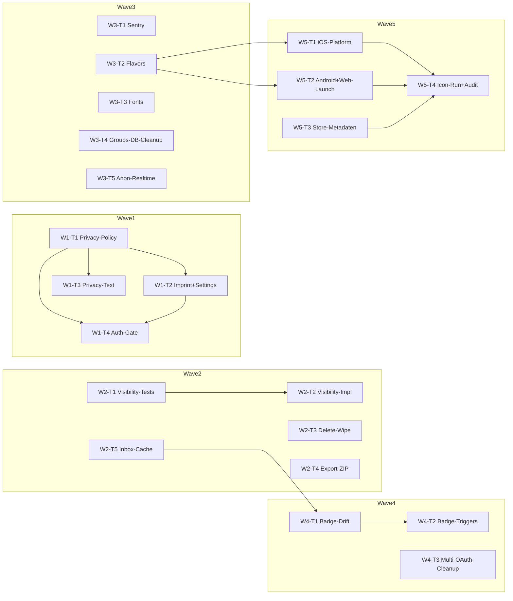

# Sprint C — Compliance + Launch-Vorbereitung

**Stand**: 2026-05-28
**Quellen**:

- `docs/bug-hunt-2026-q3/master-report.md` (End-of-Sweep §"Sprint C — Showstopper-abhängig", Sektion Runde 18 P0-Block R18-F-01..03, Runde 18 P3 R18-F-22, Sektion Runde 20 R20-F-02/-03/-04/-07/-10/-14)
- `docs/MAENGEL_REPORT_2026-05-25.md` (Punkt 9 Owner-Eskalation Berechtigungsmatrix, Owner-Frage 1 admin-Rollen, Sekundär-Block App-Store-Branding)
- `docs/design/AUDIT.md` (§2 Rebrand-Blocker iOS-Generation + Icon-Pipeline, §4.5 Push, §5 Tech-Anmerkungen Sentry/Flavors/Fonts)
- `docs/plans/sprint-a-bug-fix/sprint-plan.md` (Wave-Pattern, Worktree-Setup, Audit-Block, Worker-Briefing-Stil)
- `docs/plans/sprint-a-bug-fix/anon-rls-plan.md` (T6 Realtime-Followup für Public-Spectator, Vorbild für Plan-Detaillierung)
- `docs/plans/sprint-b-ui-polish/sprint-plan.md` (Backlog-Block Local-Font-Bundling, Designer-Eskalations-Muster, Cross-Reference-Stil)
- `docs/plans/sprint-b-ui-polish/achievements-spec.md` (Wave-6-Foundation — Drift-Hint und Trigger-Wiring sind als TODOs markiert)
- `docs/adr/0010-identity-and-auth.md` (Path A OAuth, Path B Keypair, Privacy-Floor)
- `docs/adr/0026-anon-spectator-revision.md` (Strategie A Pure-anon, Public-RPC-Surface)
- `lib/features/auth/application/account_deletion_controller.dart` (bestehender Delete-Pfad — räumt Supabase + Keypair, **nicht** die drift-DB)
- `lib/features/settings/data/csv_exporter.dart` (bestehender Export — nur Sniper/Finisseur-Sessions, kein Match/Tournament/Profile)
- `tools/export_icons.sh` (Icon-Pipeline-Stand — Script existiert, ist aber noch nie auf einer Build-Maschine durchgelaufen, PNGs liegen nicht im Repo)
- `docs/design/assets/` (sechs SVGs: `logo-mark.svg`, `-chalk`, `-ink`, `-roundel`, `logo-monogram`, `logo-wordmark` — Master ist Variante A "Meadow Badge" `logo-mark.svg`)
- `~/Workbench/projects/kubb_app/CLAUDE.md` (Worker-Pattern, Pre-commit-msg-Hook, AI-Spuren-Regel, Quality-Gates)

**Base-Commit**: `c67be5f` (Sprint-B-Wave-6 Tail — Achievements-Screen-Skelett auf main).

**Branch-Strategie**: pro Worker eigener Worktree, Branch `sprintC-w<wave>-<slug>`. Worker pushen nicht. Integration cherry-picked sequentiell auf `sprintC-integration`, ff-only Merge auf `main` nach jeder Wave. Pre-commit-msg-Hook unter `.git/hooks/commit-msg` bleibt scharf.

---

## Scope

Sprint C räumt die Compliance- und Submission-Lücken ab, die einen Public-Launch (App-Store, Play-Store, Web-Hosting jenseits Closed-Beta) heute noch blockieren. Drei Themenfelder:

1. **DSGVO / Compliance** — Datenschutzerklärung + Impressum + Privacy-Text-Korrektur + Visibility-Settings + Account-Delete-Wipe + Daten-Export-Vervollständigung.
2. **Rebrand-Submission** — Icon-Pipeline real durchlaufen, iOS-Plattform-Files generieren, Bundle-ID-Migration, Onboarding-Slide-Texte final.
3. **Backend / Infrastruktur** — Sentry/Crashlytics, drei Build-Flavors, lokal gebundelte Fonts, Drift-Migration für Achievements + Inbox-Cache, Gruppen-DB-Cleanup, Anon-Realtime-Public-Channel.

### Drin

- R18-F-01 (Privacy-Text-Lüge), R18-F-02 (Datenschutzerklärung + Impressum), R18-F-03 (Account-Delete drift-DB-Wipe), R18-F-22 (CSV-Export GDPR Art. 20 vervollständigen).
- R20-F-02 (Profile-Visibility FR-AUTH-5) + R20-F-10 (Friends-only-Privacy FR-SOCIAL-4) — gekoppelt umgesetzt.
- R20-F-03 (Inbox-Offline-Cache, ADR-0012 violiert).
- R20-F-04 (Auth-Gate-Whitelist).
- AUDIT §2.1 reale Rasterung (Build-Maschinen-Lauf), AUDIT §2.2 iOS-Plattform-Generation, AUDIT §5 Sentry/Flavors/Fonts.
- Sprint-B-W4 Tail: Gruppen-DB-Cleanup (UI ist weg, Tabellen + `group_create_jsonb`-RPC stehen noch).
- Sprint-A-Anon-RLS T6-Followup: Public-Realtime-Channel implementieren.
- Sprint-B-W6 Tail: Achievements-Drift-Persistenz + Trigger-Wiring an Match-/Session-Lifecycle.
- App-Store-Submission-Vorbereitung (LaunchScreen-Storyboard, Web-Manifest, Final-Audit) — abhängig von Owner-Eskalationen.

### Draussen (Backlog → Phase 2)

- R20-F-05 (Externe Deeplinks + Universal-Links — wartet auf Bundle-ID-Owner-Entscheidung, dann eigener Sprint).
- R20-F-07 (Block-Feature FR-SOCIAL-6 — eigener Sprint, hängt an Visibility-Foundation aus Wave 2).
- R20-F-24 (Push-Notifications — wartet auf OneSignal/FCM-Account, siehe Owner-Eskalation).
- R19-F-11 (Captain-Roadmap-Konflikt — eigene ADR-Revision, kein Sprint-C-Inhalt).
- R1-F-04 (Berechtigungsmatrix `user_roles` — eigene Story, Owner-Entscheidung steht aus).
- Tablet-/Desktop-Layout (Sprint-B-Backlog) — eigener Sprint nach C.
- ARB-Locale-Switch (R18-F-12 — Phase 1 bleibt `de`).

---

## Architektur-Notizen für die Waves

- **Senior-Limit** (siehe `.claude/rules/scrum-master.md`): max 100 LOC, max 3 Files, max 1h pro Task. Für Compliance-Texte (Datenschutzerklärung, Impressum) gilt: Markdown-Datei zählt als 1 File, der In-App-Screen mit Renderer zählt als zweites. Wenn ein Worker beide zusammen ausliefern muss und das Limit reisst, splitten in Text-Task + Renderer-Task.
- **Worktrees** vorab manuell anlegen mit `git worktree add /tmp/kubb-w<N>-<slug> -b sprintC-w<N>-<slug> $HEAD_REF`. Worker-Briefing fängt mit `cd /tmp/kubb-w<N>-<slug>` an.
- **Worker-Briefings** sind self-contained. Kein impliziter Kontext aus dieser Planungs-Session.
- **Pre-commit-msg-Hook** bleibt scharf. Worker-Briefing nennt das explizit.
- **ARB-Konflikte** erwartet (mehrere Wave-1- und Wave-2-Worker schreiben in `lib/l10n/app_de.arb`). Integration-Strategie wie in Sprint A/B: manueller Merge oder Python-Script, `flutter gen-l10n`, dann fortfahren.
- **Test-First** bei: Visibility-RLS-Policies (pgTAP-Test vor SQL), Drift-Migration für Inbox-Cache (Migration-Test vor Tabelle), Account-Delete-Wipe (Property-Test vor Repo-Patch). Achievements-Trigger und Realtime-Public-Channel folgen demselben Muster, wenn der Worker den Test-Slot vorzieht.
- **Bounded Contexts**: Compliance-Screens leben unter `lib/features/legal/` (neuer Bereich, Pragmatic-Stil — keine Domain-Logik). Visibility ist Cross-Cutting (`player/` für Schema, `social/` für Stats-Filter, `auth/` für RLS-Wiring) und braucht eigene Architektur-Notiz.

---

## Owner-Eskalationen (Sprint C)

### Sofort blockierend

- **Support-Mail-Adresse**: Welche? `support@kubb-club.ch`? Domain gekauft? Wenn ja: MX-Eintrag aktiv? Fallback: persönliche Adresse von Lukas als Übergang akzeptabel, muss aber in Impressum dokumentiert sein. **Blockiert W1-T2 (Impressum-Text) und W5-T3 (App-Store-Metadaten).**
- **Bundle-ID**: `com.kubbclub.app` oder anders? Aktueller Stand in `android/app/build.gradle` und `ios/Runner/Info.plist` ist `com.example.kubb_app` (Flutter-Default) — muss vor TestFlight neu sein. **Blockiert W3-T2 (Flavors) und W5-T1 (iOS-Generation).**
- **Apple-Developer-Account**: aktiv? TestFlight-Slot da? Provisioning-Profil + Distribution-Cert vorhanden? Wenn noch nicht: Account-Anmeldung ist ein 7-Tage-Block (Apple-Review). **Blockiert W5-T1 (iOS-Plattform-Generation kann ohne Account laufen, Submission nicht).**
- **OneSignal- oder Firebase-Project**: Setup? API-Keys (Server-Key + Client-Key) vorhanden? Wenn ja: welcher Anbieter? Wenn nein: Sprint C liefert die Push-Infrastruktur **nicht** — bleibt im Backlog. **Wirkt sich auf den finalen Submission-Sweep aus, ist aber kein Wave-1-Blocker.**
- **Datenschutzerklärungs-Text**: Owner schreibt Inhalt (Vorlage liefert Architect als Markdown-Skelett) oder externer Jurist? Empfehlung: Architect-Vorlage füllen, danach Owner-Review, optional juristischer Quick-Check vor Public-Launch. **Blockiert W1-T1 (Architect kann ohne Inhalt nur das Skelett anlegen).**
- **Impressum-Inhalt**: Owner-Daten (vollständiger Name, Postadresse, optional Verein/Firma, optional Handelsregister-Nummer). Bei Schweizer-Hosting reicht Adresse + Kontakt. **Blockiert W1-T2.**

### Mittelfristig (klären spätestens vor Wave 5)

- **Branding-Assets-Final**: Logo finalisiert? Sprint-B-Wave-1 hat Variante A "Meadow Badge" als Master genommen, aber die SVG-Datei ist eine erste Iteration. Wenn Designer noch nachzieht: Wave 1 nutzt Sprint-B-Stand, Final-Polish in Wave 5 oder Post-C.
- **Build-Maschine für Asset-Rasterung**: lokal (Lukas's Workstation hat `rsvg-convert`?) oder Cloud (GitHub-Actions-Job)? Sprint-B-W1-T1 hat das Script geschrieben, es ist noch nie gegen den echten Toolchain-Pfad gelaufen. Owner-Entscheid: A) Lukas läuft das Script einmalig lokal vor Wave 1 und committed die PNGs, B) Sprint C baut eine CI-Action, die das Script bei jedem Push gegen den Master-SVG ausführt.
- **Account-Delete-Confirmation-UX**: Soll das Wipe der lokalen DB einen extra Dialog-Step bekommen ("auch alle Trainings-Sessions löschen, das kann nicht rückgängig gemacht werden") oder ist das implizit Teil der bestehenden zwei Confirmation-Dialoge aus AK-13? Empfehlung: extra Step mit klarem Wording, weil sonst Pro-User-Backlash droht ("meine 200 Sessions sind weg!").
- **Onboarding-Slide-Texte final**: AUDIT §2.4 nennt 4 Vorschläge. Sprint-B-W2-T2 hat das Wiring, aber die Texte sind noch Stub. Wenn Owner die Texte nicht selbst schreiben mag: Worker schreibt Vorschläge im PR, Owner approved im Review. **Wirkt sich auf W5-T4 aus (Final-Audit).**
- **Sentry vs. Crashlytics**: Beides geht. Sentry hat einen Free-Tier (5k Events/Monat) und ist Tech-Stack-konformer (Dart-SDK gut gepflegt). Crashlytics setzt Firebase voraus (passt nicht zum Supabase-Stack). Empfehlung: Sentry. **Blockiert W3-T1.**
- **Profile-Visibility-Default**: `friends_only` (Bug-Hunt-Empfehlung, Privacy-by-Default) vs. `public` (App-Wachstum). Empfehlung: `friends_only` als Default, expliziter Opt-In auf `public` im Profile-Edit-Screen.
- **Visibility-Granularität**: pro Datenkategorie ein Setting (Profile, Stats, Match-Historie, Friend-List)? Bug-Hunt-Vorschlag (R20-F-02) ist ein einziges `profile_visibility`-Feld. Erweiterte Variante (eigene Visibility pro Kategorie) ist mehr Aufwand aber sauberer. Empfehlung: ein Feld in Sprint C, granulare Steuerung als Phase-2-Story.

---

## Wave-Plan

### Wave 1 — Compliance-Texte + Privacy-Korrektur (4 Worker, parallel)

Wave-Ziel: die drei sofort sichtbaren DSGVO-Lücken schliessen. Datenschutzerklärung und Impressum als Markdown-Files + In-App-Screen. Privacy-Section in den Settings sagt die Wahrheit. Onboarding-Tour bekommt die Compliance-Links.

#### W1-T1: Datenschutzerklärung — Skelett + In-App-Screen

- **Master-Report-ID**: R18-F-02 (Teil 1 von 2)
- **Type**: docs + frontend
- **Bounded Context**: core (legal, neuer Bereich)
- **Files**: `docs/legal/privacy-policy-de.md` (neu, Skelett), `lib/features/legal/presentation/privacy_policy_screen.dart` (neu), `lib/features/legal/data/legal_text_loader.dart` (neu, lädt Asset)
- **LOC-Schätzung**: 95 (Skelett 40 Zeilen Markdown + Screen 40 + Loader 15)
- **Worker-Agent**: `/agents/coder` (frontend + docs instruction)
- **Dependencies**: none (Owner liefert Text-Inhalt parallel, Worker schreibt Skelett mit Placeholder-Sektionen)
- **Worker-Briefing** (verbatim):

  ```
  cd /tmp/kubb-w1-privacy-policy

  Du bist Worker W1-T1 fuer Sprint C. Auftrag: Datenschutzerklaerung als Markdown-File anlegen
  (Skelett mit allen Pflicht-Sektionen nach DSGVO Art. 13/14) plus einen In-App-Screen, der das
  Markdown rendert.

  STRICT WORKFLOW BOUNDARY:
  - Bleib auf branch sprintC-w1-privacy-policy.
  - Kein push, kein switch, kein merge, kein touch auf main.
  - Keine Arbeit ausserhalb des Scopes (kein Impressum, das ist W1-T2; keine Privacy-Text-Korrektur in
    Settings, das ist W1-T3).
  - Wenn fertig: commit + report, stop.

  Quality gates vor jedem Commit:
  - `flutter analyze` clean.
  - `flutter test test/features/legal/` gruen (mind. ein Widget-Test der das Asset rendert).
  - Keine `Co-Authored-By`-Zeile, kein Tool-Name in Commit-Body. Pre-commit-msg-Hook unter
    `.git/hooks/commit-msg` blockiert das.

  Files to read first:
  1. `docs/bug-hunt-2026-q3/master-report.md` Eintrag R18-F-02 (Zeile 925-929).
  2. `docs/MAENGEL_REPORT_2026-05-25.md` — keinen direkten Eintrag, aber Owner-Frage 1 + 2.
  3. ADR `docs/adr/0010-identity-and-auth.md` — was geht ueber Supabase, was bleibt lokal.
  4. Bestehender Stil eines Settings-Screen (`lib/features/settings/presentation/settings_screen.dart`)
     als UI-Vorlage.
  5. `pubspec.yaml` — `flutter_markdown`-Dependency ist nicht im Stack, bewusst nicht einfuehren.
     Statt dessen ein eigener Renderer mit `Text` + `TextSpan` fuer Headings/Absaetze, max 30 Zeilen.

  Concrete change:
  - `docs/legal/privacy-policy-de.md` (neu, ca. 40 Zeilen) mit folgendem Skelett (Sektionen-Headings,
    Inhalts-Placeholder als `> Owner-Eskalation: Text hier`-Block):
    1. Verantwortlicher (Name, Adresse, E-Mail aus Owner-Eskalation).
    2. Erhobene Daten (Profil, Trainings-Sessions, Matches, Tournaments, Friend-Beziehungen, Inbox).
    3. Zweck der Verarbeitung pro Datentyp.
    4. Rechtsgrundlage (Art. 6 Abs. 1 lit. b DSGVO — Vertragserfuellung, lit. a — Einwilligung).
    5. Datenfluss (Supabase EU-Region — relevant fuer Art. 44).
    6. Speicherdauer pro Datentyp.
    7. Betroffenenrechte (Art. 15-21: Auskunft, Berichtigung, Loeschung, Datenuebertragbarkeit,
       Widerspruch, Beschwerderecht).
    8. Cookies / Tracking (App: keine; Web: optional Service-Worker fuer Offline-Cache).
    9. Kontakt fuer Datenschutzfragen.
  - Markdown-Asset in `pubspec.yaml` registrieren (`assets: - docs/legal/privacy-policy-de.md`).
    Achtung: nur DIESEN Eintrag dazu, nicht die ganze `assets:`-Sektion umordnen.
  - `lib/features/legal/data/legal_text_loader.dart` (neu): `Future<String> loadPrivacyPolicyDe()`
    mit `rootBundle.loadString('docs/legal/privacy-policy-de.md')`.
  - `lib/features/legal/presentation/privacy_policy_screen.dart` (neu): `StatelessWidget` mit
    `FutureBuilder<String>`. Custom-Renderer: split auf `\n\n`-Absatzgrenzen, Heading-Detection ueber
    `# ` / `## `-Prefix.
  - ARB-Keys: `legalPrivacyPolicyTitle`, `legalPrivacyPolicyLoading`.

  Acceptance:
  - Given der User oeffnet den Privacy-Policy-Screen
    When das Asset geladen ist
    Then sieht er die strukturierte Erklaerung mit allen 9 Sektionen.
  - Given das Asset fehlt (Asset-Bundle-Bug)
    Then erscheint ein Fallback-Text "Datenschutzerklaerung wird geladen ..." statt Crash.
  - Widget-Test mit Fake-Asset bestaetigt Rendering.

  Reporting:
  - Subject: `feat(legal): add privacy policy markdown asset and reader screen`.
  - Body: `W1-T1`, `R18-F-02 Teil 1`, "Owner-Eskalation Datenschutz-Inhalt steht aus".
  - Wenn `flutter_markdown` doch noetig (Custom-Renderer wird unleserlich): im Report eskalieren,
    keinen neuen Stack-Pick einseitig durchziehen.
  ```

#### W1-T2: Impressum — Skelett + In-App-Screen + Settings-Link

- **Master-Report-ID**: R18-F-02 (Teil 2 von 2)
- **Type**: docs + frontend
- **Bounded Context**: core (legal)
- **Files**: `docs/legal/imprint-de.md` (neu, Skelett), `lib/features/legal/presentation/imprint_screen.dart` (neu), `lib/features/legal/data/legal_text_loader.dart` (erweitern um `loadImprintDe()`), `lib/features/settings/presentation/widgets/app_section.dart` (zwei `SettingsRow`-Einträge "Datenschutz" + "Impressum")
- **LOC-Schätzung**: 90 (Skelett 25 + Screen 35 + Loader-Add 5 + Settings-Wire 25)
- **Worker-Agent**: `/agents/coder` (frontend + docs instruction)
- **Dependencies**: W1-T1 (Loader-Datei und Markdown-Renderer-Pattern werden gemeinsam genutzt — der Worker muss W1-T1 nach Cherry-Pick auf `sprintC-integration` als Vorlage haben)
- **Worker-Briefing**:

  ```
  cd /tmp/kubb-w1-imprint

  Du bist Worker W1-T2 fuer Sprint C. Auftrag: Impressum als Markdown-File plus In-App-Screen,
  und die beiden Legal-Screens (Datenschutz + Impressum) in der Settings App-Sektion verlinken.

  STRICT WORKFLOW BOUNDARY:
  - Bleib auf branch sprintC-w1-imprint.
  - Kein push, kein switch, kein merge.
  - Privacy-Policy-Screen kommt aus W1-T1 — du nutzt den `legal_text_loader`-Pattern und ergaenzt nur
    die Impressum-Methode. Wenn W1-T1 noch nicht im Worktree-Branch ist: STOPP und im Report eskalieren.
  - Wenn fertig: commit + report, stop.

  Quality gates:
  - `flutter analyze` clean.
  - `flutter test test/features/legal/` und `test/features/settings/` gruen.
  - Keine AI-Spuren im Commit.

  Files to read first:
  1. `docs/bug-hunt-2026-q3/master-report.md` Eintrag R18-F-02.
  2. `lib/features/legal/presentation/privacy_policy_screen.dart` (aus W1-T1) als Renderer-Vorlage.
  3. `lib/features/settings/presentation/widgets/app_section.dart` — wo die Legal-Links hin sollen
     (zwischen Privacy-Hinweis und Version-Row, siehe Zeile 144 ff.).

  Concrete change:
  - `docs/legal/imprint-de.md` (neu, ca. 20 Zeilen) mit Skelett:
    1. Verantwortlich (Name, Adresse aus Owner-Eskalation — Placeholder als
       `> Owner-Eskalation: Adresse hier`-Block).
    2. Kontakt (E-Mail aus Owner-Eskalation — Placeholder).
    3. Rechtliche Hinweise (Haftungsausschluss in Standard-Formulierung, Schweizer-Recht
       Verweis falls Owner Schweizer Verein).
    4. Bei Verein: Vereinsname + UID falls vorhanden.
  - Asset in `pubspec.yaml` registrieren.
  - `legal_text_loader.dart` um `Future<String> loadImprintDe()` ergaenzen.
  - `lib/features/legal/presentation/imprint_screen.dart` analog zum Privacy-Policy-Screen
    (gleicher Custom-Renderer, gleicher FutureBuilder).
  - `app_section.dart` Settings-Wire: zwei neue `SettingsRow` ueber dem Version-Row, die auf
    GoRouter-Routen pushen. Neue Routen in `lib/core/router.dart` mit Pfaden `/legal/privacy`
    und `/legal/imprint` registrieren.
  - ARB-Keys: `legalImprintTitle`, `legalImprintLoading`, `settingsRowPrivacyPolicy`,
    `settingsRowImprint`.

  Acceptance:
  - Given User oeffnet Settings
    Then sieht er zwei neue Eintraege "Datenschutz" und "Impressum" oberhalb der Version-Row.
  - Given User tippt auf "Impressum"
    Then landet er auf dem Impressum-Screen, sieht alle 4 Sektionen.
  - Widget-Test deckt Tap-Pfad und Asset-Render.

  Reporting:
  - Subject: `feat(legal): add imprint screen and settings links`.
  - Body: `W1-T2`, `R18-F-02 Teil 2`, "Owner-Eskalation Adresse/Vereinsdaten steht aus".
  ```

#### W1-T3: Privacy-Text-Korrektur in Settings (R18-F-01)

- **Master-Report-ID**: R18-F-01
- **Type**: frontend + i18n
- **Bounded Context**: core (settings)
- **Files**: `lib/l10n/app_de.arb` (Wert für `settingsPrivacyBody` umschreiben, neue Keys `settingsPrivacyBodyLocal`, `settingsPrivacyBodyCloud`), `lib/features/settings/presentation/widgets/app_section.dart` (Block strukturieren in zwei Absätze + Link auf Datenschutzerklärung)
- **LOC-Schätzung**: 40
- **Worker-Agent**: `/agents/coder` (frontend instruction)
- **Dependencies**: W1-T1 (Route `/legal/privacy` existiert)
- **Worker-Briefing**:

  ```
  cd /tmp/kubb-w1-privacy-text

  Du bist Worker W1-T3 fuer Sprint C. Auftrag: den falschen Privacy-Text in Settings ersetzen.
  Aktueller Wert `settingsPrivacyBody` behauptet "Alle Daten bleiben lokal", obwohl Matches,
  Tournaments, Friends, Inbox via Supabase synchronisiert werden. Compliance-Risk nach DSGVO Art. 5.

  STRICT WORKFLOW BOUNDARY:
  - Bleib auf branch sprintC-w1-privacy-text.
  - Kein push, kein switch, kein merge.
  - Du fasst NUR die Privacy-Section in der App-Section an. Andere Settings-Bereiche sind tabu.
  - Wenn fertig: commit + report, stop.

  Quality gates:
  - `flutter analyze` clean.
  - `flutter gen-l10n` laeuft durch, generated Files staged.
  - `flutter test test/features/settings/` gruen.
  - Keine AI-Spuren im Commit.

  Files to read first:
  1. `docs/bug-hunt-2026-q3/master-report.md` Eintrag R18-F-01 (Zeile 919-923).
  2. `lib/l10n/app_de.arb` Zeile 1158-1165 — aktueller `settingsPrivacyBody`-Wert.
  3. `lib/features/settings/presentation/widgets/app_section.dart` Zeile 144-165 — Render-Block.

  Concrete change:
  - `settingsPrivacyBody` umformulieren auf den faktischen Stand. Vorschlag (Owner darf im PR feinjustieren):
    "Lokale Daten (Trainings-Sessions, lokale Drafts) bleiben auf deinem Geraet. Matches, Turniere,
    Freundschaften und Inbox-Nachrichten werden mit unserem Supabase-Backend in der EU synchronisiert,
    damit du Geraete wechseln kannst und Mitspieler dich sehen koennen."
  - Zusaetzlich neuer Key `settingsPrivacyLinkLabel` mit Wert "Datenschutzerklaerung oeffnen".
  - Im Widget aus dem statischen `Text(l.settingsPrivacyBody)` einen `Column` mit Body + `TextButton`
    machen, der auf `/legal/privacy` navigiert.

  Acceptance:
  - Given User scrollt Settings runter
    Then sieht er den korrekten Privacy-Text plus einen "Datenschutzerklaerung oeffnen"-Link.
  - Given User tippt auf den Link
    Then oeffnet sich der Privacy-Policy-Screen aus W1-T1.
  - Widget-Test deckt den Tap-Pfad.

  Reporting:
  - Subject: `fix(settings): correct privacy section text and add policy link`.
  - Body: `W1-T3`, `R18-F-01`.
  ```

#### W1-T4: Auth-Gate-Whitelist (R20-F-04)

- **Master-Report-ID**: R20-F-04
- **Type**: frontend (Routing)
- **Bounded Context**: core (router)
- **Files**: `lib/core/router.dart` (Redirect-Logik), Test in `test/core/router_test.dart`
- **LOC-Schätzung**: 60
- **Worker-Agent**: `/agents/coder` (frontend instruction)
- **Dependencies**: none
- **Worker-Briefing**:

  ```
  cd /tmp/kubb-w1-auth-gate

  Du bist Worker W1-T4 fuer Sprint C. Auftrag: Router-Gate von Blacklist auf Whitelist umstellen.
  Aktuell laufen `/sign-in/account-link` und `/sign-in/delete` durch das Gate, weil das Prefix `/sign-in`
  als public gilt. Das ist nicht so gedacht — beides ist nur fuer authenticated-User sinnvoll.

  STRICT WORKFLOW BOUNDARY:
  - Bleib auf branch sprintC-w1-auth-gate.
  - Kein push, kein switch, kein merge.
  - Public-Routen wachsen in dieser Wave (neue /legal/*-Routen aus W1-T1/T2). Du MUSST die Whitelist
    so bauen, dass sie diese mit aufnimmt.
  - Wenn fertig: commit + report, stop.

  Quality gates:
  - `flutter analyze` clean.
  - `flutter test test/core/router_test.dart` gruen.
  - Keine AI-Spuren im Commit.

  Files to read first:
  1. `docs/bug-hunt-2026-q3/master-report.md` Eintrag R20-F-04 (Zeile 1275-1279).
  2. `lib/core/router.dart` — `redirect`-Callback, aktuelle Blacklist-Logik.
  3. `lib/features/auth/auth_routes.dart` — alle Routen-Konstanten.

  Concrete change:
  - Neue Konstante `const _publicRoutes = <String>{ '/', '/sign-in', '/sign-in/anonymous',
    '/sign-in/restore', '/sign-in/onboarding-tour', '/legal/privacy', '/legal/imprint',
    '/public', '/public/tournament', '/public/match' };` (Public-Tournament-Praefix bleibt als Praefix,
    explizit dokumentieren — der Rest ist exact match).
  - `redirect`: wenn `state.session != null`, kein Redirect noetig (auf User-Seite); wenn `null`,
    pruefe ob `state.uri.path` in `_publicRoutes` ODER mit `/public/` startet. Sonst Redirect auf `/sign-in`.
  - Test mit fake-Auth-State fuer alle Routen, plus `/sign-in/account-link` als signedOut → muss
    auf `/sign-in` redirecten.

  Acceptance:
  - Given User ist nicht authentifiziert
    When er `/sign-in/account-link` aufruft
    Then wird er auf `/sign-in` redirected.
  - Given User ist nicht authentifiziert
    When er `/legal/privacy` aufruft
    Then sieht er den Privacy-Policy-Screen ohne Redirect.
  - Test deckt mindestens 5 Routen ab (public OK, deeplink-blockiert, deeplink-erlaubt).

  Reporting:
  - Subject: `fix(core): tighten router auth gate with public route whitelist`.
  - Body: `W1-T4`, `R20-F-04`.
  ```

#### Audit nach Wave 1

Standard-Block (siehe Sektion "Audit-Schritte nach jeder Wave" weiter unten).

---

### Wave 2 — DSGVO-Compliance-Substanz (5 Worker, parallel nach Wave 1)

Wave-Ziel: die strukturellen DSGVO-Lücken hinter den Texten schliessen. Visibility-Settings (FR-AUTH-5 + FR-SOCIAL-4), Account-Delete mit drift-DB-Wipe (Art. 17), Data-Export-Vervollständigung (Art. 20), Inbox-Offline-Cache (ADR-0012).

#### W2-T1: Profile-Visibility-Schema + RLS — Tests (R20-F-02 / R20-F-10, Test-First)

- **Master-Report-IDs**: R20-F-02, R20-F-10
- **Type**: tests
- **Bounded Context**: player (Schema), Cross-Cutting (RLS)
- **Files**: `supabase/tests/profile_visibility_rls_test.sql` (neu)
- **LOC-Schätzung**: 80 (pgTAP)
- **Worker-Agent**: `/agents/tester`
- **Dependencies**: none
- **Worker-Briefing**:

  ```
  cd /tmp/kubb-w2-visibility-tests

  Du bist Worker W2-T1 fuer Sprint C. Auftrag: pgTAP-Tests schreiben, die das geplante
  `profile_visibility`-Feld + RLS-Policies spezifizieren. Test-First, Impl kommt in W2-T2.

  STRICT WORKFLOW BOUNDARY:
  - Bleib auf branch sprintC-w2-visibility-tests.
  - Kein push, kein switch, kein merge.
  - Du schreibst NUR Tests. Keine Migration, kein Client-Code.
  - Tests duerfen rot sein (Migration fehlt). Im Commit-Body markieren "expected red, impl follows in W2-T2".
  - Wenn fertig: commit + report, stop.

  Quality gates:
  - Tests laufen mit `supabase test db` durch und sind als FAIL ausgewiesen.
  - SQL syntaktisch valide (`psql --syntax-check` oder `supabase db diff`).

  Files to read first:
  1. `docs/bug-hunt-2026-q3/master-report.md` Eintraege R20-F-02, R20-F-10.
  2. Bestehende RLS-Tests als Vorlage: `supabase/tests/public_rls_test.sql` und `supabase/tests/social_graph_test.sql`.
  3. Schema `user_profiles` und `friendships` aus Migration `20260507000001_social_graph.sql`.

  Spec for tests (ein `*_visibility`-Feld auf `user_profiles`):
  - `profile_visibility text NOT NULL DEFAULT 'friends_only' CHECK (profile_visibility IN
    ('public', 'friends_only', 'private'))`.
  - Test 1: `private` — kein anderer User kann das Profil lesen.
  - Test 2: `friends_only` — nur accepted-friends koennen lesen, andere nicht.
  - Test 3: `public` — jeder authenticated-User kann lesen.
  - Test 4: anon-Caller (siehe ADR-0026) — sieht Profile nur via `public_*`-RPC-Pfad,
    direkter Table-Read bleibt deny.
  - Test 5: Match-Stats-Aggregate (`match_stats_get`-RPC oder Server-Side-Aggregat) respektiert
    Visibility — Observer ohne Friend-Beziehung sieht keinen Match-Stats-Detail eines Friends-only-Users.

  Acceptance:
  - 5 pgTAP-Tests im neuen Test-File, klare Plan-Anzahl.
  - Tests rot mit aktuellem Schema, gruen sobald W2-T2 die Migration liefert.

  Reporting:
  - Subject: `test(rls): pin profile visibility rules across visibility tiers`.
  - Body: `W2-T1`, refs R20-F-02 + R20-F-10, "rot bis W2-T2".
  ```

#### W2-T2: Profile-Visibility-Migration + Client-Wire (R20-F-02 / R20-F-10)

- **Master-Report-IDs**: R20-F-02, R20-F-10
- **Type**: data + frontend
- **Bounded Context**: player + auth + social
- **Files**: `supabase/migrations/20260601000010_profile_visibility.sql` (neu), `lib/features/auth/data/profile_repository.dart` (Feld ergänzen), `lib/features/settings/presentation/widgets/account_section.dart` (oder neuer Sub-Widget mit Picker)
- **LOC-Schätzung**: 100 (Migration 40, Client 40, Picker-UI 20 — Grenze, Splitting in 2 Commits OK)
- **Worker-Agent**: `/agents/coder` (data + frontend instruction)
- **Dependencies**: W2-T1
- **Worker-Briefing**:

  ```
  cd /tmp/kubb-w2-visibility-impl

  Du bist Worker W2-T2 fuer Sprint C. Auftrag: das Profile-Visibility-Feld + RLS-Policies
  + Settings-Picker bauen. Tests aus W2-T1 sollen gruen werden.

  STRICT WORKFLOW BOUNDARY:
  - Bleib auf branch sprintC-w2-visibility-impl.
  - Kein push, kein switch, kein merge.
  - Splitting in 2 Commits empfohlen: (a) Migration + Tests gruen, (b) Client-Wire + Settings-Picker.
  - Wenn fertig: commit + report, stop.

  Quality gates:
  - `supabase test db` gruen (W2-T1-Tests insbesondere).
  - `flutter analyze` clean.
  - `flutter test test/features/auth/` und `test/features/settings/` gruen.
  - Keine AI-Spuren im Commit.

  Files to read first:
  1. Tests aus W2-T1.
  2. ADR `docs/adr/0010-identity-and-auth.md` — Privacy-Floor.
  3. Bestehende Migration `20260507000001_social_graph.sql` — `user_profiles`-Schema.
  4. `lib/features/auth/data/profile_repository.dart` — `profileGet`/`profileUpdate`.

  Concrete change:
  - Migration: `ALTER TABLE user_profiles ADD COLUMN profile_visibility text NOT NULL DEFAULT
    'friends_only' CHECK (profile_visibility IN ('public', 'friends_only', 'private'))`. Plus
    RLS-Policy `user_profiles_visibility_aware_read`: `USING (auth.uid() = id OR profile_visibility =
    'public' OR (profile_visibility = 'friends_only' AND EXISTS (SELECT 1 FROM friendships f WHERE
    f.status = 'accepted' AND ((f.user_a = auth.uid() AND f.user_b = user_profiles.id) OR
    (f.user_b = auth.uid() AND f.user_a = user_profiles.id)))))`.
  - Bestehende `user_profiles`-Read-Policies pruefen und ggf. ersetzen — die neue Policy ist
    der einzige Read-Pfad fuer authenticated.
  - Migration auch fuer `public_tournament_roster_view` und Match-Stats-Aggregat: Filter erweitern,
    sodass Observer ohne Friend-Beziehung keinen Match-Stats-Detail eines Friends-only-Users sieht.
    (Bei Match-Stats: Server-Side-Filter im bestehenden Aggregat-RPC.)
  - Client: `UserProfile.visibility: ProfileVisibility`-Enum in `kubb_domain`, Default `friendsOnly`.
  - Settings-Picker: neuer `SettingsRow` mit `DropdownMenu` (3 Optionen). Provider invalidiert nach
    Save den `profileProvider`.

  Acceptance:
  - W2-T1-Tests gruen.
  - User kann im Settings seine Visibility auf `public` / `friends_only` / `private` stellen,
    der Wert ist nach App-Restart persistiert.
  - `flutter test` deckt Picker-Tap und Save-Flow.

  Reporting:
  - Subject: `feat(player): add profile visibility setting with rls-aware read policy`.
  - Body: `W2-T2`, refs R20-F-02 + R20-F-10.
  - Splitting OK.
  ```

#### W2-T3: Account-Delete drift-DB-Wipe (R18-F-03)

- **Master-Report-ID**: R18-F-03
- **Type**: data + application
- **Bounded Context**: auth
- **Files**: `lib/features/auth/application/account_deletion_controller.dart` (erweitern), `lib/core/data/app_database.dart` (neuer `wipeAll()`-Helper), Test `test/features/auth/application/account_deletion_controller_test.dart`
- **LOC-Schätzung**: 80
- **Worker-Agent**: `/agents/coder` (data instruction)
- **Dependencies**: none (kann parallel zu W2-T1/T2 laufen)
- **Worker-Briefing**:

  ```
  cd /tmp/kubb-w2-delete-wipe

  Du bist Worker W2-T3 fuer Sprint C. Auftrag: Account-Delete-Flow wipet die lokale drift-DB
  zusaetzlich zur Supabase-Loeschung und zum Keypair-Clear. GDPR Art. 17 fordert das fuer alle
  vom Verantwortlichen kontrollierten Daten.

  STRICT WORKFLOW BOUNDARY:
  - Bleib auf branch sprintC-w2-delete-wipe.
  - Kein push, kein switch, kein merge.
  - Keine UI-Aenderung — der bestehende zwei-Schritt-Confirmation-Flow aus AK-13 bleibt. Wenn
    Owner-Eskalation einen extra Confirmation-Step verlangt: separate Story, nicht hier.
  - Wenn fertig: commit + report, stop.

  Quality gates:
  - `flutter analyze` clean.
  - `flutter test test/features/auth/application/account_deletion_controller_test.dart` gruen,
    insbesondere Property-Test: nach `delete()` sind alle DAO-Aggregat-Reads leer.
  - Keine AI-Spuren.

  Files to read first:
  1. `docs/bug-hunt-2026-q3/master-report.md` Eintrag R18-F-03 (Zeile 931-935).
  2. `lib/features/auth/application/account_deletion_controller.dart` — aktueller Flow.
  3. `lib/core/data/app_database.dart` — `AppDatabase`-Klasse mit allen DAOs.
  4. ADR `docs/adr/0011-mnemonic-and-admin-ops.md` — was die Recovery-Story sagt.

  Concrete change:
  - `AppDatabase.wipeAll()` (neu): `transaction { for (table in allTables) await delete(table).go() }`.
    Alle in `tables:` deklarierten Tabellen abdecken (Players, Sessions, SessionEvents, AppSettingsTable,
    FinisseurStickEvents, CachedAuthSession, TournamentScoreDrafts, ScoreSubmissionOutbox).
  - `AccountDeletionController.delete()`: zwischen `adapter.deleteCurrentAccount()` und
    `keypair.clear()` ein `await ref.read(appDatabaseProvider).wipeAll()` einbauen. Reihenfolge:
    Server-Delete → drift-Wipe → Keypair-Clear, damit ein Crash dazwischen den User immer noch in
    einem definierten "alles weg"-Zustand laesst.
  - Telemetry-Event `accountDeleteWipedLocal(userId)` zusaetzlich zum bestehenden `accountDelete`.
  - Test (Property): nach `delete()` sind alle DAO-Reads leer (Sessions, Players, Outbox, Drafts).
    In-Memory-DB-Variante in der Test-Setup verwenden.

  Acceptance:
  - Given User hat 12 Trainings-Sessions, 3 Outbox-Rows, 2 Score-Drafts
    When `AccountDeletionController.delete()` durchlaeuft
    Then sind alle DAO-Reads leer und der Server-Delete ist gelaufen.
  - Given Server-Delete failt
    Then bleibt drift unberuehrt (Failure-State, kein partieller Wipe).

  Reporting:
  - Subject: `feat(auth): wipe local drift database on account deletion`.
  - Body: `W2-T3`, `R18-F-03`, "GDPR Art. 17 abgedeckt".
  ```

#### W2-T4: Daten-Export-Vervollständigung (R18-F-22)

- **Master-Report-ID**: R18-F-22
- **Type**: data + frontend
- **Bounded Context**: settings (export)
- **Files**: `lib/features/settings/data/data_export_archive.dart` (neu, Sammel-ZIP-Builder), `lib/features/settings/data/csv_export_repository.dart` (erweitern um Match-/Tournament-/Profile-Sektionen), `lib/features/settings/presentation/csv_export_modal.dart` (Picker für Bereich, Default "Alles")
- **LOC-Schätzung**: 100 (Grenze — Splitting in 2 Commits empfohlen: (a) Match/Tournament/Profile-Readers, (b) ZIP-Archive + UI)
- **Worker-Agent**: `/agents/coder` (data + frontend instruction)
- **Dependencies**: none (Schema-mässig autark)
- **Worker-Briefing**:

  ```
  cd /tmp/kubb-w2-export-archive

  Du bist Worker W2-T4 fuer Sprint C. Auftrag: GDPR Art. 20 Datenportabilitaet vervollstaendigen.
  Aktuell exportiert die App nur Trainings-Sessions (Sniper/Finisseur). Pflichtig sind auch
  Matches, Tournaments, Profil und Inbox.

  STRICT WORKFLOW BOUNDARY:
  - Bleib auf branch sprintC-w2-export-archive.
  - Kein push, kein switch, kein merge.
  - ZIP-Bundling: nutze `archive`-Package (im Stack als transient via `share_plus` da, sonst neu).
    Wenn `archive` nicht im Lockfile ist: STOPP und im Report eskalieren — neue Stack-Picks gehen
    nicht ohne ADR.
  - Splitting in 2 Commits empfohlen.
  - Wenn fertig: commit + report, stop.

  Quality gates:
  - `flutter analyze` clean.
  - `flutter test test/features/settings/` gruen.
  - Keine AI-Spuren.

  Files to read first:
  1. `docs/bug-hunt-2026-q3/master-report.md` Eintrag R18-F-22 (Zeile 1051-1055).
  2. `lib/features/settings/data/csv_exporter.dart` — aktueller CSV-Pfad.
  3. `lib/features/settings/data/csv_export_repository.dart` — wie Sessions geladen werden.
  4. `lib/features/match/data/...` und `lib/features/tournament/data/...` — Lese-Pfade pro Bereich.

  Concrete change:
  - Pro Bereich (Sessions, Matches, Tournaments, Profile, Inbox) ein eigener Exporter:
    - Sessions: bleibt CSV (bestehender Pfad).
    - Matches: neue Methode `exportMatchesAsJson(UserId)` — Liste pro Match: `matchId`, `mode`,
      `startedAt`, `finishedAt`, `score`, `opponentDisplayName` (kein UUID-Leak), `setEvents`.
    - Tournaments: `exportTournamentsAsJson(UserId)` — Tournament-Header + Match-Liste pro Tournament.
    - Profile: `exportProfileAsJson(UserId)` — `displayName`, `avatarColor`, `homeClub`, `visibility`,
      `createdAt`.
    - Inbox: `exportInboxAsJson(UserId)` — Liste der Inbox-Items mit `kind`, `body`, `createdAt`,
      `readAt`.
  - `DataExportArchive.build(UserId): Future<Uint8List>` — ZIP mit Eintraegen
    `sessions.csv`, `matches.json`, `tournaments.json`, `profile.json`, `inbox.json`, sowie
    `README.txt` (zwei Saetze: was im ZIP, wie zu lesen).
  - `CsvExportModal` bekommt einen `SegmentedButton` "Nur Sessions" / "Alles (ZIP)". Default: "Alles".
  - Bei "Alles": `archive`-Bytes via `share_plus` teilen.

  Acceptance:
  - Given User tippt "Alles (ZIP)" im Export-Modal
    Then teilt die App ein ZIP mit den 5 erwarteten Files.
  - Test mit Fake-DB: ZIP entpackt enthaelt alle Files und keine `user_id`-Felder von anderen Usern.

  Reporting:
  - Subject: `feat(settings): bundle full data export as zip archive`.
  - Body: `W2-T4`, `R18-F-22`, "GDPR Art. 20 abgedeckt".
  - Splitting OK.
  ```

#### W2-T5: Inbox-Offline-Cache (R20-F-03)

- **Master-Report-ID**: R20-F-03
- **Type**: data
- **Bounded Context**: inbox
- **Files**: `lib/core/data/tables/inbox_messages_table.dart` (neu, drift), `lib/core/data/dao/inbox_messages_dao.dart` (neu), `lib/core/data/app_database.dart` (Tabelle + DAO + Migration v7), `lib/features/inbox/data/inbox_repository.dart` (Cache-Hydrate-Pfad)
- **LOC-Schätzung**: 100 (Grenze — Splitting in 2 Commits: (a) Schema + Migration, (b) Repository-Hydrate)
- **Worker-Agent**: `/agents/coder` (data instruction)
- **Dependencies**: none
- **Worker-Briefing**:

  ```
  cd /tmp/kubb-w2-inbox-cache

  Du bist Worker W2-T5 fuer Sprint C. Auftrag: Inbox-Items in drift cachen, damit sie App-Restart
  offline ueberleben. ADR-0012 schreibt das vor, aktuell verletzt.

  STRICT WORKFLOW BOUNDARY:
  - Bleib auf branch sprintC-w2-inbox-cache.
  - Kein push, kein switch, kein merge.
  - Drift-Schema v7 — Migration-Pfad in `MigrationStrategy.onUpgrade` ergaenzen.
  - Splitting in 2 Commits empfohlen.
  - Wenn fertig: commit + report, stop.

  Quality gates:
  - `flutter analyze` clean.
  - `dart run build_runner build` laeuft durch (Drift-Generated-Code).
  - `flutter test test/features/inbox/` gruen.
  - Keine AI-Spuren.

  Files to read first:
  1. `docs/bug-hunt-2026-q3/master-report.md` Eintrag R20-F-03 (Zeile 1269-1273).
  2. ADR `docs/adr/0012-social-and-match.md` — Inbox-Cache-Anforderung.
  3. `lib/core/data/app_database.dart` Zeile 43-95 — Migration-Pattern (siehe v5 / v6 als Vorlage).
  4. `lib/features/inbox/data/inbox_repository.dart` und `inbox_models.dart`.

  Concrete change:
  - Drift-Tabelle `inbox_messages`: `id text primary key`, `userId text not null`, `kind text not null`,
    `bodyJson text not null`, `createdAt int not null` (epoch ms), `readAt int nullable`, `repliedAt
    int nullable`.
  - `InboxMessagesDao` mit `upsertMany(List)`, `watchByUser(UserId)`, `deleteForUser(UserId)`.
  - Migration v7 in `AppDatabase`: neue Tabelle anlegen.
  - `InboxRepository`: bei `loadInbox()` zuerst aus DAO laden (sofort UI-render), dann Supabase-Refresh
    im Background, Result in DAO upserten, Stream emittiert.
  - `AccountDeletionController.wipeAll()` (aus W2-T3) faengt die neue Tabelle automatisch mit ab —
    nichts extra zu tun, weil die Drift-Reflektion alle Tabellen sieht.

  Acceptance:
  - Given User hat 5 Inbox-Items synchronisiert, killt die App, geht offline
    When er die App neu oeffnet
    Then sieht er die 5 Items aus dem drift-Cache.
  - Test mit InMemory-DB: Hydrate-on-Open laedt aus Cache, ohne Supabase-Call.

  Reporting:
  - Subject: `feat(inbox): cache inbox messages in drift for offline access`.
  - Body: `W2-T5`, `R20-F-03`, "ADR-0012 wieder konform".
  - Splitting OK.
  ```

#### Audit nach Wave 2

Standard-Block.

---

### Wave 3 — Infra + Observability (5 Worker, parallel nach Wave 2)

Wave-Ziel: drei Build-Flavors (dev/staging/prod) trennen, Sentry-Integration für Crashes, Google-Fonts lokal bundeln, Gruppen-DB-Cleanup (Tail aus Sprint-B-W4), Anon-Realtime-Public-Channel (Tail aus Sprint-A-anon-rls T6).

#### W3-T1: Sentry-Integration

- **AUDIT-Ref**: §5 "Keine Sentry/Crashlytics-Integration"
- **Type**: infra + application
- **Bounded Context**: core
- **Files**: `pubspec.yaml` (sentry-flutter Dependency, neue Stack-Pick → ADR-Pflicht in W3-T1 als Vorbereitungs-ADR-Notiz), `lib/main.dart` (Sentry-Init via `SentryFlutter.init`), `lib/core/application/sentry_options_provider.dart` (neu, DSN aus dart-define), `docs/adr/0027-error-monitoring.md` (neuer ADR-Draft)
- **LOC-Schätzung**: 90 (ADR 25 + Init 30 + Provider 20 + pubspec 5 + main.dart-Wire 10)
- **Worker-Agent**: `/agents/coder` (infra instruction)
- **Dependencies**: Owner-Eskalation "Sentry vs. Crashlytics" beantwortet (Default-Annahme im Briefing: Sentry)
- **Worker-Briefing**:

  ```
  cd /tmp/kubb-w3-sentry

  Du bist Worker W3-T1 fuer Sprint C. Auftrag: Sentry-Integration einbauen plus ADR-Draft. Crashes,
  ungefangene Exceptions und Flutter-Errors gehen an Sentry. Privacy-First: keine PII (kein
  display_name, kein user_id im Event-Payload — nur opaque Tags).

  STRICT WORKFLOW BOUNDARY:
  - Bleib auf branch sprintC-w3-sentry.
  - Kein push, kein switch, kein merge.
  - Sentry ist ein neuer Stack-Pick — ADR-0027 als Proposed anlegen, im selben Commit. Owner-Approval
    triggert Status-Change auf Accepted.
  - Wenn fertig: commit + report, stop.

  Quality gates:
  - `flutter analyze` clean.
  - `flutter pub get` durch.
  - `flutter test` gruen.
  - Keine AI-Spuren.

  Files to read first:
  1. AUDIT `docs/design/AUDIT.md` §5.
  2. `pubspec.yaml` — Dependency-Stand.
  3. `lib/main.dart` und `lib/core/application/bootstrap.dart` — wo die Init laeuft.
  4. ADR-Style-Vorlage: `docs/adr/0026-anon-spectator-revision.md`.

  Concrete change:
  - ADR-0027 (Proposed): "Error monitoring via Sentry" mit Context (Crashes sichtbar machen vor Public-
    Launch), Decision (sentry_flutter), Alternatives (Crashlytics — abgelehnt weil Firebase-Lock-In),
    Consequences (PII-Filter Pflicht, DSN als dart-define, neuer Dependency).
  - `pubspec.yaml`: `sentry_flutter: ^8.0.0` (exakt-Major fixieren, siehe tech-lead.md "Versionspinning").
  - `lib/main.dart`: `await SentryFlutter.init((options) { options.dsn = const String.fromEnvironment(
    'SENTRY_DSN'); options.beforeSend = (event, hint) => sanitizeEvent(event); options.environment =
    const String.fromEnvironment('FLAVOR', defaultValue: 'dev'); }, appRunner: () => runApp(...));`.
  - `sanitizeEvent`: entfernt `user.id`, `user.email`, `user.username`, alle PII-Tags. Custom-Tags
    (Match-Status, Bounded-Context) bleiben.
  - DSN-Stub im README dokumentieren, nicht im Code.

  Acceptance:
  - Given die App crashed mit einer uncaught Exception
    When Sentry initialisiert ist und `SENTRY_DSN` gesetzt ist
    Then erscheint der Event im Sentry-Dashboard (manuell zu pruefen vom Owner).
  - Test: `sanitizeEvent` mit Fake-Event entfernt `user.email`.
  - Bei leerem DSN ist Sentry no-op (kein Crash, kein Network-Call).

  Reporting:
  - Subject: `feat(core): integrate sentry for crash and error monitoring`.
  - Body: `W3-T1`, AUDIT §5, "ADR-0027 als Proposed angelegt — Owner-Approval triggert Accepted".
  ```

#### W3-T2: Drei Build-Flavors (dev/staging/prod)

- **AUDIT-Ref**: §5 "drei Flavors"
- **Type**: infra
- **Bounded Context**: core (build)
- **Files**: `android/app/build.gradle` (productFlavors-Block), `ios/Runner.xcodeproj/project.pbxproj` (Configurations dev/staging/prod), `lib/core/application/flavor_provider.dart` (neu), `tools/run-flavor.sh` (neu, Convenience)
- **LOC-Schätzung**: 95 (Gradle 30 + Xcode 30 + Provider 15 + Script 20)
- **Worker-Agent**: `/agents/coder` (infra instruction)
- **Dependencies**: Owner-Eskalation "Bundle-ID" beantwortet (Default-Annahme im Briefing: `com.kubbclub.app` als prod, `com.kubbclub.app.staging` und `com.kubbclub.app.dev` als Suffix-Variants)
- **Worker-Briefing**:

  ```
  cd /tmp/kubb-w3-flavors

  Du bist Worker W3-T2 fuer Sprint C. Auftrag: drei Build-Flavors (dev/staging/prod) sauber trennen.
  Heute laeuft alles als `com.example.kubb_app`. Vor TestFlight muss das aufgesplittet sein.

  STRICT WORKFLOW BOUNDARY:
  - Bleib auf branch sprintC-w3-flavors.
  - Kein push, kein switch, kein merge.
  - iOS-Configurations sind nur dann editierbar, wenn der `ios/Runner.xcodeproj` existiert. Falls die
    iOS-Plattform-Generation aus W5-T1 noch nicht gelaufen ist: stoppe und im Report eskalieren —
    sonst editierst du ins Leere.
  - Wenn fertig: commit + report, stop.

  Quality gates:
  - `flutter build apk --flavor dev` baut durch (auch `staging` und `prod`).
  - Falls iOS-Project da: `flutter build ios --flavor dev --no-codesign` baut durch.
  - `flutter analyze` clean.
  - Keine AI-Spuren.

  Files to read first:
  1. AUDIT `docs/design/AUDIT.md` §5.
  2. Bestehende `android/app/build.gradle`.
  3. Flutter-Docs Pattern fuer flavorDimensions + productFlavors.
  4. `lib/main.dart` — wie `SUPABASE_URL` aktuell injiziert wird.

  Concrete change:
  - Android: `flavorDimensions "env"` plus `productFlavors { dev { applicationIdSuffix ".dev"
    versionNameSuffix "-dev" }; staging { applicationIdSuffix ".staging" }; prod {} }`.
  - iOS: drei Configurations `Debug-dev`/`Release-dev` etc., Bundle-IDs analog.
  - `FlavorProvider` als `Provider<Flavor>` der `Flavor.dev`/`staging`/`prod` aus `--dart-define=
    FLAVOR=...` liest. Used in `sentry_options_provider`, `supabase_init`, etc.
  - `tools/run-flavor.sh`: Wrapper mit Default-Args (`flutter run --flavor dev --dart-define=
    FLAVOR=dev --dart-define=SUPABASE_URL=... --dart-define=SENTRY_DSN=...`). Setup-Doku in
    `docs/build-flavors.md` (15 Zeilen).

  Acceptance:
  - `flutter build apk --flavor dev` produziert APK mit Bundle-ID `com.kubbclub.app.dev`.
  - `FlavorProvider` ist im Bootstrap konsumiert.

  Reporting:
  - Subject: `chore(infra): add dev staging prod flavors for builds`.
  - Body: `W3-T2`, AUDIT §5, "Bundle-ID default com.kubbclub.app, Owner-Eskalation falls anders".
  ```

#### W3-T3: Google-Fonts offline-bundling

- **AUDIT-Ref**: §5 "google_fonts ... offline-bundling"
- **Type**: infra + assets
- **Bounded Context**: core (theme)
- **Files**: `pubspec.yaml` (fonts-Sektion), `assets/fonts/Bricolage-Grotesque/` (3-4 Font-Files), `lib/core/ui/theme/kubb_theme.dart` (TextStyle-Init umstellen)
- **LOC-Schätzung**: 50 (pubspec 20 + theme-wire 30; Font-Binaries zählen nicht)
- **Worker-Agent**: `/agents/coder` (infra instruction)
- **Dependencies**: none
- **Worker-Briefing**:

  ```
  cd /tmp/kubb-w3-fonts

  Du bist Worker W3-T3 fuer Sprint C. Auftrag: Bricolage-Grotesque lokal bundeln statt ueber
  `google_fonts` zur Laufzeit zu fetchen. ~250 KB pro Font, kein Erst-Start-Network-Wait.

  STRICT WORKFLOW BOUNDARY:
  - Bleib auf branch sprintC-w3-fonts.
  - Kein push, kein switch, kein merge.
  - Font-Lizenz pruefen (Bricolage Grotesque ist SIL OFL — OK fuer Embedding). Wenn unklar:
    im Report eskalieren statt blind committen.
  - `google_fonts`-Dependency kann bleiben (wird ggf. fuer andere Fonts genutzt), aber Bricolage geht
    ueber das lokale Asset.
  - Wenn fertig: commit + report, stop.

  Quality gates:
  - `flutter analyze` clean.
  - `flutter run` zeigt Bricolage ohne Network-Call (im Profile-Mode pruefen).
  - Keine AI-Spuren.

  Files to read first:
  1. AUDIT `docs/design/AUDIT.md` §5.
  2. `pubspec.yaml` Fonts-Sektion (aktuell nur Default).
  3. `lib/core/ui/theme/kubb_theme.dart` — wo Bricolage aktuell via `GoogleFonts.bricolageGrotesque(...)`
     genutzt wird.

  Concrete change:
  - Font-Dateien holen (Regular, Medium, SemiBold, Bold — 4 Weights) von der offiziellen Quelle,
    in `assets/fonts/Bricolage-Grotesque/` ablegen.
  - `pubspec.yaml`:
    ```
    fonts:
      - family: BricolageGrotesque
        fonts:
          - asset: assets/fonts/Bricolage-Grotesque/BricolageGrotesque-Regular.ttf
          - asset: assets/fonts/Bricolage-Grotesque/BricolageGrotesque-Medium.ttf
            weight: 500
          - asset: assets/fonts/Bricolage-Grotesque/BricolageGrotesque-SemiBold.ttf
            weight: 600
          - asset: assets/fonts/Bricolage-Grotesque/BricolageGrotesque-Bold.ttf
            weight: 700
    ```
  - `kubb_theme.dart`: `GoogleFonts.bricolageGrotesque(...)` durch `const TextStyle(fontFamily:
    'BricolageGrotesque', ...)` ersetzen, an allen Stellen.

  Acceptance:
  - Bricolage rendert lokal.
  - Kein Network-Call zu fonts.googleapis.com bei App-Start (Netzwerk-Inspektor).

  Reporting:
  - Subject: `chore(infra): bundle bricolage grotesque font locally`.
  - Body: `W3-T3`, AUDIT §5.
  ```

#### W3-T4: Gruppen-DB-Cleanup (R19-F-03 / R20-F-01 Tail)

- **Master-Report-IDs**: R19-F-03, R20-F-01 (Sprint-B-W4-T1 hat nur UI entfernt)
- **Type**: data
- **Bounded Context**: social
- **Files**: `supabase/migrations/20260601000011_drop_groups_tables.sql` (neu), `lib/features/social/data/` (alte Group-Repository-Files verifizieren — falls noch Code-Stubs, entfernen)
- **LOC-Schätzung**: 60 (Migration 40 + Code-Cleanup 20)
- **Worker-Agent**: `/agents/coder` (data instruction)
- **Dependencies**: none
- **Worker-Briefing**:

  ```
  cd /tmp/kubb-w3-groups-cleanup

  Du bist Worker W3-T4 fuer Sprint C. Auftrag: Gruppen-DB-Layer entsorgen. Sprint-B-W4 hat das
  UI weggebaut, aber die Tabellen `groups` und `group_members` plus die RPC `group_create_jsonb`
  leben weiter und sind Privacy-Hygiene-Schmutz.

  STRICT WORKFLOW BOUNDARY:
  - Bleib auf branch sprintC-w3-groups-cleanup.
  - Kein push, kein switch, kein merge.
  - VORSICHT: pruefen, ob es Client-Code-Stubs gibt, die noch auf die Tabelle / RPC verweisen.
    Wenn ja: erst Stubs entfernen, dann Migration. Sonst crasht Code beim ersten Aufruf.
  - Wenn fertig: commit + report, stop.

  Quality gates:
  - `flutter analyze` clean.
  - `flutter test` gruen.
  - `supabase db reset` laeuft sauber durch (lokal).
  - Keine AI-Spuren.

  Files to read first:
  1. `supabase/migrations/20260507000001_social_graph.sql` Zeile 29-90 — `groups` + `group_members`.
  2. `supabase/migrations/20260507000002_group_create_jsonb.sql` — RPC.
  3. `lib/features/social/data/` — pruefen ob `groups_repository.dart` o.ae. noch existiert.
  4. `lib/features/social/application/` und `presentation/` — alte Group-Provider/Screens? Sprint-B-W4
     sollte das weg haben, verifizieren via `grep -rn "groups\|group_members" lib/features/social/`.

  Concrete change:
  - Migration: `DROP FUNCTION IF EXISTS public.group_create_jsonb(text); DROP TABLE IF EXISTS
    public.group_members CASCADE; DROP TABLE IF EXISTS public.groups CASCADE;`
  - Stub-Cleanup im Client: alle Files in `lib/features/social/`, die noch auf groups verweisen,
    loeschen oder anpassen. Falls nichts mehr da ist (Sprint-B-W4 war vollstaendig): nur Migration,
    Report-Footer dokumentiert "Client schon clean".

  Acceptance:
  - `supabase db reset` ohne Fehler.
  - `flutter analyze` zeigt keine ungeloesten Imports.
  - `grep -rn "from groups\|group_members" supabase/` zeigt nur Drop-Statement und historische Migration.

  Reporting:
  - Subject: `chore(social): drop groups tables and rpc after ui removal`.
  - Body: `W3-T4`, refs R19-F-03 + R20-F-01, "Tail von Sprint-B-W4".
  ```

#### W3-T5: Anon-Realtime-Public-Channel (Sprint-A T6-Tail)

- **Quellen**: `docs/plans/sprint-a-bug-fix/anon-rls-plan.md` T6 Followup, ADR-0026 §"Realtime fuer anon-Spectator"
- **Type**: data + frontend
- **Bounded Context**: tournament (public)
- **Files**: `supabase/migrations/20260601000012_public_tournament_realtime.sql` (neu, RLS für anon-Realtime + dediziertes `public_tournament_events`-Topic), `lib/features/tournament/data/public_tournament_realtime.dart` (neu), `lib/features/tournament/presentation/public_tournament_screen.dart` (Realtime-Subscribe einbauen)
- **LOC-Schätzung**: 100 (Grenze — Splitting in 2 Commits: (a) SQL, (b) Client)
- **Worker-Agent**: `/agents/coder` (data + frontend instruction)
- **Dependencies**: none (Sprint-A T1-T5 sind auf main)
- **Worker-Briefing**:

  ```
  cd /tmp/kubb-w3-anon-realtime

  Du bist Worker W3-T5 fuer Sprint C. Auftrag: Realtime-Updates fuer den anon-Spectator-Pfad.
  Heute ist das Public-Tournament read-only und nur per Pull aktualisierbar. ADR-0026 §Realtime
  beschreibt die Followup-Strategie.

  STRICT WORKFLOW BOUNDARY:
  - Bleib auf branch sprintC-w3-anon-realtime.
  - Kein push, kein switch, kein merge.
  - Strikt der Plan-Doku folgen (`docs/plans/sprint-a-bug-fix/anon-rls-plan.md` Sektion T6).
  - Wenn fertig: commit + report, stop.

  Quality gates:
  - `flutter analyze` clean.
  - `flutter test test/features/tournament/` gruen.
  - Keine AI-Spuren.

  Files to read first:
  1. `docs/plans/sprint-a-bug-fix/anon-rls-plan.md` Sektion T6 + Followup.
  2. ADR `docs/adr/0026-anon-spectator-revision.md`.
  3. `lib/features/tournament/data/public_tournament_repository.dart` — bestehende Lese-Pfade.
  4. `lib/features/tournament/data/tournament_realtime.dart` — wie Realtime fuer authenticated lebt.

  Concrete change:
  - Migration: Realtime-Publication `public_tournament_events` mit `private: false` (anon-readable
    Topic). Trigger auf `tournament_matches` und `tournament_set_score_proposals`, der bei Status-
    Wechsel ein Event ins Topic schreibt — mit explizit projektierten Spalten (kein `user_id`,
    kein `created_by`, kein `submitter_user_id`).
  - `PublicTournamentRealtime` (Client) subscribed das Topic, emittiert ein `Stream<PublicTournamentEvent>`.
  - `PublicTournamentScreen` konsumiert den Stream, invalidiert beim Event den `publicTournamentDetailProvider`.

  Acceptance:
  - Anon-Spectator sieht Match-Status-Wechsel ohne manuellen Refresh.
  - Keine PII im Topic-Payload (geprueft durch Test mit Fake-Subscriber).

  Reporting:
  - Subject: `feat(tournament): wire anon realtime channel for public spectator`.
  - Body: `W3-T5`, ref ADR-0026 §Realtime, "Sprint-A T6-Followup geschlossen".
  - Splitting OK.
  ```

#### Audit nach Wave 3

Standard-Block.

---

### Wave 4 — Achievements-Persistenz + Visibility-Folgen (3 Worker, parallel nach Wave 2/3)

Wave-Ziel: das Sprint-B-W6-Achievements-Foundation auf Drift + echte Trigger ziehen. Plus zwei Visibility-Follow-Ups: Friends-only-Stats-Filter und ein Multi-OAuth-ADR-Polish-Punkt.

#### W4-T1: Achievements Drift-Tabelle + Repository-Swap

- **Source**: Sprint-B-W6 Foundation (`lib/features/achievements/data/achievements_repository.dart` Zeile 13-22 markiert das als Sprint-C-Task)
- **Type**: data
- **Bounded Context**: achievements
- **Files**: `lib/core/data/tables/badge_unlocks_table.dart` (neu), `lib/core/data/dao/badge_unlocks_dao.dart` (neu), `lib/core/data/app_database.dart` (Schema v8), `lib/features/achievements/data/achievements_repository.dart` (Drift-Impl, In-Memory-Stub als Test-Default lassen)
- **LOC-Schätzung**: 95 (Tabelle 20 + DAO 30 + Migration 10 + Repo 35)
- **Worker-Agent**: `/agents/coder` (data instruction)
- **Dependencies**: W2-T5 (gleiches Schema-Migration-Pattern, sequentiell zur Sicherheit — sonst kollidieren v7/v8)
- **Worker-Briefing**:

  ```
  cd /tmp/kubb-w4-badge-drift

  Du bist Worker W4-T1 fuer Sprint C. Auftrag: die In-Memory-AchievementsRepository auf Drift ziehen.
  Sprint-B-W6 hat die Foundation gebaut und das `TODO(sprint-c)` direkt im Repo-File markiert.

  STRICT WORKFLOW BOUNDARY:
  - Bleib auf branch sprintC-w4-badge-drift.
  - Kein push, kein switch, kein merge.
  - Drift-Schema v8 (nach W2-T5 v7). Wenn W2-T5 noch nicht auf main ist: STOPP und eskalieren.
  - In-Memory-Variante bleibt als `InMemoryAchievementsRepository` fuer Tests verfuegbar.
  - Wenn fertig: commit + report, stop.

  Quality gates:
  - `flutter analyze` clean.
  - `dart run build_runner build` laeuft durch.
  - `flutter test test/features/achievements/` gruen (Repo-Tests gegen Drift-In-Memory-DB).
  - Keine AI-Spuren.

  Files to read first:
  1. `lib/features/achievements/data/achievements_repository.dart` Zeile 13-22 (TODO-Block).
  2. `packages/kubb_domain/lib/src/achievements/badge.dart` und `badge_catalog.dart`.
  3. `lib/core/data/app_database.dart` Migration-Pattern.

  Concrete change:
  - Drift-Tabelle `badge_unlocks` mit Spalten exakt wie im TODO-Block: `userId text`, `badgeId text`,
    `unlockedAt int (epoch ms)`, `sourceSessionId text nullable`. PK `(userId, badgeId)`.
  - DAO mit `recordUnlock(BadgeUnlock)` (idempotent via `insertOnConflictUpdate`), `listFor(UserId)`,
    `watchFor(UserId)`.
  - Migration v8 in `AppDatabase`.
  - `DriftAchievementsRepository` implementiert das Interface.
  - `achievementsRepositoryProvider` defaultet jetzt auf Drift-Impl, In-Memory bleibt fuer Tests.

  Acceptance:
  - Badge-Unlock ueberlebt App-Restart.
  - Idempotente Re-Unlock-Calls beruehren `unlockedAt` nicht.

  Reporting:
  - Subject: `feat(achievements): persist badge unlocks in drift`.
  - Body: `W4-T1`, "Sprint-B-W6-Foundation auf Persistenz gezogen".
  ```

#### W4-T2: Achievements-Trigger-Wiring an Match-/Session-Lifecycle

- **Source**: Sprint-B-W6-T3 (Badge-Trigger-Conditions sind im Domain-Package vorbereitet, aber an keinen Event-Listener angeschlossen)
- **Type**: application
- **Bounded Context**: achievements + match + training
- **Files**: `lib/features/achievements/application/badge_unlock_listener.dart` (neu), `lib/features/match/application/match_finalize_callback.dart` (Hook-Punkt — Bestehendes erweitern), `lib/features/training/application/active_session_notifier.dart` (Hook-Punkt — auf `complete`-Pfad)
- **LOC-Schätzung**: 95 (Listener 50 + zwei Hooks à 20)
- **Worker-Agent**: `/agents/coder` (application instruction)
- **Dependencies**: W4-T1
- **Worker-Briefing**:

  ```
  cd /tmp/kubb-w4-badge-triggers

  Du bist Worker W4-T2 fuer Sprint C. Auftrag: die Trigger-Conditions aus `packages/kubb_domain/lib/
  src/achievements/badge_trigger.dart` an den echten Event-Lifecycle anschliessen. Match-Finalize und
  Session-Complete sind die zwei Hook-Punkte.

  STRICT WORKFLOW BOUNDARY:
  - Bleib auf branch sprintC-w4-badge-triggers.
  - Kein push, kein switch, kein merge.
  - Listener konsumiert Domain-Events und ruft das Repository — keine direkte Domain-Logik im
    Listener selbst (das ist Sache der Trigger-Conditions).
  - Wenn fertig: commit + report, stop.

  Quality gates:
  - `flutter analyze` clean.
  - `flutter test test/features/achievements/` und `test/features/match/` gruen.
  - Keine AI-Spuren.

  Files to read first:
  1. `packages/kubb_domain/lib/src/achievements/badge_trigger.dart` und `badge_catalog.dart`.
  2. `lib/features/match/application/match_finalize_callback.dart` (oder analog — Sprint-A-W3-T5
     hat den Match-Finalize-Notifier um Invalidate ergaenzt, also der Hook-Punkt ist erreichbar).
  3. `lib/features/training/application/active_session_notifier.dart` — Complete-Pfad.

  Concrete change:
  - `BadgeUnlockListener`: liest aktuellen User aus Auth, bei Match-Finalize evaluiert die
    Trigger-Conditions aus dem Domain-Package (`evaluate(MatchSummary, ExistingUnlocks)`), neue Unlocks
    via `repository.recordUnlock`.
  - Match-Finalize-Pfad: Listener wird im Post-Submit-Callback aufgerufen.
  - Session-Complete-Pfad analog mit `evaluate(SessionSummary, ExistingUnlocks)`.

  Acceptance:
  - Given User schiesst seine 100ste Hit-Session zu Ende
    When `markCompleted` durchlaeuft
    Then ist der Badge `hits_100` in drift gespeichert.
  - Test mit Fake-Repository: Trigger-Condition matched → recordUnlock wird aufgerufen.

  Reporting:
  - Subject: `feat(achievements): wire badge triggers into match and session finalize`.
  - Body: `W4-T2`, "Sprint-B-W6-Tail".
  ```

#### W4-T3: Multi-OAuth-Sammelposten-Cleanup (R18-F-24 Teil)

- **Master-Report-ID**: R18-F-24 (zwei der fünf Sammelposten-Punkte: `settingsRowResetSessions`-Label-Klärung + Multi-OAuth-Hinweis in ADR-0010)
- **Type**: docs + frontend (i18n)
- **Bounded Context**: settings + auth (Doku)
- **Files**: `lib/l10n/app_de.arb` (`settingsRowResetSessions`-Label präzisieren), `docs/adr/0010-identity-and-auth.md` (Multi-OAuth-Verhalten klären — Append Section, kein Status-Change)
- **LOC-Schätzung**: 35
- **Worker-Agent**: `/agents/coder` (docs + frontend instruction)
- **Dependencies**: none
- **Worker-Briefing**:

  ```
  cd /tmp/kubb-w4-multi-oauth-cleanup

  Du bist Worker W4-T3 fuer Sprint C. Auftrag: zwei Sammelposten aus R18-F-24 abraeumen.
  (a) `settingsRowResetSessions`-Label ist mehrdeutig, (b) ADR-0010 sagt nicht, was passiert,
  wenn ein User Google UND Apple verknuepft.

  STRICT WORKFLOW BOUNDARY:
  - Bleib auf branch sprintC-w4-multi-oauth-cleanup.
  - Kein push, kein switch, kein merge.
  - Andere Sammelposten aus R18-F-24 (Sniper-Per-Distance, "Ueber/Lizenzen"-Eintrag) sind nicht Teil
    dieses Tasks. Owner-Approval kann sie spaeter triggern.
  - Wenn fertig: commit + report, stop.

  Quality gates:
  - `flutter analyze` clean.
  - `flutter gen-l10n` laeuft durch.
  - Keine AI-Spuren.

  Files to read first:
  1. `docs/bug-hunt-2026-q3/master-report.md` Eintrag R18-F-24 (Zeile 1063-1067).
  2. `lib/l10n/app_de.arb` — `settingsRowResetSessions`-Eintrag.
  3. ADR `docs/adr/0010-identity-and-auth.md` Sektion "Migration paths".

  Concrete change:
  - `settingsRowResetSessions` Wert auf "Lokale Trainings-Sessions zuruecksetzen" (vs. dem mehrdeutigen
    "Sessions zuruecksetzen"). Plus Description-Attribut, das den Scope dokumentiert (nur Sniper +
    Finisseur-Sessions, keine Match-Drafts, keine Inbox).
  - ADR-0010 um eine Sektion "Multi-Credential users" erweitern: was passiert wenn Google + Apple
    parallel verknuepft werden, was der Account-Link-Screen zeigt, wie der Detach-Pfad aussieht
    (Backlog).

  Acceptance:
  - ARB-Wert verstaendlich.
  - ADR-0010 hat die neue Sektion, Status bleibt Accepted.

  Reporting:
  - Subject: `docs(auth): clarify multi-credential behaviour in adr-0010`.
  - Body: `W4-T3`, refs R18-F-24 (Multi-OAuth-Teil + Reset-Label).
  ```

#### Audit nach Wave 4

Standard-Block.

---

### Wave 5 — App-Store-Submission-Vorbereitung (4 Worker, sequenziell, Owner-Eskalations-abhängig)

Wave-Ziel: alles ready für TestFlight + Play-Console. Wave 5 läuft nur, wenn die Owner-Eskalationen "Apple-Cert", "Bundle-ID" und "Support-Mail" beantwortet sind. Wenn nicht: einzelne Tasks freischalten, der Rest wartet.

#### W5-T1: iOS-Plattform-Generation + LaunchScreen

- **AUDIT-Refs**: §2.2 (LaunchScreen.storyboard), §2 Pkt 1-3
- **Type**: infra + assets
- **Bounded Context**: core (ios)
- **Files**: `ios/Runner/` (neu generiert via `flutter create --platforms ios .` falls noch nicht da), `ios/Runner/Base.lproj/LaunchScreen.storyboard`, `ios/Runner/Assets.xcassets/LaunchImage.imageset/` (3 Sizes)
- **LOC-Schätzung**: keine direkt — generierte Files plus Storyboard-XML (~50 Zeilen)
- **Worker-Agent**: `/agents/coder` (infra instruction)
- **Dependencies**: Owner-Eskalation "Apple-Cert" beantwortet (kann ohne Cert laufen, aber Build endet ohne Signing; das ist OK für Sprint C — Submit-Lauf macht Owner separat)
- **Worker-Briefing**:

  ```
  cd /tmp/kubb-w5-ios-platform

  Du bist Worker W5-T1 fuer Sprint C. Auftrag: iOS-Plattform-Files erzeugen falls noch nicht da,
  LaunchScreen auf Meadow + Mark setzen.

  STRICT WORKFLOW BOUNDARY:
  - Bleib auf branch sprintC-w5-ios-platform.
  - Kein push, kein switch, kein merge.
  - VOR `flutter create --platforms ios .`: pruefen ob `ios/Runner/` schon existiert. Wenn ja:
    iOS ist da, NUR LaunchScreen + Icon-Pflege. Sonst: `flutter create --platforms ios --org
    com.kubbclub --project-name kubb_app .` ausfuehren.
  - Bundle-ID-Wert (`com.kubbclub.app` per Default) im `Info.plist` setzen.
  - Wenn fertig: commit + report, stop.

  Quality gates:
  - `flutter build ios --no-codesign` baut durch.
  - LaunchScreen.storyboard ist valides XML.
  - Keine AI-Spuren.

  Files to read first:
  1. AUDIT `docs/design/AUDIT.md` §2.2 und §2.
  2. `docs/design/preview/brand-splash.html` — Vorlage A oder B fuer das LaunchScreen-Layout.
  3. `tools/export_icons.sh` — produziert die iOS-Asset-Catalog-Files.

  Concrete change:
  - Falls iOS-Files fehlen: `flutter create --platforms ios .` ausfuehren, generierte Files committen,
    bundle id setzen.
  - `LaunchScreen.storyboard`: Meadow-Background (Hex `#2D6324`), zentriertes K+Crown (LaunchImage
    aus dem AssetCatalog).
  - `LaunchImage.imageset` mit 1x/2x/3x-Variants des Mark.

  Acceptance:
  - `flutter build ios --no-codesign` baut durch.
  - LaunchScreen zeigt die Brand-Vignette beim App-Start (im Simulator pruefen, Screenshot beilegen).

  Reporting:
  - Subject: `chore(ios): generate platform files and brand the launch screen`.
  - Body: `W5-T1`, AUDIT §2.2, "Apple-Cert-Eskalation steht aus, Submit separat".
  ```

#### W5-T2: Web-Manifest + Android-Launch-Background (AUDIT §2.2 Web/Android)

- **AUDIT-Ref**: §2.2 Android `launch_background.xml` + Web `<body>` Loader
- **Type**: infra + assets
- **Bounded Context**: core (android + web)
- **Files**: `android/app/src/main/res/drawable/launch_background.xml` (Meadow-Background + zentriertes Logo), `android/app/src/main/res/values/colors.xml` (Meadow-Green-Hex), `web/manifest.json` (theme_color + background_color), `web/index.html` (Loader-DIV mit Meadow + Mark)
- **LOC-Schätzung**: 70
- **Worker-Agent**: `/agents/coder` (infra instruction)
- **Dependencies**: none
- **Worker-Briefing**:

  ```
  cd /tmp/kubb-w5-launch-rest

  Du bist Worker W5-T2 fuer Sprint C. Auftrag: Android-Launch-Background + Web-Manifest auf
  Brand-Stand bringen. iOS macht W5-T1 separat.

  STRICT WORKFLOW BOUNDARY:
  - Bleib auf branch sprintC-w5-launch-rest.
  - Kein push, kein switch, kein merge.
  - Keine Touches an `ios/`.
  - Wenn fertig: commit + report, stop.

  Quality gates:
  - `flutter build apk --flavor dev` baut durch.
  - `flutter build web` baut durch.
  - Keine AI-Spuren.

  Files to read first:
  1. AUDIT §2.2.
  2. Bestehende `android/app/src/main/res/drawable/launch_background.xml`.
  3. `web/index.html` und `web/manifest.json`.

  Concrete change:
  - `colors.xml`: `<color name="launchBg">#2D6324</color>`.
  - `launch_background.xml`: Vector-Drawable mit Meadow-Background, zentriertes K+Crown.
  - `manifest.json`: `"theme_color": "#2D6324", "background_color": "#2D6324"`.
  - `index.html` Body-Loader: kleines DIV mit Meadow-Hintergrund und Mark.

  Acceptance:
  - Android-Splash zeigt Meadow + Mark.
  - Web zeigt waehrend Boot kein weisses Frame.

  Reporting:
  - Subject: `chore(infra): brand android and web launch screens`.
  - Body: `W5-T2`, AUDIT §2.2.
  ```

#### W5-T3: App-Store-Connect-Metadaten-Sammlung

- **Type**: docs
- **Bounded Context**: core (release-prep)
- **Files**: `docs/release/app-store-metadata.md` (neu, Sammlung aller Strings für Apple + Google)
- **LOC-Schätzung**: 60
- **Worker-Agent**: `/agents/coder` (docs instruction)
- **Dependencies**: Owner-Eskalation "Support-Mail" beantwortet
- **Worker-Briefing**:

  ```
  cd /tmp/kubb-w5-store-meta

  Du bist Worker W5-T3 fuer Sprint C. Auftrag: alle Strings fuer App-Store + Play-Store-Listing
  in einer Doku-Datei sammeln. Owner kopiert sie spaeter ins Console.

  STRICT WORKFLOW BOUNDARY:
  - Bleib auf branch sprintC-w5-store-meta.
  - Kein push, kein switch, kein merge.
  - Keine Doku-Datei ausserhalb von `docs/release/` anlegen.
  - Wenn fertig: commit + report, stop.

  Quality gates:
  - Markdown parsebar.
  - Keine AI-Spuren.

  Files to read first:
  1. AUDIT §2.4 (Onboarding-Slides als Marketing-Texte) und §6.
  2. `lib/l10n/app_de.arb` — App-Name + Kurzbeschreibung.
  3. Owner-Eskalations-Liste in dieser Sprint-Plan-Datei.

  Concrete change:
  - `docs/release/app-store-metadata.md` mit Sektionen:
    1. App-Name (Display + Internal).
    2. Kurzbeschreibung (DE, max 80 Zeichen).
    3. Lange Beschreibung (DE, max 4000 Zeichen, Platzhalter-Block).
    4. Keywords / Suchbegriffe (Liste).
    5. Support-URL (Owner-Eskalations-Wert).
    6. Privacy-URL (Link auf `/legal/privacy`).
    7. Kategorie (Sports).
    8. Altersfreigabe (4+).
    9. Screenshots-Liste (Pflicht-Sizes, Pfad-Konvention).
    10. Release-Notes-Vorlage fuer initiale Submission.

  Acceptance:
  - Datei vollstaendig, Owner kann sie als Briefing fuer Console-Eingaben nutzen.

  Reporting:
  - Subject: `docs(release): collect app store and play store metadata strings`.
  - Body: `W5-T3`.
  ```

#### W5-T4: Final-Audit-Checklist + Icon-Pipeline-Run

- **Source**: AUDIT §2.1 (Icon-Pipeline real durchlaufen), §6 Rebrand-MVP-Punkte 1-5
- **Type**: docs + infra (Run)
- **Bounded Context**: core
- **Files**: `docs/release/sprint-c-audit.md` (neu, Checkliste), Asset-Files unter `ios/`/`android/`/`web/` (real überschrieben durch Icon-Pipeline-Run)
- **LOC-Schätzung**: keine direkten Code-LOC — Checkliste (~50 Zeilen Markdown) + Binär-Output der Pipeline
- **Worker-Agent**: `/agents/coder` (infra instruction)
- **Dependencies**: Owner-Eskalation "Build-Maschine" beantwortet — Option A oder B aus der Liste. Wenn Option A: Owner laeuft das Script vor diesem Task. Wenn Option B: dieser Task baut die CI-Action.
- **Worker-Briefing**:

  ```
  cd /tmp/kubb-w5-final-audit

  Du bist Worker W5-T4 fuer Sprint C. Auftrag: Icon-Pipeline real durchlaufen ODER CI-Action bauen,
  Final-Audit-Checkliste fuer den Submission-Lauf erstellen.

  STRICT WORKFLOW BOUNDARY:
  - Bleib auf branch sprintC-w5-final-audit.
  - Kein push, kein switch, kein merge.
  - Pfad A (lokal): `bash tools/export_icons.sh` ausfuehren, generierte PNGs committen.
  - Pfad B (CI): GitHub-Actions-Workflow `.github/workflows/export-icons.yml` anlegen, der das
    Script auf jedem Push gegen `docs/design/assets/logo-mark.svg` laufen laesst und die Outputs
    in einen Artifact-Branch pusht — KEIN Auto-Commit auf main.
  - Wenn fertig: commit + report, stop.

  Quality gates:
  - `flutter build apk --flavor dev` zeigt das neue Icon.
  - `flutter build ios --no-codesign` zeigt das Icon im AppIcon-Set.
  - Keine AI-Spuren.

  Files to read first:
  1. AUDIT §2.1.
  2. `tools/export_icons.sh` (Script existiert).
  3. Sprint-B-Plan-Doku Wave 1 Pkt 1.

  Concrete change:
  - Pfad A (Default): `tools/export_icons.sh` lokal laufen, PNGs nach `ios/Runner/Assets.xcassets/...`
    und `android/app/src/main/res/mipmap-*` committen.
  - Final-Audit-Checkliste `docs/release/sprint-c-audit.md` mit Sektionen:
    1. Compliance (Privacy-Screen erreichbar? Impressum-Screen erreichbar? Settings-Privacy-Text
       korrekt? Visibility-Picker funktional? Account-Delete wipet drift? Export liefert ZIP?).
    2. Branding (Icons in allen Sizes? LaunchScreen brand? Web-Manifest brand?).
    3. Build (`flutter build apk --flavor prod` ohne Warnings? `flutter build ios --release`
       ohne Warnings?).
    4. Observability (Sentry-Smoke-Test gegen Staging-DSN?).
    5. Submission-Strings (App-Store-Metadaten-File vollstaendig? Bundle-ID korrekt? Support-Mail
       gesetzt?).
    6. Bekannte offene Punkte (Push-Notifications, Deeplinks, Block-Feature — Backlog).

  Acceptance:
  - Icons im Repo gerendert (oder CI-Action laeuft gruen).
  - Checkliste vollstaendig, Owner kann sie als pre-Submission-Walkthrough nutzen.

  Reporting:
  - Subject: `chore(release): regenerate icons and document submission audit`.
  - Body: `W5-T4`, "Pfad A oder B je nach Owner-Eskalation".
  ```

#### Audit nach Wave 5

Standard-Block plus zusätzlicher Smoke-Test:

```bash
flutter build apk --flavor dev --debug
flutter build apk --flavor staging --debug
flutter build apk --flavor prod --release
# wenn iOS aktiv:
flutter build ios --flavor dev --no-codesign
```

---

## Sync-Points und Reihenfolge



---

## Worktree-Setup-Skript

Vor jeder Wave einmal ausführen (von `~/Workbench/projects/kubb_app` aus, HEAD_REF aktueller `main`):

```bash
HEAD_REF=$(git rev-parse main)
# Wave 1
for slug in privacy-policy imprint privacy-text auth-gate; do
  git worktree add /tmp/kubb-w1-$slug -b sprintC-w1-$slug $HEAD_REF
done
# Wave 2
for slug in visibility-tests visibility-impl delete-wipe export-archive inbox-cache; do
  git worktree add /tmp/kubb-w2-$slug -b sprintC-w2-$slug $HEAD_REF
done
# Wave 3
for slug in sentry flavors fonts groups-cleanup anon-realtime; do
  git worktree add /tmp/kubb-w3-$slug -b sprintC-w3-$slug $HEAD_REF
done
# Wave 4
for slug in badge-drift badge-triggers multi-oauth-cleanup; do
  git worktree add /tmp/kubb-w4-$slug -b sprintC-w4-$slug $HEAD_REF
done
# Wave 5
for slug in ios-platform launch-rest store-meta final-audit; do
  git worktree add /tmp/kubb-w5-$slug -b sprintC-w5-$slug $HEAD_REF
done
```

Cleanup nach Wave-Merge:

```bash
for d in /tmp/kubb-w<N>-*; do
  git worktree remove "$d" --force
done
git branch -D $(git branch | grep "sprintC-w<N>-")
```

---

## Audit-Schritte nach jeder Wave (Standard)

```bash
# 1. Hook-Check auf jedem Commit
for c in $(git rev-list main..HEAD); do
  git log -1 --format=%B $c > /tmp/audit.txt
  .git/hooks/commit-msg /tmp/audit.txt || echo "HOOK-FAIL on $c"
done

# 2. AI-Marker-Scan auf Diff
git diff main..HEAD | grep -iE "co-authored-by|noreply@anthropic|generated by|claude|anthropic|copilot" \
  && echo "AI-SPUREN GEFUNDEN — sofort fixen" || echo "diff clean"

# 3. Quality-Gates
export PATH="$HOME/.local/flutter/bin:$PATH"
flutter analyze
(cd packages/kubb_domain && dart analyze && dart test)
flutter test
```

Falls alles clean: `git checkout main && git merge --ff-only sprintC-integration && git push origin main`.

---

## Integration-Strategie

Pro Wave:

1. Worker committed auf eigenem Branch, kein push.
2. Orchestrator cherry-picked alle Worker-Commits auf `sprintC-integration` (vor Wave 1 frisch von `c67be5f` erstellen).
3. ARB-Konflikte lösen (Wave 1 und Wave 2 schreiben beide in `app_de.arb`) via manuellem Merge oder Python-Script.
4. `flutter gen-l10n` neu, `lib/l10n/generated/` stagen.
5. Bei Schema-Migration-Konflikten (Wave 2 v7 + Wave 4 v8): sequentielle Reihenfolge zwingend, sonst kollidieren die `onUpgrade`-Branches.
6. Audit-Block durchlaufen.
7. Bei clean: `git checkout main && git merge --ff-only sprintC-integration && git push origin main`.
8. Worktree-Cleanup.

Bei Audit-FAIL: betroffene Worker re-briefen, neuen Branch vom cherry-pick-Stand erzeugen, Fix als zusätzlicher Commit. Kein Amend.

---

## Cross-Reference

- **Bug-Hunt-Master-Report** End-of-Sweep "Sprint C — Showstopper-abhängig" (Zeile 1466 ff.):
  - R18-F-01 (Privacy-Text) → W1-T3.
  - R18-F-02 (Datenschutzerklärung + Impressum) → W1-T1 + W1-T2.
  - R18-F-03 (Account-Delete drift-DB-Wipe) → W2-T3.
  - R18-F-22 (CSV-Export Art. 20) → W2-T4.
  - R20-F-02 (Profile-Visibility) + R20-F-10 (Friends-only-Privacy) → W2-T1 + W2-T2.
  - R20-F-03 (Inbox-Offline-Cache) → W2-T5.
  - R20-F-04 (Auth-Gate-Whitelist) → W1-T4.
- **AUDIT.md**:
  - §2.1 (Icon-Pipeline real) → W5-T4.
  - §2.2 (LaunchScreen iOS/Android/Web) → W5-T1 + W5-T2.
  - §5 (Sentry / Flavors / Fonts) → W3-T1 + W3-T2 + W3-T3.
- **Mängel-Report 2026-05-25**:
  - Owner-Frage Apple-Cert/Bundle-ID/Branding (Sekundär-Block) → Owner-Eskalations-Sektion.
- **Sprint-A-Anon-RLS-Plan T6**: Realtime-Followup → W3-T5.
- **Sprint-B-Wave-6**: Achievements-Foundation → W4-T1 + W4-T2 (Persistenz + Trigger-Wiring).
- **Sprint-B-Wave-4-T1**: Gruppen-UI-Removal → W3-T4 (DB-Tail).

---

## Statistik

- 5 Waves, 21 Worker-Tasks (Wave 1: 4, Wave 2: 5, Wave 3: 5, Wave 4: 3, Wave 5: 4).
- 7 P0/P1-Bug-Hunt-Showstopper aus Sprint-C-Block adressiert (R18-F-01, R18-F-02, R18-F-03, R18-F-22, R20-F-02, R20-F-03, R20-F-04, R20-F-10).
- 3 AUDIT-§5-Tech-Anmerkungen abgehakt (Sentry, Flavors, Fonts).
- 2 Sprint-Tails geschlossen (Sprint-B-W4 Gruppen-DB, Sprint-B-W6 Achievements-Persistenz).
- 1 Sprint-A-T6-Followup geschlossen (Anon-Realtime).
- 1 neuer ADR (0027 Error monitoring), kein neuer Bounded Context.
- Erwartete Sprint-C-Dauer: 7-10 Arbeitstage bei voller paralleler Worker-Auslastung. Wave 5 ist Owner-Eskalations-abhängig — wenn Apple-Cert/Bundle-ID/Support-Mail noch nicht da sind, läuft Wave 5 verzögert oder nur teilweise.
- Test-First-Bedarf moderat: 1 pgTAP-Test-Slice (W2-T1 vor W2-T2), Drift-Migrations-Tests inline. Compliance-Texte sind nicht test-driven, der Compliance-Wert liegt im Inhalt.

---

## Scale-Impact (ADR-0004-Check)

- **W2-T2 (Visibility-RLS)**: jede `user_profiles`-Read-Query hat jetzt einen `EXISTS`-Friend-Check. Bei < 1k aktiven Usern unkritisch. Ab Tier 1: Friend-Beziehungen indexieren (`friendships(user_a, user_b, status)` ist als Composite-Index Pflicht — pgTAP-Test verifiziert das beim ersten Run).
- **W2-T4 (Export-ZIP)**: einmaliger Daten-Pull, kein Hot-Path. Bei 10k Sessions / 1k Matches pro User bleibt das im 200ms-Bereich.
- **W2-T5 (Inbox-Cache)**: Hydrate-on-Open + Background-Refresh ist Standard-Pattern. Kein Tier-Impact.
- **W3-T1 (Sentry)**: Free-Tier ist 5k Events/Monat. Bei aktiver Pilot-Phase mit echten Crashes ist das eng — Owner-Notiz: nach Pilot-Lauf bei > 50% Quota-Verbrauch auf Team-Tier upgraden.
- **W3-T5 (Anon-Realtime)**: Tier-2-Limit (500 concurrent Realtime-Subscriptions pro Tournament) wird kritisch ab viralem Public-Tournament. Mitigation: Polling-Fallback aus M4 bleibt als Backup, Wave-5-Audit-Block prüft den Verhalten unter Last (Owner-Note).
- **W4-T1 (Badge-Drift)**: lokale Schreibe pro Unlock. Tier-irrelevant.
