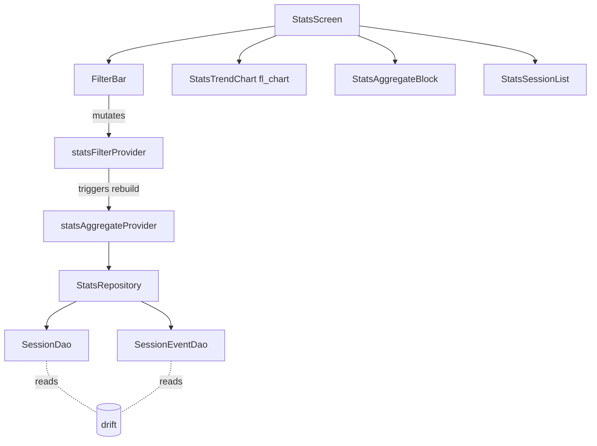

# Architektur: Stats Screen (F3)

## Übersicht

Read-only Aggregator-Layer über die existierenden drift-Tabellen `sessions` und `session_events`. Neuer Bounded Context `lib/features/stats/` (pragmatisch, kein Domain-Layer). Aggregation und Filter laufen in einem `StatsRepository`, der die existierenden DAOs nutzt. Charts via `fl_chart`.

## Bounded Context

`stats/` (neu, pragmatisch). Liegt unter `lib/features/stats/` und folgt dem Schema der existierenden `training/`-Pragmatic-Pattern: `data/` (Repository), `application/` (Provider, Notifier), `presentation/` (Screen + Widgets).

Begründung: read-only Aggregation, keine reiche Domäne, keine Sync-Konflikte, keine State-Machine. Ein eigener Domain-Layer wäre over-engineered.

## Komponenten

### `lib/features/stats/data/`

- `stats_filter.dart` — `StatsFilter` Datenklasse (manuell, freezed wäre overkill für 3 Felder): `distanceMeters` (`double?`), `dateRange` (enum: `all`, `last7Days`, `last30Days`).
- `stats_aggregate.dart` — `StatsAggregate` VO: `totalSessions`, `totalThrows`, `hitRatePercent`, `longestHitStreak`, `bestHitRate` (mit `bestHitRateDistance`), `mostThrowsInOneDay`, `trendPoints` (List<double>), `sessionRows` (List<StatsSessionRow>).
- `stats_repository.dart` — `StatsRepository.computeAggregate(playerId, filter, heliTracking)` returnt `Future<StatsAggregate>`.

### `lib/features/stats/application/`

- `stats_filter_notifier.dart` — `StatsFilterNotifier extends Notifier<StatsFilter>`, mutiert Filter via `setDistance(double?)` / `setDateRange(...)`.
- `stats_aggregate_provider.dart` — `FutureProvider` der `StatsRepository.computeAggregate` aufruft mit aktuellem Profile + Filter + heliTracking.

### `lib/features/stats/presentation/`

- `stats_screen.dart` — Scaffold mit `KubbAppBar`, Body = `SingleChildScrollView` mit Filter-Bar oben, dann Chart, dann Aggregate-Block, dann Personal Bests, dann Session-Liste.
- `widgets/stats_filter_bar.dart` — Filter-Pillen für Distanz und Datums-Range.
- `widgets/stats_aggregate_block.dart` — Hero-Zahlen-Block.
- `widgets/stats_trend_chart.dart` — `LineChart` aus `fl_chart`.
- `widgets/stats_session_list.dart` — Tappbare Liste der Sessions.

## Schnittstellen

- `StatsRepository` liest aus `SessionDao` + `SessionEventDao` (existierend).
- `statsAggregateProvider` (FutureProvider) → `StatsScreen` consume.
- `statsFilterProvider` (NotifierProvider) → Filter-Bar mutiert, Aggregate-Provider rebuildet.

## Datenfluss

```
StatsScreen
  ├─ ref.watch(statsFilterProvider)        → Filter-Bar
  ├─ ref.watch(statsAggregateProvider)     → Chart + Aggregate + Liste
  │     └─ StatsRepository.computeAggregate(playerId, filter, heliTracking)
  │            ├─ SessionDao.allCompletedForPlayer(playerId)  (neu)
  │            └─ for each session: SessionEventDao.forSession(session.id)
  └─ on tap row → context.push('/training/summary/<id>')
```

## Tech-Stack-Erweiterung

- `fl_chart: ^0.69.0` — Industry-Standard Flutter-Chart-Library. Begründung: keine 3rd-Party-Backend-Calls, pure Flutter, gut gepflegt, MIT-Lizenz, simple LineChart-API. Alternativen verworfen: `charts_flutter` (Google, deprecated), `syncfusion_flutter_charts` (kommerzielle Lizenz für >5 Mitarbeiter, hier irrelevant aber overkill an Features).

## Diagramm



## Scale-Impact

Trigger: liest Daten, deren Volumen mit Sessions wächst.

- **Bei welcher Tier kritisch:** Tier 1 (~5k aktive Spieler, ~10k Sessions pro Spieler an obergrenze)
- **Mitigation:** Aggregate-Berechnung lädt aktuell ALLE completed Sessions des Spielers in Memory. Bei >1k Sessions pro Spieler wird das spürbar. Mitigation für später: SQL-Aggregat-Queries (`SUM`, `COUNT`, `GROUP BY date`) statt Lade-und-zähl. Heute: für Phase 1 (Solo-Use, <500 Sessions) ausreichend.
- **Performance-Budget:** Aggregate-Berechnung < 200ms p95 bei 500 Sessions auf Mid-Range Phone.
- **Migrationsrelevant?** no — Schema bleibt unverändert.
