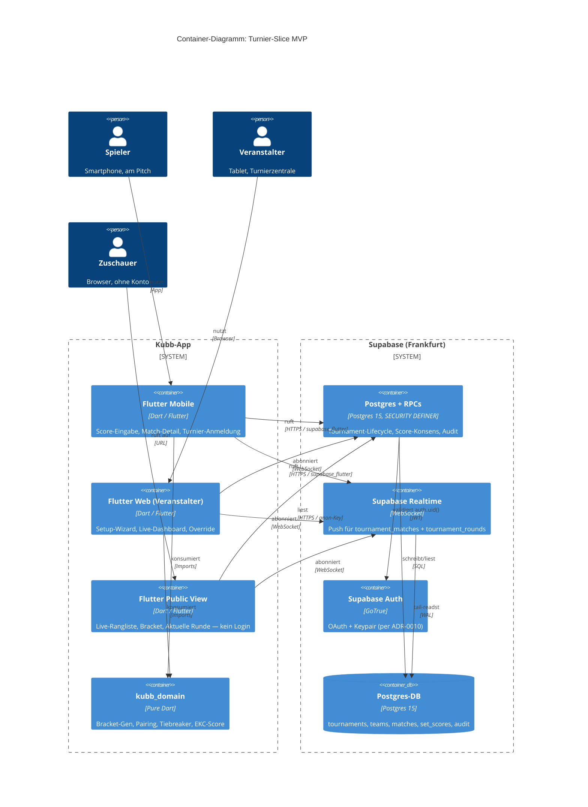
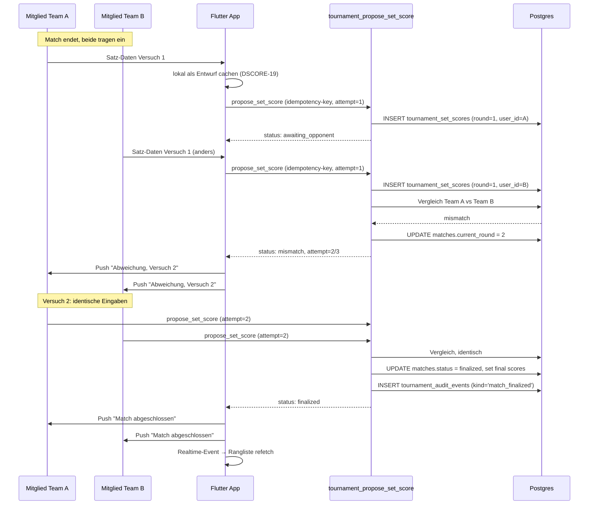
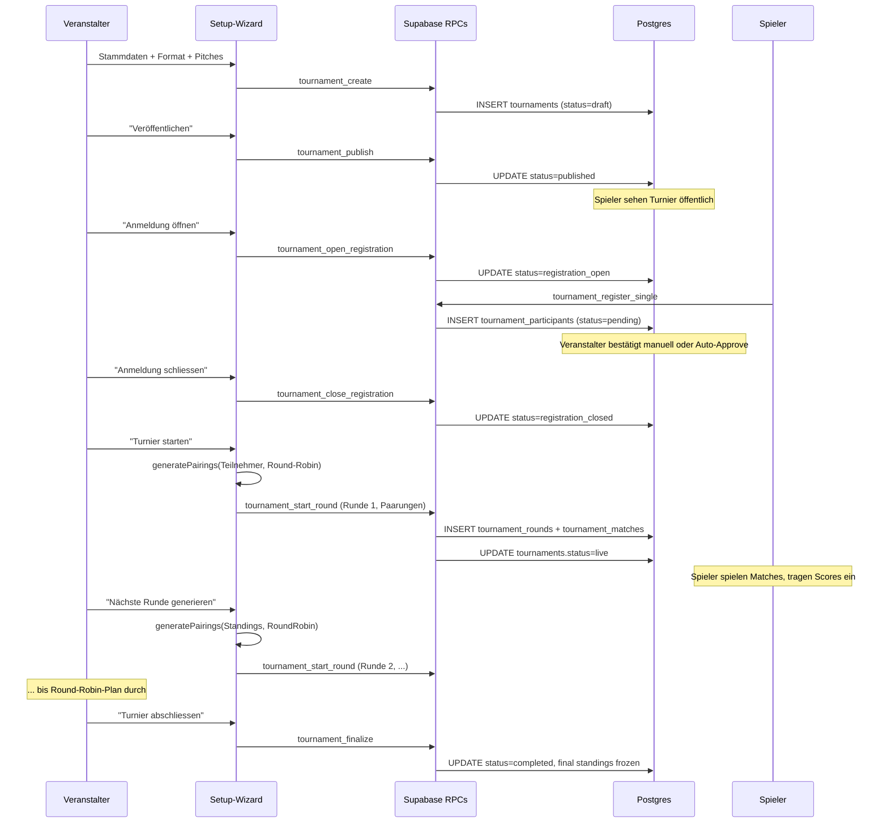

# Tournament foundation — Architektur

> Status: Entwurf, wartet auf Abnahme
> Datum: 2026-05-25
> Bezug: `docs/specs/tournament-mode-spec.md` v0.4, `docs/specs/score-input-conflict-spec.md` v0.2, ADR-0002, ADR-0012, ADR-0013

## 1. Übersicht

Turniermodus baut auf der bestehenden Solo-Match-Engine auf. Match-Mechanik (per-Satz-Eingabe, Konsens-Auflösung, Audit-Trail) wandert ins Turnier; Bracket, Roster, Liga-Wertung kommen oben drauf. Match-Logik lebt weiter im Server (Postgres-RPCs, per ADR-0013). Turnier-Domäne (Pool, Bracket, Ranglisten-Berechnung) wird als pure Dart in `kubb_domain` modelliert, damit Bracket-Generierung und Tiebreaker testbar und vom Client und einem späteren Server-Validator nutzbar sind.

## 2. Bounded Context

Der `tournament/`-Context bleibt **hexagonal-light** wie in [ADR-0002 §2](../../adr/0002-bounded-contexts.md) festgehalten. Keine neue Schichtenarchitektur, keine Repository-Interfaces pro Entität — nur dort wo eine reine Funktion sauberer ist.

Innerhalb des Contexts gibt es zwei Substrate:

- **Pure Domain** in `packages/kubb_domain/lib/src/tournament/` — Bracket, Pool, Pairing, Tiebreaker, Punkte-Formel. Keine Flutter-Imports, keine Supabase-Imports, keine I/O.
- **Server-getriebene Lifecycle-Daten** in Supabase. Turniere, Anmeldungen, Match-Plan, Roster, Rangliste werden in Postgres gehalten; alle Mutationen über `SECURITY DEFINER`-RPCs.

Die Grenze ist scharf: alles was **Regel** ist (wer paart wen, wie wird der Tiebreaker berechnet, wieviel Punkte gibt Platz 3) gehört in `kubb_domain`. Alles was **Zustand** ist (welches Team ist angemeldet, welches Match läuft gerade) lebt im Server. Der Server ruft die pure Domain nicht auf — Bracket-Generation passiert clientseitig im Veranstalter-Flow, das Ergebnis wird als fertige Match-Plan-Rows zurück in die DB geschrieben.

Drei Nachbar-Contexts werden berührt:

- **Match** (server-shaped per ADR-0013): Turnier-Matches sind Match-Rows mit zusätzlichem `tournament_id`-FK und `tournament_round_id`-FK. Die bestehende `match_propose_result`-RPC + Konsens-Protokoll wird ausgebaut, nicht ersetzt.
- **Player / Team** (CRUD per ADR-0002): bekommt neue Tabelle `teams` (mit Pool-Mitgliedschaft) und `team_members`. Heute existiert nichts davon — Solo-Match nutzt nur ad-hoc-Participants.
- **Stats** (presentation-only heute): bekommt im MVP eine neue Tab-Ebene oder Verzweigung "Turnier" vs. "Training", damit die Privacy-Trennung (Turnierstats öffentlich, Trainingsstats nur für Freunde) sichtbar wird.

## 3. Komponenten

### 3.1 `packages/kubb_domain/lib/src/tournament/`

Neue pure Dart Komponenten:

- `bracket.dart` — `Bracket`-Wertobjekt (Liste von KO-Runden), Generator-Funktionen für Single-Elimination mit/ohne Spiel-um-Platz-3. Pure, deterministisch, seedbar.
- `pool.dart` — Pool-Strukturen für Gruppenphase. Für MVP genügt Round-Robin-Generator (jeder gegen jeden, ausgewogene Anzahl Runden, BYE-Behandlung).
- `pairing.dart` — Paarungsstrategien als pure Funktionen mit Eingabe `List<Standing>` und Ausgabe `List<MatchPairing>`. MVP: Round-Robin (vollständig vorberechnet) + Schochmodus (Gewinner-vs-Gewinner pro Runde). Schweizer System landet später.
- `tiebreaker.dart` — Konfigurierbare Tiebreaker-Kette gemäss [FR-RANK-4](../../specs/tournament-mode-spec.md#313-turnier-rangliste-fr-rank). Reine Vergleichsfunktion `Comparator<Standing>` aus einer Liste `List<TiebreakerKind>`.
- `standings.dart` — Tabellen-Berechnung aus `List<MatchResult>`. Eingabe sind die finalisierten Match-Ergebnisse, Ausgabe `List<Standing>` mit allen Tiebreaker-Werten.
- `score_system.dart` — EKC-Punktevergabe pro Satz. Eingabe `Set` (Basekubbs Team A, Basekubbs Team B, König gefällt von), Ausgabe `MatchPoints`.
- `league_points.dart` — Globale Punkte-Formel ([FR-POINTS-1](../../specs/tournament-mode-spec.md#3141-globale-punkte-formel)). Pure, parametrisierbar durch Stufungs-Tabelle und Turnier-Faktor.

MVP nutzt nur einen Teil davon — Bracket-Generator und EKC-Score-System sind die zwei harten Stücke. Tiebreaker und Punkte-Formel können stark vereinfacht starten (Anzahl Siege, dann Kubb-Differenz) und später ausgebaut werden.

### 3.2 `lib/features/tournament/`

Riverpod-Provider, Drift-Cache, Screens.

```
lib/features/tournament/
├── application/
│   ├── tournament_list_controller.dart      # öffentliche Liste + eigene Turniere
│   ├── tournament_detail_controller.dart    # einzelnes Turnier inkl. Realtime
│   ├── tournament_setup_controller.dart     # Wizard-State
│   ├── registration_controller.dart         # Anmeldung Einzel/Team
│   ├── live_dashboard_controller.dart       # Veranstalter Live-Sicht
│   └── score_entry_controller.dart          # per-Satz-Eingabe inkl. Outbox
├── data/
│   ├── tournament_models.dart               # Wire-Shapes wie match_models.dart
│   ├── tournament_repository.dart           # RPC-Wrapper
│   ├── score_draft_cache.dart               # lokaler Entwurf (sembast/drift)
│   └── score_outbox.dart                    # Offline-Queue für Score-Eingaben
└── presentation/
    ├── tournament_list_screen.dart
    ├── tournament_detail_screen.dart
    ├── tournament_setup_wizard.dart         # mehrstufig per shared_preferences-Step
    ├── tournament_registration_screen.dart
    ├── tournament_live_dashboard.dart       # Veranstalter
    ├── tournament_match_detail_screen.dart  # Score-Eingabe
    ├── tournament_conflict_screen.dart      # Strittig-Ansicht
    ├── tournament_standings_screen.dart     # Rangliste
    └── tournament_routes.dart
```

Die Schichtentiefe spiegelt die Komplexität — gleicher Aufbau wie `match/` heute, plus zwei Datenpfade (`score_draft_cache`, `score_outbox`) die für die Offline-Toleranz aus [§12 der Score-Spec](../../specs/score-input-conflict-spec.md#12-offline-verhalten-und-lokales-caching) nötig sind.

### 3.3 Supabase

Schema-Erweiterung als neue Migrations-Datei `20260601000001_tournament_schema.sql`. Tabellen:

| Tabelle | Schlüssel-Spalten | Zweck |
|---|---|---|
| `tournaments` | `id`, `organizer_user_id`, `status`, `format`, `scoring_config`, `team_size`, `published_at` | Stammdaten + Lifecycle |
| `tournament_rounds` | `tournament_id`, `round_index`, `phase` (group\|ko), `started_at`, `closed_at` | Eine Zeile pro Runde |
| `teams` | `id`, `name`, `home_club_id`, `country`, `league_id`, `founded_by_user_id`, `dissolved_at` | Team-Pool (offen, unbegrenzt) |
| `team_members` | `team_id`, `user_id` NULL, `guest_name` NULL, `joined_at`, `removed_at` | Pool-Mitglieder. Captain-Recht implizit für jedes registrierte Mitglied (BR-27) |
| `tournament_participants` | `tournament_id`, `team_id` NULL, `user_id` NULL, `seed`, `status` (pending\|approved\|waitlist\|withdrawn) | Anmeldung. Bei Einzelturnier `team_id` NULL |
| `tournament_rosters` | `participant_id`, `user_id` NULL, `guest_name` NULL, `slot_index`, `swapped_at` NULL | Für Teamturniere: pro Anmeldung N Roster-Einträge, mid-Turnier swappable (FR-TEAM-13) |
| `tournament_matches` | `match_id` (FK auf `public.matches`), `tournament_id`, `tournament_round_id`, `pitch_number`, `participant_a_id`, `participant_b_id`, `is_bye`, `is_forfeit`, `forfeit_against` NULL | Verbindung Match ↔ Turnier-Runde |
| `tournament_set_scores` | `match_id`, `round` (per Score-Versuch), `user_id`, `set_index`, `basekubbs_a`, `basekubbs_b`, `king_felled_by` (A\|B\|none) | Satz-genauer Score statt match-total — Erweiterung der bestehenden `match_result_proposals` |
| `tournament_audit_events` | `tournament_id`, `kind`, `actor_user_id`, `payload`, `at` | Audit-Trail für Roster-Wechsel, Seeding-Override, Override-Eingriffe |

Die existierende `public.matches`-Tabelle bekommt eine optionale Spalte `tournament_id uuid NULL REFERENCES tournaments(id)`. Bei Solo-Match bleibt sie NULL. Bei Turnier-Match wird sie gesetzt — alle Solo-Match-RPCs (`match_propose_result`, `match_get`) funktionieren weiter, die Turnier-Logik checkt zusätzlich auf den FK.

Neue RPCs:

- `tournament_create`, `tournament_publish`, `tournament_open_registration`, `tournament_close_registration` — Lifecycle.
- `tournament_register_single(p_tournament_id)` und `tournament_register_team(p_tournament_id, p_team_id, p_roster jsonb)` — Anmeldung. Inkl. Pflicht-Check FR-REG-12 (mindestens ein registriertes Mitglied im Roster).
- `tournament_start_round(p_round_id, p_pairings jsonb)` — Veranstalter übergibt die client-berechneten Paarungen.
- `tournament_propose_set_score(p_match_id, p_set_data jsonb)` — Variante von `match_propose_result`, die Satz-Daten statt nur winner+score-total entgegen nimmt. Reconciliation-Logik wird in derselben Form erweitert wie heute: hashbasierter Vergleich der Eingaben pro Versuch, max. 3 Runden, dann STRITTIG (siehe Sequence-Diagram in §6).
- `tournament_organizer_override(p_match_id, p_set_data jsonb, p_reason text)` — Override mit Pflicht-Begründung.
- `tournament_compute_standings(p_tournament_id)` — gibt die Rangliste zurück. Vorerst clientseitig berechnet aus den Match-Ergebnissen; Server-RPC ist optional Cache für die öffentliche Ansicht.

RLS: Lesen für `published`+`live`+`completed`-Turniere öffentlich, Schreiben nur über RPCs. Score-Eingabe-RPCs prüfen, dass der Aufrufer im `team_members` des betroffenen Teams ist und dort einen `user_id`-Eintrag mit `removed_at IS NULL` hat.

### 3.4 Stats-Trennung

Die heutige `StatsScreen` mit drei Tabs (Sniper / Finisseur / Match) zeigt Solo-Match-Statistiken **immer öffentlich** — das passt nicht zu FR-SOCIAL-4/FR-SOCIAL-5. Im MVP-Slice ist das nicht der Fokus; offene Entscheidung [OD-03](open-decisions.md#od-03-privacy-stats-split) klärt, wie die Trennung Tournament-Stats-public vs. Training-Stats-friends-only umgesetzt wird.

## 4. Schnittstellen (Ports)

Der bestehende Port `TournamentRemote` in `packages/kubb_domain/lib/src/ports/tournament_remote.dart` ist heute auf den per-Throw-Event-Pfad zugeschnitten (`publishMatchEvent`, `subscribeToMatch`). Der gewählte Pfad ist anders — pro-Match-Result, server-shaped, kein lokales Event-Log. Der Port wird umgeschrieben:

```dart
abstract interface class TournamentRemote {
  Future<TournamentSummary> createTournament(TournamentDraft draft);
  Future<TournamentDetail> getTournament(TournamentId id);
  Stream<TournamentDetail> watchTournament(TournamentId id);

  Future<void> registerSingle(TournamentId tournamentId);
  Future<void> registerTeam(TournamentId tournamentId, TeamId teamId, List<RosterSlot> roster);

  Future<void> startRound(TournamentRoundId roundId, List<MatchPairing> pairings);
  Future<MatchDetail> getMatch(MatchId matchId);
  Future<void> proposeSetScore(MatchId matchId, List<SetScore> sets);
  Future<void> organizerOverride(MatchId matchId, List<SetScore> sets, String reason);

  Future<Standings> computeStandings(TournamentId tournamentId);
}
```

Die alten Match-Event-Methoden bleiben für eine spätere echte per-Throw-Engine reserviert — der Port wird in zwei Interfaces gespalten: `TournamentRemote` (das Neue) und `MatchEventRemote` (das Alte, derzeit ohne Adapter). Solange niemand `MatchEventRemote` instanziiert, kostet die Trennung nichts.

Konkrete Adapter:

- `SupabaseTournamentRemote` in `lib/features/tournament/data/`. Direkter Wrapper um die RPCs. Realtime-Subscription über Supabase Realtime auf `tournament_matches`+`match_result_proposals`.
- Tests: `FakeTournamentRemote` (in-memory) für Widget-Tests und für Integrationstests mit echtem Supabase-Testclient.

Zwei zusätzliche Ports, beide app-intern (nicht in `kubb_domain`):

- `ScoreDraftCache` — speichert nicht abgeschickte Score-Eingaben lokal pro Match. Implementierung: drift auf Mobile/Linux, sembast_web auf Web (per ADR-0005).
- `ScoreOutbox` — speichert abgeschickte aber noch nicht synchronisierte Eingaben. Idempotenz-Key pro Eingabe (DSCORE-101). Implementierung wie oben.

## 5. Datenfluss

### 5.1 Lese-Pfad (öffentliche Live-Rangliste)

UI (`TournamentStandingsScreen`) → Riverpod `tournamentStandingsProvider(id)` → `SupabaseTournamentRemote.computeStandings(id)` → Supabase RPC `tournament_compute_standings` → SQL-View bzw. RPC liefert sortierte Liste.

Realtime: parallel dazu `watchTournament(id)`-Stream — auf jeden Insert/Update in `tournament_matches` oder `tournament_set_scores` löst der Provider ein Refetch der Standings aus (debounced 500 ms).

### 5.2 Schreib-Pfad (Score-Eingabe Team-Mitglied)

Siehe Sequence-Diagramm in §6.2. Wichtig: lokaler Entwurf wird kontinuierlich gespeichert (DSCORE-19), beim "Absenden" wandert er in den Outbox-Eintrag und wird sofort versucht zu pushen. Offline-Fall: Outbox-Eintrag bleibt liegen, wird beim Reconnect abgearbeitet.

### 5.3 Realtime-Strategie

Aktueller Solo-Match-Code nutzt Polling (siehe `match_repository.dart`). Für Turniere mit live-Updates auf der Public-Live-Sicht ([FR-PUB-11](../../specs/tournament-mode-spec.md#317-öffentliche-sichten-fr-pub)) ist Polling alle paar Sekunden bei 200 Zuschauern x N Turnieren teuer.

Vorschlag MVP: Supabase Realtime auf zwei Tabellen — `tournament_matches` (Status + Score) und `tournament_rounds` (Phase). Ein einziger Channel pro geöffnetem Turnier. Bei der ersten Turnier-Grösse (≤16 Teilnehmer, MVP-Slice) ist das harmlos. Skalierungs-Trigger aus [ADR-0004](../../adr/0004-scaling-strategy.md) greifen bei 400+ Realtime-Verbindungen. Offene Entscheidung [OD-01](open-decisions.md#od-01-realtime-strategie) zur Bestätigung.

### 5.4 Veranstalter startet Runde

UI (`TournamentLiveDashboard`) → "Runde starten" → Riverpod-Action ruft im Hintergrund die pure Funktion `generatePairings(currentStandings, pairingStrategy)` aus `kubb_domain`. Ergebnis (List of `MatchPairing`) wird mit Pitch-Zuteilung an `startRound`-RPC geschickt. Server inserted die Match-Rows transaktional. Realtime-Push erreicht die Spieler-Apps.

## 6. Diagramme

### 6.1 C4 Container — Turnier-Slice



### 6.2 Sequence — Score-Eingabe Konflikt-Auflösung

Modelliert den drei-Versuche-Flow aus [§7.2 der Score-Spec](../../specs/score-input-conflict-spec.md#72-konflikt-flow-abweichung-einigkeit-nach-versuch-2-oder-3).



Bei drei Fehlversuchen oder manueller Eskalation geht der gleiche Flow in den `disputed`-Zweig: die RPC setzt `matches.status = disputed`, der Veranstalter erhält einen hochpriorisierten Push, trägt selbst über `tournament_organizer_override` mit Pflicht-Begründung ein, das Match landet bei `overridden_finalized`.

### 6.3 Sequence — Turnier-Lifecycle



## 7. Tech-Stack-Erweiterung

Keine neuen Top-Level-Libraries für den MVP-Slice. Was schon da ist trägt:

- **freezed** + **json_serializable**: für die neuen Wire-Types in `tournament_models.dart`.
- **Riverpod 2.x** + **riverpod_generator**: Provider für Liste, Detail, Live-Dashboard.
- **drift 2.x**: Score-Outbox auf Mobile/Linux.
- **sembast_web**: Score-Outbox auf Web (per ADR-0005 schon im Stack-Plan, aber noch nicht installiert — wird im MVP-Slice eingeführt).
- **Supabase Realtime** über `supabase_flutter`: schon im Stack.

Eine Lib-Wahl steht zur Diskussion: **Bracket-Visualisierung** für die KO-Phase. MVP-Slice braucht das nicht (Round-Robin only), aber spätestens Milestone M2 verlangt es. Optionen: eigenes CustomPainter-Widget (volle Kontrolle, ca. 1 Tag Arbeit) oder ein Paket wie `bracket_widget`. Verschiebbar bis M2, dann ADR.

## 8. Sicherheits- und Privacy-Anker

- **Score-Eingabe-Berechtigung**: RPC validiert über `EXISTS (SELECT 1 FROM team_members WHERE user_id = auth.uid() AND team_id IN (SELECT participant.team_id FROM tournament_participants WHERE ...))`. Identischer Pfad wie heute in `_match_propose_result`, nur mit Team-Pool-Auflösung statt direkter Participant-Match-Beziehung.
- **Audit-Trail**: jede Score-Eingabe (auch ersetzte), jeder Roster-Wechsel, jeder Override landet in `tournament_audit_events` mit `actor_user_id` + Payload.
- **Privacy-Trennung**: Turnier-Match-Ergebnisse haben RLS-Read public für `published/live/completed`-Turniere. Solo-Match-Stats nicht — daher der offene Punkt zur Stats-Screen-Trennung.

## 9. Was im MVP-Slice **nicht** drin ist

Damit die erste Milestone in akzeptabler Zeit demobar ist, bleibt vieles aus der Vollspezifikation explizit aussen vor — Detail in `risks-and-deferrals.md`. Kurzversion:

- Kein Schweizer System, kein Schochmodus, kein Bracket. Nur Round-Robin oder einfaches KO-Bracket.
- Keine Teams. Nur Einzelspieler (FR-CFG-1 mit teamSize=1).
- Keine Liga-Punkte, kein globales Ranking, keine Saisons.
- Kein Lageplan, keine Streaming-Sicht, keine Veranstalter-Bewertung.
- Kein Vereins-Konzept, keine Plattform-Admin-UI für Faktor-Freigaben (CLI reicht).
- Realtime-Anbindung im MVP nur Polling über `watchTournament` (5-Sekunden-Refetch). Echtes Supabase Realtime kommt M1+.

## 10. Migration des bestehenden `match/`-Codes

Die Solo-Match-Engine (per ADR-0013) bleibt **unverändert** stehen. Solo-Matches haben `tournaments.id IS NULL` und routen über `match_propose_result` (winner+score-total) statt über `tournament_propose_set_score`. Die Lobby-UI, die Result-Screens, der `match_repository`-Wrapper bleiben.

Was berührt wird:

- `public.matches`-Tabelle bekommt eine neue nullable Spalte `tournament_id`. Migration ist additiv, bestehende Solo-Matches haben dort NULL.
- Die bestehende `match_finish_play`-RPC wird im Turnier-Pfad **nicht** verwendet — Turnier-Matches starten im `active`-State direkt mit der Runden-Clock, ohne den Lobby-Schritt.

Die Tournament-Domain liegt **neben** der Solo-Match-Domain, nicht darüber. Ein späterer Refactor, der die beiden Score-Pfade vereinheitlicht, kann ab Milestone M4 in Angriff genommen werden — dafür ist es zu früh, solange nicht klar ist, ob beide Pfade dauerhaft koexistieren.
